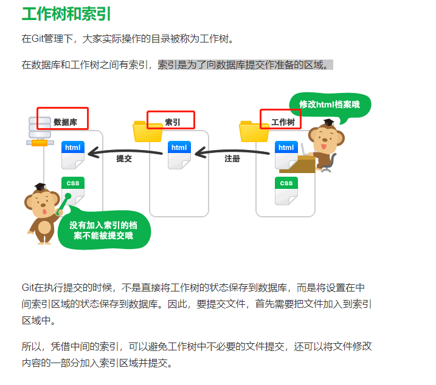

1. merge规则：当前所在分支为dev，在dev_zhaoning分支上选择merge into current，是将dev_zhaoning上的内容
merge进dev分支，merge后的部分内容处在commit状态，需要push后才会提交到git服务器  

<<<<<<<<< HEAD
Hello
========
Hello World
'>>>>>>>>>' a624ed2b646c6e026cc75355c86a4a64edb738b9

注意：
<<<<<<<<<
这就是发生冲突的部分
'>>>>>>>>>'

=====分割线上方是本地数据库的内容，下方是远程数据库的编辑内容

2. 索引和工作树:可以实际操作的目录被称为工作树，索引指的是暂存区  



3. 撤销commit:(只提交到了本地的work tree，没有提交到服务器)
```
git reset --soft HEAD^
```

4. 工作中用到的gitlab工作流:


