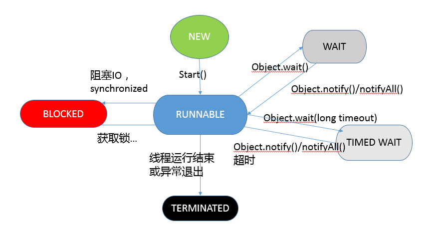

一个类只能有一个带有指定签名的构造器，编程人员通常知道如何避开这一限制:通过提供两个构造器，他们的参数列表只在参数类型的顺序上有所不同。
实际这并不是一个好主意。

方法签名包括：参数类型，参数顺序，不包括返回类型

Enum不允许继承，但是可以实现接口。

不写构造方法，编译器会自动提供一个共有的，无参的构造方法 

### 1. Stream求和
```
BigDecimal:
BigDecimal bb =list.stream().map(Plan::getAmount).reduce(BigDecimal.ZERO,BigDecimal::add);
 

int、double、long:
double max = list.stream().mapToDouble(User::getHeight).sum();

```

建议多使用JDK并发包提供的并发容器和工具类解决并发问题，因为这些类都已经通过了充分的测试和优化  
Java中所使用的并发机制依赖于JVM的实现和CPU的指令  
synchronized实现同步的基础：Java中每一个对象都可以作为锁。具体表现为下面3种形式：  
1. 对于普通同步方法，锁是当前实例对象  
2. 对于静态同步方法，锁是当前类的Class对象  
3. 对于同步代码块，锁是synchronized 括号里配置的对象  

Java将操作系统中的运行和就绪两个状态合并称为运行状态，阻塞状态是线程阻塞在进入synchronized
关键字修饰的方法或代码块(获取锁)时的状态，但是阻塞在java.concurrent包中Lock接口的线程状态确实等待状态
，因为java.concurrent包中Lock接口对于阻塞的实现均使用了LockSupport类中的相关方法。  

java支持多个线程同时访问一个对象或者对象的成员变量，由于每个线程执行过程中可以拥有一份拷贝，
这样可以加速程序的执行，这是现代多核处理器的一个显著特性。所以程序在执行过程中，一个线程看到的变量
并不一定是最新的。  

mq是一个常见的解耦利器
什么时候不用mq？上游实时关注执行结果

HashMap在并发执行put操作时会引起死循环，是因为多线程会导致HashMap的Entry链表形成环形数据结构，
一旦形成环形数据结构，Entry的next节点永远为空，就会产生死循环获取Entry

Final关键字修饰的变量
String的intern()是什么作用
方法的名字和参数列表称为方法的签名，返回类型不是签名的一部分。
如果将一个类声明为final，只有其中的方法自动的成为final，而不包括域

所有的数组类型，不管是对象数组还是基本类型的数组都扩展了object类

Arrays.deepToString

synchronized关键字是怎么实现可重入的？
当一个线程进入synchronized修饰的代码块中且该代码块未被其他线程访问时，JVM会记下锁的持有者，并且
将获取计数器值置为1.如果同一个线程再次获取这个锁时，计数器值将递增，而当线程退出同步代码块时，计数器会相应地递减。
当计数器值为0时，这个锁将被释放。

### 2. filter和interceptor有什么区别？
1. Filter是基于函数回调（doFilter()方法）的，而Interceptor则是基于Java反射的（AOP思想）。
2. Filter依赖于Servlet容器，而Interceptor不依赖于Servlet容器。
3. Filter对几乎所有的请求起作用，而Interceptor只能对action请求起作用。
4. Interceptor可以访问Action的上下文，值栈里的对象，而Filter不能。
5. 在action的生命周期里，Interceptor可以被多次调用，而Filter只能在容器初始化时调用一次。  
6. Filter在过滤是只能对request和response进行操作，而interceptor可以对request、response、handler、modelAndView、exception进行操作。

filter 继承OncePerRequestFilter,重写doFilterInternal方法
interceptor实现HandlerInterceptor接口，重写preHandle方法，其中postHandle方法是在业务处理器处理请求执行完成后，生成视图之前执行。
afterCompletion方法在DispatcherServlet完全处理完请求后被调用

Interceptor和AOP可以看作是类似的,因为其内部实现原理都是利用JAVA的反射机制(AOP是使用动态代理,动态代理的实现就是java反射机制).
但是Filter和Interceptor有本质上的区别.其实现是通过回调函数.两者的控制粒度也不同,AOP和Interceptor的控制粒度都是方法级别,
但是Filter的控制粒度就是servlet容器,它只能在servlet容器执行前后进行处理.

### 3.JDK 和 JRE 有什么区别？
* JRE 为 Java 提供了必要的运行时环境，JDK 为 Java 提供了必要的开发环境
* JDK 是 JRE 的超集，JRE 是 JDK 的子集

### 4. Java运行程序的步骤：
我理解的java程序执行步骤:
* 首先javac编译器将源代码编译成字节码。
* 然后jvm类加载器加载字节码文件，然后通过解释器逐行解释执行，这种方式的执行速度相对会比较慢。
* 有些方法是高频率调用的(JIT即时编译是以方法和代码块为单位的)，也就是所谓的热点代码，所以引进JIT技术，运行时将热点代码直接编译为机器码，
* 这样类似于缓存技术，运行时再遇到这类热点代码直接可以执行，而不是先解释后执行。

### 5. AtomicInteger 底层实现原理是什么？如何在业务中应用 CAS 操作？
* CAS 是 Java 并发中所谓 lock-free(无锁) 机制的基础

### 7. 一个线程两次调用 start() 方法会出现什么情况？谈谈线程的生命周期和状态转移。
* Java 的线程是不允许启动两次的，第二次调用必然会抛出 IllegalThreadStateException，这是一种运行时异常，多次调用 start 被认为是编程错误。
在第二次调用 start() 方法的时候，线程可能处于终止或者其他（非 NEW）状态，但是不论如何，都是不可以再次启动的。



### 8.线程有哪几个状态？

在任意一个时间点中，一个线程只能有且只有其中的一种状态，并 且可以通过特定的方法在不同状态之间转换

Java 5 以后，线程状态被明确定义在其公共内部枚举类型 java.lang.Thread.State 中，6种分别是：
* 新建（NEW），表示线程被创建出来还没真正启动的状态，可以认为它是个 Java 内部状态。
* 就绪（RUNNABLE），表示该线程已经在 JVM 中执行，当然由于执行需要计算资源，它可能是正在运行，
也可能还在等待系统分配给它 CPU 片段，在就绪队列里面排队。在其他一些分析中，会额外区分一种状态 RUNNING，但是从 
Java API 的角度，并不能表示出来。
* 阻塞（BLOCKED），这个状态和我们前面两讲介绍的同步非常相关，阻塞表示线程在等待 Monitor lock。比如，线程试图通过 synchronized 
去获取某个锁，但是其他线程已经独占了，那么当前线程就会处于阻塞状态。
* 等待（WAITING），表示正在等待其他线程采取某些操作。一个常见的场景是类似生产者消费者模式，发现任务条件尚未满足，就让当前消费者线程等待（wait），另外的生产者线程去准备任务数据，然后通过类似 notify 
等动作，通知消费线程可以继续工作了。Thread.join() 也会令线程进入等待状态。
* 计时等待（TIMED_WAIT），其进入条件和等待状态类似，但是调用的是存在超时条件的方法，比如 wait 或 join 等方法的指定超时版本，如下面示例：public final native void wait(long 
timeout) throws InterruptedException;
* 终止（TERMINATED），不管是意外退出还是正常执行结束，线程已经完成使命，终止运行，也有人把这个状态叫作死亡。

### 8.为什么volatile只能保证可见性不保证原子性？
* volatile保证的可见性是指当一条线程修改了这个变量的值，新值对于其他线程来说是可以立即得知的，(每一条线程获取volatile变量值时，
拿到的确实是那个时刻的最新值，但是由于volatile变量是没有限制并发修改的，所以无法保证原子性)，
而普通变量不能做到这一点。普通变量的值在线程间传递时均需要通过主内内存来完成。例如，线程A修改
 一个普通变量的值，然后向主内存进行回写，另外一条线程B在线程A回写完成后再对主内存进行读取操作，
 新变量值才会对线程B可见。
 
* 可见性就是指当一个线程修改了共享变量的值时，其他线程能够立即得知这个修改。Java内存模型是通过在变量修改后将新值同步回主内存，
在变量读取前从主内存刷新变量值这种依赖主内存作为传递媒介的方式来实现可见性的，无论是普通变量还是volatile变量都是如此。普通变量与volatile变量的区别是，
volatile的特殊规则保证了新值 能立即同步到主内存，以及每次使用前立即从主内存刷新。因此我们可以说volatile保证了多线程操作时变量的可见性，而普通变量则不能保证这一点。
 
* 每条线程内的工作内存与主内存同步存在延迟，这也是普通变量无法保证可见性的原因
 
 对i++操作来说，读取，+1，写回。当一条线程读取到volatile变量值后，其他线程可能会在读取后
 把i值已经修改了，这时第一条线程读取到的值就变成过期数据了，这时将值+1后写回时，就可能会把错误值
 写回到主内存中。

* 一个变量i被volatile修饰，两个线程想对这个变量修改，都对其进行自增操作也就是i++，i++的过程可以分为三步，
首先获取i的值，其次对i的值进行加1，最后将得到的新值写回到缓存中。线程A首先得到了i的初始值100，
但是还没来得及修改，就阻塞了，这时线程B开始了，它也得到了i的值，由于i的值未被修改，即使是被volatile修饰，
主存的变量还没变化，那么线程B得到的值也是100，之后对其进行加1操作，得到101后，将新值写入到缓存中，再刷入主存中。
根据可见性的原则，这个主存的值可以被其他线程可见。问题来了，线程A已经读取到了i的值为100，
也就是说读取的这个原子操作已经结束了，所以这个可见性来的有点晚，线程A阻塞结束后，继续将100这个值加1，得到101，
再将值写到缓存，最后刷入主存，所以即便是volatile具有可见性，也不能保证对它修饰的变量具有原子性。

### 什么情况下变量适合用volatile修饰？如果volatile无法解决原子性该选取什么？
* 运算结果并不依赖变量的当前值，或者能够确保只有单一的线程修改变量的值
* 变量不需要与其他的状态变量共同参与不变约束。

* 不符合上面两条的，只能通过加锁（使用synchronized、java.util.concurrent中的锁或原子类）来保证原子性

### 9.Java内存模型的先行发生原则是做什么用的？
* Java内存模型操作简化为read，write，lock，unlock四种。
* 先行发生原则主要用来确定一个操作在并发环境下是否安全

### 10. ReentrantLock 与 synchronized 有什么区别？
* ReentrantLock 与 synchronized 相比增加了一些高级功能，主要有以下三项：等待可中断、可实现公平锁及锁可以绑定多个条件。
* 等待可中断：指的是当持有锁的线程长期不释放锁的时候，正在等待的线程可以选择放弃等待，改为处理其他事情。
可中断特性对处理执行时间非常长的同步块很有帮助。 
* 公平锁：指的是多个线程在等待同一个锁时，必须按照申请锁的时间顺序来依次获得锁；而非公平锁则不保证这一点，
在锁被释放时，任何一个等待锁的线程都有机会获得锁。synchronized中的锁是非公平的，
ReentrantLock在默认情况下也是非公平的，但可以通过带布尔值的构造函数要求使用公平锁。不过一旦使用了公平锁，
将会导致ReentrantLock的性能急剧下降，会明显影响吞吐量。 
* 锁绑定多个条件：是指一个ReentrantLock对象可以同时绑定多个Condition对象。在synchronized 中，
锁对象的wait()跟它的notify()或者notifyAll()方法配合可以实现一个隐含的条件，如果要和多于一个的条件关联的时候，
就不得不额外添加一个锁；而ReentrantLock则无须这样做，多次调用 newCondition()方法即可。


### 从JVM源码看synchronized:
https://blog.csdn.net/pange1991/article/details/84970574

### 11.如何用linkedHashMap实现一个lru？
```
/**
 * 利用现有的JDK数据结构来实现java版的LRU
 *
 * @param <K>
 * @param <V>
 */
class LRUCache<K, V> extends LinkedHashMap<K, V> {

    private final int CACHE_SIZE;

    // 这里就是传递进来最多能缓存多少个数据
    public LRUCache(int cacheSize) {
        /**
         * 这块就是设置一个hashmap的初始大小，同时最后一个true指的是让linkedHashMap按照访问顺序来进行排序，
         * 最近访问的放在头，最老访问的放在尾
         */
        super((int) Math.ceil(cacheSize / 0.75) + 1, 0.75f, true);
        CACHE_SIZE = cacheSize;
    }

    @Override
    protected boolean removeEldestEntry(Map.Entry eldest) {
        // 这个意思就是说当map中的数据量大于指定的缓存个数时，就自动删除最老的数据
        return size() > CACHE_SIZE;
    }
}
```
### 11.synchronized 和 Object 中的方法 wait，notify，notifyAll 的用法？
使用wait(),notify(),notifyAll()进行线程间通信必须和synchronized配合使用，
也就是说，synchronized支持的3种同步方法：同步代码块，同步方法，静态同步方法都是
可以搭配这3个方法使用的。如果没有搭配synchronized，直接调用这3个方法，会报java.lang.IllegalMonitorStateException，

* 执行完wait后会释放对象锁
* 执行notify后不会立即让出对象锁，而是必须把同步块中的程序执行完才会释放锁，这时才轮到wait线程执行
* notify会随机通知一个正在wait的线程

等待通知的经典范式：
等待方遵循的原则：
(1)获取锁
(2)如果条件不满足，调用锁对象的wait()方法，需要用while，这样在被通知后仍然会检查条件
(3)条件满足则执行对应的逻辑
伪代码:
```
synchronized (对象) {
     while (条件不满足) {
           对象.wait();
      }
     对应的处理逻辑
}
```
```
while(condition is not true) {
	 lock.wait() 
}
```
解释：两个消费者线程c1和c2，逻辑都是，判断资源是否为空，是就wait，否就消费一个；某个时
刻，两个线程都进入等待队列，然后生产者生产了一个资源，并执行notifyAll，唤醒c1和c2都进入锁
池，c1先获取锁，执行完消费掉资源，然后释放锁，此时，如果c2获得锁，如果是if逻辑，那么就会
进入消费代码，但是资源已经被c1消费掉了，可能抛出异常。如果是while逻辑，则不会进入消费代
码，而是继续等待。

在一般情况下，总应该调用notifyAll唤醒所有需要被唤醒的线程。可能会唤醒其他一些线程，但这不
影响程序的正确性，这些线程醒来之后，会检查他们正在等待的条件（循环检测），如果发现条件
不满足，就会继续等待

* 通知方遵循的原则:
(1)获得锁
(2)改变条件
(3)通知等待在对象上的所有线程
伪代码:
```
synchronized (对象){
     改变条件
     对象.notifyAll();
}
```


