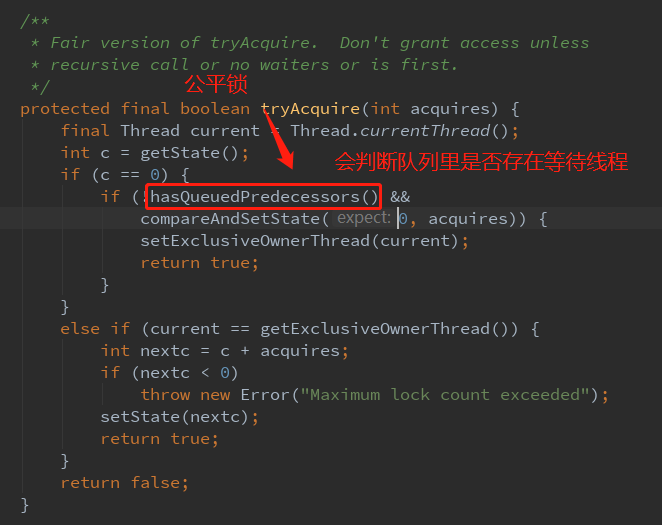
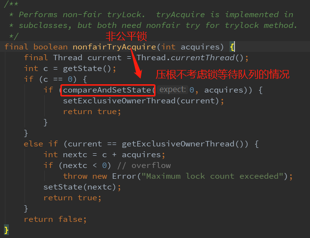

## 锁的分类


* Java中悲观锁的实现是synchronized和Lock相关类，乐观锁的实现有原子类和并发容器等

* git就是乐观锁的典型例子。当我们向远端仓库push时，git会检查远端仓库版本是否领先于我们当前push的版本，如果远程仓库的版本号和本地的不一样，就表示有其他人修改了远端代码，本次push就会失败；如果远端和本地版本号一致，本次push就可以成功提交

* 数据库: select for update 就是悲观锁，用 version 控制数据库就是乐观锁

  ```bash
  # 数据库中实现乐观锁
  # 添加一个字段 lock_version
  # 先查询这个更新语句的version:select * from table，然后
  update set num = 2,verion = version + 1 where version = 1 and id = 5;
  # 如果version与预期值相同则更新成功，如果不一样则会更新出错
  ```


# synchronized

## 1.synchronized用在同步方法、同步代码块、静态同步方法中，分别锁的是什么？

synchronized实现同步的基础就是Java中每个对象都可以作为锁
1. 对于同步方法:锁的是当前实例对象
2. 对于同步代码块:锁的是synchronized括号里配置的对象
3. 对于静态同步方法:锁的是当前类的class对象


# Lock

锁是一种工具，用于控制对共享资源的访问。Lock和synchronized是两种最常见的锁，使用他们都可以达到线程安全的目的。Lock并不是用来代替synchronized的，而是当使用synchronized不合适或者不满足需求时，用来提供高级功能的。最常见的实现类是ReentrantLock。通常情况下，Lock只允许一个线程来访问共享资源，但是Lock接口中的特殊实现ReadWriteLock里面的ReadLock，能允许并发访问

### 为什么synchronized不够用？

1. synchronized锁在线程试图获得锁时不能设定超时时间，
2. 也无法响应中断(无法中断一个正在试图获得锁的线程)，
3. 每个synchronized锁只有一个条件(用某个对象加锁)， 加锁和释放的条件单一
4. 无法知道是否成功获得锁

### Lock中有哪 4 个主要方法？

lock中声明了4个方法用于获取锁

```bash
lock(): # 最普通的获取锁。如果锁已被其他线程获取则进行等待。lock()方法不能被中断，也不像synchronized一样在异常时自动释放锁，因此必须在finally中释放锁，以保证发生异常时锁一定被释放
tryLock(): # 尝试获取锁，该方法会立即返回，即使获取不到锁也不会一直等待。如果当前锁没有被其他线程占用则获取成功返回true，否则返回false代表获取锁失败。可以根据获取锁是否成功来决定程序后续行为
tryLock(long time, TimeUnit unit): # 超时没有获取到锁则放弃，返回true则获取锁成功，返回false则获取锁失败
lockInterruptibly(): # 获取锁的过程中永不超时，但是等待锁的线程可以响应中断
```

```java
/**
* JDK 推荐的 tryLock() 用法
*/
Lock lock = new ReentrantLock();
if(lock.tryLock()){
    try{
        // 编写获取锁成功的处理逻辑
    }catch(Exception e){
        e.printStackTrace();
    }finally{
        lock.unlock();
    }
}else{
    // 编写获取锁失败的处理逻辑
}
```


### ReentrantLock

#### ReentrantLock的可重入性:可由一个线程多次加锁

```java
import java.util.concurrent.locks.ReentrantLock;

public class ReentrantLockDemo {
    private static final ReentrantLock lock = new ReentrantLock();

    public static void main(String[] args) {
        System.out.println(lock.getHoldCount());
        lock.lock();
        System.out.println(lock.getHoldCount());
        lock.lock();
        System.out.println(lock.getHoldCount());
        lock.lock();
        System.out.println(lock.getHoldCount());
        lock.lock();
        System.out.println(lock.getHoldCount());
        lock.unlock();
        System.out.println(lock.getHoldCount());
        lock.unlock();
        System.out.println(lock.getHoldCount());
        lock.unlock();
        System.out.println(lock.getHoldCount());
        lock.unlock();
        System.out.println(lock.getHoldCount());
    }
}
```

```bash
# 运行结果:
0
1
2
3
4
3
2
1
0
```

```java
	/**
     * 递归加锁
     */
    private static void accessResource() {
        lock.lock();
        try {
            System.out.println("已经对资源进行了处理");
            if (lock.getHoldCount() < 5) {
                System.out.println(lock.getHoldCount());
                accessResource();
                System.out.println();
                System.out.println(lock.getHoldCount());
            }
        } finally {
            lock.unlock();
        }
    }
```

```bash
# 运行结果:
已经对资源进行了处理
1
已经对资源进行了处理
2
已经对资源进行了处理
3
已经对资源进行了处理
4
已经对资源进行了处理

4

3

2

1
```

#### 可重入锁ReentrantLock和非可重入锁ThreadPoolExecutor#Worker#tryAcquire()的底层实现有什么区别？

```java
/**
     * ReentrantLock加锁
     *
     * @param acquires
     * @return
     */
    final boolean nonfairTryAcquire(int acquires) {
        final Thread current = Thread.currentThread();
        int c = getState();
        if (c == 0) {
            if (compareAndSetState(0, acquires)) {
                setExclusiveOwnerThread(current);
                return true;
            }
        } else if (current == getExclusiveOwnerThread()) {
            // 获取锁时先判断如果是当前占有锁的线程，则status值+1，然后返回true
            int nextc = c + acquires;
            if (nextc < 0) // overflow
                throw new Error("Maximum lock count exceeded");
            setState(nextc);
            return true;
        }
        return false;
    }

    /**
     * ReentrantLock解锁
     *
     * @param releases
     * @return
     */
    protected final boolean tryRelease(int releases) {
        // 释放锁时先判断当前线程是否是已占有锁的线程，然后再判断status等于0，就真正把锁释放了
        int c = getState() - releases;
        if (Thread.currentThread() != getExclusiveOwnerThread())
            throw new IllegalMonitorStateException();
        boolean free = false;
        if (c == 0) {
            free = true;
            setExclusiveOwnerThread(null);
        }
        setState(c);
        return free;
    }

    /**
     * Worker加锁
     *
     * @param unused
     * @return
     */
    protected boolean tryAcquire(int unused) {
        // 非可重入锁是直接尝试获取锁
        if (compareAndSetState(0, 1)) {
            setExclusiveOwnerThread(Thread.currentThread());
            return true;
        }
        return false;
    }

    /**
     * Worker解锁
     *
     * @param unused
     * @return
     */
    protected boolean tryRelease(int unused) {
        setExclusiveOwnerThread(null);
        // 释放锁时也是直接将status置为0
        setState(0);
        return true;
    }
```

#### ReentrantLock还有哪些其他方法？

```bash
isHedlByCurrentthread: # 可以查看锁是否被当前线程持有
getQueueLength: # 可以返回正在等待这把锁的队列有多长，一般用于开发调试
```

#### 公平锁和非公平锁中的公平和非公平锁指的是什么？

公平指的是按照线程请求的顺序来分配锁；非公平指的是不完全按照请求顺序，而是在一定情况下允许插队。非公平同样不提倡插队行为，只是在合适的时机插队而不是盲目插队，插队可以避免唤醒带来的空档期

|          | 优势                           | 劣势                                                         |
| -------- | ------------------------------ | ------------------------------------------------------------ |
| 公平锁   | 各线程平等对待，按排队顺序执行 | 更慢，吞吐量小                                               |
| 非公平锁 | 更快，吞吐量更大               | 有可能产生线程饥饿，也就是说有可能存在某些线程长时间始终得不到执行 |

源码解析:





#### ReentrantLock的公平与非公平示例代码

```java
import java.util.Random;
import java.util.concurrent.locks.ReentrantLock;

public class FairDemo {
    // 通过true、false来构造公平锁和非公平锁
    private static final ReentrantLock lock = new ReentrantLock(true);

    public static void main(String[] args) throws InterruptedException {
        for (int i = 1; i <= 10; i++) {
            new Thread(() -> print(), "" + i).start();
            Thread.sleep(100);
        }
    }

    public static void print() {
        // 第一个打印任务
        lock.lock();
        try {
            int duration = new Random().nextInt(5) + 1;
            System.out.println(Thread.currentThread().getName() + "正在打印，需要 " + duration + " 秒");
            Thread.sleep(duration * 1000);
        } catch (InterruptedException e) {
            e.printStackTrace();
        } finally {
            lock.unlock();
        }

        // 第二个打印任务
        lock.lock();
        try {
            int duration = new Random().nextInt(5) + 1;
            System.out.println(Thread.currentThread().getName() + "正在打印，需要 " + duration + " 秒");
            Thread.sleep(duration * 1000);
        } catch (InterruptedException e) {
            e.printStackTrace();
        } finally {
            lock.unlock();
        }
    }
}
```

```bash
# 公平锁运行结果:可以看到所有线程在打印时完全按照排队顺序依次打印
1正在打印，需要 3 秒
2正在打印，需要 5 秒
3正在打印，需要 1 秒
4正在打印，需要 1 秒
5正在打印，需要 2 秒
6正在打印，需要 2 秒
7正在打印，需要 1 秒
8正在打印，需要 4 秒
9正在打印，需要 2 秒
10正在打印，需要 3 秒
1正在打印，需要 2 秒
2正在打印，需要 3 秒
3正在打印，需要 1 秒
4正在打印，需要 3 秒
5正在打印，需要 5 秒
6正在打印，需要 1 秒
7正在打印，需要 4 秒
8正在打印，需要 2 秒
9正在打印，需要 4 秒
10正在打印，需要 5 秒
```

```bash
# 非公平锁运行结果:可以看到并没有完全按照线程排队顺序来，而是能免去唤醒其他线程就插队执行
1正在打印，需要 5 秒
1正在打印，需要 4 秒
2正在打印，需要 3 秒
2正在打印，需要 5 秒
3正在打印，需要 4 秒
3正在打印，需要 1 秒
4正在打印，需要 2 秒
4正在打印，需要 1 秒
5正在打印，需要 2 秒
5正在打印，需要 2 秒
6正在打印，需要 4 秒
6正在打印，需要 3 秒
7正在打印，需要 5 秒
7正在打印，需要 5 秒
8正在打印，需要 4 秒
8正在打印，需要 5 秒
9正在打印，需要 2 秒
10正在打印，需要 3 秒
10正在打印，需要 1 秒
9正在打印，需要 1 秒
```

#### tryLock()方法不遵循设定的公平规则。当线程A正在执行tryLock()方法时，一旦线程B释放了锁，那么线程A就能立即获取到锁，即使锁等待队列里有其他线程在等待，线程A也会插队

#### ReentranReadWriteLock

.png)

由ReadLock和WriteLock组成

ReadLock:读锁，是一把共享锁，线程获取读锁后只能查看无法修改，其他线程也可以同时获取到读锁

WriteLock:写锁，是一把独占锁，也叫排它锁

读写锁规则:

* 读锁可以被多个线程申请到
* 写锁只能被一个线程申请到
* 如果一个线程进行了写锁定，那么其他线程申请进行读锁或者写锁会被阻塞直到写锁定被释放。如果一个线程进行了读锁定，那么其他线程申请读锁定可以成功，申请写锁定会被阻塞直到所有读锁定被释放

代码演示:

```java
import java.util.concurrent.locks.ReentrantReadWriteLock;

public class ReadWriteLockDemo {
    // 读写锁
    private static ReentrantReadWriteLock reentrantReadWriteLock = new ReentrantReadWriteLock();

    /**
     * 加读锁
     */
    public static void getRead() {
        System.out.println("当前线程为 " + Thread.currentThread().getName());
        reentrantReadWriteLock.readLock().lock();
        System.out.println("获取读锁成功");
    }

    /**
     * 加写锁
     */
    public static void getWrite() {
        System.out.println("当前线程为 " + Thread.currentThread().getName());
        reentrantReadWriteLock.writeLock().lock();
        System.out.println("获取写锁成功");
    }
}
```

* 两个线程可以同时加读锁，不会阻塞

  ```java
  public static void main(String[] args) throws InterruptedException {
          // 读取
          new Thread(() -> getRead(), "2").start();
          Thread.sleep(100);
          // 读取
          new Thread(() -> getRead(), "1").start();
  }
  ```

  ```bash
  # 运行结果:
  当前线程为 2
  获取读锁成功
  当前线程为 1
  获取读锁成功
  ```

* 一个线程加


#### ReentrantReadWriteLock 相对于 ReentrantLock 是如何提升性能的？

* 使用 ReentrantLock 虽然保证了线程安全，但是多个读操作之间并没有线程安全问题，也进行了同步，浪费了性能。
* 使用 ReentrantReadWriteLock 在读场景使用读锁，写场景使用写锁，灵活控制，当没有加写锁时多个读锁之间是无阻塞的，提高了程序的执行效率


