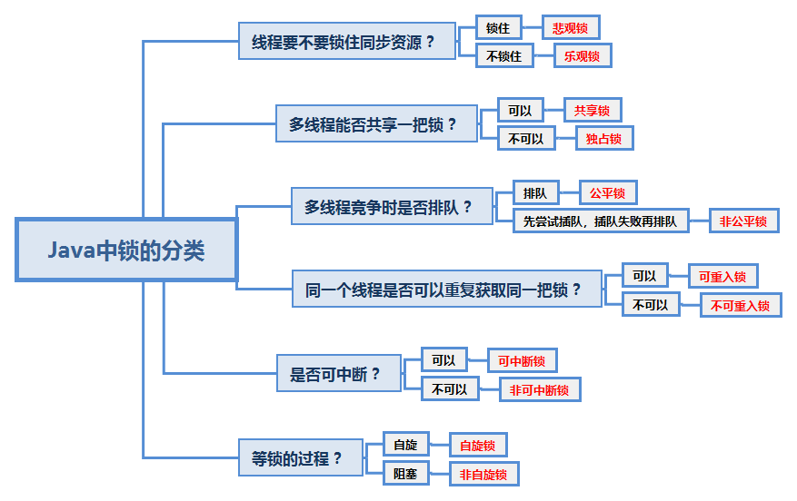

## 锁的分类



* Java中悲观锁的实现是synchronized和Lock相关类，乐观锁的实现有原子类和并发容器等

* git就是乐观锁的典型例子。当我们向远端仓库push时，git会检查远端仓库版本是否领先于我们当前push的版本，如果远程仓库的版本号和本地的不一样，就表示有其他人修改了远端代码，本次push就会失败；如果远端和本地版本号一致，本次push就可以成功提交

* 数据库: select for update 就是悲观锁，用 version 控制数据库就是乐观锁

  ```bash
  # 数据库中实现乐观锁
  # 添加一个字段 lock_version
  # 先查询这个更新语句的version:select * from table，然后
  update set num = 2,verion = version + 1 where version = 1 and id = 5;
  # 如果version与预期值相同则更新成功，如果不一样则会更新出错
  ```

  


# synchronized

## 1.synchronized用在同步方法、同步代码块、静态同步方法中，分别锁的是什么？

synchronized实现同步的基础就是Java中每个对象都可以作为锁
1. 对于同步方法:锁的是当前实例对象
2. 对于同步代码块:锁的是synchronized括号里配置的对象
3. 对于静态同步方法:锁的是当前类的class对象


# Lock

锁是一种工具，用于控制对共享资源的访问。Lock和synchronized是两种最常见的锁，使用他们都可以达到线程安全的目的。Lock并不是用来代替synchronized的，而是当使用synchronized不合适或者不满足需求时，用来提供高级功能的。最常见的实现类是ReentrantLock。通常情况下，Lock只允许一个线程来访问共享资源，但是Lock接口中的特殊实现ReadWriteLock里面的ReadLock，能允许并发访问

### 为什么synchronized不够用？

1. synchronized锁在线程试图获得锁时不能设定超时时间，
2. 也无法响应中断(无法中断一个正在试图获得锁的线程)，
3. 每个synchronized锁只有一个条件(用某个对象加锁)， 加锁和释放的条件单一
4. 无法知道是否成功获得锁

### Lock中有哪 4 个主要方法？

lock中声明了4个方法用于获取锁

```bash
lock(): # 最普通的获取锁。如果锁已被其他线程获取则进行等待。lock()方法不能被中断，也不像synchronized一样在异常时自动释放锁，因此必须在finally中释放锁，以保证发生异常时锁一定被释放
tryLock(): # 尝试获取锁，该方法会立即返回，即使获取不到锁也不会一直等待。如果当前锁没有被其他线程占用则获取成功返回true，否则返回false代表获取锁失败。可以根据获取锁是否成功来决定程序后续行为
tryLock(long time, TimeUnit unit): # 超时没有获取到锁则放弃，返回true则获取锁成功，返回false则获取锁失败
lockInterruptibly(): # 获取锁的过程中永不超时，但是等待锁的线程可以响应中断
```

```java
/**
* JDK 推荐的 tryLock() 用法
*/
Lock lock = new ReentrantLock();
if(lock.tryLock()){
    try{
        // 编写获取锁成功的处理逻辑
    }catch(Exception e){
        e.printStackTrace();
    }finally{
        lock.unlock();
    }
}else{
    // 编写获取锁失败的处理逻辑
}
```


