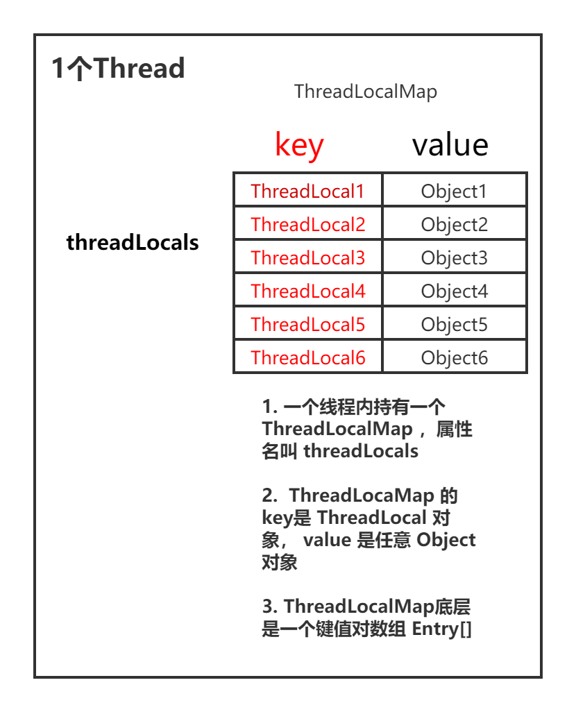

#### 使用静态变量来共享对象带来的问题  --> 线程不安全

```java
import java.text.SimpleDateFormat;

/**
 * 多线程环境下使用 静态变量来共享对象 并不安全
 */
public class ThreadLocalDemo1 {
    public static void main(String[] args) {
        for (int i = 1; i <= 5; i++) {
            final int temp = i;
            new Thread(() ->
                    System.out.println(UnThreadSafeFormatter.sdf.format(temp * 1000))).start();
        }
    }
}

class UnThreadSafeFormatter {
    public static SimpleDateFormat sdf = new SimpleDateFormat("yyyy-MM-dd hh:mm:ss");
}
```

```bash
# 运行结果-错误
1970-01-01 08:00:05
1970-01-01 08:00:05
1970-01-01 08:00:05
1970-01-01 08:00:03
1970-01-01 08:00:02
```

* 用锁也可以解决，但是有性能损耗，更好的办法是使用ThreadLocal

```java
import java.text.SimpleDateFormat;
import java.util.Date;

/**
 * 使用ThreadLocal给每个线程设置一个初始值，避免了共享变量，做到了线程安全
 */
public class ThreadLocalDemo2 {
    public static void main(String[] args) {
        for (int i = 1; i <= 5; i++) {
            final int temp = i;
            new Thread(() ->
                    System.out.println(ThreadSafeFormatter2.dateFormatThreadLocal.get().format(new Date(temp * 1000)))).start();
        }
    }
}

class ThreadSafeFormatter2 {
    public static ThreadLocal<SimpleDateFormat> dateFormatThreadLocal =
            ThreadLocal.withInitial(() -> new SimpleDateFormat("yyyy-MM-dd hh:mm:ss"));
}
```

```bash
# 运行结果-正确
1970-01-01 08:00:05
1970-01-01 08:00:04
1970-01-01 08:00:01
1970-01-01 08:00:02
1970-01-01 08:00:03
```

#### ThreadLocal的两大使用场景(用途)

* 典型场景1: 每个线程需要一个独享的对象(通常是工具类，典型需要使用的类有SimpleDataFormat 和 Random)，需要通过ThreadLocal.withInitial()来对每个线程初始化一个对象

  每个Thread内有自己的实例副本，不和其他线程共享。就像教材只有一本，一起做笔记有线程安全问题，复印后每人一本就没问题了

* 典型场景2: 每个线程内需要保存一个全局变量可以让不同方法直接使用(例如在拦截器中获取用户信息)，避免参数传递的麻烦,强调的是同一个请求内(同一个线程内)不同方法间的共享。不需要使用ThreadLocal.withInitial()赋初值，但是必须手动调用set()方法

```java
import lombok.Getter;

/**
 * 使用 ThreadLocal 来保存线程全局变量，避免层层方法传递参数
 */
public class ThreadLocalDemo4 {
    public static void main(String[] args) {
        ThreadLocalDemo4 demo4 = new ThreadLocalDemo4();
        // 将用户信息放入ThreadLocal
        demo4.serviceMethod1();
        // 然后直接从当前线程的ThreadLocal中取出用户信息
        demo4.serviceMethod2();
        demo4.serviceMethod3();
    }

    public void serviceMethod1() {
        User user = new User("张三");
        UserInfoHolder.holder.set(user);
    }

    public void serviceMethod2() {
        User user = UserInfoHolder.holder.get();
        System.out.println("serviceMethod2()  -----> 获取到用户信息: " + user.getName());

    }

    public void serviceMethod3() {
        User user = UserInfoHolder.holder.get();
        System.out.println("serviceMethod3()  -----> 获取到用户信息: " + user.getName());
    }
}

class UserInfoHolder {
    public static ThreadLocal<User> holder = new ThreadLocal<>();
}

@Getter
class User {
    private String name;

    public User(String name) {
        this.name = name;
    }
}
```

#### 使用ThreadLocal带来的好处

1. 如果单纯用静态变量共享对象则有线程安全问题，ThreadLocal能做到线程安全
2. 无需加锁能提高执行效率
3. 能节省内存

ThreadLocal的两个作用
1. 让某个需要用到的对象在线程间隔离(让每个线程都有自己独立的对象)
2. 在任何方法中都可以轻松获得该对象
根据共享对象的生成时机不同，选择initialValue或者set来保存对象

1. 在ThreadLocal第一次get时候把对象初始化出来，对象的初始化时机可以由我们控制
2. set:如果需要保存到ThreadLocal里的对象的生成时机不由我们随意控制，例如拦截器生成的用户信息，用ThreadLocal.set直接放到我们的ThreadLocal中去，以便于后续使用
3. initialValue():通常每个线程最多调用一次此方法，但如果已经调用了remove()后，再调用get()，则可以再次调用此方法
4. 如果不重写本方法，这个方法会返回null，一般使用匿名内部类或lambd表达式方式来重写initialValue()方法，以便在后续使用中可以初始化副本对象

#### ThreadLoca有哪些常用方法？

```bash
T initialValue(): 用于初始化
void set(T t): 为当前线程设置一个新值
T get(): 获取当前线程对应的value值。先取出当前线程的ThreadLocalMap，然后调用map.getEntry方法，根据当前的  
如果是首次调用get()，则会调用setInitialValue来得到这个值
void remove():删除当前线程对应的值
```

#### Thread、ThreadLocal、ThreadLocalMap之间有什么关系？



#### ThreadLocalMap是如何解决哈希冲突的？

HashMap使用拉链法解决哈希冲突，ThreadLocalMap采用线性探测法，也就是如果发生哈希冲突，就继续找下一个空位置，而不是用链表拉链

#### ThreadLocal什么情况下会发生内存泄漏？如何避免？

什么是内存泄漏:某个对象不再使用，但是占用的内存却不能被回收

ThreadLocalMap的每个Entry的key使用了弱引用(WeakReference)，而Entry的value是强引用。弱引用的特点是，如果这个对象只被弱引用关联(没有其他任何强引用关联)，那么这个对象就可以被回收。

正常情况下，当线程终止时保存在ThreadLocal里的value就会被垃圾回收掉，但是如果线程不终止，例如线程池的情况，那么key对应的value就不能被回收，因为Thread和value之间还存在一个强引用链路:

Thread -> ThreadLocalMap -> Entry(key为null) -> value

所以导致value无法被回收，可能出现oom

JDK已经考虑到这个问题，所以在set、remove、rehash方法中会扫描key为null的Entry，并把对应的value设置为null，这样value对象就能被回收

但是如果一个ThreadLocal不被使用，那么实际上set、remove、rehash方法也不会被调用，如果同时线程又不会被终止，就会由于强引用链路一直存在导致可value的内存泄漏

避免内存泄漏的办法:使用完ThreadLocal后应该调用remove方法，调用remove方法，就会删除对应的 Entry 对象，就可以避免内存泄漏

#### 使用ThreadLocal需要注意什么？

1. 如果不使用ThreadLocal就能解决问题，不要强行使用。例如在任务数很少时，在局部变量中新建对象就可以解决问题，那么这种情况就不需要使用ThreadLocal
2. 优先使用框架的支持而不是自己创造。例如在Spring中如果可以使用RequestContextHolder，那么就不需要自己维护ThreadLocal，因为自己可能会忘记调用remove()方法，造成内存泄漏。
3. Spring的DateTimeCOntextHolder类使用了ThreadLocal
4. 每个Http请求都对应着一个线程，线程之间相互隔离，这就是ThreadLocal的典型应用场景


