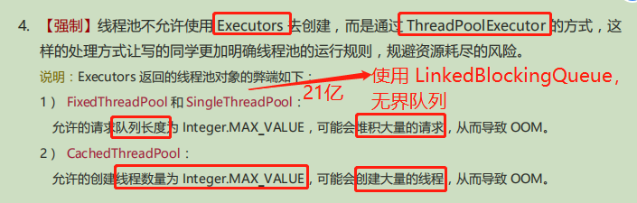
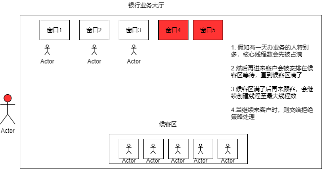
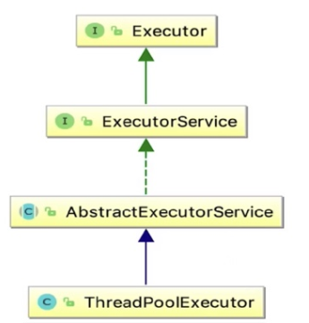

#### 线程池(重点)

3大方法、7大参数、4种拒绝策略

线程池工具类提供的3个创建线程池的方法

数组相关的工具类为Arrays，集合类的工具类为Collections，线程池的工具类为Executors
```java
public class ExecutorsDemo {
    public static void main(String[] args) {
        // 单一线程
        ExecutorService threadPool = Executors.newSingleThreadExecutor();
        // 固定线程数
        ExecutorService threadPool = Executors.newFixedThreadPool(5);
        // 遇强则强，遇弱则弱，可伸缩(可以无限创建线程)
        ExecutorService threadPool = Executors.newCachedThreadPool();
        try {
            for (int i = 1; i <= 10; i++) {
                threadPool.execute(() -> {
                    System.out.println(Thread.currentThread().getName());
                });
            }
        } catch (Exception e) {
            e.printStackTrace();
        } finally {
            // 线程池用完程序结束时，关闭线程池
            threadPool.shutdown();
        }
    }
}
```
运行结果:
```
pool-1-thread-1
pool-1-thread-2
pool-1-thread-4
pool-1-thread-5
pool-1-thread-3
pool-1-thread-6
pool-1-thread-7
pool-1-thread-8
pool-1-thread-9
pool-1-thread-10
```
#### 什么是3大方法？

从源码分析，本质都是使用ThreadPoolExecutor对象创建线程池

```java
public class Executors {
    
    public static ExecutorService newSingleThreadExecutor() {
        return new Executors.FinalizableDelegatedExecutorService
                (new ThreadPoolExecutor(1, 1, 0L, TimeUnit.MILLISECONDS, new LinkedBlockingQueue<Runnable>()));
    }

    public static ExecutorService newFixedThreadPool(int nThreads) {
        return new ThreadPoolExecutor(nThreads, nThreads,
                0L, TimeUnit.MILLISECONDS,
                new LinkedBlockingQueue<Runnable>());
    }

    public static ExecutorService newCachedThreadPool() {
        return new ThreadPoolExecutor(0, Integer.MAX_VALUE,
                60L, TimeUnit.SECONDS,
                new SynchronousQueue<Runnable>());
    }
}
```
#### 四种线程池的构造器参数都有哪些？

| 构造器参数名    | FixedThreadPool    | CachedThreadPool  | ScheduledThreadPool | SingleThreadPool |
| --------------- | ------------------ | ----------------- | ------------------- | ---------------- |
| corePoolSize    | 根据传参           | 0                 | 根据传参            | 1                |
| maximumPoolSize | 和corePoolSize相同 | Integer.MAX_VALUE | Integer.MAX_VALUE   | 1                |
| keepAliveTime   | 0 seconds          | 60 seconds        | 0 seconds           | 0 seconds        |

阿里巴巴Java开发手册--线程池规约:


#### 线程池构造参数有哪7大参数？

ThreadPoolExecutor的构造方法需要的7个参数

```java
public class ThreadPoolExecutor {
        public ThreadPoolExecutor(int corePoolSize, // 核心线程数
                                  int maximumPoolSize, // 最大线程数
                                  long keepAliveTime, // 如果线程池当前线程数大于corePoolSize，那么多出来的线程空闲时间超过keepAliveTime后就会被终止。多余的线程在超时时间内找不到活干，就会被终止
                                  TimeUnit unit,     // 超时单位
                                  BlockingQueue<Runnable> workQueue, // 工作队列，必须是阻塞队列类型，因为要在多线程并发环境下从工作队列中取任务，必须保证线程安全。有3种常见的阻塞队列类型:第一种是直接交接，不保存任务，例如 SynchronousQueue；第二种是无界队列，没有容量限制，例如 LinkedBlockingQueue；第三种是有界队列，有容量限制，例如 ArrayBlockingQueue。
                                  ThreadFactory threadFactory, // 线程工厂，用来创建线程的。默认使用Executors.defaultThreadFactory()就可以了,这样创建出来的线程都在同一个线程组，都有同样的norm_priority优先级，并且都不是守护线程。如果自己写一个ThreadFactory，就可以改变线程名、线程组、优先级、是否是守护线程等
                                  RejectedExecutionHandler handler) // 拒绝策略 
        {}
}
```

```java
public class ExecutorServiceDemo {
    public static void main(String[] args) {
        ExecutorService threadPool = new ThreadPoolExecutor(3, 5, 3, TimeUnit.SECONDS, new LinkedBlockingQueue<>(3),
                Executors.defaultThreadFactory(), new ThreadPoolExecutor.AbortPolicy());
        for (int i = 1; i <= 9; i++) {
            // 最大承载 = 最大线程数 + 队列最大容量
            /**
             * 超出最大承载则报错:rejected from java.util.concurrent.ThreadPoolExecutor@27bc2616[Running, pool size = 5, active
             * threads = 5, queued tasks = 3, completed tasks = 0]
             */
            threadPool.execute(() -> {
                System.out.println(Thread.currentThread().getName());
            });
        }
    }
}
```

线程池执行任务与银行办理业务的关联:


#### 4种拒绝策略都有什么？
* AbortPolicy: 到达最大负载后，再提交任务进来直接抛异常
* DiscardPolicy: 如果队列满了则丢掉刚提交的任务，不抛异常
* DiscardOldestPolicy: 队列满了尝试去和最早的竞争，不会抛异常
* CallerRunsPolicy: 哪个线程提交的任务就扔回给哪个线程去处理

#### 线程池添加线程的规则是怎样的？

当向线程池提交一个任务时:(从源码中分析流程)

1. 如果线程池当前线程数小于corePoolSize，即使其他工作线程处于空闲状态，也会创建一个新线程来执行提交的这个任务
2. 如果线程数不小于corePoolSize但小于maximumPoolSize，则将任务存入队列
3. 如果队列满了，并且线程数小于maximumPoolSize，则创建一个新线程来执行任务
4. 如果队列满了，并且当前线程数大于或等于maxPoolSize，则交给拒绝策略处理

```java
public void execute(Runnable command) {
        if (command == null)
            throw new NullPointerException();
        int c = ctl.get();
		// 当前线程数小于corePoolSize则直接创建一个线程
        if (workerCountOf(c) < corePoolSize) {
            if (addWorker(command, true))
                return;
            c = ctl.get();
        }
    	// 如果入队成功则放入队列
    	// 如果放入队列没成功则尝试增加线程，如果增加线程失败则拒绝任务
        if (isRunning(c) && workQueue.offer(command)) {
            int recheck = ctl.get();
            if (! isRunning(recheck) && remove(command))
                reject(command);
            else if (workerCountOf(recheck) == 0)
                addWorker(null, false);
        }
        else if (!addWorker(command, false))
            reject(command);
    }
```

#### 增减线程有什么特点?

1. 通过设置corePoolSize和maximumPoolSize相同可以创建固定大小的线程池
2. 达到corePoolSize并且小于maximumPoolSize时线程的增加逻辑，核心思想是希望保持较少的线程，并且只有在负载变的很大时才去增加线程来帮忙处理
3. 把maximumPoolSize设置为很高的值如Integer.MAX_VALUE，就可以允许线程池容纳任意数量的并发任务。
4. 队列是用来缓冲任务的。由于只有在队列存满时才会创建多于corePoolSize的线程，所以如果使用的是无界队列(例如LinkedBlockingQueue)，那么线程数是不会超过corePoolSize的

#### 如何向线程池提交任务？

execute()方法:用于提交不需要返回值的任务，所以无法判断任务是否被线程池执行成功
submit()方法:用于提交需要返回值的任务。线程池会返回一个future类型的对象，通过future对象可以判断任务是否执行成功。
调用future.get()方法可以获取返回值。get()方法会阻塞当前线程直到任务完成，
而get(long timeout,TimeUnit unit)会阻塞当前线程一段时间后，立即返回，这时任务有可能还没执行完，所以可能future对象携带的返回值可能是空对象

#### 线程池什么时候会拒绝任务？(线程池的拒绝时机)

1. 当Executor关闭时，提交新任务会被拒绝
2. 当Executor达到最大工作负载(达到最大线程数 maximumPoolSize + 工作队列已满时工作队列容量)时，再提交任务会被拒绝

#### 使用线程池应该注意什么？

1. 避免任务堆积
2. 避免线程数过度增加
3. 排查线程泄漏

#### 如何监控线程池？

系统中大量使用线程池，需要对线程池进行监控，出现问题时，可以根据线程池的使用状况快速定位问题。可以使用线程池提供的参数进行监控:

* taskCount:线程池需要执行的任务数量
* completeTaskCount:已经完成的任务数量(小于等于taskCount)
* largestPoolSize:线程池里曾经创建过的最大线程数量(可以通过该参数知道线程池是否满过，如果该数值等于线程池的最大大小，则表示线程池曾经满过)
* getPoolSize:线程池中当前线程数量。(如果线程池不销毁的话，线程池里的线程不会自动销毁，所以这个大小只增不减)
* getActiveCount:获取当前活动的线程数

#### 如何停止线程池？

和停止线程池相关的方法有5个:

1. shutdown: 将线程池状态标记为正在停止，不接收新任务
2. isShutdown: 是否已标记为正在停止
3. isTerminated: 线程池是否已完全终止
4. awaitTermination: 等待指定时长后返回线程池是否已终止
5. shutdownNow: 立即给线程池中所有线程发送中断信号，同时返回工作队列中未被执行的任务列表

```java
import lombok.SneakyThrows;

import java.util.List;
import java.util.concurrent.ExecutorService;
import java.util.concurrent.Executors;
import java.util.concurrent.TimeUnit;

/**
 * 停止线程池的方法
 */
public class TestShutDown {
    @SneakyThrows
    public static void main(String[] args) {
        ExecutorService executorService = Executors.newFixedThreadPool(10);
        for (int i = 1; i < 1000; i++) {
            executorService.execute(new ShutDownTask());
        }
        TimeUnit.MILLISECONDS.sleep(500);
        // shutDown方法执行后不会关闭线程池，只是不接收新的任务，等工作队列中任务全部完成才会关闭，比较优雅
        executorService.shutdown();
        // shutDownNow方法执行后立即中断，返回未被执行的任务列表
        List<Runnable> list = executorService.shutdownNow();
        System.out.println("isShutDown() ---> " + executorService.isShutdown());
        TimeUnit.SECONDS.sleep(1);
        System.out.println("awaitTermination() ---> " + executorService.awaitTermination(1, TimeUnit.SECONDS));
        System.out.println("isTerminated() ---> " + executorService.isTerminated());
    }
}

class ShutDownTask implements Runnable {
    @Override
    public void run() {
        try {
            TimeUnit.MILLISECONDS.sleep(100);
        } catch (InterruptedException e) {
            System.out.println("被中断了");
        }
        System.out.println(Thread.currentThread().getName());
    }
}
```

#### 如何关闭线程池？关闭线程池的原理是什么？

调用线程池的shutdown()或shutdownNow方法
原理：遍历线程池中的工作线程，逐个调用线程的interrupt方法来中断线程。所以无法响应中断的任务可能永远无法终止。
区别：shutdownNow先将线程池状态设置为STOP，然后尝试停止所有正在执行或暂停任务的线程。返回等待执行的任务列表(List<Runnable>)
shutdown将线程池状态设置为shutdown，然后中断所有空闲的线程
shutdown方法和shutdownNow如何选择？
一般通过调用shutdown方法来关闭线程池。如果任务不一定要执行完，则可以调用shutdownNow方法

#### 说下线程池的生命周期？

* Running: 能接受新提交的任务， 并且也能处理工作队列中的任务
* Shutdown: 关闭状态，不再接受新提交的任务，但可以继续处理工作队列中已保存的任务
* Stop: 不能接受新任务，也不处理队列中的任务，会中断正在处理任务的线程。
* Tidying：中文意思是整洁，此时所有任务都已终止，workerCount(有效线程数)为0，线程池状态转换为Tiding状态后会执行terminate()钩子方法
* Terminated：在terminated()方法执行完后进入该状态

#### 线程池钩子函数

```java
mport lombok.SneakyThrows;

import java.util.concurrent.BlockingQueue;
import java.util.concurrent.LinkedBlockingQueue;
import java.util.concurrent.ThreadPoolExecutor;
import java.util.concurrent.TimeUnit;
import java.util.concurrent.locks.Condition;
import java.util.concurrent.locks.Lock;
import java.util.concurrent.locks.ReentrantLock;

/**
 * 在线程池指定任务前后放 钩子函数
 */
public class PauseThreadPool extends ThreadPoolExecutor {
    public static void main(String[] args) throws InterruptedException {
        PauseThreadPool pauseThreadPool = new PauseThreadPool(10, 10, 0, TimeUnit.SECONDS, new LinkedBlockingQueue<>());
        for (int i = 1; i <= 1000; i++) {
            pauseThreadPool.execute(new Task());
        }
        TimeUnit.SECONDS.sleep(1);
        pauseThreadPool.pause();
        System.out.println("检查是否已暂停");
        TimeUnit.SECONDS.sleep(5);
        System.out.println("检查完成，恢复执行");
        pauseThreadPool.resume();
    }

    private Lock lock = new ReentrantLock();
    Condition condition = lock.newCondition();

    private volatile boolean isPaused = false;

    public PauseThreadPool(int corePoolSize, int maximumPoolSize, long keepAliveTime, TimeUnit unit,
                           BlockingQueue<Runnable> workQueue) {
        super(corePoolSize, maximumPoolSize, keepAliveTime, unit, workQueue);
    }

    /**
     * 池中任务执行前被调用
     *
     * @param t
     * @param r
     */
    @Override
    protected void beforeExecute(Thread t, Runnable r) {
        super.beforeExecute(t, r);
        lock.lock();
        try {
            while (isPaused) {
                condition.await();
            }
        } catch (Exception e) {
            e.printStackTrace();
        } finally {
            lock.unlock();
        }
    }

    /**
     * 池中任务执行后被调用
     *
     * @param r
     * @param t
     */
    @Override
    protected void afterExecute(Runnable r, Throwable t) {
        super.afterExecute(r, t);
        System.out.println("执行完成");
    }

    /**
     * 暂停
     */
    public void pause() {
        lock.lock();
        try {
            isPaused = true;
        } catch (Exception e) {
            e.printStackTrace();
        } finally {
            lock.unlock();
        }
    }

    /**
     * 恢复
     */
    public void resume() {
        lock.lock();
        try {
            isPaused = false;
            condition.signalAll();
        } catch (Exception e) {
            e.printStackTrace();
        } finally {
            lock.unlock();
        }
    }
}

class Task implements Runnable {
    @SneakyThrows
    @Override
    public void run() {
        System.out.println("正在执行...");
        TimeUnit.MILLISECONDS.sleep(100);
    }
}
```

#### 线程池实现任务复用的原理是什么？

向线程池提交的任务会被包装成worker，worker也是一个实现了Runnable接口的类，worker的run方法里面是调用runWorker方法，而runworker方法不断从工作队列中取任务来执行任务的run方法

```java
private final class Worker extends AbstractQueuedSynchronizer implements Runnable {
    	// worker的run方法
        public void run() {
            runWorker(this);
        }
		// runWorker方法
        final void runWorker(ThreadPoolExecutor.Worker w) {
            Thread wt = Thread.currentThread();
            Runnable task = w.firstTask;
            w.firstTask = null;
            while (task != null || (task = getTask()) != null) {
                task.run();
            }
        }
    }
```

#### 如何提前创建所有核心线程？

调用线程池的prestartAllCoreThreads()方法，线程池会提前创建并启动所有基本线程。

#### 线程池调优

CPU密集型任务及IO密集型业务

* 对于线程池中都是CPU密集型任务，则最大线程数设置为Runtime.getRuntime().availableProcessors()个效率最高，因为可以避免上下文切换
* 对于线程池中都是IO密集型任务，则最大线程数设置为 2* Runtime.getRuntime().availableProcessors()，避免CPU长时间等待IO

#### Fork/Join 线程池
```java
import java.util.concurrent.ExecutionException;
import java.util.concurrent.ForkJoinPool;
import java.util.concurrent.ForkJoinTask;
import java.util.concurrent.RecursiveTask;
import java.util.stream.LongStream;

/**
 * Fork/Join 使用流程:
 * <p>
 * 1. 计算类要继承RecursiveTask,覆写compute方法
 * 2.新建一个ForkJoinPool
 * 3. 使用ForkJoinPool的submit方法提交任务
 */
public class ForkJoinDemo {
    public static void main(String[] args) throws ExecutionException, InterruptedException {
        test1();
        test2();
        test3();
    }

    // 普通计算
    public static void test1() {
        long startTime = System.currentTimeMillis();
        long sum = 0;
        for (int i = 1; i <= 10_0000_0000; i++) {
            sum += i;
        }
        long endTime = System.currentTimeMillis();
        System.out.println("普通计算得到的sum结果为:" + sum);
        System.out.println("计算用时:" + (endTime - startTime) + "毫秒");
    }

    // fork/join 计算
    public static void test2() throws ExecutionException, InterruptedException {
        long startTime = System.currentTimeMillis();
        ForkJoinPool forkJoinPool = new ForkJoinPool();
        ForkJoinTask<Long> task = new ForkJoinTaskDemo(1, 10_0000_0000, 10000);
        ForkJoinTask<Long> submit = forkJoinPool.submit(task);
        Long result = submit.get();
        long endTime = System.currentTimeMillis();
        System.out.println("fork/join计算结果为:" + result);
        System.out.println("计算用时:" + (endTime - startTime) + "毫秒");
    }

    // stream并行流计算
    public static void test3() {
        long startTime = System.currentTimeMillis();
        Long result = LongStream.rangeClosed(0, 10_0000_0000L).parallel().reduce(0, Long::sum);
        long endTime = System.currentTimeMillis();
        System.out.println("stream并行计算结果为:" + result);
        System.out.println("计算用时:" + (endTime - startTime) + "毫秒");
    }
}

class ForkJoinTaskDemo extends RecursiveTask<Long> {
    private long start;
    private long end;
    private long temp;

    public ForkJoinTaskDemo(long start, long end, long temp) {
        this.start = start;
        this.end = end;
        this.temp = temp;
    }

    @Override
    protected Long compute() {
        // 小于临界值则直接计算
        if (end - start < temp) {
            long sum = 0L;
            for (long i = start; i <= end; i++) {
                sum += i;
            }
            return sum;
        } else {
            // 大于临界值则使用fork/join 用递归方式拆分任务
            long middle = (start + end) / 2;
            ForkJoinTaskDemo task1 = new ForkJoinTaskDemo(start, middle, temp);
            // 拆分任务，把任务压入线程队列
            task1.fork();
            ForkJoinTaskDemo task2 = new ForkJoinTaskDemo(middle + 1, end, temp);
            // 拆分任务，把任务压入线程队列
            task2.fork();
            return task1.join() + task2.join();
        }
    }
}
```

#### Executor家族

线程池、ThreadPoolExecutor、ExecutorSurvice、Executor、Executors




#### workStealingPool 线程池

workStealingPool是JDK 1.8 新加入的，这个线程池的设计思想和之前的线程池有很大不同，它不保证执行顺序，且采用无阻塞队列便于工作窃取

#### 异步回调:

使用CompletableFuture进行异步执行，异步执行成功或执行失败都有回调
```java
import java.util.concurrent.CompletableFuture;
import java.util.concurrent.ExecutionException;
import java.util.concurrent.TimeUnit;

public class CompletableFutureDemo {
    public static void main(String[] args) throws ExecutionException, InterruptedException {
        test1();
        test2();
    }

    // 没有返回值的 runAsync 异步回调
    public static void test1() throws ExecutionException, InterruptedException {
        CompletableFuture<Void> completableFuture = CompletableFuture.runAsync(() -> {
            try {
                TimeUnit.SECONDS.sleep(1);
            } catch (InterruptedException e) {
                e.printStackTrace();
            }
            System.out.println(Thread.currentThread().getName() + " runSync ==> Void");
        });
        completableFuture.get();
        System.out.println("runAsync--已完成");
    }

    // 有返回值的 supplyAsync 异步回调
    public static void test2() throws ExecutionException, InterruptedException {
        CompletableFuture<Integer> completableFuture = CompletableFuture.supplyAsync(() -> {
            System.out.println(Thread.currentThread().getName() + " supplyAsync ==> Integer");
            int i = 1 / 0;
            return 1024;
        });

        completableFuture
                .whenComplete((r, e) -> {
                    System.out.println("正常返回的结果为:" + r);
                    System.out.println("返回的异常信息为:" + e);
                })
                .exceptionally(e -> {
                    System.out.println(e.getMessage());
                    return 404;
                });
        System.out.println(completableFuture.get());
    }
}
```