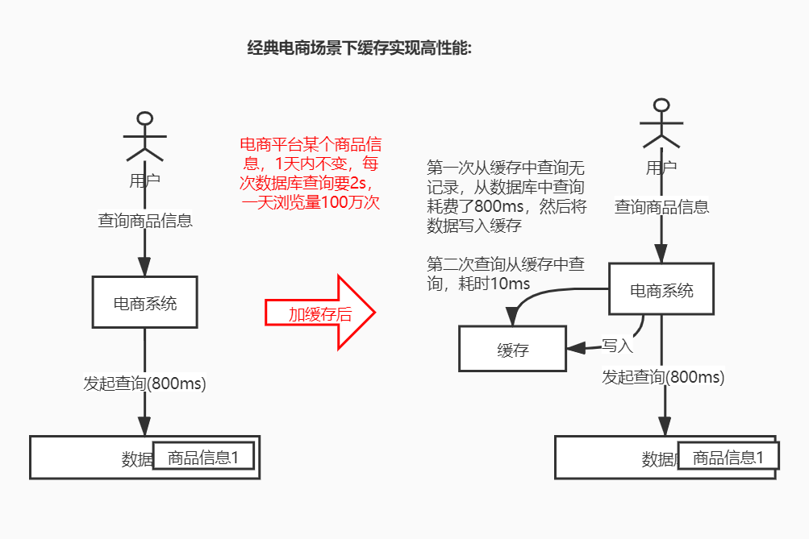
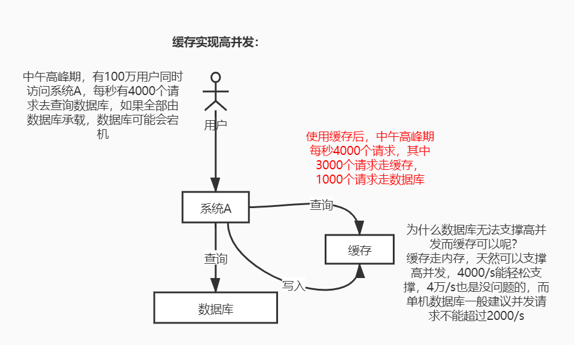

### Redis简介
* Redis 是一个内存数据库，读写速度比较快，所以多用于做缓存。此外，redis支持事务，持久化，lua脚本，集群部署  

### 为什么不用map或者guava做缓存？
* map和guava实现的是本地缓存，生命周期随着jvm的销毁而结束。在分布式架构中，多个实例每个实例单独持有一份缓存，无法保证缓存一致性
而redis或memCached属于分布式缓存，在分布式架构的多个实例下，可以共用一份缓存，可以保证缓存一致性。缺点是需要保证缓存的高可用  

### redis默认分多少个数据库？
* 16个，从 0 到 15

### 在项目里缓存是怎么用的？为什么在项目里用缓存？缓存使用不当会有什么不良后果？
使用缓存的两个核心目的就是是高性能，高并发:
* 缓存实现高性能：(电商场景)电商平台某个商品信息，1天内不变，但是每次查询要2s，一天被浏览100万次。第一次从数据库查询花费800ms
后，就把结果放入缓存，以后都走缓存。如果后续商品数据发生变化，只要修改数据库的同时，更新一下缓存就可以了。

* 缓存实现高并发：(场景)中午高峰期，100万用户同时访问系统a，每秒有4000个请求去查询数据库，可能数据库会宕机  
* 方案：中午高峰期，3000个请求走缓存，1000个请求走数据库
* 为什么缓存有用：缓存走内存，单机数据库建议并发请求不要超过 2000 QPS

### Redis和memcached区别？redis线程模型是什么？为什么单线程的redis比多线程的memcached效率要高得多？为什么redis是单线程的但是可以支撑高并发？
* 答：数据类型比memcached丰富，redis单线程，mem多线程。mem没有原生集群模式，redis原生支持cluster模式

Redis线程模型：redis基于refactor模型开发了文件事件处理器，这个是单线程的实现，采用io多路复用同时监听多个socket

### 4.redis为什么快？
* 纯内存访问
* 单线程架构避免了线程上下文切换带来的资源损耗
* 使用基于事件的IO多路复用模型

### 客户端和redis通信一次的流程：
建立连接，然后发命令给io多路复用程序，io多路复用程序维护一个队列，将客户端压入队列，然后命令通过文件事件分派器分别分给 连接应答处理器，命令请求处理器，命令回复处理器
Io多路复用程序只负责监听。压队列
文件事件分派器来对队列处理

纯内存操作，
核心基于非阻塞io多路复用
单线程避免了多线程的上下文频繁切换

### Redis都有哪些数据类型分析？分别在哪些场景下使用比较合适？字符串最大不能超过多少？
* String：最简单的key v缓存
* Hash：类似map，一般可以将于存对象，方便对某个字段进行操作
* List ：有序列表，微博某大v的粉丝。可以用list存储。可以用lrange来实现分页。还可以用于简单的消息队列，
* Set：无序集合，自动去重。分布式环境下用redis来全局去重。并且可以算交集，并集，差集
* Sorted set：排序的set，能自动去重。可以用于排行榜

还有HyperLogLog、流、地理坐标等
* 最大不能超过 512MB

### Redis的过期策略？手写lru？Redis是怎么对过期key进行删除的？
定期删除➕惰性删除
* 定期删除：指的是redis每隔100ms随机抽取一些设置了过期时间的key，过期则删除.随机抽取，并不是全盘扫描的。
* 惰性删除：在每次获取key时, redis会检查一下，如果过期了就在检查时候删除，不会返回任何东西

出现的问题：定期删除漏掉了很多过期key，然后你

### 内存淘汰策略：
Noeviction：内存不足以写入新数据时，写入操作会报错
Allkeys-lru:内存不足以写入时移除最近最少使用的key（最常用）
Allkeys-random:内存不足以写入时，随机删掉某个key，（一般没人用，为啥要随机，肯定是把最近最少使用的key删掉啊）
Volatile-lru:内存不足时在设置了过期时间的key中，移除最近最少使用的key（一般不太合适）
Volatile-random:当内存不足时，在设置了过期时间的key中，随机移除某个key
Volatile-ttl:内存不足时，在设置了过期时间的key中，有更早过期时间的key优先删除。

### 怎么保证redis是高并发和高可用的？redis的主从复制原理能介绍一下吗？redis的哨兵原理能介绍一下吗？
高可用架构原理
单机redis能够承载的qps大概在上万到几万不等。
20w➕qps的Redis架构：主从架构。一主多从。主负责写。并且将数据同步复制到其他的slave节点。从节点负责读，所有的读请求全部走从节点

### redis replication的核心机制？
(1)redis采用异步复制的方式复制数据到slave节点，不过redis2.8开始，slave node会周期性地确认自己每次复制的数据量
(2)一个maste node 是可以配置多个slave node的
(3)slave node也可以连接其他的slave node
(4)slave node做复制的时候，是不会block master node的正常工作的
(5)slave node在做复制的时候，也不会block对自己的查询操作，它会用旧的数据集来提供服务；但是复制完成时，需要删除旧数据集，加载新数据集，这个时候就会暂停对外服务了(间隔在ms到s之间，看数据集大小)
(6)slave node主要用来进行横向扩容，做读写分离，扩容的slave node可以提高读的吞吐量

slave:高可用性，有很大关系

### master持久化对于主从架构的安全保障的意义？
如果采用了主从架构，那么建议必须开启Master node的持久化。
不建议用slave node作为master node的数据热备，因为那样的话,如果你关掉master的
持久化,可能在master宕机重启的时候数据是空的，然后可能一经过复制，
slave node数据也丢了。

如果 master -> RDB和AOF都关闭了 -> 此时数据全在内存中
这时 master宕机，重启，是没有本地数据可以恢复的，然后会直接认为自己ide数据是空的
master就会把空的数据集同步到slave上去，所有slave数据都就全部被清空了
这种数据 会100%丢失
所以master节点必须要使用持久化机制
第二个，master的各种备份方案要不要做：万一说本地的所有文件丢失了，从备份中挑选一份rdb去恢复master，这样才能确保
master启动的时候，是有数据的

即使采用了后续讲解的高可用机制:slave node可以自动接管master node，但是也可能sentinal还没有检测到master failure，
master node就自动重启了，还是可能导致上面的所有slave node 数据清空故障

### redis主从复制的过程及原理？
当启动一个slave node时，它会先发送一个psync命令给master，
如果这时slave node重新连接master node，那么master node仅仅会复制给slave部分缺少的数据；否则如果是slave node第一次连接master
node，那么会触发一次full -resynchronization
开始full resynchronization的时候，master会启动一个后台线程，开始生成一份RDB快照文件，同时还会将从客户端收到的所有写命令缓存在
内存中，RDB文件生成完毕后，master会将这个RDB发送给slave，slave会先写入本地磁盘，然后再从本地磁盘加载到内存中，
然后master会将内存中的写命令发送给slave，slave也会同步这些数据，slavenode如果跟master node有
网络故障，断开了连接，会自动重连，master如果发现有多个slave node都来重新连接，仅仅会启动一个rdb save操作，
用一份数据服务所有slave node

当master和salve已经建立好连接时，正常master接受一条写请求后，直接将命令异步发给slave

### 主从复制的断点续传
从redis2.8开始，就支持主从复制的断点续传，如果主从复制过程中，网络连接断掉了，那么可以接着上次复制的地方，继续复制下去，而不是从头开始复制一份
master会在内存中创建一个backlog，master和slave都会保存一个replica offset还有要给master id
offset就是保存在backlog中的，如果master和slave网络连接断掉了，slave会i让master从上次的replicat开始复制
但是如果没有找到对应的offset，那么会执行一次resynchronization

### 无磁盘化复制
master在内存中直接创建rdb，然后发送给slave，不会在自己本地落盘了
repl-diskless-sync  no(yes) 
为 no时，redis启动一个新进程把rdb文件存入磁盘，然后被redis父进程传给slave
repl-diskless-sync-delay,等待一定时长再开始复制，因为要等更多slave重新连接进来(生成rdb是有开销的，所以生成一次，连接更多的slave好)

### 主从复制架构对过期key处理:
slave不会过期key，只会等待master过期key。如果master过期了一个key，或者通过lru淘汰了一个key，那么master会模拟一条del命令发送给slave

1. 主从复制的完整流程：
(1)slave node 启动，仅仅保存master node的信息，包括master node的host和ip，但是复制流程没开始

master host和ip是从哪儿来的，redis.conf里面的slaveof配置的

(2)slave node内部有个定时任务，每秒检查是否有新的master node要连接和复制，如果没发现，就跟master node建立socket网络连接
(3)slave node发送ping命令给master node
(4)口令认证:如果master设置了requirepass，那么slave node必须发送masterauth的口令过去进行认证
(5)master node第一次执行全量复制，将所有数据发给slave node
(6)master node后续持续将写命令，异步复制给slave node

2.数据同步相关的核心机制
指的是第一次slave连接master时候，执行的是全量复制，这个过程中的一些细节机制
(1)master和slave都会维护一个offset

master会在自身不断累加offset，slave也会在自身不断累加offset
slave每秒都会上报自己的offset给master，同时master也会保存每个slave的offset

这个倒不是说特定就用在全量复制的，主要是master和slave都要知道各自数据的offset，在能知道互相之间的数据不一致的情况

(2)backlog
master node 有一个backlog，默认是1mb大小
master node给slave node复制数据时，也会将数据在backlog中同步写一份
backlog主要是用来做全量复制中断后的增量复制的

(3)master run id
info server,可以看到master run id
如果根据host+ip定位master node，是不靠谱的，如果master node 重启或者数据发生了变化，那么slave node应该根据不同的run id区分，run id不同就做全量复制，如果需要不更改run id重启redis，可以使用redis-cli debug reload命令

(4)psync

从节点使用psync从master node进行复制，psync runid offset
master node会根据自身的情况返回响应信息，可能是fullresycn runid offset触发全量复制，可能是continuc触发增量复制

3.全量复制

(1)master执行bgsave，在本地生成一份rdb快照文件
(2)master node将rdb快照文件发送给slave node，如果rdb复制时间超过60秒(repl-timeout)，那么slave node就会认为复制失败，可以适当调大这个参数
(3)对于千兆网卡的机器，一般每秒传输100mb，6g文件很可能超过60s
(4)master node在生成rdb时，会将所有写命令缓存在内存中，在slave node保存了rdb后，再将新的写命令复制给slave node
(5)client-output-buffer-limit slave 256mb 64mb 60,如果在复制期间，内存缓冲区持续消耗超过64mb，或者一次性超过256mb，那么停止复制， 复制失败
(6)slave node接收到rdb后，清空自己的旧数据，然后重新加载rdb到自己的内存中，同事基于旧的数据版本对外提供服务
(7)如果slave node开启了aof，那么会立即执行bgRewriteAof,重写aof

rdb生成，rdb通过网络拷贝，slave旧数据的清理，slave aof rewrite
如果复制的数据量在4g-6g之间，那么很可能全量复制时间消耗到1分半到2分钟

4.增量复制
(1)如果全量复制过程中，master-slave网络连接断掉，那么slave重新连接master时，会触发增量复制
(2)master直接从自己的backlog中获取部分丢失的数据，发送给slave node，默认backlog就是1mb
(3)master就是根据slave发送的psync中的offset来从backlog中获取数据的

5.heartbeat 
主从节点互相都会发送heartbeat信息
master默认每隔10s发送一次heartbeat，slave node每隔1秒发送一个heartbeat

6.异步复制
master每次接收到写命令后，先在内部写入数据，然后异步发送给slave node

Redis不可用是什么？单实例不可用？主从架构不可用？不可用的后果是什么？
一个slave挂掉了没有问题，但是如果master节点挂掉了，就没法写数据了，这时候剩下的slave节点也没用了，这种情况属于redis不可用导致缓存不可用。
缓存不可用，大量流量打入mysql会超过mysql最大承载能力，mysql宕机，导致整个系统不可用

如何做到高可用？
Redis高可用架构，做故障转移。也可以叫主备切换。

在master节点故障时，自动检测，并且将某个slave节点自动切换为master节点的过程，叫做主备切换。这个过程实现了redis的主从架构下的高可用，可以对外提供99.99%的高可用性。

一旦master故障，在很短时间就会切换到另外一个master，可能几秒钟，几分钟redis是不可用的

sentinal哨兵是redis集群架构中非常重要的一个组件，主要功能如下：
(1)集群监控，负责监控redis master和slave进程是否正常工作
(2)消息通知，如果某个redis实例有故障，那么哨兵负责发送消息作为报警通知给管理员
(3)故障转移，如果master节点挂掉了，会自动转移到slave节点上
(4)配置中心，如果故障转移发生了，通知client客户端新的master地址

哨兵本身也是分布式的，作为一个哨兵集群去运行，互相协同工作:
(1)故障转移时，判断一个master节点是否宕机，需要大部分的哨兵同意才行，涉及到了分布式选举问题
(2)即使部分哨兵节点挂掉了，哨兵集群还是能正常工作的，因为如果一个作为高可用机制重要组成部分的故障转系统本身是单点的，那就不合理了

目前采用的是sentinal 2 版本，sentinal 2版本相对于sentinal 1来说，重写了很多代码，
主要是让故障转移机制的算法变得更加健壮和简单

哨兵的核心知识

(1)哨兵至少需要3个实例，来保证自己的健壮性
(2)哨兵 + redis主从的部署架构，不保证数据零丢失，只能保证redis集群的高可用
(3)对于哨兵 + redis主从这种复杂的部署架构，尽量在测试环境和生产环境，都进行重组的测试和演练

为什么reids哨兵集群只有2个节点无法正常工作？
哨兵集群必须部署两个以上节点，如果哨兵集群仅仅部署了2个哨兵实例，quorm=1，configuration: quorum = 1
master宕机，s1和s2中只要有1个哨兵认为master宕机就可以进行切换，同时s1核s2中会选举出一个哨兵来执行故障转移，同时这个时候，
需要majority:也就是大多数哨兵都是运行的，2个哨兵的majority就是2(2的majority是2,3的majority= 2,5的majority = 3,4的majority = 2)，
2个哨兵都运行着，就可以允许执行故障转移。但是如果整个m1和s1运行的机器宕机了，那么哨兵就只有1个了，此时就没有majority来允许执行故障转移，
虽然另外一台机器还有一个r1，但是故障转移不会执行

### 哨兵集群 + 主从架构遇到的两种数据丢失情况
主备切换的过程中，可能回导致数据丢失
情况1:异步复制导致的是数据丢失:
因为master -> slave的复制是异步的，所以可能有部分数据还没复制到slave，master就宕机了，此时这些数据就丢失了。
情况2:脑裂导致的数据丢失:
脑裂，也就是说，某个master所在机器突然脱离了正常的网络，跟其他slave机器不能连接，但是实际上master还运行着，此时哨兵可能就会认为master宕机了，然后开启选举，将其他slave切换成了master。这时集群里就会有两个master，也就是所谓的脑裂。而这个过程中虽然某个slave被切换成了master，但是可能client还没来得及切换到新的master，还继续写向旧master的数据可能也丢失了。因此旧master再次恢复时，会被作为一个slave挂到新的master上去，自己的数据会清空，重新从新的master复制数据

### 如何解决异步复制和脑裂导致的数据丢失？
min-slaves-to-write 1
min-slaves-max-lag 10
上面两个配置可以减少异步复制和脑裂导致的数据丢失
(1)减少异步复制的数据丢失
有了min-slaves-max-lag这个配置，就可以确保，一旦slave复制数据和ack延时太长，就认为可能master宕机后损失的数据太多了，那么就拒绝写请求，这样可以把master宕机时由于部分数据未同步到slave导致的数据丢失降低在可控范围内
(2)减少脑裂的数据丢失
如果一个master出现了脑裂，跟其他slave丢了连接，那么上面两个配置可以确保，如果不能继续给指定数量的slave发送数据，而且slave超过10秒没有给自己ack消息，那么就直接拒绝客户端的写请求。这样脑裂后的旧master就不会接受client的新数据，也就避免了数据丢失

上面的配置就确保了，如果跟任何一个slave丢了连接，在10秒后发现没有slave给自己ack，那么就拒绝新的写请求。因此保证了在脑裂场景下，最多就丢失10秒的数据
 
### 7. redis持久化的几种方式？
* RDB(Redis DataBase): RDB持久化是把当前进程数据生成快照以二进制的方式写入磁盘的过程
RDB 的持久化是如何触发的？
（1）手动触发:
save :阻塞当前 Redis 服务器，直到 RDB 过程完成为止，如果数据比较大的话，会造成长时间的阻塞，线上不建议。
bgsave:redis 进程执行 fork 操作创作子进程，持久化由子进程负责，完成后自动结束，阻塞只发生在fork阶段，
一般时间很短。
（2）自动触发：
savexsecends n: 表示在x秒内，至少有n个键发生变化，就会触发RDB持久化。也就是说满足了条件就会触发持久化。
flushall:主从同步触发  
2.RDB的优点？  
rdb是一个紧凑的二进制文件，代表Redis在某个时间点上的数据快照。  
适合于备份，全量复制的场景，对于灾难恢复非常有用。  
Redis加载RDB恢复数据的速度远快于AOF方式。  
3.RDB的缺点？  
RDB没法做到实时的持久化。中途意外终止，会丢失一段时间内的数据。  
RDB需要fork创建子进程，属于重量级操作，可能导致Redis卡顿若干秒。  

* AOF(append only file): 为了解决 rdb 不能实时持久化的问题，以独立的日志方式记录把每次命令记录到 aof 文件中。
AOF工作流程？
（1）所有写入命令追加到aof_buf缓冲区。
（2）AOF缓冲区根据对应的策略向硬盘做同步操作。
（3）随着AOF文件越来越大，需要定期对AOF文件进行重写，达到压缩的目的。
（4）当redis服务器重启时，可以加载AOF文件进行数据恢复。

4.为什么AOF要先把命令追加到缓存区(aof_buf)中？

Redis使用单线程响应命令，如果每次写入文件命令都直接追加到硬盘，性能就会取决于硬盘的负载。如果使用缓冲区，redis提供多种缓冲区策略，在性能和安全性方面做出平衡。

5.AOF持久化如何触发的？

（1）自动触发：满足设置的策略和满足重写触发。
always 命令写入aof_buf后调用系统fsync操作同步到aof文件，fsync完成后线程返回
every sec 命令写入aof_buf后调用系统write操作，write完成后线程返回。fsync同步文件操作由专门线程每秒调用一次
no 命令写入aof_bug后调用系统write操作，不对aof文件做fsync同步，同步硬盘操作由操作系统负责，通常同步周期最长30秒
（2）手动触发：（执行命令）

bgrewriteaof 

6.AOF优点？

AOF提供了3种保存策略：每秒保存、跟系统策略、每次操作保存。实时性比较高，一般来说会选择每秒保存，因此意外发生时顶多失去一秒的数据。
文件追加写形式，所以文件很少有损坏问题，如最后意外发生少写数据，可通过redis-check-aof工具修复。

AOF由于是文本形式，直接采用协议格式，避免二次处理开销，另外对于修改也比较灵活。

7.AOF缺点？

AOF文件要比RDB文件大。
AOF冷备没RDB迅速。

由于执行频率比较高，所以负载高时，性能没有RDB好。

* 混合持久化:  
一般来说我们的线上都会采取混合持久化。redis4.0以后添加了新的混合持久化方式。  
1.优点：  
在快速加载的同时，避免了丢失过更多的数据。  
2.缺点：  
由于混合了两种格式，所以可读性差。  
兼容性，需要4.0以后才支持。  

##### 缓存淘汰策略:
1. FIFO(first in first out) 先进先出策略。使得最先进入的数据被淘汰掉
应用场景: 在实时性比较高的要求下，需要经常访问最新的数据  
2. LRU(Least Recently Used) 最近最久未使用策略。优先淘汰最久未使用的数据  
应用场景:需要保存内存中的数据都是热点数据，保证缓存命中率  
3. LFU(Least Frequently Used) 最不经常使用策略。淘汰一段时间内使用次数最少的数据  

LRU和LFU的区别:  
LRU是淘汰最长时间未被使用的数据，LFU是淘汰一定时间内被访问次数最少的数据  

### 怎么保证redis是高并发 且 高可用的？
* redis高并发: 主从架构，一主多从，单主用来写入数据，单机能支撑每秒几万QPS，多从用来查询数据，多个从实例能支撑每秒10万QPS，对于一般项目就足够了。如果需要更近一步的高并发，redis
高并发的同时还需要容纳大量数据，而因为一主多从的每个实例都存储了完整的数据，比如redis主实例内存为10G，那么整个一主多从就只能容纳10G的数据量。如果需要缓存的数据量达到了几十G，甚至上百G，或者几T，就需要使用redis集群了，redis集群可以提供每秒几十万的读写并发
* redis高可用: 主从架构部署，加上哨兵就可以实现1个实例宕机，自动进行主备切换，实现高可用

~~redis集群模式的工作原理能说一下吗？在集群模式下，redis的key是如何寻址的？分布式寻址都有哪些算法？了解一致性hash算法吗？
单机redis在海量数据面前的瓶颈
怎么才能突破单机瓶颈，让redis支撑海量数据？
redis的集群架构
redis cluster能支撑N个redis master节点，而每个master节点又可以挂载多个slave node
在redis的读写分离架构中，对于每个master来说，写就写入到master，读就从master对应的slave读取
redis cluster(多master + 读写分离 + 高可用 )
我们只要基于redis cluster去搭建集群即可，不需要手工去搭建replication复制 + 主从架构 + 读写分离 + 哨兵集群 + 高可用
如果数据量很少，主要是承载高性能场景，单机即可
redis cluster机制能支撑N个master节点，而每个master节点又可以挂载多个slave node，主要针对的是海量数据 + 高并发 + 高可用的场景~~

### 引入缓存带来的问题：
1. 缓存与数据库双写不一致
2. 缓存雪崩
3. 缓存穿透
4. 缓存并发竞争

1. 缓存穿透:用户对某些一定不在缓存中的数据进行请求，则这些请求会直接到达数据库，造成缓存穿透  
解决方案:  
(1)对这类请求进行过滤  
(2)对这些不存在的数据缓存一个空数据  

2. 缓存雪崩:指的是缓存数据大面积失效，叫雪崩  
原因:  
(1)数据没有被加载到缓存中  
(2) 缓存在同一时间大量失效  
(3)缓存服务器宕机  
在有缓存起作用的系统中，缓存分担了很大一部分请求，当雪崩发生后，所有请求直接打到数据库，会导致数据库崩溃  
解决方案:  
(1)合理设置缓存过期时间，最好是随机数，这样避免同一时间大面积失效  
(2) 为防止单点故障，可以使用分布式缓存，保证可用性  
(3) 进行缓存预热，避免系统刚启动不久还未将大量数据缓存导致的缓存雪崩  

3. 缓存一致性:在数据更新时缓存必须同时被更新  
解决方案:  
(1) 在更新数据时更新缓存  
(2) 读缓存之前先判断是否为最新缓存，如果不是最新的则更新  

保证缓存一致性需要付出很大代价，所以缓存中最好放点对一致性要求不高的东西。  

