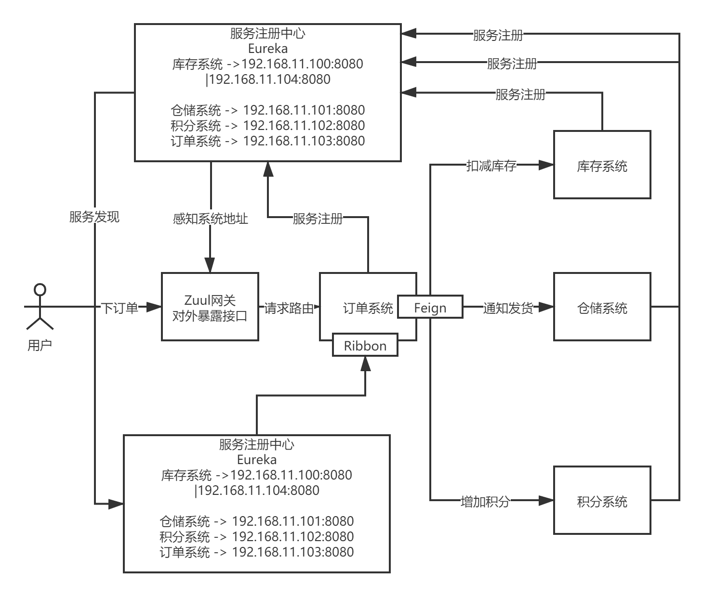
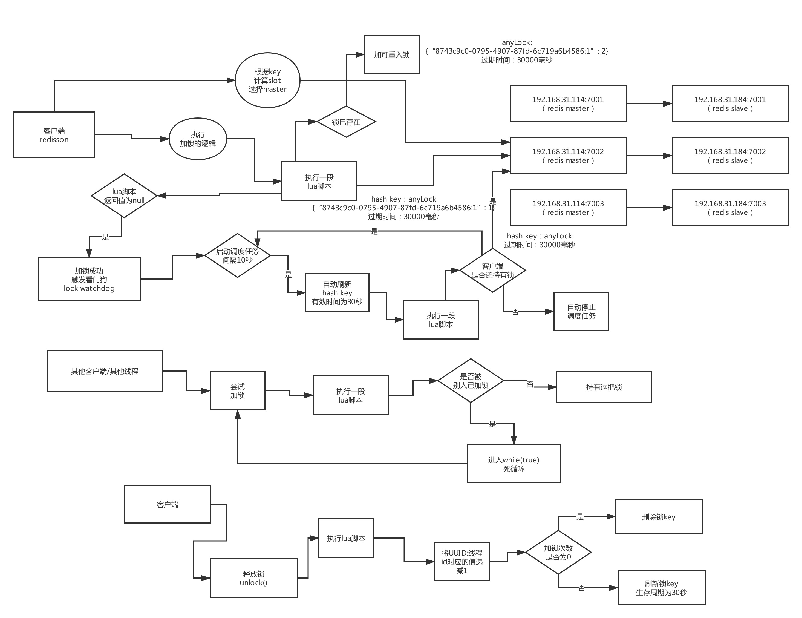
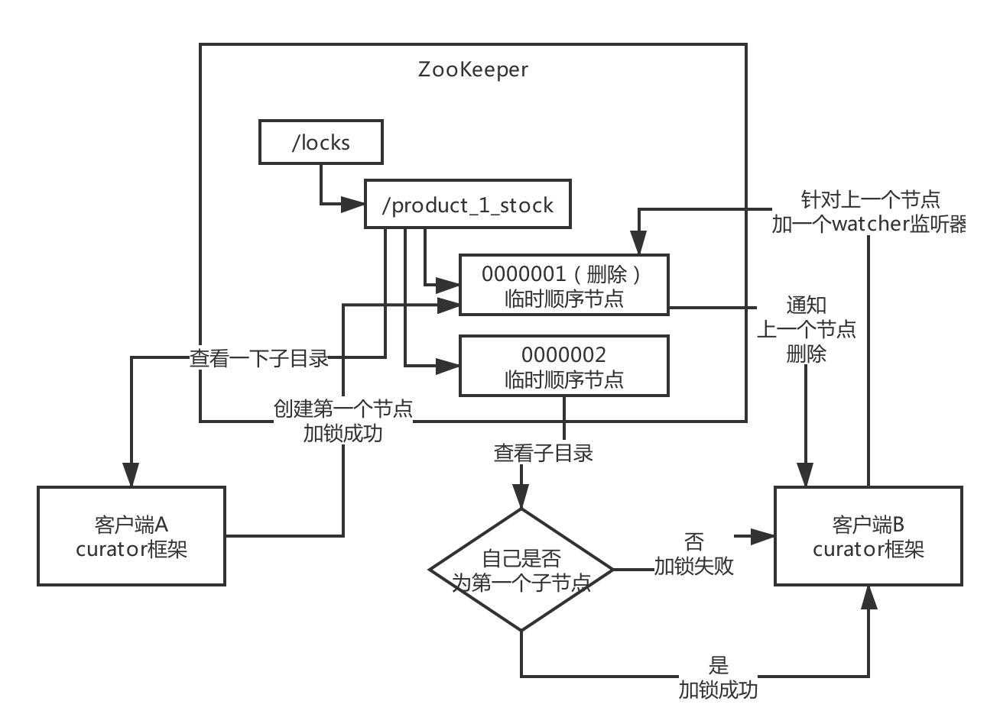

## 电商系统使用Spring Cloud架构图:


## SpringCloud四大核心组件:
* Eureka:服务注册中心
* Feign:服务调用
* Ribbon:负载均衡
* Zuul/Spring Cloud Gateway:网关

Hystrix、链路追踪、Stream等很多组件，并不是说一个普通系统刚开始就必须得用的，如果用了没有用好反而会出问题。Hystrix线路熔断的框架必须得设计对应的一整套限流方案、熔断方案、资源隔离方案、降级方案等机制，来配合降级机制来做。

## 

## SpringCloud接口请求处理流程:
基于SpringCloud对外发布一个接口，实际上就是对外发布一个最普通的SpringMVC的http接口。请求首先到达网关，
网关里配置了不同请求路径和服务的对应关系，由网关查找请求所要访问的服务，然后将请求转发给服务的某台机器，
然后这台机器要调用其他服务时，先访问的是打了feign注解的接口，然后feign对这个接口生成动态代理，
当针对feign的动态代理去调用方法时，会在底层生成http协议格式的请求，/order/create?productId=1,
然后先通过Ribbon从本地的Eureka注册表缓存中获取出目标服务的机器列表，然后按照负载均衡算法选出一台机器，
然后使用Httpclient对这台机器发起Http请求。


## SpringCloud和Dubbo的优劣比较？
对于Dubbo，经过深度优化的RPC服务框架性能和并发是比HTTP更好的，Dubbo请求一次10ms，SpringCloud耗费20ms，但是对于中型公司而言，性能、并发并不是主要因素。
SpringCloud这套框架走Http请求就足够满足性能和并发的需要了，没必要使用高度优化的RPC服务框架。

## 服务注册中心的技术选型？
* Dubbo作为服务框架的，一般注册中心都会选择zk
* SpringCloud作为服务框架的，一般注册中心会选择Eureka
* consul、Nacos，普及还没那么广泛。
* 服务注册发现的原理:
>1. Eureka:peer-to-peer，集群部署，集群里每个机器的地位是对等的，每个微服务可以向任何一个Eureka实例进行注册和服务发现，集群里任何一个Eureka实例接收到写请求后会自动同步给其他所有的Eureka实例
>2. zookeeper:服务注册和发现，分为leader + follower 两种角色，服务注册只能发给leader，只有leader可以负责接收写请求(也就是服务注册)
，然后由leader将数据同步给follower，读的时候leader/follower都可以读
* 一致性保障:CP or AP
CAP,C是一致性、A是可用性、P是分区容错性
>1. zookeeper选择实现CP，zookeeper只由一个leader节点来接收数据，然后同步给其他follower节点，当一旦leader挂了要重新选举leader，这个过程为了保证C，就牺牲了A，会导致zookeeper
在leader选举期间不可用一段时间。当leader选举完成后，就可以继续写数据了，保证了强一致性
>2. Eureka是peer模式，在微服务注册后还没有同步给其他实例时本实例宕机，会丢失注册消息，此时微服务还可以继续从别的机器上拉取注册表，但是不是最新的数据。这样保证了可用性、最终一致性
* 服务注册发现的时效性:
zookeeper的时效性更好，当服务注册或者是服务宕机，一般能做到秒级感知。
Eureka默认配置非常糟糕，服务发现要几十秒，甚至分钟级别。上线一个新的服务实例到其他服务可以发现他，极端情况下要1分钟时间，由ribbon去获取每个服务上缓存的eureka注册表进行负载均衡。当服务故障时，Eureka每隔60秒才去检查心跳，如果发现这个服务上一次心跳是在60秒之前，然后再隔60秒去检查心跳，超过90秒没有心跳，才会认为服务宕机，两分钟过去了，然后eureka 30秒才会更新缓存，然后再过30秒其他服务才会来拉取最新的注册表。如果一个服务实例宕机，到其他服务发现宕机，可能要2、3分钟时间
* 容量:
>1. zookeeper不适合大规模的服务实例，因为服务上下线时需要瞬间推送数据到所有其他服务实例，一旦服务实例规模太大到几千个服务实例时，会导致网络带宽被大量占用
>2. eureka也很难支撑大规模的服务实例，因为每个eureka实例都要接收所有请求，实例多了压力太大扛不住，所以很难到几千个服务实例

## 你们系统遇到过服务发现过慢的问题吗？怎么优化和解决的？
* 对于zk，一般服务注册和发现都是很快的，所以一般没有这种问题
* 对于 Eureka，必须优化参数:
>1. eureka.server.responseCacheUpdateIntervalMs = 30000(readWrite缓存向readOnly缓存的同步时间，默认是30秒，修改为3秒)
>2. eureka.client.registryFetchIntervalSeconds = 30000(服务从eureka的readOnly缓存中拉取注册表的时间，默认30秒，修改为3秒)
>3. eureka.client.leaseRenewallIntervalSeconds = 30(心跳间隔，默认30秒，修改为3秒)
>4. eureka.client.server.evictionIntervalTimerInMs = 60000(心跳检查间隔，默认60秒，修改为6秒)
>5. eureka.instant.leaseExpirationDurationInSeconds = 90(心跳超时时间，默认90秒，修改为9秒)

eureka的自我保护机制:如果一次检查心跳中，发现注册表中超过默认百分比的服务都没有发送心跳，eureka
就认为是网络故障了，此时不会在服务注册表中清除掉这些服务。

建议关掉自我保护机制:  
enableSelfPreservation: false

优化参数后eureka服务发现的时效性变成秒级，几秒钟就可以感知服务的上线和下线

## 作业:说一下你们公司的服务注册中心是怎么技术选型的？生产环境中应该怎么优化？
服务注册中心: eureka、zk、consul原理，画图画清楚
数据一致性: CP  or AP
服务注册、故障、和发现的时效性是多长时间
注册中心最大能支撑多少服务实例
如何部署的？几台机器，每台机器的配置如何？会用比较高配置的机器来做，8核16GB，16核32GB的高配置机器来搞，
基本上可以做到每台机器每秒钟的请求支撑几千绝对没问题
可用性如何来保证的？
有没有做过一些优化，服务注册、故障以及发现的时效性，是否可以优化一下，用eureka的话可以尝试一下配合上面
讲解的那些参数，优化一下时效性，服务上线，故障到发现是几秒钟的时效性

zk，一旦服务挂掉，zk感知到以及通知其他服务的时效性，服务注册到zk后通知到其他服务的时效性，leader挂掉之后可用性是否会
出现短暂的问题，为了去换取一致性

## 网关的技术选型？

### 网关的核心功能:
>1. 动态路由: 新开发某个服务，动态把请求路径和服务的映射关系热加载到网关中；服务增减机器由网关来自动感知
>2. 灰度发布
>3. 授权认证
>4. 性能监控:每个api接口的耗时、成功率、QPS
>5. 系统日志
>6. 数据缓存
>7. 限流熔断

### 几种技术选型:
Kong、Zuul、Nginx + Lua(OpenResty)、自研网关

>1. Kong:Nginx里面的一个基于 lua 写的模块，实现了网关的功能
>2. Zuul:SpringCloud技术架构的网关。高并发能力不强，需要基于Tomcat部署很多台机器
>3. Nginx + Lua(OpenResty):类似于Kong。Nginx抗高并发能力很强，少数几台机器部署一下就可以抗很高的并发，Java技术栈精通Nginx很难，所以很难从Nginx内核层面去做一些二次开发和源码定制
>4. 自研网关: BAT、京东、美团、滴滴之类的大厂都是基于Servlet、Netty来开发高并发、高性能的网关

中小型公司: SpringCloud 技术栈主要是用 Zuul 和 Gateway；如果是Dubbo技术栈，有的用 Kong 网关，也可以直接不用网关，直接Nginx反向代理 + 负载均衡

### 说说生产环境下如何实现网关对服务的动态路由？
基于数据库表，使用简单的SpringMVC + 前端页面封装一个可视化的网关管理工作台，如果新开发了一个服务时，可以在界面上为某个服务配置某个url路径，并可以增删改查
```
CREATE TABLE `gateway_api_route` (
   `id` varchar(50) NOT NULL,
   `path` varchar(255) NOT NULL,
   `service_id` varchar(50) DEFAULT NULL,
   `url` varchar(255) DEFAULT NULL,
   `retryable` tinyint(1) DEFAULT NULL,
   `enabled` tinyint(1) NOT NULL,
   `strip_prefix` int(11) DEFAULT NULL,
   `api_name` varchar(255) DEFAULT NULL,
   PRIMARY KEY (`id`)
 ) ENGINE=InnoDB DEFAULT CHARSET=utf8

INSERT INTO gateway_api_route (id, path, service_id, retryable, strip_prefix, url, enabled) VALUES ('order-service', '/order/**', 'order-service',0,1, NULL, 1);
```

### 如果网关需要抗每秒10万的高并发访问，应该怎么对网关进行生产优化？
* 第一个是高并发。抗高并发取决于Zuul网关是用什么配置的机器来部署的。用32核64G机器，对于路由转发请求，每秒抗个小几万请求是不成问题的，几台Zuul网关机器即可抗10万并发。如果每秒是1万请求，8核16G
的机器部署Zuul网关，5台机器就够了。
* 第二个是如何优化。
生产级网关应该具备的几个特点和功能:
(1)动态路由
(2)灰度发布:基于现成的开源插件来做
(3)授权认证
(4)限流熔断
(5)性能监控:每个 API 接口的耗时、成功率、QPS
(6)系统日志
(7)数据缓存 

### 作业:你们公司的网关是怎么技术选型的，假设有高并发场景怎么优化？
* 服务框架的原理和技术选型，你们公司是怎么选的？为什么？
* 服务注册中心你们公司是怎么选的，生产环境有没有做过一些优化，如果没有，哪些地方是有优化空间的？
* 网关系统，思考你们公司是怎么技术选型的，为什么？生产环境是否对类似动态路由的功能做过优化，如果没有是否有优化空间呢？

### 如果需要部署上万服务实例，现有的服务注册中心能否扛住？如何优化？
* eureka: peer-to-peer连接，每台机器都是高并发请求，有瓶颈
* zookeeper: 服务上下线时会全量注册表通知给其他服务，网络带宽被打满，有瓶颈
可以自研分布式服务注册中心，采用分片存储服务注册表，横向扩容，每台机器均摊高并发请求，各个服务主动拉取，避免zk那种反向通知方式导致网卡被打满

### 你们是如何基于网关实现灰度发布的？说说你们的灰度发布方案？
>1. 数据库中建一个灰度发布启用表，也可以保存在Apollo配置中心、redis、zookeeper中
```
CREATE TABLE `gray_release_config` (
   `id` int(11) NOT NULL AUTO_INCREMENT,
   `service_id` varchar(255) DEFAULT NULL,
   `path` varchar(255) DEFAULT NULL,
   `enable_gray_release` int(11) DEFAULT NULL,
   PRIMARY KEY (`id`)
 ) ENGINE=InnoDB DEFAULT CHARSET=utf8
```
>2. 在 zuul 里面加入下面的filter，然后在zuul的filter里定制ribbon的负载均衡策略
```
<dependency>
			<groupId>io.jmnarloch</groupId>
			<artifactId>ribbon-discovery-filter-spring-cloud-starter</artifactId>
			<version>2.1.0</version>
</dependency>
```
然后写一个zuul的filter，zuul对每个请求都会调用这个filter
```java
@Configuration
public class GrayReleaseFilter extends ZuulFilter{

@Autowired
private JdbcTemplate jdbcTemplate;

    @Override
    public int filterOrder(){
        return PRE_DECORATION_FILTER_ORDER;
    }
    
    @Override
    public String filterType(){
        return PRE_TYPE;
    }
    
    @Override
    public boolean shouldFilter(){
        HttpServletRequest  request = ctx.getRequest();
        String requestURI = request.getRequestURI();
        
        // http://localhost:9000/order/order?xxx
        
        Map<String,GrayReleaseConfig> grayReleaseConfigs = grayReleaseConfigManager.getGrayReleaseConfigs();
        for(String path : grayReleaseConfigs.keySet()){
            if(requestURI.contains(path)){
                GrayReleaseConfig grayReleaseConfig = grayReleaseConfigs.get(path);
                if(grayReleaseConfig.getEnableGrayRelease() == 1){
                    System.out.println("启用灰度发布功能");
                    return true;
                }
            }
       System.out.println("不启用灰度发布功能");
        }
    }
    
    @Override
    public Object run(){
        RequestContext ctx = RequestContext.getCurrentContext();
        HttpServletRequest request = ctx.getRequest();
        
        Random random = new Random();
        int seed = random.getInt() * 100;
        
        if(seed == 50){
            // 把服务id放入请求上下文
            RibbonFilterContextHolder.getCurrentContext().add("version","new");
        } else{
            RibbonFilterContextHolder.getCurrentContext().add("version","old");
        }
        
        return null;   
    }
}

// eureka.instance.metadata-map.version = new
```

### 说说你们一个服务从开发到上线、服务注册、网关路由、服务调用的流程？
* 如果是新开发完一个服务，线上部署后，配合网关动态路由功能先在网关里配置一下url和新服务的映射关系，就可以直接对外提供服务了
* 如果是对已有服务进行迭代，就先把新版本部署少数几台机器，然后通过一个界面开启此服务的灰度发布，此时zuul filter会按照写好的规则把少量流量打入新版本部署的机器上
观察新版本机器是否运行正常，如果运行正常就把版本改成current，然后全量机器部署，并关闭灰度发布功能，此时网关就会把流量均匀分发给每个服务了

### 作业:看看你们公司的服务注册中心能否支撑上万服务实例的大规模场景？

### 画一下你们系统的整体架构图，说说各个服务在生产环境怎么部署的？
服务框架、注册中心、网关系统。即使你没有用很多微服务架构的东西，但只要有这三个东西，再配合写一些接口文档，其实分布式架构就出来了，
很多中小型公司的一个小型技术团队的后端开发工程师总共就10多个人。

* 服务注册中心部署:两台4核8G机器，做高可用冗余，保证其中一台机器死掉不会影响系统的运行。一台4核8G机器每秒钟轻松扛几百请求，上千请求也是可以的。因为大部分系统高峰期每秒几百请求，低峰期每秒几十请求

* 网关系统部署:4核8G机器，每台机器每秒能扛几百请求，需要部署3~4台机器，这样可以保证网关系统每台机器的压力比较小，能进一步保证系统可靠性

* MySQL部署:16核32G的物理机最佳，每秒最多可扛几千请求问题不大，此时MySQL机器负载会很高，CPU使用率、磁盘IO负载、网络负载都很高

### 你们系统每天有多大访问量？每个服务高峰 QPS 多少？压测过服务最大 QPS 吗？
在核心服务里使用AtomicLong来统计接口调用次数，并统计每个接口的执行时间
使用压测工具对系统进行压测:假设系统每秒钟最多能扛800个请求，如果压测工具每秒发起了1000个请求，此时最多只有800个请求能同时被处理，剩余200哥请求需要进行排队阻塞

### 如果系统访问量比现在扩大10倍，你们考虑过系统的扩容方案吗？
* 网关:直接多部署10倍机器即可，然后配置前面的 Nginx 做负载均衡，把流量均匀分发给各个网关机器
* 服务实例:直接多加机器，部署服务后启动即可。这些服务会自动注册到注册中心然后自动被其他服务感知
* 注册中心:服务实例增加10倍，从几十个增加到几百个服务实例，eureka每秒会接收几百个请求，如果用8核16G的机器部署eureka，单机扛上千请求问题不大，所以注册中心不用动
* 数据库:原来是每秒钟几百请求，10倍每秒高峰期是三四千请求，因为横向扩容很麻烦，所以此时可以考虑给单个数据库部署的机器提高配置，32核128G高配物理机每秒钟扛几千请求问题不大

### 作业:独立画出自己系统的生产部署架构图，梳理系统和服务的 QPS 以及扩容方案
部署、机器配置、大概能扛多少并发、性能监控、压测、扩容方案

### 你们生产环境的服务是怎么配置超时和重试参数的？为什么要这样配置？
分布式系统拆分成多个服务后，平时服务内要优化的参数其实不多，对于高可用这块，hystrix负责资源隔离、熔断、降级，zuul网关负责限流
* SpringCloud生产优化，系统第一次启动时被调用经常会出现timeout，因为每个服务第一次被请求时都需要去初始化一个Ribbon
组件，初始化这些组件需要耗费一定的时间，所以很容易导致超时。所以配置参数让服务启动时直接初始化Ribbon相关组件，避免在第一次请求时初始化
```
ribbon:
      eager-load:
        enable: true
zuul:
   ribbon:
     eager-load:
        enable: true
feign:
   hystrix:
      enable: false
```
* 假如积分服务部署了两台机器，机器1和机器2。当订单服务第一次请求积分服务机器1时，超过1秒钟导致超时，此时需要重试，可以配置这时对积分服务当前这台机器1重试几次，如果还不行
就可以继续重试一下积分服务的机器2，下面是配置:
```
ribbon:
    ConnectionTimeout: 3000
    ReadTimeout: 3000
    OkToRetryOnAllOperations: true
    MaxAutoRetries: 1
    MaxAutoRetriesNextServer: 1
中小型公司的中小型系统，如果没有设计一整套系统高可用方案，是没必要直接开启hystrix的资源隔离、熔断、降级的

zuul请求一个订单服务超过 1 秒就认为超时了，此时会先重试一下订单服务当前这台机器，如果实在不行再重试一下订单服务的其他机器

可以使用 spring-retry 来进行重试
<dependency>
    <groupId>org.springframework.retry</groupId>
    <artifactId>spring-retry</artifactId>
</dependency>

hystrix.command.default.execution.isolation.thread.timeoutInMilliseconds = 10000
```

### 如果出现服务请求重试，会不会出现类似重复下单的问题？

### 对于核心接口的防重幂等性，你们是怎么设计的？如何防止重复下单问题？
中大型互联网公司里也没有做一个统一的防重幂等框架。因为只有少数的核心接口需要做幂等性保障，如果要保证幂等性由每个服务根据自己的业务逻辑来实现
>1. 数据库唯一索引:对于插入类操作，用唯一索引来约束
>2. 基于 Redis 实现:对于update类的操作，使用业务逻辑配合上 redis 来保证幂等性

### 作业:看看自己系统核心接口有没有设计幂等性方案？如果没有，应该怎么设计？

### 画一下你们电商系统的核心交易链路图？说说分布式架构下存在什么问题？
分布式系统核心的问题:服务框架、注册中心、网关系统、部署架构、超时重试、幂等防重等生产相关问题如果都搞定了

### 针对电商核心交易链路，你们是怎么设计分布式事务技术方案的？
分布式事务方案中的 TCC 和 可靠消息最终一致性 方案，在生产中是最常用的。而最大努力通知方案、Sega、XA，这几种方案在生产中用的不多

对于下面场景的分布式事务技术方案分析:
订单服务 -> 创建订单
-> 库存服务 -> 扣减库存
-> 积分服务 -> 增加积分
-> 仓储服务 -> 通知发货

可以把订单服务、库存服务、积分服务 -> 绑定成一个 TCC 事务，如果积分服务报错，就会撤销刚才创建的订单，回滚刚才扣减的库存。

仓储服务通知发货没必要绑定到TCC事务中，仓储服务使用可靠消息最终一致性方案，通过将消息发送给可靠消息中间件，由中间件来保证消息一定回交给仓储服务然后通知发货，如果
这个过程中消息发送失败可以由可靠消息中间件来保证不停的重试投递消息

### 对于 TCC 事务、最终一致性事务的技术选型，你们是怎么做的？如何调研的？
* TCC事务: 阿里开源的分布式事务框架 seata ,经历过阿里生产环境大量考验的一个框架，支持 dubbo、spring cloud两种服务框架
* 最终一致性事务:
>1. 可靠消息最终一致性，如果使用ActiveMQ或者RabbitMQ，需要自己封装一个可靠消息服务，收到消息后会尝试投递到mQ上，如果投递失败就重试投递
。如果消费成功了必须回调一个接口来通知消息处理成功，如果一段时间后发现消息还是没有处理成功，此时会再次
投递消息到mQ上去。此方案需要在本地数据库存放一些信息，然后基于ActiveMQ\RabbitMQ来实现消息的异步投递和消费
>2. 使用RocketMQ作为MQ中间件，提供了分布式事务支持，中间件把可靠消息服务需要实现的功能逻辑都做好了

### 作业:你们公司的核心链路是否有事务问题？ 
你自己的系统，核心链路是否存在数据不一致的问题，分布式事务的技术选型？如果要设计分布式事务方案，如何设计？

### 在搭建好的电商系统里，落地开发对交易链路的TCC分布式事务方案
基于seata去用分布式事务，必须先独立部署seata-server

### 能说一下一个TCC分布式事务框架的原理吗？
seata原理

### 现有的 TCC 事务方案的性能瓶颈在哪里？能支撑高并发交易场景吗？如何优化？
* byteTCC框架，需要在mysql中创建表，然后基于表中数据进行状态更新
* seata框架，核心链路中的每个服务都需要跟TC这个角色进行频繁的网络通信，带来性能开销。如果一个请求不引入分布式事务可能只需要100ms，引入分布式事务后可能需要耗费200ms。
而所有微服务需要上报分支事务的状态给tc，并且seata-server需要选择基于哪种存储来存放这些分布式事务日志或者状态信息，一般是选择磁盘文件、MySQL。
在高并发场景下也需要对seata-server进行扩容，部署多台机器。这时如果用一个数据库来存放分布式事务的日志和状态的话，数据库也会有压力，需要对tc背后的数据库进行分库分表来抗更
高的并发压力

### 作业:如果对自己的系统核心链路落地TCC事务，应该如何落地实现？
参考seata的sample，尝试把seata分布式事务框架整合到springcloud技术架构里去，成功跑起来

### 你了解rocketMQ对分布式事务支持的底层实现原理吗？
RocketMQ来实现可可靠消息最终一致性事务方案:
>1. producer向RocketMQ发送一个half-message，RocketMQ返回一个half-message success的响应给producer，这时候就形成了一个half-message
了，此时这个message是不能被消费的。注意这个步骤可能会因为网络等原因失败，有可能producer没有收到rocketMQ返回的响应，这时需要producer
重新发送half-message，直到一个half-message成功创建
>2. producer在本地数据库执行相关操作，然后根据数据库操作的结果发送commit/rollback给RocketMQ，如果本地数据库执行成功则发送一个commit，这时消息变为可以被消费的；如果
本地数据库执行失败，就发送一个rollback来废弃之前的half-message。注意这个步骤可能会失败，因为producer可能会由于网络原因没成功发送commit/rollback给rocketMQ，此时RocketMQ
会在一段时间后发现一直没收到message的commit/rollback，就会回调此服务提供的一个接口
>3. 在这个接口中需要自己写逻辑去检查之前执行的本地数据库操作是否成功了，然后返回commit/rollback给RocketMQ，
>4. 只要message被commit，下游的服务就可以消费到这个消息，此时还需要结合ack机制，也就是下游消费者必须在消费成功后返回ack给RocketMQ才能被认为消息成功，否则一旦处理失败没有返回ack
，则必须让rocketMQ重新投递消息给其他consumer

### 在搭建好的电商系统里，如何基于RocketMQ最终一致性事务进行落地开发？
在自己本地部署一个单机版的rocketMQ，参考RocketMQ官网的sample，做实验，实际发送一下消息，回调接口，一个是事务消息，一个是消费者ack

### 如果公司没有RocketMQ中间件，那你们如何实现最终一致性？
自己写一个可靠消息服务，接受producer发送的half-message，然后给producer返回响应，如果producer没收到响应则重发。然后producer执行本地事务
接着根据本地事务的成功或失败发送commit/rollback给可靠消息服务。然后在可靠消息服务中启动一个后台线程定时扫描本地数据库表中所有的half-message，超过一定时间没有commit/rollback就回调producer
提供的接口来确认本地事务是否成功，来获取commit/rollback。如果消息被rollback就废弃掉，如果消息被commit就发送这个消息给下游服务，或者是发送给RabbitMQ/kafka/ActiveMQ
，然后下游服务消费了就必须回调可靠消息服务接口进行ack，如果一段时间都没有接收到ack则重发消息给下游服务

### 作业:如果对自己系统落地最终一致性，如何落地实现？
思路全给到位了，想想自己系统里哪个业务场景可以用这个分布式事务，基于RocketMQ实现一遍，再自己写可靠消息服务实现一遍

### 你们生产系统中有哪个业务场景是需要用分布式锁的？为什么要使用？
支付之前需要创建一个订单，而在创建订单时，订单里会指定对哪些商品要购买多少件，此时需要先校验库存，然后确保库存充足后锁定库存，
这个过程必须使用分布式锁，锁住这个商品的库存，对同一个商品的购买同一时间只能有一个人操作。

### 你们是用哪个开源框架实现的redis分布式锁？能说说其核心原理吗？
redis的分布式锁，很少自己手写，一般直接用Redisson框架，这个框架基于redis实现了一系列开箱即用的高级功能如分布式锁
核心原理:对苹果这个商品id为1的商品加锁，redisson.lock("product_1_stock"),分布式锁key的业务语义为针对productId为1的商品库存进行加锁,product_1_stock:{"XXX":1},
过期时间30秒。加锁成功后，redission框架后台会启动一个watchDog来每隔10s去检查一下这个锁是否还被当前客户端持有，如果是的话，重新刷新一下key的过期时间为30s
，当其他客户端尝试加锁时，会发现"product_1_stock"这个key已存在，说明已经被其他客户端加锁了，此时会进入一个无限循环阻塞状态来等待加锁。当第一个客户端加锁成功时此时会有两种情况，第一种情况是
这个客户端操作完毕后主动释放锁；第二种情况时如果这个客户端在持有锁期间宕机了，那么这个客户端的reddison框架之前启动的后台watchDog
线程就没有了， 此时最多30s，key就会过期然后自动释放了宕机客户端之前持有的锁


### 如果redis是集群部署的，那么集群故障时分布式锁还有效吗？
* 瞬时故障:当第一个客户端加锁成功后，redis的master数据还未同步给slave，此时redis故障转移，slave被选举为master，这时第二个客户端就可以加锁成功
彻底解决这个问题，很难，除非修改一些redis和redisson框架的源码，做源码级的二次开发，当加锁时必须是master和slave同时写成功才算是加锁成功

### 作业:自己梳理出来redis分布式锁的生产问题解决方案
自己哪个业务可以用分布式锁？用什么框架？有什么生产问题？

### 如果要实现zookeeper分布式锁，一般用哪个开源框架？核心原理是什么？
一般很少自己手写，主要使用curator框架，基于zk实现了一整套高级功能


### 对于zookeeper的羊群效应，分布式锁应该如何优化？
* 使用普通临时节点带来的羊群效应:直接对指定key创建临时节点，多个客户端同时争抢创建此临时节点，当客户端A加锁成功后，
其他客户端会对key节点注册一个watcher，当客户端A释放锁时，zookeeper会同时通知其他所有客户端来尝试创建锁，造成很多没必要的请求和网络开销，
加重网络负载。
* 解决方案(使用临时有序节点):也就是Curator框架所采用的那种方式，使用临时有序节点。客户端A加锁成功后，其他客户端按节点序号注册watcher，
每个watcher监听前一个节点的状态，当客户端A释放锁后，只会通知后面一个客户端。

### 如果遇到zookeeper脑裂问题，分布式锁应该如何保证健壮性？
* 脑裂问题:分布式系统，主控节点有一个master，此时由于网络故障导致其他人认为此master不可用然后重新选举出了一个master，造成集群里同时有2个master
在运行。脑裂问题会导致重复加锁 -> 当客户端A加锁成功后，选举出了新master，客户端B在新的master上加锁成功，发生了重复加锁
* 解决方案:解决脑裂问题算是一个业界难题，分布式锁并不是百分百健壮的。如果实在要做，修改curator框架源码增加一些协调机制

### 作业:自己梳理出来zookeeper分布式锁的生产问题解决方案 & redis和zookeeper哪种分布式锁更好？
从分布式系统协调语义而言，用zookeeper做分布式锁更好一些，因为zookeeper就是用于分布式协调服务的，而redis本身其实是分布式缓存，但是redis能扛高并发，高并发场景
用redis好些。而zookeeper本身不适合部署大规模集群，本身适用的场景就是部署三五台机器，不是承载高并发请求的，仅仅是用于分布式协调服务的。
* 选redis还是选zookeeper？ 如果公司有redis集群，没有zookeeper集群，当然选择redis；如果公司两个都有，用哪种分布式锁都可以，如果有高并发场景就选redis

### 在搭建好的电商系统中，落地开发分布式锁保证库存数据准确的方案


