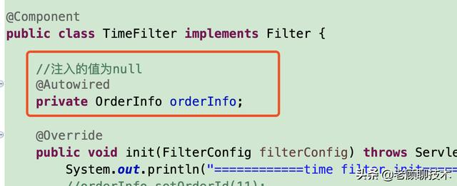
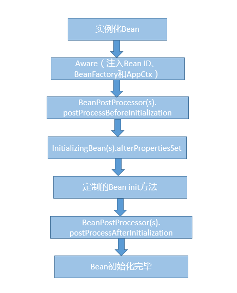

@Autowired默认是根据byType注入的，如果根据type获取到的对象大于1，则根据byName注入

### 1. 自动装配注解的区别： 

1、@Autowired是Spring自带的，@Resource是JSR250规范实现的，@Inject是JSR330规范实现的  
2、@Autowired、@Inject用法基本一样，不同的是@Inject没有一个request属性  
3、@Autowired、@Inject是默认按照类型匹配的，@Resource是按照名称匹配的  
4、@Autowired如果需要按照名称匹配需要和@Qualifier一起使用，@Inject和@Name一起使用，@Resource则通过name进行指定  

### 2. filter中bean注入失败:  



在spring中，web应用的启动顺序为：listener -> filter -> servlet,先初始花listener，
然后再初始化filter，接着才到dispatcherServlet的初始化，所以，当我们需要在filter里注入一个注解的bean时，就会注入失败。因为filter初始化时，注解的bean还没初始化，所以注入为null   

### 3. 用Spring Aop做切面编程时，如果切面处理类中出现异常，可能会影响切点方法(主业务逻辑)的执行。
解决方法:  
(1)不要用@Before 和@Around(5种通知类型还有一种@AfterThrowing)，而是采用@After 或者 @AfterReturning 等方式来处理，
让主业务逻辑走完后再执行切面方法,这样切面处理类的方法抛异常不影响主业务逻辑。  
(2)在切面处理类中try-catch住可能出异常的代码，不要向上抛

### 4. 从源码解析Spring事务传播:
spring事务传播与事务隔离：事务传播和事务隔离是两回事。
在spring中，是否存在事务指的是在当前线程，在当前数据源(DataSource)中是否存在处于活动状态的事务
，猜测更具体是当前的connection是否存在事务。

声明式事务其实说白了是一种特殊的aop应用，它其实包括两种advice，一种是around，另外一种是after-throwing。
利用around advice在方法执行前，先关闭数据库的自动提交功能，然后设定一个标志符。根据业务代码实际的情况，对标志符赋不同的值，如果数据更新成功赋true，否则false。在业务方法执行完之后的部分对标志符进行处理。如为true，则提交数据库操作，否则就进行回滚。
另外还会使用after-throwing，对出错的信息进行记录。然后再将错误抛出至上层。

如果在spring执行的方法中，检测到了已存在的事务，那么就要考虑事务的传播行为了  

(1) PROPAGATION_NEVER  
即当前方法需要在非事务的环境下执行，如果有事务存在，那么抛出异常。相关源码:  
```
if (definition.getPropagationBehavior() == TransactionDefinition.PROPAGATION_NEVER) {
    throw new IllegalTransactionStateException(
        "Existing transaction found for transaction marked with propagation 'never'");
}
```
(2) PROPAGATION_NOT_SUPPORTED
与前者的区别在于，如果有事务存在，那么将事务挂起，而不是抛出异常。事务挂起其实是移除当前线程数据源活动事务对象的过程，
挂起是将ConnectionHolder设为null，因为一个ConnectionHolder对象就代表了一个数据库连接，将ConnectionHolder设为null就
意味着我们下次要使用连接时，将重新从数据库连接池中获取，而新的Connection得自动提交是为true的  
```
if (definition.getPropagationBehavior() == TransactionDefinition.PROPAGATION_NOT_SUPPORTED) {
    Object suspendedResources = suspend(transaction);
    boolean newSynchronization = (getTransactionSynchronization() == SYNCHRONIZATION_ALWAYS);
    return prepareTransactionStatus(
        definition, null, false, newSynchronization, debugEnabled, suspendedResources);
}
```
(3) PROPAGATION_REQUIRES_NEW  
挂起当前活动事务并创建新事务的过程，doBegin方法是事务开启的核心
```
if (definition.getPropagationBehavior() == TransactionDefinition.PROPAGATION_REQUIRES_NEW) {
    SuspendedResourcesHolder suspendedResources = suspend(transaction);
    boolean newSynchronization = (getTransactionSynchronization() != SYNCHRONIZATION_NEVER);
    DefaultTransactionStatus status = newTransactionStatus(
            definition, transaction, true, newSynchronization, debugEnabled, suspendedResources);
    doBegin(transaction, definition);
    prepareSynchronization(status, definition);
    return status;
}
```
(4) PROPAGATION_NESTED
PROPAGATION_NESTED 开始一个 "嵌套的" 事务,  它是已经存在事务的一个真正的子事务. 嵌套事务开始执行时,  它将取得一个 savepoint. 如果这个嵌套事务失败, 我们将回滚到此 savepoint. 
嵌套事务是外部事务的一部分, 只有外部事务结束后它才会被提交.   
```
if (definition.getPropagationBehavior() == TransactionDefinition.PROPAGATION_NESTED) {
    if (useSavepointForNestedTransaction()) {
        // Create savepoint within existing Spring-managed transaction,
        // through the SavepointManager API implemented by TransactionStatus.
        // Usually uses JDBC 3.0 savepoints. Never activates Spring synchronization.
        DefaultTransactionStatus status =
            prepareTransactionStatus(definition, transaction, false, false, debugEnabled, null);
        status.createAndHoldSavepoint();
        return status;
    }
}
```

### 5. Spring Bean的生命周期和作用域:Spring Bean 生命周期比较复杂，可以分为创建和销毁两个过程。
* 1.初始化:
实例化 Bean 对象。
设置 Bean 属性。
如果我们通过各种 Aware 接口声明了依赖关系，则会注入 Bean 对容器基础设施层面的依赖。具体包括 BeanNameAware、BeanFactoryAware 和 ApplicationContextAware，分别会注入 Bean ID、Bean Factory 或者 ApplicationContext。
调用 BeanPostProcessor 的前置初始化方法 postProcessBeforeInitialization。
如果实现了 InitializingBean 接口，则会调用 afterPropertiesSet 方法。
调用 Bean 自身定义的 init 方法。
调用 BeanPostProcessor 的后置初始化方法 postProcessAfterInitialization。
创建过程完毕。

* 2.销毁:
依次调用 DisposableBean 的 destroy 方法和 Bean 自身定制的 destroy 方法

5个作用域:
>1 Singleton: Spring的默认作用域，为每个ioc容器创建唯一的Bean  
>2 ProtoType: 针对每个 getBean 请求，容器都会单独创建一个 Bean 实例  
>3 Request: 为每个 HTTP 请求创建单独的 Bean 实例  
>4 Session: 每个Session单独一个Bean实例
>5 GlobalSession: 用于 Portlet 容器

### 6. SpringBoot创建定时任务的三种方法
(1) 基于注解@Scheduled
(2) 基于实现接口SchedulingConfigurer，主要用于需要从数据库读取cron表达式执行的场景
(3) 基于注解@Scheduled和@Async("线程池bean名称"),将定时任务标记为异步任务，然后用指定的线程池来执行

### 7.Spring中使用到哪些设计模式？
* BeanFactory和ApplicationContext应用了工厂模式。
* 在 Bean 的创建中，Spring 也为不同 scope 定义的对象，提供了单例和原型等模式实现。
* AOP 使用了代理模式、装饰器模式、适配器模式等。
* 各种事件监听器，是观察者模式的典型应用。
* 类似 JdbcTemplate 等则是应用了模板模式。
