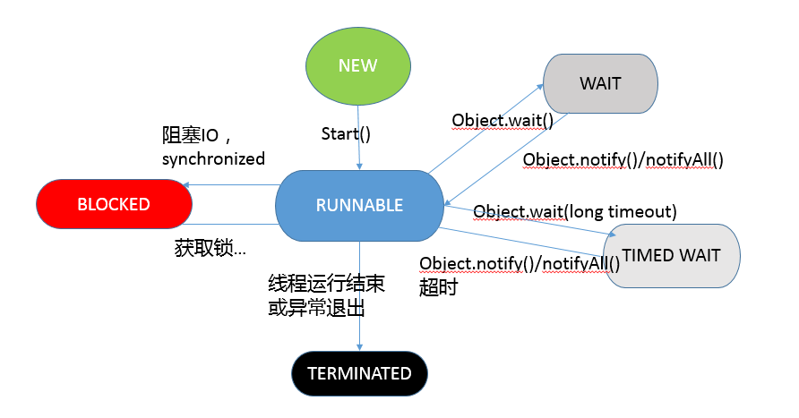

一个类只能有一个带有指定签名的构造器，编程人员通常知道如何避开这一限制:通过提供两个构造器，他们的参数列表只在参数类型的顺序上有所不同。
实际这并不是一个好主意。

方法签名包括：参数类型，参数顺序，不包括返回类型

Enum不允许继承，但是可以实现接口。

不写构造方法，编译器会自动提供一个共有的，无参的构造方法

对象锁与类锁

读源码，JDK常用工具包源码，juc,util,读guava源码，同样也是一些工具包,各大公司spring肯定都用到了。读spring源码。慢慢读，读不明白配合各种书籍和博客。
这个过程很艰辛和很复杂，一般要有三年左右的时间过渡。

《redis设计与实现》《TCP/ip详解》 《计算机网络自顶向下方法》
《现代操作系统》《深入理解计算机系统》
《深入理解Java虚拟机》 ---> 《Java并发编程实战》
《Spring技术内幕》第一遍读，什么都不懂，按图索骥，迷迷糊糊的读完了；
第二遍读，就轻车熟路一些咯，“卧槽！原来如此！”的感叹声也络绎不绝；
第三遍就能够在整体代码设计和细节实现两个不同的层次上去吸收spring框架的优点咯。 

工作：
Java基础 -> 暂时不看 Java核心技术(暂时去掉Java编程思想)
Java容器 -> 1 看Java集合源码：ArrayList，HashMap，HashSet,HashTable,LinkedList,TreeMap，ConcurrentHashMap，JDK常用工具包源码，juc,util
Java并发 -> 2 Java并发编程的艺术
Java虚拟机 -> 3 (纯理论相关，及调优思路和方法，见猪跑)
MySQL的哪部分：手写sql(基本sql与复杂sql)，索引及相关数据结构，查找mysql相关试题
，最后去做LeetCode上database试题
记笔记用github开个项目
redis都算作数据库部分
学习今日头条中收藏的文章

地铁：
1 进阶训练营视频 或者是 极客时间架构课程

回家：
1 数据结构和算法：剑指offer，玩转数据结构，Java并发编程的艺术

展望：
1 挖掘项目细节
2 spring源码视频，进阶后看《Spring技术内幕》，结合源码

复习阶段主要分为三部分： 
学习「自己知道自己不会」的知识 
全方位的学习，构建自己的「知识体系」 
学习「自己不知道自己不会」的知识 

Stream求和
```
BigDecimal:
BigDecimal bb =list.stream().map(Plan::getAmount).reduce(BigDecimal.ZERO,BigDecimal::add);
 

int、double、long:
double max = list.stream().mapToDouble(User::getHeight).sum();

```

@Autowired默认是根据byType注入的，如果根据type获取到的对象大于1，则根据byName注入

ThreadLocal:对threadLocal的理解可以分为3个方面:
1.应用场景: 首先只适用于多线程场景，   框架应用场景：Spring的事务管理，用ThreadLocal存储Connection，从而各个DAO可以获取同一Connection，可以进行事务回滚，提交等操作。
 2.内部细节 3. 最佳实践
是个啥，字面翻译过来，这是个线程本地变量。首先它是个类，可以被实例化为对象，这对象就3个方法，get，set，remove


建议多使用JDK并发包提供的并发容器和工具类解决并发问题，因为这些类都已经通过了充分的测试和优化  
Java中所使用的并发机制依赖于JVM的实现和CPU的指令  
synchronized实现同步的基础：Java中每一个对象都可以作为锁。具体表现为下面3种形式：  
1. 对于普通同步方法，锁是当前实例对象  
2. 对于静态同步方法，锁是当前类的Class对象  
3. 对于同步代码块，锁是synchronized 括号里配置的对象  

Java将操作系统中的运行和就绪两个状态合并称为运行状态，阻塞状态是线程阻塞在进入synchronized
关键字修饰的方法或代码块(获取锁)时的状态，但是阻塞在java.concurrent包中Lock接口的线程状态确实等待状态
，因为java.concurrent包中Lock接口对于阻塞的实现均使用了LockSupport类中的相关方法。  

java支持多个线程同时访问一个对象或者对象的成员变量，由于每个线程执行过程中可以拥有一份拷贝，
这样可以加速程序的执行，这是现代多核处理器的一个显著特性。所以程序在执行过程中，一个线程看到的变量
并不一定是最新的。  

mq是一个常见的解耦利器
什么时候不用mq？上游实时关注执行结果

HashMap在并发执行put操作时会引起死循环，是因为多线程会导致HashMap的Entry链表形成环形数据结构，
一旦形成环形数据结构，Entry的next节点永远为空，就会产生死循环获取Entry

Final关键字修饰的变量
String的intern()是什么作用
方法的名字和参数列表称为方法的签名，返回类型不是签名的一部分。
如果将一个类声明为final，只有其中的方法自动的成为final，而不包括域

所有的数组类型，不管是对象数组还是基本类型的数组都扩展了object类

Arrays.deepToString

synchronized关键字是怎么实现可重入的？
当一个线程进入synchronized修饰的代码块中且该代码块未被其他线程访问时，JVM会记下锁的持有者，并且
将获取计数器值置为1.如果同一个线程再次获取这个锁时，计数器值将递增，而当线程退出同步代码块时，计数器会相应地递减。
当计数器值为0时，这个锁将被释放。

### 1. 并发与并行有什么区别？
个人理解，并发是一种竞争关系，并行是一种合作关系。一堆砖由两个人搬，把一堆砖如何分为两部分，然后让每个人各搬一部分，
这是并行。而并发考虑的是两个人一起搬这堆砖，需要解决的是保证两个人不能同时从这堆砖中拿出一块搬走。  

### 2. filter和interceptor有什么区别？
1. Filter是基于函数回调（doFilter()方法）的，而Interceptor则是基于Java反射的（AOP思想）。
2. Filter依赖于Servlet容器，而Interceptor不依赖于Servlet容器。
3. Filter对几乎所有的请求起作用，而Interceptor只能对action请求起作用。
4. Interceptor可以访问Action的上下文，值栈里的对象，而Filter不能。
5. 在action的生命周期里，Interceptor可以被多次调用，而Filter只能在容器初始化时调用一次。  
6. Filter在过滤是只能对request和response进行操作，而interceptor可以对request、response、handler、modelAndView、exception进行操作。

filter 继承OncePerRequestFilter,重写doFilterInternal方法
interceptor实现HandlerInterceptor接口，重写preHandle方法，其中postHandle方法是在业务处理器处理请求执行完成后，生成视图之前执行。
afterCompletion方法在DispatcherServlet完全处理完请求后被调用

Interceptor和AOP可以看作是类似的,因为其内部实现原理都是利用JAVA的反射机制(AOP是使用动态代理,动态代理的实现就是java反射机制).
但是Filter和Interceptor有本质上的区别.其实现是通过回调函数.两者的控制粒度也不同,AOP和Interceptor的控制粒度都是方法级别,
但是Filter的控制粒度就是servlet容器,它只能在servlet容器执行前后进行处理.

### 3.JDK 和 JRE 有什么区别？
* JRE 为 Java 提供了必要的运行时环境，JDK 为 Java 提供了必要的开发环境
* JDK 是 JRE 的超集，JRE 是 JDK 的子集

### 4. Java运行程序的步骤：
我理解的java程序执行步骤:
* 首先javac编译器将源代码编译成字节码。
* 然后jvm类加载器加载字节码文件，然后通过解释器逐行解释执行，这种方式的执行速度相对会比较慢。
* 有些方法是高频率调用的(JIT即时编译是以方法和代码块为单位的)，也就是所谓的热点代码，所以引进JIT技术，运行时将热点代码直接编译为机器码，
* 这样类似于缓存技术，运行时再遇到这类热点代码直接可以执行，而不是先解释后执行。

### 5. AtomicInteger 底层实现原理是什么？如何在业务中应用 CAS 操作？
* CAS 是 Java 并发中所谓 lock-free(无锁) 机制的基础

### 6.Java 并发类库提供的线程池有哪几种？ 分别有什么特点？
开发者都是利用 Executors 提供的通用线程池创建方法，去创建不同配置的线程池，
主要区别在于不同的 ExecutorService 类型或者不同的初始参数。
  
Executors 目前提供了 5 种不同的线程池创建配置：  
* newCachedThreadPool()，它是一种用来处理大量短时间工作任务的线程池，具有几个鲜明特点：它会试图缓存线程并重用，
当无缓存线程可用时，就会创建新的工作线程；如果线程闲置的时间超过 60 秒，则被终止并移出缓存；长时间闲置时，
这种线程池，不会消耗什么资源。其内部使用 SynchronousQueue 作为工作队列。

* newFixedThreadPool(int nThreads)，重用指定数目（nThreads）的线程，其背后使用的是无界的工作队列，
任何时候最多有 nThreads 个工作线程是活动的。这意味着，如果任务数量超过了活动队列数目，
将在工作队列中等待空闲线程出现；如果有工作线程退出，将会有新的工作线程被创建，以补足指定的数目 nThreads。

* newSingleThreadExecutor()，它的特点在于工作线程数目被限制为 1，操作一个无界的工作队列，
所以它保证了所有任务的都是被顺序执行，最多会有一个任务处于活动状态，并且不允许使用者改动线程池实例，
因此可以避免其改变线程数目。

* newSingleThreadScheduledExecutor() 和 newScheduledThreadPool(int corePoolSize)，
创建的是个 ScheduledExecutorService，可以进行定时或周期性的工作调度，区别在于单一工作线程还是多个工作线程。

* newWorkStealingPool(int parallelism)，这是一个经常被人忽略的线程池，Java 8 
才加入这个创建方法，其内部会构建ForkJoinPool，利用Work-Stealing算法，并行地处理任务，不保证处理顺序。

### 7. 一个线程两次调用 start() 方法会出现什么情况？谈谈线程的生命周期和状态转移。
* ava 的线程是不允许启动两次的，第二次调用必然会抛出 IllegalThreadStateException，这是一种运行时异常，多次调用 start 被认为是编程错误。
在第二次调用 start() 方法的时候，线程可能处于终止或者其他（非 NEW）状态，但是不论如何，都是不可以再次启动的。



Java 5 以后，线程状态被明确定义在其公共内部枚举类型 java.lang.Thread.State 中，分别是：
* 新建（NEW），表示线程被创建出来还没真正启动的状态，可以认为它是个 Java 内部状态。
* 就绪（RUNNABLE），表示该线程已经在 JVM 中执行，当然由于执行需要计算资源，它可能是正在运行，
也可能还在等待系统分配给它 CPU 片段，在就绪队列里面排队。在其他一些分析中，会额外区分一种状态 RUNNING，但是从 
Java API 的角度，并不能表示出来。
* 阻塞（BLOCKED），这个状态和我们前面两讲介绍的同步非常相关，阻塞表示线程在等待 Monitor lock。比如，线程试图通过 synchronized 
去获取某个锁，但是其他线程已经独占了，那么当前线程就会处于阻塞状态。
* 等待（WAITING），表示正在等待其他线程采取某些操作。一个常见的场景是类似生产者消费者模式，发现任务条件尚未满足，就让当前消费者线程等待（wait），另外的生产者线程去准备任务数据，然后通过类似 notify 
等动作，通知消费线程可以继续工作了。Thread.join() 也会令线程进入等待状态。
* 计时等待（TIMED_WAIT），其进入条件和等待状态类似，但是调用的是存在超时条件的方法，比如 wait 或 join 等方法的指定超时版本，如下面示例：public final native void wait(long 
timeout) throws InterruptedException;
* 终止（TERMINATED），不管是意外退出还是正常执行结束，线程已经完成使命，终止运行，也有人把这个状态叫作死亡。


