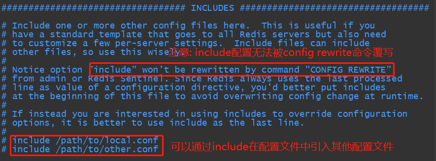
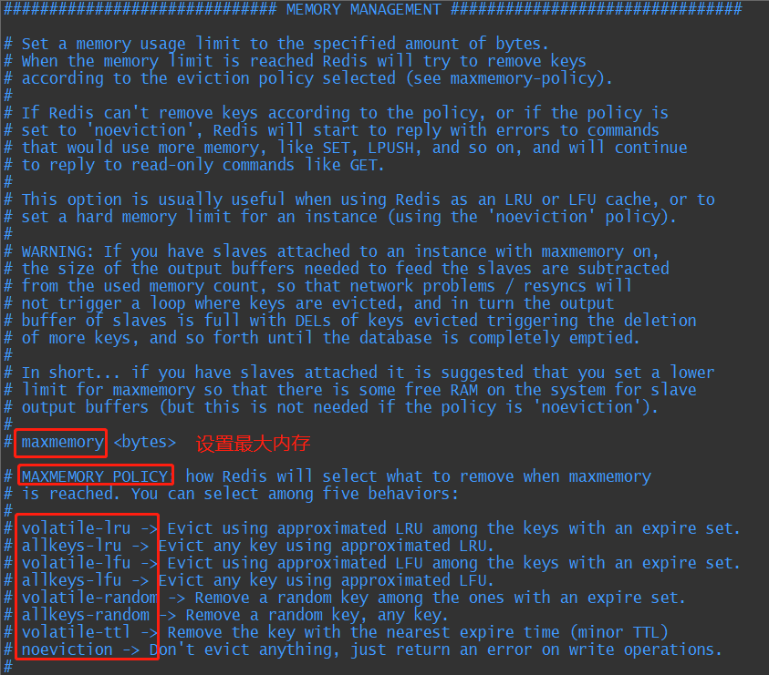
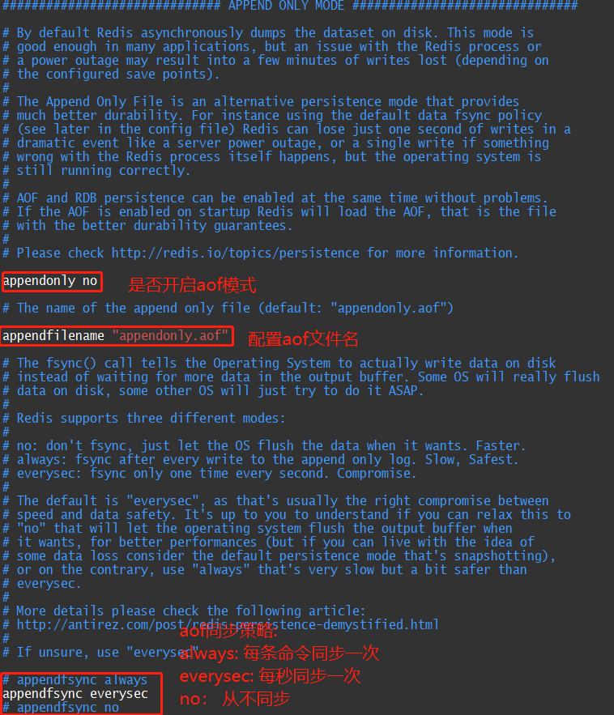

### 为什么要使用Nosql?

数据量变大，mysql无法承受压力，所以使用nosql来缓解mysql的压力。而且80%请求是读请求，缓存可以提高性能

### NoSQL的四大分类

1. K-V键值对: redis、memcached
2. 文档型数据库: mongoDB
3. 列存储数据库: HBase、Cassandra
4. 图关系数据库:Neo4J

### Redis =>  ==Re== mote ==Di==ctionary ==S==erver，即远程字典服务

官网网站介绍:Redis 是一个开源（BSD许可）的，内存中的数据结构存储系统，它可以用作数据库、缓存和消息中间Redis 是一个开源（BSD许可）的，内存中的数据结构存储系统，它可以用作数据库、缓存和消息中间件。 它支持多种类型的数据结构，如 字符串（strings）， 散列（hashes）， 列表（lists）， 集合（sets）， 有序集合（sorted sets） 与范围查询， bitmaps， hyperloglogs 和 地理空间（geospatial） 索引半径查询。 Redis 内置了 复制（replication），LUA脚本（Lua scripting）， LRU驱动事件（LRU eviction），事务（transactions） 和不同级别的 磁盘持久化（persistence）， 并通过 Redis哨兵（Sentinel）和自动 分区（Cluster）提供高可用性（high availability）。

redis基于内存操作，cpu不是redis的瓶颈，redis的瓶颈是机器的内存和带宽

###  Linux下安装Redis

```bash
# 使用wget命令下载redis源码
wget http://download.redis.io/releases/redis-5.0.8.tar.gz
# 解压源码
tar -zxvf redis-5.0.8.tar.gz
# 进入解压目录进行编译
cd redis-5.0.8
# 安装gcc环境
yum install -y gcc-c++
# 编译
make
# 安装
make install
# 修改 redis.conf 配置文件，把daemonize 改为 yes
# 启动redis
redis-server /user/local/redis-5.0.8/redis.conf
# 启动后用redis客户端连接到server
redis-cli -p 6379
# 测试是否连接成功,当收到 ‘Pong’说明连接成功
ping
# 从客户端关闭server
127.0.0.1:6379> shutdown
not connected> exit
```

### 压力测试工具:

#### 官方工具  -->  redis-benchmark

| 序号 | 选项      | 描述                                       | 默认值    |
| ---- | --------- | ------------------------------------------ | --------- |
| 1    | **-h**    | 指定服务器主机名                           | 127.0.0.1 |
| 2    | **-p**    | 指定服务器端口                             | 6379      |
| 3    | **-s**    | 指定服务器 socket                          |           |
| 4    | **-c**    | 指定并发连接数                             | 50        |
| 5    | **-n**    | 指定请求数                                 | 10000     |
| 6    | **-d**    | 以字节的形式指定 SET/GET 值的数据大小      | 2         |
| 7    | **-k**    | 1=keep alive 0=reconnect                   | 1         |
| 8    | **-r**    | SET/GET/INCR 使用随机 key, SADD 使用随机值 |           |
| 9    | **-P**    | 通过管道传输 请求                          | 1         |
| 10   | **-q**    | 强制退出 redis。仅显示 query/sec 值        |           |
| 11   | **--csv** | 以 CSV 格式输出                            |           |
| 12   | **-l**    | 生成循环，永久执行测试                     |           |
| 13   | **-t**    | 仅运行以逗号分隔的测试命令列表。           |           |
| 14   | **-I**    | Idle 模式。仅打开 N 个 idle 连接并等待。   |           |

#### 简单性能测试:

```bash
# 100个并发连接进行100000次请求
redis-benchmark -h localhost -p 6379 -c 100 -n 100000
```

### 常用命令

#### 通用命令

```bash
# 默认是16个数据库，切换数据库(0-15)
127.0.0.1:6379[3]> select 3  # 切换数据库
OK
127.0.0.1:6379[3]> dbsize # 统计数据库中key个数 
(integer) 2
127.0.0.1:6379[3]> keys * # 查看数据库中的所有key
1) "out"
2) "money"
127.0.0.1:6379[3]> flushdb # 清空当前数据库
OK
127.0.0.1:6379[3]> flushall # 清空所有数据库
OK
127.0.0.1:6379[3]> exists money # 查看key是否存在(返回0为不存在，1为存在)
(integer) 1
127.0.0.1:6379[3]> move money 0 # 把key迁移到其他数据库
(integer) 1
127.0.0.1:6379[3]> keys *  # 迁移成功
1) "out"
127.0.0.1:6379[3]>  expire out 10000 # 对key设置过期时间10000s
(integer) 1
127.0.0.1:6379[3]> ttl out # 查看key的剩余存活时间
(integer) 9997
127.0.0.1:6379[3]> type out # 查看key所存value的类型
string
```

##### 五大基本数据类型

###### String字符串类型

```bash
127.0.0.1:6379[3]> set k1 v1 # 设置值
OK
127.0.0.1:6379[3]> get k1 # 获取值
"v1"
127.0.0.1:6379[3]> append k1 hello # 给指定key的value追加字符串
(integer) 7
127.0.0.1:6379[3]> get k1 # 追加成功
"v1hello"
127.0.0.1:6379[3]> append k2 v2 #追加时如果key不存在则相当于set k-v
(integer) 2
127.0.0.1:6379[3]> get k2 # 设置成功
"v2"
127.0.0.1:6379[3]> set money 0 #设置余额初始值为数字
OK
127.0.0.1:6379[3]> incr money # 增加1
(integer) 1
127.0.0.1:6379[3]> decr money # 减少1
(integer) 0
127.0.0.1:6379[3]> get money # 查看修改结果
"0"
127.0.0.1:6379[3]> incrby money 100 # 增加指定步长
(integer) 100
127.0.0.1:6379[3]> decrby money 50 # 减少指定步长
(integer) 50
127.0.0.1:6379[3]> get money # 查看修改结果
"50"
127.0.0.1:6379[3]> get k1 #查 看k1
"v1hello"
127.0.0.1:6379[3]> getrange k1 1 3 # 截取字符串
"1he"
127.0.0.1:6379[3]> getrange k1 0 -1 #截取全部字符串(-1)
"v1hello"
127.0.0.1:6379[3]> set k2 abcd 
OK
127.0.0.1:6379[3]> setrange k2 1 xx # 替换字符串
(integer) 4
127.0.0.1:6379[3]> get k2 # 替换成功
"axxd"
127.0.0.1:6379[3]> setex k3 100 hello #设置值带过期时间
OK
127.0.0.1:6379[3]> ttl k3 # 设置过期时间成功
(integer) 96
127.0.0.1:6379[3]> setnx db redis # 如果不存在则创建，创建成功返回1
(integer) 1
127.0.0.1:6379[3]> get db #key不存在，创建成功
"redis"
127.0.0.1:6379[3]> setnx db redis #key已存在，创建失败返回0
(integer) 0
127.0.0.1:6379> mset k1 v1 k2 v2 k3 v3 #同时设置多个值
OK
127.0.0.1:6379> mget k1 k2 k3 # 同时获取多个值
1) "v1"
2) "v2"
3) "v3"
127.0.0.1:6379> msetnx k1 v1 k4 v4 # msetnx是一个原子命令，要么一起成功，要么一起失败
(integer) 0
127.0.0.1:6379> keys * # 查看所有key发现由于k1已存在，所以k4没有被设置
1) "k3"
2) "k1"
3) "k2"
127.0.0.1:6379> getset db redis #先获取value再设置value，如果原值不存在则返回null
(nil)
127.0.0.1:6379> get db #设置成功
"redis"
127.0.0.1:6379> getset db mongodb #如果原值存在则返回原值并设置新值
"redis"
127.0.0.1:6379> get db #设置成功
"mongodb"
```

###### List列表类型

```bash
127.0.0.1:6379[3]> lpush mylist one # 左插
(integer) 1
127.0.0.1:6379[3]> lpush mylist two
(integer) 2
127.0.0.1:6379[3]> lpush mylist three
(integer) 3
127.0.0.1:6379[3]> lrange mylist 0 -1 # 获取list中的值
1) "three"
2) "two"
3) "one"
127.0.0.1:6379[3]> lrange mylist 0 1  # 获取list中指定区间的值
1) "three"
2) "two"
127.0.0.1:6379[3]> rpush mylist hello # 右插
(integer) 4
127.0.0.1:6379[3]> get mylist # 尝试发现list类型不能使用get命令来获取整个list中的值
(error) WRONGTYPE Operation against a key holding the wrong kind of value
127.0.0.1:6379[3]> lrange mylist 0 -1 #list类型必须使用lrange来获取list中的值
1) "three"
2) "two"
3) "one"
4) "hello"
127.0.0.1:6379[3]> lpop mylist #从左边弹出一个元素
"three"
127.0.0.1:6379[3]> rpop mylist # 从右边弹出一个元素
"hello"
127.0.0.1:6379[3]> lrange mylist 0 -1 # 查看弹出两个元素后的list中值
1) "two"
2) "one"
127.0.0.1:6379[3]> lindex mylist 0 #根据下标获取list中值
"two"
127.0.0.1:6379[3]> lindex mylist 1 
"one"
127.0.0.1:6379[3]> lpush mylist one #左插一个重复的值
(integer) 3
127.0.0.1:6379[3]> lrange mylist 0 -1 #查看当前list中的值
1) "one"
2) "two"
3) "one"
127.0.0.1:6379[3]> llen mylist # 查看列表的长度
(integer) 3
127.0.0.1:6379[3]> lrem mylist 1 one # 移除列表中的一个one
(integer) 1
127.0.0.1:6379[3]> lrange mylist 0 -1 #查看移除后的结果
1) "two"
2) "one"
```


### 事务

redis事务的本质就是一组命令的集合。redis单条命令能保证原子性但是事务不保证原子性。redis事务通过multi命令开启，开启事务后所有命令都放入队列中缓存，通过exec命令提交事务，事务中的任何一条命令执行失败，其余的命令仍然会被执行，在事务收集命令的过程中，其他客户端提交的命令不会被插入到当前事务的命令队列中

#### 一个事务从开启到执行的三个阶段:

* 开启事务:MULTI
* 命令入队
* 提交事务:EXEC 或放弃事务:DISCARD

```bash
127.0.0.1:6379[3]> multi   #开启事务
OK
127.0.0.1:6379[3]> set k1 v1
QUEUED
127.0.0.1:6379[3]> set k2 v2
QUEUED
127.0.0.1:6379[3]> get k1
QUEUED
127.0.0.1:6379[3]> exec  #执行事务
1) OK
2) OK
3) "v1"
```

```bash
127.0.0.1:6379[3]> multi     #开启事务
OK
127.0.0.1:6379[3]> set k1 v1
QUEUED
127.0.0.1:6379[3]> set k2 v2
QUEUED
127.0.0.1:6379[3]> discard   #放弃事务
OK
127.0.0.1:6379[3]> get k1  #事务并没有执行，值是空的
(nil)
```

#### 事务中的编译型异常与运行时异常:

* 编译型异常:事务队列里的某条命令有语法错误，则整个事务都不会执行

```bash
127.0.0.1:6379[3]> multi  #开启事务
OK
127.0.0.1:6379[3]> set k1 v1
QUEUED
127.0.0.1:6379[3]> set k2 v2
QUEUED
127.0.0.1:6379[3]> setget k1 #事务队列中输入了语法错误的命令
(error) ERR unknown command 'setget'
127.0.0.1:6379[3]> exec  #执行事务报错，事务被放弃了
(error) EXECABORT Transaction discarded because of previous errors.
127.0.0.1:6379[3]> get k1   #事务并没有被执行，值是空的
(nil)
```

* 运行时异常:事务队列中的命令语法全部正确，而是执行时出的错，则错误命令抛出异常，剩余的其他命令都可以被正常执行

```bash
127.0.0.1:6379[3]> multi  #开启事务
OK
127.0.0.1:6379[3]> set k1 v1
QUEUED
127.0.0.1:6379[3]> incr k1 #写一条执行时会失败的命令
QUEUED
127.0.0.1:6379[3]> set k2 v2
QUEUED
127.0.0.1:6379[3]> exec #提交事务
1) OK
2) (error) ERR value is not an integer or out of range   #只有这条出错，其余命令全部被执行
3) OK
```

### 使用 watch 命令作为redis的乐观锁

* watch命令用于事务开启前对指定key进行监视，如果在事务中被监视的值被其他线程所修改，则整个事务会失败返回一个null。watch命令底层使用了cas方式去更新值。

* 当执行exec命令时，无论事务是否成功，对所有key的监视都会取消。也可以使用命令unwatch手动取消对key的监视

```bash
127.0.0.1:6379[3]> set money 100 #钱包初始余额为100
OK
127.0.0.1:6379[3]> set out 0
OK
127.0.0.1:6379[3]> watch money #开启监视余额
OK
127.0.0.1:6379[3]> multi
OK
127.0.0.1:6379[3]> decrby money 20 #减少钱包余额
QUEUED
127.0.0.1:6379[3]> incrby out 20
QUEUED
127.0.0.1:6379[3]> exec
(nil)  #事务执行期间，余额已经被其他线程修改过了，cas失败所以事务执行失败
127.0.0.1:6379[3]> get money
"200"  #余额已经被其他线程修改为200了
```

使用watch命令执行事务正常更新的情况:

```bash
127.0.0.1:6379[3]> set money 100 #钱包余额为100
OK
127.0.0.1:6379[3]> set out 0
OK
127.0.0.1:6379[3]> watch money #开启监视余额
OK
127.0.0.1:6379[3]> multi
OK
127.0.0.1:6379[3]> decrby money 20 #减少钱包余额
QUEUED
127.0.0.1:6379[3]> incrby out 20
QUEUED
127.0.0.1:6379[3]> exec 
1) (integer) 80   #对比监视的值，cas成功所以事务执行成功
2) (integer) 20
```

### Jedis

#### redis官方推荐的java连接开发工具

#### jedis的使用步骤

1. 导入依赖

```xml
<!--jedis-->
<dependency>
    <groupId>redis.clients</groupId>
    <artifactId>jedis</artifactId>
    <version>3.2.0</version>
</dependency>
<!--fastjson-->
<dependency>
    <groupId>com.alibaba</groupId>
    <artifactId>fastjson</artifactId>
    <version>1.2.62</version>
</dependency>
```

2. 在 maven 项目中编码测试:

```java
public class TestJedis {
    public static void main(String[] args) {
        Jedis jedis = new Jedis("192.168.200.40", 6379);
        System.out.println(jedis.ping());
    }
}
// 输出:  PONG
```

#### Jedis常用api

jedis的命令和redis原生命令基本相同

#### jedis中执行事务

```java
public class JedisDemo {
    public static void main(String[] args) {
        JedisPoolConfig poolConfig = new JedisPoolConfig();
        JedisPool jedisPool = new JedisPool(poolConfig, "192.168.11.112", 6379, 0, "123456", false);
        Jedis jedis = jedisPool.getResource();

        JsonObject jsonObject = new JsonObject();
        jsonObject.addProperty("hello", "world");
        //开启事务
        Transaction multi = jedis.multi();
        try {
            multi.set("json".getBytes(), jsonObject.getAsString().getBytes());
            //除0异常
            int i = 100 / 0;
            multi.exec();
        } catch (Exception e) {
            e.printStackTrace();
            //如果出现异常则放弃事务
            multi.discard();
        } finally {
            //关闭客户端
            jedis.close();
        }
    }
}
```

### SpringBoot整合Redis

#### 说明:

SpringBoot 2.x后把jedis替换成了lettuce。jedis是线程模型，属于BIO。lettuce使用了netty，是nio模型，比较高效

#### 设置RedisTemplate的序列化方式

```java
import com.fasterxml.jackson.annotation.JsonAutoDetect;
import com.fasterxml.jackson.annotation.PropertyAccessor;
import com.fasterxml.jackson.databind.ObjectMapper;
import org.springframework.context.annotation.Bean;
import org.springframework.context.annotation.Configuration;
import org.springframework.data.redis.connection.RedisConnectionFactory;
import org.springframework.data.redis.core.RedisTemplate;
import org.springframework.data.redis.serializer.Jackson2JsonRedisSerializer;
import org.springframework.data.redis.serializer.StringRedisSerializer;

@Configuration
public class RedisSerializeConfig {
    /**
     * 修改redisTemplate序列化方式
     *
     * @return
     */
    @Bean
    public RedisTemplate<String, Object> redisTemplate(RedisConnectionFactory factory) {
        RedisTemplate<String, Object> redisTemplate = new RedisTemplate<>();
        redisTemplate.setConnectionFactory(factory);

        // jackson序列化对象
        Jackson2JsonRedisSerializer jackson2JsonRedisSerializer = new Jackson2JsonRedisSerializer(Object.class);
        ObjectMapper om = new ObjectMapper();
        om.setVisibility(PropertyAccessor.ALL, JsonAutoDetect.Visibility.ANY);
        om.enableDefaultTyping(ObjectMapper.DefaultTyping.NON_FINAL);
        jackson2JsonRedisSerializer.setObjectMapper(om);

        // string序列化对象
        StringRedisSerializer stringRedisSerializer = new StringRedisSerializer();

        // key使用string的序列化方式
        redisTemplate.setKeySerializer(stringRedisSerializer);
        // value使用string的序列化方式
        redisTemplate.setValueSerializer(stringRedisSerializer);
        // hash的key使用string的序列化方式
        redisTemplate.setHashKeySerializer(stringRedisSerializer);
        // hash的value使用fastJson的序列化方式
//        redisTemplate.setHashValueSerializer(new FastJsonRedisSerializer<>(Object.class));
        redisTemplate.setHashValueSerializer(jackson2JsonRedisSerializer);
        redisTemplate.afterPropertiesSet();

        return redisTemplate;
    }
}
```


#### 对 SpringData 中的 RedisTemplate 封装形成工具类

```java
import org.springframework.beans.factory.annotation.Autowired;
import org.springframework.data.redis.core.RedisTemplate;
import org.springframework.stereotype.Component;
import org.springframework.util.CollectionUtils;

import java.util.List;
import java.util.Map;
import java.util.Set;
import java.util.concurrent.TimeUnit;

@Component
public final class RedisUtil {

    @Autowired
    private RedisTemplate<String, Object> redisTemplate;

    // =============================common============================

    /**
     * 指定缓存失效时间
     *
     * @param key  键
     * @param time 时间(秒)
     */
    public boolean expire(String key, long time) {
        try {
            if (time > 0) {
                redisTemplate.expire(key, time, TimeUnit.SECONDS);
            }
            return true;
        } catch (Exception e) {
            e.printStackTrace();
            return false;
        }
    }

    /**
     * 根据key 获取过期时间
     *
     * @param key 键 不能为null
     * @return 时间(秒) 返回0代表为永久有效
     */
    public long getExpire(String key) {
        return redisTemplate.getExpire(key, TimeUnit.SECONDS);
    }

    /**
     * 判断key是否存在
     *
     * @param key 键
     * @return true 存在 false不存在
     */
    public boolean hasKey(String key) {
        try {
            return redisTemplate.hasKey(key);
        } catch (Exception e) {
            e.printStackTrace();
            return false;
        }
    }

    /**
     * 删除缓存
     *
     * @param key 可以传一个值 或多个
     */
    @SuppressWarnings("unchecked")
    public void del(String... key) {
        if (key != null && key.length > 0) {
            if (key.length == 1) {
                redisTemplate.delete(key[0]);
            } else {
                redisTemplate.delete(CollectionUtils.arrayToList(key));
            }
        }
    }

    // ============================String=============================

    /**
     * 普通缓存获取
     *
     * @param key 键
     * @return 值
     */
    public Object get(String key) {
        return key == null ? null : redisTemplate.opsForValue().get(key);
    }

    /**
     * 普通缓存放入
     *
     * @param key   键
     * @param value 值
     * @return true成功 false失败
     */

    public boolean set(String key, Object value) {
        try {
            redisTemplate.opsForValue().set(key, value);
            return true;
        } catch (Exception e) {
            e.printStackTrace();
            return false;
        }
    }

    /**
     * 普通缓存放入并设置时间
     *
     * @param key   键
     * @param value 值
     * @param time  时间(秒) time要大于0 如果time小于等于0 将设置无限期
     * @return true成功 false 失败
     */

    public boolean set(String key, Object value, long time) {
        try {
            if (time > 0) {
                redisTemplate.opsForValue().set(key, value, time, TimeUnit.SECONDS);
            } else {
                set(key, value);
            }
            return true;
        } catch (Exception e) {
            e.printStackTrace();
            return false;
        }
    }

    /**
     * 递增
     *
     * @param key   键
     * @param delta 要增加几(大于0)
     */
    public long incr(String key, long delta) {
        if (delta < 0) {
            throw new RuntimeException("递增因子必须大于0");
        }
        return redisTemplate.opsForValue().increment(key, delta);
    }

    /**
     * 递减
     *
     * @param key   键
     * @param delta 要减少几(小于0)
     */
    public long decr(String key, long delta) {
        if (delta < 0) {
            throw new RuntimeException("递减因子必须大于0");
        }
        return redisTemplate.opsForValue().increment(key, -delta);
    }

    // ================================Map=================================

    /**
     * HashGet
     *
     * @param key  键 不能为null
     * @param item 项 不能为null
     */
    public Object hget(String key, String item) {
        return redisTemplate.opsForHash().get(key, item);
    }

    /**
     * 获取hashKey对应的所有键值
     *
     * @param key 键
     * @return 对应的多个键值
     */
    public Map<Object, Object> hmget(String key) {
        return redisTemplate.opsForHash().entries(key);
    }

    /**
     * HashSet
     *
     * @param key 键
     * @param map 对应多个键值
     */
    public boolean hmset(String key, Map<String, Object> map) {
        try {
            redisTemplate.opsForHash().putAll(key, map);
            return true;
        } catch (Exception e) {
            e.printStackTrace();
            return false;
        }
    }

    /**
     * HashSet 并设置时间
     *
     * @param key  键
     * @param map  对应多个键值
     * @param time 时间(秒)
     * @return true成功 false失败
     */
    public boolean hmset(String key, Map<String, Object> map, long time) {
        try {
            redisTemplate.opsForHash().putAll(key, map);
            if (time > 0) {
                expire(key, time);
            }
            return true;
        } catch (Exception e) {
            e.printStackTrace();
            return false;
        }
    }

    /**
     * 向一张hash表中放入数据,如果不存在将创建
     *
     * @param key   键
     * @param item  项
     * @param value 值
     * @return true 成功 false失败
     */
    public boolean hset(String key, String item, Object value) {
        try {
            redisTemplate.opsForHash().put(key, item, value);
            return true;
        } catch (Exception e) {
            e.printStackTrace();
            return false;
        }
    }

    /**
     * 向一张hash表中放入数据,如果不存在将创建
     *
     * @param key   键
     * @param item  项
     * @param value 值
     * @param time  时间(秒) 注意:如果已存在的hash表有时间,这里将会替换原有的时间
     * @return true 成功 false失败
     */
    public boolean hset(String key, String item, Object value, long time) {
        try {
            redisTemplate.opsForHash().put(key, item, value);
            if (time > 0) {
                expire(key, time);
            }
            return true;
        } catch (Exception e) {
            e.printStackTrace();
            return false;
        }
    }

    /**
     * 删除hash表中的值
     *
     * @param key  键 不能为null
     * @param item 项 可以使多个 不能为null
     */
    public void hdel(String key, Object... item) {
        redisTemplate.opsForHash().delete(key, item);
    }

    /**
     * 判断hash表中是否有该项的值
     *
     * @param key  键 不能为null
     * @param item 项 不能为null
     * @return true 存在 false不存在
     */
    public boolean hHasKey(String key, String item) {
        return redisTemplate.opsForHash().hasKey(key, item);
    }

    /**
     * hash递增 如果不存在,就会创建一个 并把新增后的值返回
     *
     * @param key  键
     * @param item 项
     * @param by   要增加几(大于0)
     */
    public double hincr(String key, String item, double by) {
        return redisTemplate.opsForHash().increment(key, item, by);
    }

    /**
     * hash递减
     *
     * @param key  键
     * @param item 项
     * @param by   要减少记(小于0)
     */
    public double hdecr(String key, String item, double by) {
        return redisTemplate.opsForHash().increment(key, item, -by);
    }

    // ============================set=============================

    /**
     * 根据key获取Set中的所有值
     *
     * @param key 键
     */
    public Set<Object> sGet(String key) {
        try {
            return redisTemplate.opsForSet().members(key);
        } catch (Exception e) {
            e.printStackTrace();
            return null;
        }
    }

    /**
     * 根据value从一个set中查询,是否存在
     *
     * @param key   键
     * @param value 值
     * @return true 存在 false不存在
     */
    public boolean sHasKey(String key, Object value) {
        try {
            return redisTemplate.opsForSet().isMember(key, value);
        } catch (Exception e) {
            e.printStackTrace();
            return false;
        }
    }

    /**
     * 将数据放入set缓存
     *
     * @param key    键
     * @param values 值 可以是多个
     * @return 成功个数
     */
    public long sSet(String key, Object... values) {
        try {
            return redisTemplate.opsForSet().add(key, values);
        } catch (Exception e) {
            e.printStackTrace();
            return 0;
        }
    }

    /**
     * 将set数据放入缓存
     *
     * @param key    键
     * @param time   时间(秒)
     * @param values 值 可以是多个
     * @return 成功个数
     */
    public long sSetAndTime(String key, long time, Object... values) {
        try {
            Long count = redisTemplate.opsForSet().add(key, values);
            if (time > 0)
                expire(key, time);
            return count;
        } catch (Exception e) {
            e.printStackTrace();
            return 0;
        }
    }

    /**
     * 获取set缓存的长度
     *
     * @param key 键
     */
    public long sGetSetSize(String key) {
        try {
            return redisTemplate.opsForSet().size(key);
        } catch (Exception e) {
            e.printStackTrace();
            return 0;
        }
    }

    /**
     * 移除值为value的
     *
     * @param key    键
     * @param values 值 可以是多个
     * @return 移除的个数
     */

    public long setRemove(String key, Object... values) {
        try {
            Long count = redisTemplate.opsForSet().remove(key, values);
            return count;
        } catch (Exception e) {
            e.printStackTrace();
            return 0;
        }
    }

    // ===============================list=================================

    /**
     * 获取list缓存的内容
     *
     * @param key   键
     * @param start 开始
     * @param end   结束 0 到 -1代表所有值
     */
    public List<Object> lGet(String key, long start, long end) {
        try {
            return redisTemplate.opsForList().range(key, start, end);
        } catch (Exception e) {
            e.printStackTrace();
            return null;
        }
    }

    /**
     * 获取list缓存的长度
     *
     * @param key 键
     */
    public long lGetListSize(String key) {
        try {
            return redisTemplate.opsForList().size(key);
        } catch (Exception e) {
            e.printStackTrace();
            return 0;
        }
    }

    /**
     * 通过索引 获取list中的值
     *
     * @param key   键
     * @param index 索引 index>=0时， 0 表头，1 第二个元素，依次类推；index<0时，-1，表尾，-2倒数第二个元素，依次类推
     */
    public Object lGetIndex(String key, long index) {
        try {
            return redisTemplate.opsForList().index(key, index);
        } catch (Exception e) {
            e.printStackTrace();
            return null;
        }
    }

    /**
     * 将list放入缓存
     *
     * @param key   键
     * @param value 值
     */
    public boolean lSet(String key, Object value) {
        try {
            redisTemplate.opsForList().rightPush(key, value);
            return true;
        } catch (Exception e) {
            e.printStackTrace();
            return false;
        }
    }

    /**
     * 将list放入缓存
     *
     * @param key   键
     * @param value 值
     * @param time  时间(秒)
     */
    public boolean lSet(String key, Object value, long time) {
        try {
            redisTemplate.opsForList().rightPush(key, value);
            if (time > 0)
                expire(key, time);
            return true;
        } catch (Exception e) {
            e.printStackTrace();
            return false;
        }

    }

    /**
     * 将list放入缓存
     *
     * @param key   键
     * @param value 值
     * @return
     */
    public boolean lSet(String key, List<Object> value) {
        try {
            redisTemplate.opsForList().rightPushAll(key, value);
            return true;
        } catch (Exception e) {
            e.printStackTrace();
            return false;
        }

    }

    /**
     * 将list放入缓存
     *
     * @param key   键
     * @param value 值
     * @param time  时间(秒)
     * @return
     */
    public boolean lSet(String key, List<Object> value, long time) {
        try {
            redisTemplate.opsForList().rightPushAll(key, value);
            if (time > 0)
                expire(key, time);
            return true;
        } catch (Exception e) {
            e.printStackTrace();
            return false;
        }
    }

    /**
     * 根据索引修改list中的某条数据
     *
     * @param key   键
     * @param index 索引
     * @param value 值
     * @return
     */

    public boolean lUpdateIndex(String key, long index, Object value) {
        try {
            redisTemplate.opsForList().set(key, index, value);
            return true;
        } catch (Exception e) {
            e.printStackTrace();
            return false;
        }
    }

    /**
     * 移除N个值为value
     *
     * @param key   键
     * @param count 移除多少个
     * @param value 值
     * @return 移除的个数
     */

    public long lRemove(String key, long count, Object value) {
        try {
            Long remove = redisTemplate.opsForList().remove(key, count, value);
            return remove;
        } catch (Exception e) {
            e.printStackTrace();
            return 0;
        }
    }
}
```

### redis配置文件详解

#### 单位


#### 引入其他配置文件



#### 网络设置


```bash
bind 127.0.0.1		#绑定ip，远程访问可以设置本机ip

protected-mode yes		#开启保护模式，只允许绑定的ip访问

port 6379		#端口
```

#### 通用


#### 快照

redis是内存数据库，如果没有持久化则断电即失


持久化设置:在规定时间内执行多少次操作，则会持久化到文件dump.rdb、apendonly.aof文件

```bash
save 900 1  #900s内， 如果至少有1个key进行了修改，就进行持久化操作
save 300 10   #300s内， 如果至少有10个key进行了修改， 就进行持久化操作
save 60 10000  #60s内， 如果至少有10000个key进行了修改， 就进行持久化操作
```

#### 安全


```bash
192.168.200.40:6379> ping
PONG
192.168.200.40:6379> CONFIG GET requirepass		#获取redis的密码
1) "requirepass"
2) ""
192.168.200.40:6379> CONFIG SET requirepass 123456		#设置redis的密码
OK
192.168.200.40:6379> CONFIG GET requirepass		#所有命令都没有权限了
(error) NOAUTH Authentication required.
192.168.200.40:6379> ping
(error) NOAUTH Authentication required.
192.168.200.40:6379> AUTH 123456		#使用密码登录
OK
192.168.200.40:6379> CONFIG GET requirepass
1) "requirepass"
2) "123456"
```

#### 客户端


#### 内存管理



```bash
maxmemory-policy noeviction			#内存到达上限之后的处理策略

# maxmemory-policy 六种方式
volatile-lru：只对设置了过期时间的key进行LRU（默认值）
allkeys-lru ： 删除lru算法的key
volatile-random：随机删除即将过期key
allkeys-random：随机删除
volatile-ttl ： 删除即将过期的
noeviction ： 永不过期，返回错误
```

#### aof设置



### redis持久化

redis是内存数据库，如果不将内存中的数据保存到磁盘，一旦服务器进程退出数据库中数据就会消失，所以redis提供了两种持久化方案:一种是快照的方式，一种是类似日志追加的方式。

#### RDB持久化

RDB(Redis DataBase)持久化是一种快照存储的持久化方式，也就是将某一时刻的内存数据保存到磁盘上，在redis服务器启动时会重新加载dump.rdb文件的数据到内存中以恢复数据库

##### RDB快照触发机制:

* 满足save规则时，会自动触发rdb快照
* 执行flushall命令也会触发rdb快照
* 退出redis，也会触发rdb快照

##### RDB文件的恢复

```bash
192.168.200.40:6379> config get dir  # 先查看rdb文件的存放目录
1) "dir"
2) "/usr/local/bin"

# 把rdb文件放在上面的存放目录中，redis启动时则会自动检查dump.rdb文件并恢复其中的数据
```

##### RDB持久化的缺点

* fork子进程进行持久化需要占用一定的内存空间
* fork过程中如果意外宕机则修改的数据会丢失

#### AOF持久化

aof(Append Only File)持久化方式就是把server端收到的每一条写命令，以redis协议追加保存到appendonly.aof文件中，当redis重启时会加载aof文件并重放命令来恢复数据

##### 开启aof持久化的方式

```bash
appendonly yes    # 开启aof持久化机制
appendfilename "appendonly.aof" # 配置aof文件名
appendsync everysec # 写入策略:每秒写入一次
no-appendfsync-on-rewrite no # 默认不重写aof文件
dir ~/redis/  # aof文件保存目录
```

##### aof文件损坏的处理

在写入aof日志文件时redis服务器宕机则aof日志文件会出现格式错误，当重启redis服务器时，redis服务器会拒绝载入这个aof文件。需要使用redis-check-aof对aof文件修复后再重新启动redis，修复时可能删除部分aof日志内容，也就是修复时可能丢失一部分数据

```bash
redis-check-aof --fix appendonly.aof
```

##### 优点和缺点

* 优点:aof只是追加日志文件，对服务器性能影响较小，速度比rdb快
* 缺点:aof生成的日志文件体积较大，恢复数据速度比rdb慢

### RDB与AOF如何选择？

当RDB与AOF两种持久化方式都开启时，redis优先使用aof日志来恢复数据，因为aof文件保存的数据比rdb文件更完整

| 持久化方式 | RDB      | AOF        |
| ---------- | -------- | ---------- |
| 启动优先级 | 低       | 高         |
| 体积       | 小       | 大         |
| 恢复速度   | 快       | 慢         |
| 数据完整性 | 会丢数据 | 由策略决定 |
| 轻重       | 重       | 轻         |


