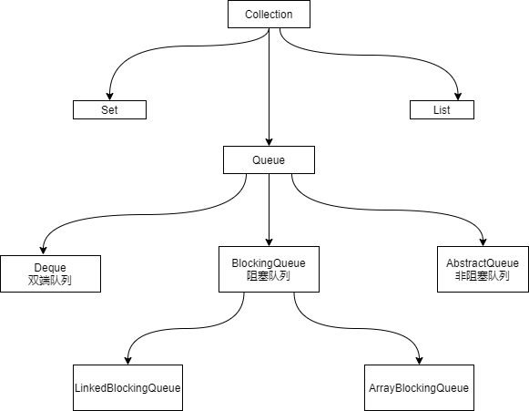

# 并发安全容器

## 1.普通的ArrayList在多线程并发环境下去添加元素会有什么问题？
所有的不安全并发都会抛出ConcurrentModificationException
```java
public class ListTest {
    public static void main(String[] args) {
        List<String> list = new ArrayList<>();
        // 多线程下会抛出java.util.ConcurrentModificationException
        for (int i = 1; i < 30; i++) {
            new Thread(() -> {
                list.add(UUID.randomUUID().toString());
                System.out.println(list);
            }).start();
        }
    }
}
```
## 2.如何得到一个线程安全的List？
* 使用Collections.synchronizedList()方法得到一个同步的List
* 使用Vector
* 使用CopyOnWriteArrayList

## 4.HashSet在并发环境下同样会抛异常，如何得到一个线程安全的Set？
* 使用Collections.synchronizedSet()
* 使用CopyOnWriteArraySet

## HashSet底层是怎么实现的？
```java
public class HashSet {
    // 用一个空对象作为常量
    private static final Object PRESENT = new Object();
    
    // 底层使用一个HashMap
    public HashSet() {
        map = new HashMap<>();
    }
    
    // 本质上是用hashMap的key去维护这个set，因为hashMap的key是不重复的。 而present是一个常量
    public boolean add(E e) {
        return map.put(e, PRESENT)==null;
    }
}
```

## 5.HashMap并发环境下同样会抛异常，如何得到一个线程安全的Map？
* 使用Collections.synchronizedMap()
* 使用ConcurrentHashMap

## 3.CopyOnWriteList
源码中思想:改的时候不在原来的上面改，抢到锁后，复制出来改完再set回去

## ConcurrentHashMap

blog.kuangstudy.com 看hashMap相关分析

## ReadWriteLock:是一个接口，具体实现类为ReentrantReadWriteLock
下面是自己实现一个缓存，如果不使用锁，会造成并发写入,也就是在一次写入还没有完成时，其他线程也开始写入
```java
import java.util.HashMap;
import java.util.Map;

public class ReadWriteLockDemo {
    public static void main(String[] args) {
        MyCache cache = new MyCache();
        for (int i = 1; i <= 5; i++) {
            final int temp = i;
            new Thread(() -> {
                cache.put(String.valueOf(temp), temp);
            }).start();
        }

        for (int i = 1; i < 5; i++) {
            final int temp = i;
            new Thread(() -> {
                cache.get(String.valueOf(temp));
            }).start();
        }
    }
}
class MyCache {
    private volatile Map<String, Object> cache = new HashMap<>();

    public void put(String k, Object v) {
        System.out.println(Thread.currentThread().getName() + "写入" + k);
        cache.put(k, v);
        System.out.println(Thread.currentThread().getName() + "写入" + k + " ok");
    }

    public void get(String k) {
        System.out.println(Thread.currentThread().getName() + "读取" + k);
        Object v = cache.get(k);
        System.out.println(Thread.currentThread().getName() + "读取" + k + " ok");
    }
}
```
运行结果:
```
Thread-2写入3
Thread-0写入1
Thread-0写入1 ok
Thread-1写入2
Thread-1写入2 ok
Thread-2写入3 ok
Thread-5读取2
Thread-4读取1
Thread-7读取4
Thread-6读取3
Thread-7读取4 ok
Thread-4读取1 ok
Thread-5读取2 ok
Thread-6读取3 ok
Thread-3写入4
Thread-3写入4 ok
```
改进办法:使用ReentrantLock 和 synchronized 可以解决，但是锁粒度比较粗，影响性能，可以使用 JUC 包中的ReentrantReadWriteLock解决
```java
import java.util.HashMap;
import java.util.Map;
import java.util.concurrent.locks.ReadWriteLock;
import java.util.concurrent.locks.ReentrantReadWriteLock;

public class ReadWriteLockDemo {
    public static void main(String[] args) {
        MyCache cache = new MyCache();
        for (int i = 1; i <= 5; i++) {
            final int temp = i;
            new Thread(() -> {
                cache.put(String.valueOf(temp), temp);
            }).start();
        }

        for (int i = 1; i < 5; i++) {
            final int temp = i;
            new Thread(() -> {
                cache.get(String.valueOf(temp));
            }).start();
        }
    }
}

class MyCache {
    private volatile Map<String, Object> cache = new HashMap<>();
    private ReadWriteLock lock = new ReentrantReadWriteLock();

    public void put(String k, Object v) {
        lock.writeLock().lock();
        try {
            System.out.println(Thread.currentThread().getName() + "写入" + k);
            cache.put(k, v);
            System.out.println(Thread.currentThread().getName() + "写入" + k + " ok");
        } catch (Exception e) {
            e.printStackTrace();
        } finally {
            lock.writeLock().unlock();
        }
    }

    public void get(String k) {
        lock.readLock().lock();
        try {
            System.out.println(Thread.currentThread().getName() + "读取" + k);
            Object v = cache.get(k);
            System.out.println(Thread.currentThread().getName() + "读取" + k + " ok");
        } catch (Exception e) {
            e.printStackTrace();
        } finally {
            lock.readLock().unlock();
        }
    }
}
```
改进后运行结果:写都是排队写的，读可以并发读
```
Thread-0写入1
Thread-0写入1 ok
Thread-1写入2
Thread-1写入2 ok
Thread-2写入3
Thread-2写入3 ok
Thread-3写入4
Thread-3写入4 ok
Thread-4写入5
Thread-4写入5 ok
Thread-6读取2
Thread-6读取2 ok
Thread-7读取3
Thread-8读取4
Thread-7读取3 ok
Thread-8读取4 ok
Thread-5读取1
Thread-5读取1 ok
```

ReentrantReadWriteLock原理:
* 写锁是独占锁，一次只能被一个线程占有
* 读锁是共享锁，多个线程可以同时占有

|场景|是否能共存|
|-----|-----|
|读 -- 读| 可以共存|
|读 -- 写 |不能共存|
|写 -- 写 |不能共存|

## 阻塞队列: BlockingQueue是一个接口，具体实现类有ArrayBlockingQueue、LinkedBlockingQueue、SynchronizedQueue

## 什么况下会去使用阻塞队列:多线程并发处理，线程池



学会使用队列:添加、移除。四组api:
1.抛出异常
2.不会抛出异常
3.阻塞等待
4.超时等待

| 方式         | 抛出异常  | 有返回值，不抛出异常 | 阻塞等待 | 超时等待                                |
| ------------ | --------- | -------------------- | -------- | --------------------------------------- |
| 添加         | add()     | offer()              | put()    | offer(E e, long timeout, TimeUnit unit) |
| 移除         | remove()  | poll()               | take()   | poll(long timeout, TimeUnit unit)       |
| 检测队首元素 | element() | peek()               | -        | -                                       |

```java
public class BlockingQueueDemo {
    /**
     * 一个容量为2的阻塞队列
     */
    static BlockingQueue<String> blockingQueue = new ArrayBlockingQueue<>(2);

    public static void main(String[] args) throws InterruptedException {
        test1();
    }
    /**
     * 抛异常
     */
    public static void test1() {
        // 添加
        System.out.println(blockingQueue.add("a"));
        System.out.println(blockingQueue.add("b"));
        // TODO 抛出 IllegalStateException: Queue full
//        System.out.println(blockingQueue.add("c"));
        // 移除
        System.out.println(blockingQueue.remove());
        System.out.println(blockingQueue.remove());
        // TODO 抛出 NoSuchElementException
        System.out.println(blockingQueue.remove());
    }
    /**
     * 有返回值，不抛出异常
     */
    public static void test2() {
        // 添加
        System.out.println(blockingQueue.offer("a"));
        System.out.println(blockingQueue.offer("b"));
        // TODO 不抛异常，返回false
//        System.out.println(blockingQueue.offer("c"));
        // 移除
        System.out.println(blockingQueue.poll());
        System.out.println(blockingQueue.poll());
        // TODO 返回null
        System.out.println(blockingQueue.poll());
    }
    /**
     * 阻塞等待
     */
    public static void test3() throws InterruptedException {
        // 添加
        blockingQueue.put("a");
        blockingQueue.put("b");
        // TODO 一直阻塞等待队列中腾出位置
//        blockingQueue.put("c");
        // 移除
        System.out.println(blockingQueue.take());
        System.out.println(blockingQueue.take());
        // TODO 一直阻塞等待队列中插入元素
        System.out.println(blockingQueue.take());
    }

    /**
     * 超时等待
     *
     * @throws
     */
    public static void test4() throws InterruptedException {
        // 添加
        blockingQueue.offer("a", 1, TimeUnit.SECONDS);
        blockingQueue.offer("b", 1, TimeUnit.SECONDS);
        // 超时后退出
        blockingQueue.offer("c", 1, TimeUnit.SECONDS);
        // 移除
        System.out.println(blockingQueue.poll(1, TimeUnit.SECONDS));
        System.out.println(blockingQueue.poll(1, TimeUnit.SECONDS));
        // 超时后返回null
        System.out.println(blockingQueue.poll(1, TimeUnit.SECONDS));
    }
}
```

