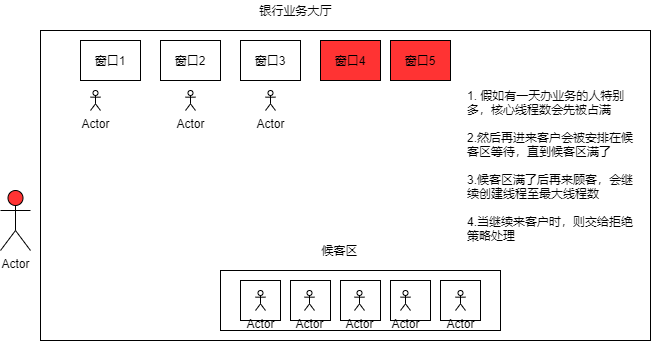

### 线程池(重点)

3大方法、7大参数、4种拒绝策略

#### 3大方法:线程池工具类提供的3个创建线程池的方法
数组相关的工具类为Arrays，集合类的工具类为Collections，线程池的工具类为Executors
```java
public class ExecutorsDemo {
    public static void main(String[] args) {
        // 单一线程
        ExecutorService threadPool = Executors.newSingleThreadExecutor();
        // 固定线程数
        ExecutorService threadPool = Executors.newFixedThreadPool(5);
        // 遇强则强，遇弱则弱，可伸缩(可以无限创建线程)
        ExecutorService threadPool = Executors.newCachedThreadPool();
        try {
            for (int i = 1; i <= 10; i++) {
                threadPool.execute(() -> {
                    System.out.println(Thread.currentThread().getName());
                });
            }
        } catch (Exception e) {
            e.printStackTrace();
        } finally {
            // 线程池用完程序结束时，关闭线程池
            threadPool.shutdown();
        }
    }
}
```
运行结果:
```
pool-1-thread-1
pool-1-thread-2
pool-1-thread-4
pool-1-thread-5
pool-1-thread-3
pool-1-thread-6
pool-1-thread-7
pool-1-thread-8
pool-1-thread-9
pool-1-thread-10
```
#### 3个方法的本质(源码分析):都是使用ThreadPoolExecutor对象创建线程池
```java
public class Executors {
    
    public static ExecutorService newSingleThreadExecutor() {
        return new Executors.FinalizableDelegatedExecutorService
                (new ThreadPoolExecutor(1, 1, 0L, TimeUnit.MILLISECONDS, new LinkedBlockingQueue<Runnable>()));
    }

    public static ExecutorService newFixedThreadPool(int nThreads) {
        return new ThreadPoolExecutor(nThreads, nThreads,
                0L, TimeUnit.MILLISECONDS,
                new LinkedBlockingQueue<Runnable>());
    }

    public static ExecutorService newCachedThreadPool() {
        return new ThreadPoolExecutor(0, Integer.MAX_VALUE,
                60L, TimeUnit.SECONDS,
                new SynchronousQueue<Runnable>());
    }
}
```
阿里巴巴开发--线程池规约:

##### 7大参数:ThreadPoolExecutor的构造方法需要的7个参数
```java
public class ThreadPoolExecutor {
        public ThreadPoolExecutor(int corePoolSize, // 核心线程数
                                  int maximumPoolSize, // 最大线程数
                                  long keepAliveTime, // 超时没被使用则被回收
                                  TimeUnit unit,     // 超时单位
                                  BlockingQueue<Runnable> workQueue, // 阻塞队列
                                  ThreadFactory threadFactory, // 线程工厂，创建线程的
                                  RejectedExecutionHandler handler) // 拒绝策略 
        {}
}
```

```java
public class ExecutorServiceDemo {
    public static void main(String[] args) {
        ExecutorService threadPool = new ThreadPoolExecutor(3, 5, 3, TimeUnit.SECONDS, new LinkedBlockingQueue<>(3),
                Executors.defaultThreadFactory(), new ThreadPoolExecutor.AbortPolicy());
        for (int i = 1; i <= 9; i++) {
            // 最大承载 = 最大线程数 + 队列最大容量
            /**
             * 超出最大承载则报错:rejected from java.util.concurrent.ThreadPoolExecutor@27bc2616[Running, pool size = 5, active
             * threads = 5, queued tasks = 3, completed tasks = 0]
             */
            threadPool.execute(() -> {
                System.out.println(Thread.currentThread().getName());
            });
        }
    }
}
```

线程池与银行办理业务的关联:


#### 4种拒绝策略:
* AbortPolicy: 最大承载满了后，再有任务进来直接抛异常
* CallerRunsPolicy: 扔给提交任务的那个线程去处理
* DiscardPolicy: 如果队列满了则丢掉提交的任务，不抛异常
* DiscardOldestPolicy: 队列满了尝试去和最早的竞争，不会抛异常
