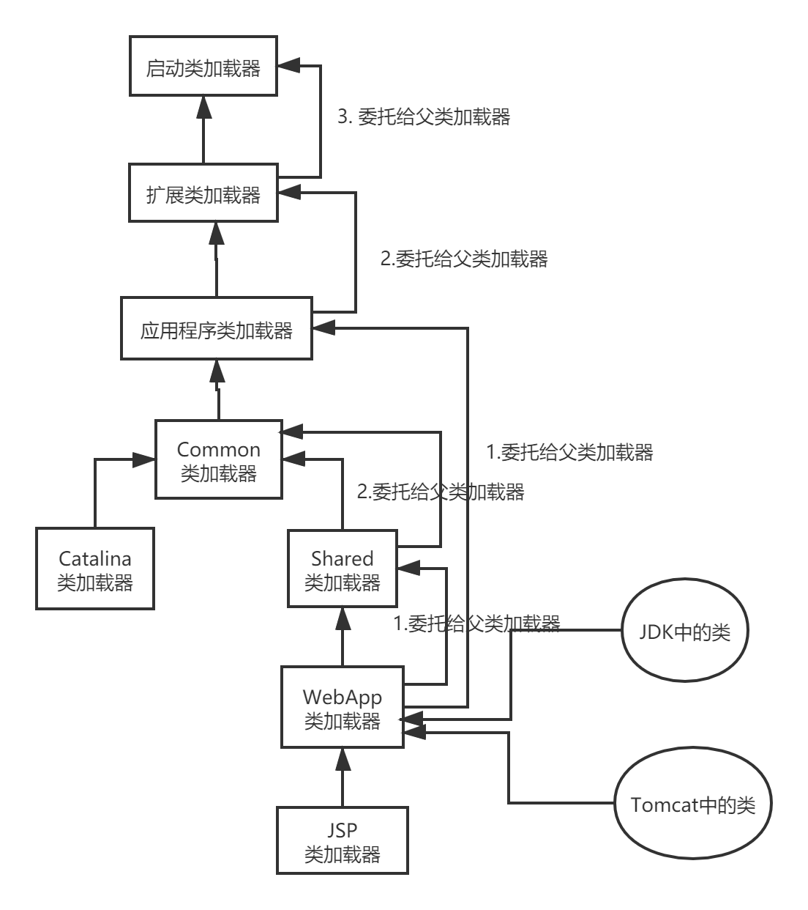
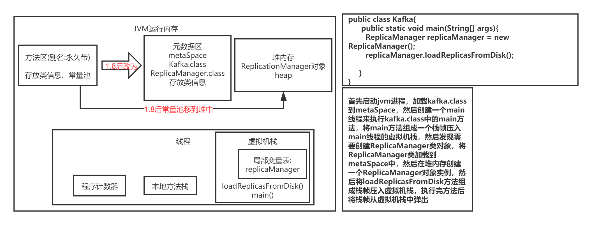

# 专栏学习目标:
1. 对自己负责的线上系统，可以进行生产环境的JVM参数优化
2. 线上遇到生产故障，绝对有思路去分析、排查和定位
3. 清楚如何去动手实践从而弄明白背后的JVM底层原理
4. 通过专栏积累的几十个JVM生产案例，能去支撑你对各种不同的生产故障进行处理和解决

## Java代码是如何运行起来的？
* .java后缀的java源文件是由程序员编写的(面向程序员的)，给自己或者其他人看的，编译后编译成.class后缀的字节码文件(面向虚拟机的)，是可以被jvm运行的文件  

* JVM想运行“hello.class”文件中的代码,首先使用类加载器将“hello.class”文件中的类加载到jvm中，然后由jvm中的字节码执行引擎来执行hello.class中的main()
方法，从main方法运行开始，如果遇到哪个类需要被使用，就使用类加载器来加载对应的类。(按需加载,而不是一次性加载)   


## JVM在什么情况下会加载一个类？类加载的过程？
* 加载时机:在jvm运行时，代码中第一次用到这个类的时候，jvm会从".class"字节码文件中加载这个类到jvm内存里来。

* 一个类从加载到使用的过程:
加载 -> 验证 -> 准备 -> 解析 -> 初始化 -> 使用 -> 卸载

```
类代码如下: 
public class ReplicaManager{
	public static int flushInterval;
}
```

* 验证:(先加载进内存后再验证)就是根据java虚拟机规范，来校验加载进来的“.class”文件中的内容是否符合指定的规范，主要是为了维护虚拟机自身的安全
* 准备(核心阶段):字节码文件加载进内存后，在准备阶段，需要给类分配一定的内存空间，然后给类变量分配内存空间，并给类变量初始化为默认值。(给ReplicaManager
.class类分配空间，给类变量flushInterval分配空间，然后把初始值0赋给类变量flushInterval)
>1. 给类分配内存空间
>2. 给类变量分配空间并赋默认值
* 解析: 把符号引用替换为直接引用
* 初始化(核心阶段): 
>1. 真正给类变量赋值
>2. 如果有static代码块，执行static代码块(用户使用类的时候肯定是希望类已经准备好了一些数据，所以jvm设计者设计在类加载的初始化阶段去执行静态代码块)

类的初始化时机:
>1. 被main()方法间接调用的类，必须是立即初始化的
>2. 代码中如果要实例化对象(new 对象)，就必须先触发类的加载全过程
>3. 如果初始化一个子类时发现他的父类还没有初始化，那么必须先初始化他的父类

## 类加载器与双亲委派机制
类加载器:类加载器是有亲子层次结构的，启动类加载器在最上层，扩展类加载器在第二层，应用程序加载器在第三层，自定义类加载器在最后一层
>1. 启动类加载器(Bootstrap ClassLoader):负责加载java安装目录下lib目录下的核心类库
>2. 扩展类加载器(Extension ClassLoader):负责加载lib/ext目录中的核心类
>3. 应用程序加载器(Application ClassLoader):负责加载环境变量(classPath)所指定的路径中的类，可以认为应用程序加载器将我们写好的java代码加载到内存中
>4. 自定义类加载器:根据自己的需求来定义类的加载

类加载器本身也可以对代码之间进行隔离，例如，应用无法获取启动类加载器（Bootstrap Class-Loader）对象实例，
不同的类加载器也可以起到容器的作用，隔离模块之间不必要的可见性等

一个类在双亲委派机制下的加载过程:  


双亲委派机制的好处:
先找父类加载器去加载，如果父类无法加载再由子类加载器来加载，避免了多层级的加载器结构重复加载某些类，双亲委派机制主要是为了避免类的重复加载.每个类加载器层次分明，没有规矩不成方圆，定义父子角色后可以防止类的重复加载


为什么类加载器必须要一级一级往上找，直接从顶层类加载器开始找不行吗？
* 如果从顶层类加载器开始找，就必须硬编码来规定，可扩展性不好，这是一种保证代码可扩展的代码设计思想。
* 每一层类加载器对某个类的加载，先上推给父类加载器，直到顶层类加载器如果发现自己无法加载，再下推回子类加载器，这样可以保证不会重复加载某个类

## Tomcat的类加载器结构
Tomcat自定义了Common、Catalina、Shared等类加载器，用来加载Tomcat自身的一些核心基础类库。Tomcat为每个部署在它里面的web应用分配一个WebApp类加载器，负责加载部署的这个web
应用包中的类。对于JSP类加载器，是给每个JSP分配一个JSP类加载器  

* Tomcat是打破了双亲委派机制的，因为每个webApp类加载器只负责加载自己对应的那个应用包的class文件，不会委派给上层的父加载器去加载
* 如果加载jdk中的类，webAppClassLoader会委派给应用程序类加载器走双亲委派模型去加载。如果加载的不是jdk中的类，webAppClassLoader自己先尝试加载，如果无法加载，就委派给shared
类加载器走双亲委派模型去加载
* tomcat7以后，目录common、server、shared合并为一个lib包。common类加载器和Catalina类加载器和shared类加载器被tomcat作者实现为同一个实例

tomcat的类加载过程是打破了双亲委派机制的。
>1. 先在本地缓存中查找是否已经加载过该类(对于已经加载了的类，会被缓存在resourceEntries这个数据结构中)，如果找到了就返回，否则进入下一步
>2. 让系统类加载器(AppClassLoader)先尝试加载该类，主要是为了防止一些基础类被web中的类覆盖，如果加载成功则返回，否则进入下一步
>3. webAppClassLoader尝试加载，如果加载成功则返回，否则进入下一步
>4. 委托父类加载器(CommonClassLoader)去加载
## JVM运行时内存区域划分
首先启动jvm进程，加载kafka.class到metaSpace，然后创建一个main线程来执行kafka.class中的main方法，将main方法组成一个栈帧压入main线程的虚拟机栈，然后发现需要创建ReplicaManager类对象，将ReplicaManager类加载到metaSpace中，然后在堆内存创建一个ReplicaManager对象实例，然后将loadReplicasFromDisk方法组成栈帧压入虚拟机栈，执行完方法后将栈帧从虚拟机栈中弹出


### 包含main方法的类会优先加载，如果一个项目中有多个类中都有main方法，都会加载吗？
不会的，因为启动的jar包需要指定某个类的main方法作为入口，优先加载这个类

-----
## 新生代的内存分配过程？
系统刚启动时，第一次创建对象时只会分配到eden区，当第一次MinorGc时，会将eden中存活的对象转移到一块Survivor区中，然后将eden区清空。第一次MinorGc完成后如果此时再分配对象，就可以再次分配到eden区了。这时如果发生第二次MinorGC，会对eden区和Survivor区进行垃圾回收，然后将存活对象转移到空的那块survivor区，然后将eden区和survivor区都清空，后面的情况和第二次MinorGC的情况重复
* Survivor区只能专门用来放每次GC后的存活对象的，而不是用于直接在此区分配对象
* 因为总是有一块survivor区是空着的，所以新生代空间利用率为90%

# 垃圾回收
* 什么是垃圾？垃圾指的是某个实例对象没有任何一个方法的局部变量指向他，也没有任何类的静态变量或者常量在指向他
* 如何计算一个对象在java堆内存中占用多少内存空间呢？
一个对象占用的空间，大致分为两块:
>1. 对象自身的一些信息占用的空间
>2. 对象的实例变量占用的空间

在64位linux操作系统上，对象头占用16字节，一个int占用4个字节，long占用8个字节，如果是数组或者map会占用更多内存.
Object Header(4字节) + class Pointer(4字节) + field(取决于类型),jvm内存占用必须是8的倍数，所以最终结果要向上取整到8的倍数

## 加载到方法区的类会被垃圾回收吗？什么时候回收？为什么？
会。满足下面3个条件，方法区里的类就可以被回收了:
>1. 首先该类的所有实例(对象)都已经从java堆内存里被回收了
>2. 其次加载这个类的ClassLoader已经被回收了
>3. 最后，对该类的Class对象没有任何引用

## JVM 被GC对象的判断方法?
JVM gc算法采用可达性分析法，如果对象到GC Roots之间无路径可达，就可以被回收，那可以被当作gc roots的对象有局部变量，类静态变量。
还涉及到java中的四种引用类型。

## 四种引用?
与 GC Roots 没有引用关系的：引用不可达，一定回收。
* 强引用：不回收。
* 软引用：内存不够就回收。
* 弱引用：一定回收。
* 虚引用：一定回收，get出来就是null，引用形同虚设，主要和引用队列联合使用，在finalize之前会被放到引用队列中。  

## 什么时候触发youngGC？
youngGC，也叫minorGC。在新生代的eden区需要分配新对象发现内存空间不足时。minorGC 和 fullGC 都会造成 "Stop The world" 
，只不过minorGC比较快，停顿时间短；fullGC比较慢，停顿时间长

## 触发老年代Full GC的时机？
* 第一:老年代可用内存小于新生代全部对象大小，如果没开启空间担保参数，会直接触发FullGC，所以一般空间担保参数都会打开
* 第二: 老年代可用内存小于历次新生代Gc后进入老年代的平均对象大小,此时会提前fullGC
* 第三:新生代MinorGc后的存活对象大于Survivor，会直接进入老年代，而此时老年代空间不足，触发Full GC
* 第四:JVM参数"-XX:CMSInitiatingOccupancyFaction",如果老年代可用内存大于历次minorGC后进入老年代对象的平均大小，但是老年代已用内存超过了此参数指定的比例，也会触发FullGC

## 为什么老年代的FullGC比新生代MinorGc慢很多倍，一般在10倍以上？
分析新生代和老年代的GC执行过程：
* 新生代Gc速度很快是因为直接从GC Roots出发追踪哪些对象是存活的即可，因为新生代存活对象很少，所以需要追踪的对象数量也很少，所以此过程速度很快，将存活对象放入Survivor，然后一次回收eden和survivor即可
* 老年代使用的CMS的FullGC:第一在并发标记阶段需要追踪所有存活对象，因为老年代存活对象很多，所以这个过程很慢。第二在并发清理阶段，不是一次性回收一大片内存，而是找到散落在各个地方的垃圾对象，所以速度很慢。最后还需要进行内存碎片整理，把大量存活的对象向一个方向移动，这个过程需要"Stop The World"。并且在并发清理期间，剩余内存空间不足以存放即将进入老年代的对象，引发"Concurrent Mode Failure"问题，还需要用”Serial Old“垃圾收集器来替换CMS垃圾收集器，这样就得重新"Stop The World"然后让"Serial Old"垃圾收集器重新走一次FullGC流程，就更加耗时了。

## 老年代的垃圾回收算法?
* 标记清除算法: 会产生内存碎片，不使用
* 标记整理算法: 标记出当前存活的对象，然后把存活对象尽量向一个方向移动，让存活对象紧凑的靠在一起，这个过程内存地址会改变，避免垃圾回收后出现过多的内存碎片，然后一次性将垃圾对象都回收掉。老年代的垃圾回收算法速度至少比新生代垃圾回收算法速度慢10
倍，如果系统频繁出现full gc会严重影响性能

## 对象是如何进入老年代的？
>1. 一个实例对象在新生代成功躲过15次垃圾回收后还是没被回收掉，说明它已经15岁了，就会被转移到老年代中。具体多少岁进入老年代，可以通过JVM参数"-XX:MaxTenuringThreshold"来设置，默认是15岁
>2. 动态对象年龄判断机制:有一种情况可以让新生代的对象不用等待15次GC就可以进入老年代:如果当前存放对象的Survivor区域里，一批对象的总大小大于这块Survivor区域内存大小的50%，那么此时Survivor区域中大于等于这批对象年龄的对象(取这批对象中年龄最大的大小作为参考值)，就可以直接进入老年代。比如年龄1对象 + 年龄2 对象 + 年龄n的对象大小总和超过了Survivor区域大小的50%，此时就会把年龄n及以上的对象都放入老年代。核心思想就是希望那些可能是长期存活的对象今早进入老年代。
>3. 大对象直接进入老年代:JVM参数"-XX:PretenureSizeThreshold"控制大对象的阈值，这个值可以设置为字节数，比如"1048576"字节，就是1MB
，如果要创建一个大于这个大小的对象或者数组，会直接将这个大对象在老年代分配，不经过新生代。假如新生代里出现大对象后，屡次躲过GC，然后在两个Survivor
区来回复制多次后才能进入老年代，很耗费时间。核心思想就是让长时间存活的对象尽早进入老年代。  

## 当每个线程执行方法时，方法对应的栈帧出栈了，栈帧里的局部变量需要垃圾回收吗？
JVM垃圾回收针对的是新生代、老年代、方法区，不会针对方法的栈帧。方法执行完毕后当栈帧出栈时，栈帧里面的局部变量引用会被直接从内存里清理掉，虚拟机栈栈帧出栈后，栈帧中局部变量的引用直接被清除，但是对象还是要等待垃圾回收时才能被销毁。
(方法运行期间，堆上对象被引用占用，无法被回收，所以高并发下多个方法同时运行期间，这种情况下会发生OOM)

## MinorGC后对象太多无法放入Survivor区怎么办?
>1. 在minorGC前先检查一下老年代的可用空间是否大于新生代所有对象的总大小，这是因为最极端的情况下，minorgc后可能所有对象都存活下来。如果老年代空间足以放下，就可以发起minorGC了，因为即使minorGC后所有对象都存活且survivor区放不下，也是可以放到老年代的。如果老年代空间能放下，直接将这批对象放入老年代
>2. 如果老年代内存不足以放下新生代所有对象，就检查JVM参数“-XX:HandlePromotionFailure”是否已设置，此参数用于开启老年代空间担保机制。如果设置了这个参数，就判断老年代的内存大小是否大于每次minorGC
后进入老年代对象的平均大小，例如之前每次minorGC后平均有10MB的对象进入老年代，如果此时老年代剩余可用内存大于10MB，就说明这次minorGC后差不多也是10MB左右对象进入老年代，老年代空间足够。老年代空间不足或者参数没有设置，就直接触发一次fullGC对老年代控件进行回收，然后再进行minorGC。

第一种可能:minorGC后存活对象小于Survivor区大小，此时所有存活对象进入Survivor区
第二种可能: minorGC后存活对象大于Survivor区大小，但是小于老年代可用内存大小，此时直接进入老年代
第三种可能:minorGC后存活对象大于Survivor区大小，也大于老年代可用内存大小，此时如果没配置handle promotion failure，就直接oom。如果配置了，就触发fullGC，如果fullGC后还是放不下minorGC存活的对象，就会oom

## JVM参数"HandlePromotionFail"空间分配担保的意义是什么？
如果开启了这个参数，当minorGC后老年代放不下所有对象时，还会继续判断老年代剩余空间是否大于每次MinorGC后进入老年代的平均对象大小，如果大于，就直接minorGc后将存活对象放入老年代。要是不配置这个参数，当判断完老年代放不下新生代所有存活对象后，就直接触发fullGc对老年代进行垃圾回收了。这个参数配置的意义就是说，在这种情况下，有可能会省一次提前的fullGc，当然如果判断通过了，到实际放时候放不下，也是需要通过fullGc来回收老年代空间的。开启参数与否的区别在于不需要频繁FullGC

## ParNew + CMS的垃圾收集器，如何保证只做MinorGC，JVM参数如何配置？
优化JVM参数后的一个最理想的状态就是: 只发生MinorGC，fullGC次数为0。那就要求老年代可以放下所有长时间存活的对象，并且新生代的对象，就不要跑到老年代去，这就需要去考虑新生代对象什么情况下会被转移到老年代去，把几种会转移到老年代的情况，结合线上系统的运行情况(借助一些工具来观察每秒钟会在新生代增加多少对象，多长时间触发一次MinorGC，平均每次minorGC后会有多少对象存活，Survivor区是否可以放的下)，核心点就是必须让survivor区放得下，而且也要保证不能因为动态年龄判定机制使新生代的对象直接升入老年代，通过优化JVM参数来做到只发生MinorGC，而fullGC次数为0.

## 跟JVM内存相关的核心参数:
* -Xms: Java堆内存的大小
* -Xmx: java堆内存的最大大小
* -Xmn: 堆内存新生代大小(扣除新生代就是老年代大小了)
* -XX:PermSize: 永久代大小
* -XX:MaxPermSize: 永久代最大大小
* -Xss:每个线程的虚拟机栈内存大小

对于 -Xms和-Xmx这对参数，一般会设置为完全一样的大小，用于限定Java堆内存的总大小  
-XX:PermSize和-XX:MaxPermSize,分别限定了永久代大小和永久代的最大大小，通常这两个数值也设置为一样大小。JDK 1.8后，这两个参数被替换为:-XX:MetaspaceSize 和 -XX:MaxMetaspaceSize
```
启动命令示例:
java -Xms512M -Xmx512M -Xmn256M -Xss1M -XX:MetaspaceSize=128M -XX:MaxMetaspaceSize=128M -jar App.jar
```

## 垃圾收集器:
对于新生代和老年代进行垃圾回收时，不同区域使用不同的垃圾收集器。
* serial 和 serial old垃圾收集器:分别用来回收新生代和老年代的垃圾对象。单线程运行，垃圾回收时停止所有其他工作线程，然后进行垃圾回收，现在几乎不用
* ParNew 和 CMS: ParNew回收新生代，CMS回收老年代。这两个都是多线程并发，性能更好，现在一般是生产环境标配组合
* G1: 统一收集新生代和老年代，采用了更优秀的算法和设计机制

## JDK 8 默认使用的垃圾收集器是什么？
使用下面命令查看:
```
java -XX:+PrintCommandLineFlags -version
结果显示:
-XX:+UseParallelGC
```
可以通过"-XX:+UseParNewGC"参数指定使用ParNew垃圾收集器对新生代进行回收

## 老年代垃圾收集器？
CMS垃圾收集器采用的是垃圾回收线程 和 系统工作线程并行的模式来处理  
CMS在执行一次垃圾回收的过程一共分为4个阶段:
>1. 初始标记:将系统工作线程全部停止，进入"Stop The World"状态，然后只标记出所有GC Roots直接引用的对象
>2. 并发标记:系统工作线程恢复运行，在这个过程中垃圾回收线程主要是对此过程中新创建的对象和在此过程失去引用变成垃圾的对象进行标记，也就是标记出被GC Roots间接引用的对象，也是对老年代所有对象进行Gc 
Roots追踪，追踪所有对象是否从根源上被GC Roots引用了，此过程最耗时
>3. 重新标记:再次将系统工作线程全部停止，进入"Stop The World"状态，然后标记下在并发标记阶段新创建的对象中失去引用变成垃圾的那些对象
>4. 并发清理: 系统工作线程和垃圾回收线程并行运行，由垃圾回收线程将之前标记为垃圾的对象清理掉，这个阶段很耗时