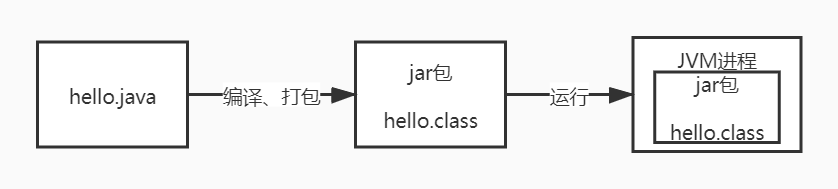
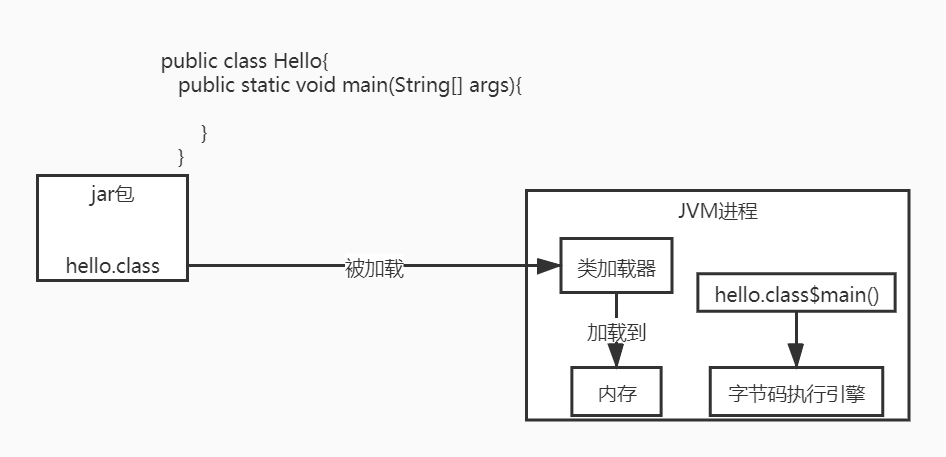
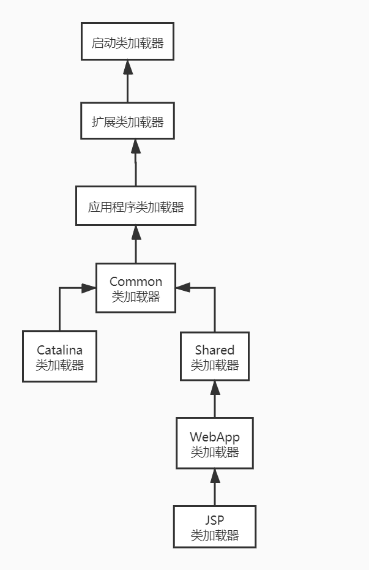
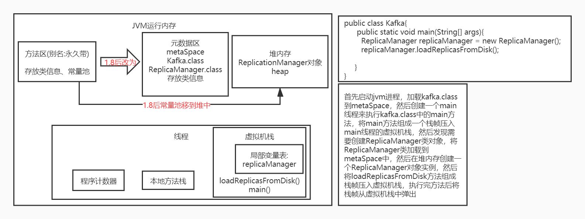

# 专栏学习目标:
1. 对自己负责的线上系统，可以进行生产环境的JVM参数优化
2. 线上遇到生产故障，绝对有思路去分析、排查和定位
3. 清楚如何去动手实践从而弄明白背后的JVM底层原理
4. 通过专栏积累的几十个JVM生产案例，能去支撑你对各种不同的生产故障进行处理和解决

## Java代码是如何运行起来的？
* .java后缀的java源文件是由程序员编写的(面向程序员的)，给自己或者其他人看的，编译后编译成.class后缀的字节码文件(面向虚拟机的)，是可以被jvm运行的文件  

* JVM想运行“hello.class”文件中的代码,首先使用类加载器将“hello.class”文件中的类加载到jvm中，然后由jvm中的字节码执行引擎来执行hello.class中的main()
方法，从main方法运行开始，如果遇到哪个类需要被使用，就使用类加载器来加载对应的类。(按需加载,而不是一次性加载)   


## JVM在什么情况下会加载一个类？类加载的过程？
* 加载时机:在jvm运行时，代码中第一次用到这个类的时候，jvm会从".class"字节码文件中加载这个类到jvm内存里来。

* 一个类从加载到使用的过程:
加载 -> 验证 -> 准备 -> 解析 -> 初始化 -> 使用 -> 卸载

```
类代码如下: 
public class ReplicaManager{
	public static int flushInterval;
}
```

* 验证:(先加载进内存后再验证)就是根据java虚拟机规范，来校验加载进来的“.class”文件中的内容是否符合指定的规范，主要是为了维护虚拟机自身的安全
* 准备(核心阶段):字节码文件加载进内存后，在准备阶段，需要给类分配一定的内存空间，然后给类变量分配内存空间，并给类变量初始化为默认值。(给ReplicaManager
.class类分配空间，给类变量flushInterval分配空间，然后把初始值0赋给类变量flushInterval)
>1. 给类分配内存空间
>2. 给类变量分配空间并赋默认值
* 解析: 把符号引用替换为直接引用
* 初始化(核心阶段): 
>1. 真正给类变量赋值
>2. 如果有static代码块，执行static代码块

类的初始化时机:
>1. 被main()方法间接调用的类，必须是立即初始化的
>2. 代码中如果要实例化对象(new 对象)，就必须先触发类的加载全过程
>3. 如果初始化一个子类时发现他的父类还没有初始化，那么必须先初始化他的父类

## 类加载器与双亲委派机制
类加载器:类加载器是有亲子层次结构的，启动类加载器在最上层，扩展类加载器在第二层，应用程序加载器在第三层，自定义类加载器在最后一层
>1. 启动类加载器(Bootstrap ClassLoader):负责加载java安装目录下lib目录下的核心类库
>2. 扩展类加载器(Extension ClassLoader):负责加载lib/ext目录中的核心类
>3. 应用程序加载器(Application ClassLoader):负责加载环境变量(classPath)所指定的路径中的类，可以认为应用程序加载器将我们写好的java代码加载到内存中
>4. 自定义类加载器:根据自己的需求来定义类的加载

一个类在双亲委派机制下的加载过程:  


双亲委派机制的好处:
先找父类加载器去加载，如果父类无法加载再由子类加载器来加载，避免了多层级的加载器结构重复加载某些类，
双亲委派机制主要是为了避免类的重复加载

## Tomcat的类加载器结构
Tomcat自定义了Common、Catalina、Shared等类加载器，用来加载Tomcat自身的一些核心基础类库。Tomcat为每个部署在它里面的web应用分配一个WebApp类加载器，负责加载部署的这个web
应用包中的类。对于JSP类加载器，是给每个JSP分配一个JSP类加载器  

* Tomcat是打破了双亲委派机制的，因为每个webApp类加载器只负责加载自己对应的那个应用包的class文件，不会委派给上层的父加载器去加载

## JVM运行时内存区域划分
