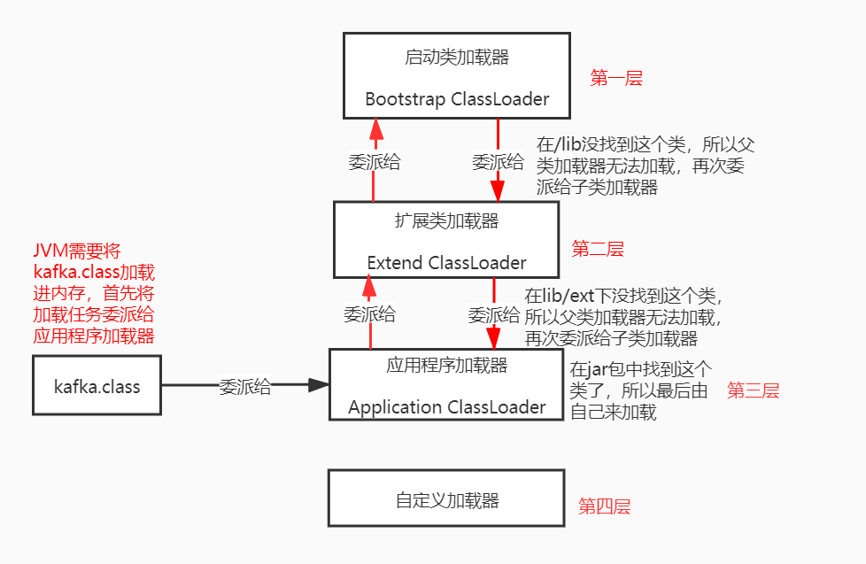

# 专栏学习目标:
1. 对自己负责的线上系统，可以进行生产环境的JVM参数优化
2. 线上遇到生产故障，绝对有思路去分析、排查和定位
3. 清楚如何去动手实践从而弄明白背后的JVM底层原理
4. 通过专栏积累的几十个JVM生产案例，能去支撑你对各种不同的生产故障进行处理和解决

## Java代码是如何运行起来的？
* .java后缀的java源文件是由程序员编写的(面向程序员的)，给自己或者其他人看的，编译后编译成.class后缀的字节码文件(面向虚拟机的)，是可以被jvm运行的文件  

* JVM想运行“hello.class”文件中的代码,首先使用类加载器将“hello.class”文件中的类加载到jvm中，然后由jvm中的字节码执行引擎来执行hello.class中的main()
方法，从main方法运行开始，如果遇到哪个类需要被使用，就使用类加载器来加载对应的类。(按需加载,而不是一次性加载)   


## JVM在什么情况下会加载一个类？类加载的过程？
* 加载时机:在jvm运行时，代码中第一次用到这个类的时候，jvm会从".class"字节码文件中加载这个类到jvm内存里来。

* 一个类从加载到使用的过程:
加载 -> 验证 -> 准备 -> 解析 -> 初始化 -> 使用 -> 卸载

```
类代码如下: 
public class ReplicaManager{
	public static int flushInterval;
}
```

* 验证:(先加载进内存后再验证)就是根据java虚拟机规范，来校验加载进来的“.class”文件中的内容是否符合指定的规范，主要是为了维护虚拟机自身的安全
* 准备(核心阶段):字节码文件加载进内存后，在准备阶段，需要给类分配一定的内存空间，然后给类变量分配内存空间，并给类变量初始化为默认值。(给ReplicaManager
.class类分配空间，给类变量flushInterval分配空间，然后把初始值0赋给类变量flushInterval)
>1. 给类分配内存空间
>2. 给类变量分配空间并赋默认值
* 解析: 把符号引用替换为直接引用
* 初始化(核心阶段): 
>1. 真正给类变量赋值
>2. 如果有static代码块，执行static代码块(用户使用类的时候肯定是希望类已经准备好了一些数据，所以jvm设计者设计在类加载的初始化阶段去执行静态代码块)

类的初始化时机:
>1. 被main()方法间接调用的类，必须是立即初始化的
>2. 代码中如果要实例化对象(new 对象)，就必须先触发类的加载全过程
>3. 如果初始化一个子类时发现他的父类还没有初始化，那么必须先初始化他的父类

## 类加载器与双亲委派机制
类加载器:类加载器是有亲子层次结构的，启动类加载器在最上层，扩展类加载器在第二层，应用程序加载器在第三层，自定义类加载器在最后一层
>1. 启动类加载器(Bootstrap ClassLoader):负责加载java安装目录下lib目录下的核心类库
>2. 扩展类加载器(Extension ClassLoader):负责加载lib/ext目录中的核心类
>3. 应用程序加载器(Application ClassLoader):负责加载环境变量(classPath)所指定的路径中的类，可以认为应用程序加载器将我们写好的java代码加载到内存中
>4. 自定义类加载器:根据自己的需求来定义类的加载

一个类在双亲委派机制下的加载过程:  


双亲委派机制的好处:
先找父类加载器去加载，如果父类无法加载再由子类加载器来加载，避免了多层级的加载器结构重复加载某些类，双亲委派机制主要是为了避免类的重复加载.每个类加载器层次分明，没有规矩不成方圆，定义父子角色后可以防止类的重复加载


为什么类加载器必须要一级一级往上找，直接从顶层类加载器开始找不行吗？
* 如果从顶层类加载器开始找，就必须硬编码来规定，可扩展性不好，这是一种保证代码可扩展的代码设计思想。
* 每一层类加载器对某个类的加载，先上推给父类加载器，直到顶层类加载器如果发现自己无法加载，再下推回子类加载器，这样可以保证不会重复加载某个类

## Tomcat的类加载器结构
Tomcat自定义了Common、Catalina、Shared等类加载器，用来加载Tomcat自身的一些核心基础类库。Tomcat为每个部署在它里面的web应用分配一个WebApp类加载器，负责加载部署的这个web
应用包中的类。对于JSP类加载器，是给每个JSP分配一个JSP类加载器  

* Tomcat是打破了双亲委派机制的，因为每个webApp类加载器只负责加载自己对应的那个应用包的class文件，不会委派给上层的父加载器去加载
* 如果加载jdk中的类，webAppClassLoader会委派给应用程序类加载器走双亲委派模型去加载。如果加载的不是jdk中的类，webAppClassLoader自己先尝试加载，如果无法加载，就委派给shared
类加载器走双亲委派模型去加载
* tomcat7以后，目录common、server、shared合并为一个lib包。common类加载器和Catalina类加载器和shared类加载器被tomcat作者实现为同一个实例

tomcat的类加载过程是打破了双亲委派机制的。
>1. 先在本地缓存中查找是否已经加载过该类(对于已经加载了的类，会被缓存在resourceEntries这个数据结构中)，如果找到了就返回，否则进入下一步
>2. 让系统类加载器(AppClassLoader)先尝试加载该类，主要是为了防止一些基础类被web中的类覆盖，如果加载成功则返回，否则进入下一步
>3. webAppClassLoader尝试加载，如果加载成功则返回，否则进入下一步
>4. 委托父类加载器(CommonClassLoader)去加载
## JVM运行时内存区域划分
首先启动jvm进程，加载kafka.class到metaSpace，然后创建一个main线程来执行kafka.class中的main方法，将main方法组成一个栈帧压入main线程的虚拟机栈，然后发现需要创建ReplicaManager类对象，将ReplicaManager类加载到metaSpace中，然后在堆内存创建一个ReplicaManager对象实例，然后将loadReplicasFromDisk方法组成栈帧压入虚拟机栈，执行完方法后将栈帧从虚拟机栈中弹出


### 包含main方法的类会优先加载，如果一个项目中有多个类中都有main方法，都会加载吗？
不会的，因为启动的jar包需要指定某个类的main方法作为入口，优先加载这个类

# 垃圾回收
* 什么是垃圾？垃圾指的是某个实例对象没有任何一个方法的局部变量指向他，也没有任何类的静态变量或者常量在指向他
* 如何计算一个对象在java堆内存中占用多少内存空间呢？
一个对象占用的空间，大致分为两块:
>1. 对象自身的一些信息占用的空间
>2. 对象的实例变量占用的空间

在64位linux操作系统上，对象头占用16字节，一个int占用4个字节，long占用8个字节，如果是数组或者map会占用更多内存.
Object Header(4字节) + class Pointer(4字节) + field(取决于类型),jvm内存占用必须是8的倍数，所以最终结果要向上取整到8的倍数

## 加载到方法区的类会被垃圾回收吗？什么时候回收？为什么？
会。满足下面3个条件，方法区里的类就可以被回收了:
>1. 首先该类的所有实例(对象)都已经从java堆内存里被回收了
>2. 其次加载这个类的ClassLoader已经被回收了
>3. 最后，对该类的Class对象没有任何引用

## 什么时候触发youngGC？
youngGC，也叫minorGC。在新生代需要分配新对象，发现内存空间不足时

## 什么时候对象会从新生代被转移到老年代？
一个实例对象在新生代成功躲过15次垃圾回收后还是没被回收掉，说明它已经15岁了，就会被转移到老年代中

## 当每个线程执行方法时，方法对应的栈帧出栈了，栈帧里的局部变量需要垃圾回收吗？
JVM垃圾回收针对的是新生代、老年代、方法区，不会针对方法的栈帧。方法执行完毕后当栈帧出栈时，栈帧里面的局部变量会被直接从内存里清理掉

## 跟JVM内存相关的核心参数:
* -Xms: Java堆内存的大小
* -Xmx: java堆内存的最大大小
* -Xmn: 堆内存新生代大小(扣除新生代就是老年代大小了)
* -XX:PermSize: 永久代大小
* -XX:MaxPermSize: 永久代最大大小
* -Xss:每个线程的虚拟机栈内存大小

对于 -Xms和-Xmx这对参数，一般会设置为完全一样的大小，用于限定Java堆内存的总大小  
-XX:PermSize和-XX:MaxPermSize,分别限定了永久代大小和永久代的最大大小，通常这两个数值也设置为一样大小。JDK 1.8后，这两个参数被替换为:-XX:MetaspaceSize 和 -XX:MaxMetaspaceSize
```
启动命令示例:
java -Xms512M -Xmx512M -Xmn256M -Xss1M -XX:MetaspaceSize=128M -XX:MaxMetaspaceSize=128M -jar App.jar
```