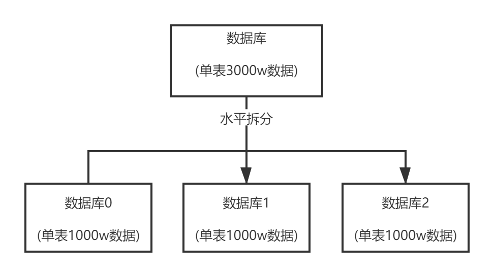
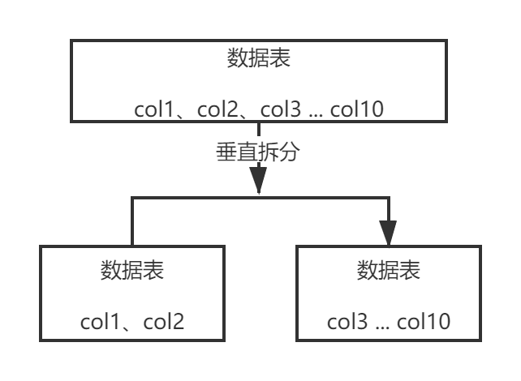

###你们的分布式系统是如何进行链路追踪的？说说链路追踪系统架构原理？
一个接口可能由几个微服务来提供服务，可以追踪接口的调用链路，对链路性能监测，可以用于排查链路故障
* 链路追踪开源中间件:Google的Dapper、阿里的鹰眼、大众点评的CAT、Twitter的Zipkin、Line的pinpoint、国产的skywalking。国内一般用CAT和zipkin比较多
* 核心架构原理:做一个框架，每次服务调用都要经过这个框架，框架来采集调用链路的数据保存起来，然后用可视化界面展示出每个调用链路、性能、故障

###对分布式系统进行核心链路追踪时，链路id是怎么管理的？
每个请求入口分配一个traceId，然后每经过一个服务，记录spanId(本链路id),parentId(上一链路id),调用时间。单个微服务记录日志后上传给链路追踪系统客户端框架来进行处理

###聊过两阶段提交了，那么分布式事务三阶段提交的思想能说一下吗？
第一阶段canCommit: 业务系统执行一个简单查询，进行试探，看是否可以提交
第二阶段prepareCommit: 锁定资源
第三阶段doCommit: 正式提交

###唯一id生成机制中的snowflake算法的时钟回拨问题如何解决？
分布式业务系统分布在多台机器上，每个业务系统都有生成唯一id的需求，可以调用某台机器的snowflake算法来生成。
snowflake算法:40多位当前机器上的时间 + 中间几位是代表机器id + 自增长的id  
* 判断是否回拨条件: 当前时间比上次生成id的时间小，此时就是发生了时钟回拨。可能由于当前机器时间比基准时间服务器的时间快，然后当前服务器与基准时间服务器进行时间校准，导致时钟回拨
* 解决办法: 查看当前时钟回拨到哪1毫秒里了，然后接着在那1毫秒的最大id里继续自增

###实施灰度发布时，网关是可以灰度了，但是dubbo服务如何进行灰度呢？
Eureka不支持灰度发布，需要进行二次开发。spring cloud alibaba中nacos支持灰度发布

###除了常见的服务注册中心外，你觉得redis能作为服务注册中心吗？
可以。使用redis里的hash数据结构，约定好服务注册的key都是:service_Order、service_Product,
用scan命令扫描指定前缀开头的所有key，一次性将注册表里的所有服务都扫描出来，当作一个注册表，每个key过期时间设为30秒。
每隔30秒每个服务从redis中拉取最新的完整注册表，然后每个服务每隔5秒上传自己的最新地址当作心跳，当不再上传时，30秒后服务过期，
不再被其他服务发现。基于redis还可以做分布式服务注册中心，用redis cluster做集群

-----
# 分库分表

## 为什么要分库分表？
分库分表的目的是为了解决高并发、数据量大这两个问题。分库与分表是两回事，可以光分库不分表，也可以光分表不分库
* 分表: 如果单表数据几千万，会极大影响sql的执行性能，一般单表数据几百万性能就会差一些了。比如把一个表的数据按用户id来分发到多个表中，这样1个用户的数据就存放在1个表中，所以同一用户数据可以只查一个表。
* 分库: 单库一般最多能撑2000并发就一定要扩容了，而且一个健康的单库并发量最好保持在每秒1000左右，不能过大。所以要抗高并发，需要将单库拆成多个库来抗高并发  

|  |分库分表前|分库分表后|
|:---:|:---:|:---:|
| 并发支撑情况 | 单机MySQL，扛不住高并发 | MySQL从单机到多机，能撑多倍并发 |
| 磁盘使用情况 | MySQL单机磁盘容量几乎占满 | 拆分为多个库后，数据库磁盘占用率大大降低 |
| SQL执行性能 | 单表数据量太大，SQL越跑越慢 | 单表数据量减少，SQL执行效率明显提升 |

## 用过哪些分库分表中间件？不同中间件的优点和缺点？
* Sharding-jdbc，现更名为ShardingSphere，当当开源，属于client层方案，通过在项目中集成jar包的形式使用。支持分库分表、读写分离、分布式id生成、柔性事务(最大努力送达型事务、TCC事务)
，优点是不用部署，运维成本低，不需要代理层对请求二次转发，性能很高；缺点是与系统产生耦合，升级版本时需要各个系统升级版本后重新发布
* MyCAT，属于proxy层方案，支持的功能非常完善，缺点是需要独立部署，运维成本高，优点是升级版本无需系统重新发布

建议中小型公司选用sharding-sphere，client层方案轻便，维护成本低。中大型公司选用MyCAT这种proxy方案，这样可以大量项目直接透明使用  
## 具体是怎么对数据库进行垂直拆分或水平拆分的？
* 水平拆分: 把单库一个表的数据拆分到多个库的多个表中去，每个库的表结构都是一样的，只是每个库的表存放的数据是不同的，所有库的表数据加起来就是全部数据。水平拆分的意义就是将数据均匀放在更多的库里，然后用多个库来扛更高的并发的同时利用多个库的存储容量来进行扩容

* 垂直拆分:把一个有很多字段的表拆成多个表，或者多个库上面。每个库的表都包含部分字段。一般来说，会将访问频率低的字段放到一个表中，然后将访问频率高的字段放到另一个表中。因为数据库是有缓存的，访问频率高的表字段越少，就能缓存更多的行，性能越好

分库分表的两种方式:
>1. 按range分:每个库存储一段连续的数据，一般按时间范围来分。但容易产生热点问题，大量请求都打到最新数据上
>2. 按hash分:好处是可以均匀分散，将每个库的数据量和请求压力平均分配。坏处是扩容比较麻烦，多了一个迁移数据的过程，之前存储的数据需要重新计算hash值重新分配到不同的库和表

### 分布式微服务技术栈:
注册中心，rpc框架，多环境隔离，自动化部署，分布式事务，限流，熔断。降级，配置中心，监控中心，链路监控。日志中心，api网关。安全认证的作用？
通过一个api网关屏蔽微服务，也就是把微服务伪装成单体应用，安全认证放在网关，统一限流

3-5年前，dubbo➕zookeeper基本就是一个最原始微服务技术架构的雏形

Rpc和http有什么区别？
分布式事务的解决方案？

Spring cloud alibaba的解决方案:
注册中心：nacos -eureka
Rpc框架:dubbo-feign ribbon
分布式事务：seata-无
限流熔断降级：sentinel-hystrix
Api网关：无-zuul

Netflix对springcloud组件停止更新
配置中心：携程apollo
大众点评cat：zipkin，slueth
Prometheus用于监控

1. 保护高并发系统的三把利器:限流,缓存和降级

分布式的CAP理论和BASE理论:

2. 分布式任务调度框架: QuartZ  
Scheduler容器包括 JobDetails ,  Trigger 多线程作业执行池
Trigger:触发器。什么时候工作
Job: 做什么工作
Scheduler: 调度器，搭配Trigger和Job

1. Scheduler是一个计划调度器容器(总部),容器里面可以盛放众多的JobDetail和Trigger，当容器启动后，里面的每个
JobDetail都会根据Trigger按部就班自动去执行  
2. JobDetail是一个可执行的工作，他本身可能是有状态的  
3. Trigger代表一个调度参数的配置，什么时候去调  
4. 当JobDetail和Trigger在Scheduler容器上注册后，形成了装配好的作业(JobDetail和Trigger所组成的一对)，就可以伴随容器启动而调度执行了  
5. Scheduler是个容器，容器中有一个线程池，用来并行调度执行每个作业，这样可以提高容器效率。  