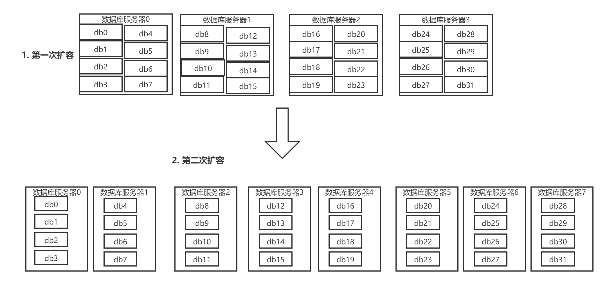

### 你们的分布式系统是如何进行链路追踪的？说说链路追踪系统架构原理？
一个接口可能由几个微服务来提供服务，可以追踪接口的调用链路，对链路性能监测，可以用于排查链路故障

* 链路追踪开源中间件:Google的Dapper、阿里的鹰眼、大众点评的CAT、Twitter的Zipkin、Line的pinpoint、国产的skywalking。国内一般用CAT和zipkin比较多
* 核心架构原理:做一个框架，每次服务调用都要经过这个框架，框架来采集调用链路的数据保存起来，然后用可视化界面展示出每个调用链路、性能、故障

### 对分布式系统进行核心链路追踪时，链路id是怎么管理的？
每个请求入口分配一个traceId，然后每经过一个服务，记录spanId(本链路id),parentId(上一链路id),调用时间。单个微服务记录日志后上传给链路追踪系统客户端框架来进行处理

### 聊过两阶段提交了，那么分布式事务三阶段提交的思想能说一下吗？
第一阶段canCommit: 业务系统执行一个简单查询，进行试探，看是否可以提交
第二阶段prepareCommit: 锁定资源
第三阶段doCommit: 正式提交

### 唯一id生成机制中的snowflake算法的时钟回拨问题如何解决？
分布式业务系统分布在多台机器上，每个业务系统都有生成唯一id的需求，可以调用某台机器的snowflake算法来生成。
snowflake算法:40多位当前机器上的时间 + 中间几位是代表机器id + 自增长的id  

* 判断是否回拨条件: 当前时间比上次生成id的时间小，此时就是发生了时钟回拨。可能由于当前机器时间比基准时间服务器的时间快，然后当前服务器与基准时间服务器进行时间校准，导致时钟回拨
* 解决办法: 查看当前时钟回拨到哪1毫秒里了，然后接着在那1毫秒的最大id里继续自增

### 实施灰度发布时，网关是可以灰度了，但是dubbo服务如何进行灰度呢？
Eureka不支持灰度发布，需要进行二次开发。spring cloud alibaba中nacos支持灰度发布

### 除了常见的服务注册中心外，你觉得redis能作为服务注册中心吗？
可以。使用redis里的hash数据结构，约定好服务注册的key都是:service_Order、service_Product,
用scan命令扫描指定前缀开头的所有key，一次性将注册表里的所有服务都扫描出来，当作一个注册表，每个key过期时间设为30秒。
每隔30秒每个服务从redis中拉取最新的完整注册表，然后每个服务每隔5秒上传自己的最新地址当作心跳，当不再上传时，30秒后服务过期，
不再被其他服务发现。基于redis还可以做分布式服务注册中心，用redis cluster做集群

-----
# 分库分表

## 为什么要分库分表？
分库分表的目的是为了解决高并发、数据量大这两个问题。分库与分表是两回事，可以光分库不分表，也可以光分表不分库
* 分表: 如果单表数据几千万，会极大影响sql的执行性能，一般单表数据几百万性能就会差一些了。比如把一个表的数据按用户id来分发到多个表中，这样1个用户的数据就存放在1个表中，所以同一用户数据可以只查一个表。
* 分库: 单库一般最多能撑2000并发就一定要扩容了，而且一个健康的单库并发量最好保持在每秒1000左右，不能过大。所以要抗高并发，需要将单库拆成多个库来抗高并发  

|  |分库分表前|分库分表后|
|:---:|:---:|:---:|
| 并发支撑情况 | 单机MySQL，扛不住高并发 | MySQL从单机到多机，能撑多倍并发 |
| 磁盘使用情况 | MySQL单机磁盘容量几乎占满 | 拆分为多个库后，数据库磁盘占用率大大降低 |
| SQL执行性能 | 单表数据量太大，SQL越跑越慢 | 单表数据量减少，SQL执行效率明显提升 |

## 用过哪些分库分表中间件？不同中间件的优点和缺点？
* Sharding-jdbc，现更名为ShardingSphere，当当开源，属于client层方案，通过在项目中集成jar包的形式使用。支持分库分表、读写分离、分布式id生成、柔性事务(最大努力送达型事务、TCC事务)
，优点是不用部署，运维成本低，不需要代理层对请求二次转发，性能很高；缺点是与系统产生耦合，升级版本时需要各个系统升级版本后重新发布
* MyCAT，属于proxy层方案，支持的功能非常完善，缺点是需要独立部署，运维成本高，优点是升级版本无需系统重新发布

建议中小型公司选用sharding-sphere，client层方案轻便，维护成本低。中大型公司选用MyCAT这种proxy方案，这样可以大量项目直接透明使用  
## 具体是怎么对数据库进行垂直拆分或水平拆分的？
* 水平拆分: 把单库一个表的数据拆分到多个库的多个表中去，每个库的表结构都是一样的，只是每个库的表存放的数据是不同的，所有库的表数据加起来就是全部数据。水平拆分的意义就是将数据均匀放在更多的库里，然后用多个库来扛更高的并发的同时利用多个库的存储容量来进行扩容

* 垂直拆分:把一个有很多字段的表拆成多个表，或者多个库上面。每个库的表都包含部分字段。一般来说，会将访问频率低的字段放到一个表中，然后将访问频率高的字段放到另一个表中。因为数据库是有缓存的，访问频率高的表字段越少，就能缓存更多的行，性能越好

分库分表的两种方式:
>1. 按range分:每个库存储一段连续的数据，一般按时间范围来分。但容易产生热点问题，大量请求都打到最新数据上
>2. 按hash分:好处是可以均匀分散，将每个库的数据量和请求压力平均分配。坏处是扩容比较麻烦，多了一个迁移数据的过程，之前存储的数据需要重新计算hash值重新分配到不同的库和表

## 如何把单库单表系统迁移到分库分表系统？
考点分析:主要考察是否全流程经历过这个迁移过程
* 停机迁移方案:
网站挂出公告，0到6点维护。然后0点将系统停掉，使用提前写好的临时程序将单库单表中的数据读取出来然后通过中间件写入到分库分表中去，然后修改系统数据库连接配置，上线即可。
* 双写迁移方案(不停机):
.png)
>1. 首先在线上系统代码所有写数据库的地方(增删改)
，除了对老库增删改，都加上对新库的增删改，这就是双写，同时写老库和新库。系统部署后，新库数据和老库数据差很多，用临时程序跑起来读取老库数据然后写入新库，写的时候需要根据gmt_modified这类字段来判断数据最后修改时间，新库中没有的数据可以直接写入，新库中有的，只有读取的数据比新库的数据新才能写，也就是不允许用老数据覆盖新数据。
>2. 迁移后有可能数据会不一致，再使用程序自动做校验，对比新老库每张表的每条数据，如果有不一样的，再从老库读取数据写入新库，当两个库数据完全一致时，再基于只使用分库分表的代码重新部署即可

## 如何设计动态扩容缩容的分库分表方案？
从单库单表迁移到分库分表后，如果后续数据库写并发又撑不住了，需要继续扩容，就需要提前设计分库分表后的扩容缩容方案了。
* 停机扩容(推荐):已经做了分库分表了，说明数据量很大，多达几亿条，迁移时间成本太大
* 优化后的方案:
  
谈分库分表的扩容，第一次扩容就一次性分够，用32个库，每个库32张表，总共1024张表，对于大部分的中小型互联网公司来说已经足够支撑好几年了。

从写并发量和存储数据量两方面来验证可行性。
>1. 写并发量:每个库能正常承载的写并发量是1000,32个库能承载32 * 1000 = 32000的写并发；如果每个库承载1500的写并发，32 * 1500 = 
48000的写并发，接近5w的写并发，如果后续写并发扛不住了，可以前面再加个mq来削峰，每秒写入mq8万条数据，数据库每秒可以承载5万条数据的写入。除非是国内top级别公司的最核心系统才会出现几百台数据库服务器的规模，128个库、256个库、512个库。
>2. 存储数据量:1024张表，每个表放500万数据，在MySQL中可以存放50亿条数据。
每秒5万的写并发 + 总计存储50亿条数据，对于国内大部分互联网公司已经足够了。

方法:
写入时，根据某个id先对32取模定位到库，然后再次对32取模定位到库中的表。刚开始扩容时，32个库可以为逻辑库，比如用4台mysql服务器，每个mysql放8个库。当扩容时，呈倍数扩容，4台 -> 8台,8 台-> 
16台，由dba将使用迁移工具将整库迁移，代码中只需要在配置中调整迁移后数据库所在数据库服务器的地址后重新上线即可，按倍数缩容同理。

## 分库分表后id主键如何处理？
考点分析:这个问题属于分库分表后必然面对的问题
* 基于数据库的实现方案:数据库自增id
每次系统需要一个id时，往数据库里特定的一张表中插入一条数据得到一个id，然后拿着这个id去分库分表中写入。
缺点：单库生成自增id，高并发下有瓶颈。适用于低并发，数据量大的场景
也可以通过使用数据库sequence功能或者表自增步长。例如在数据库创建8个sequence来产生id，每个sequence的起始id不同，并且依次递增，步长都是8.缺点是无法扩展
* uuid:uuid做主键，长度太长，占用空间大，而且无序，会导致b+树索引写入时会产生过多的随机写(如果是连续的id可以产生部分顺序写)，而且由于写入时无法产生顺序的append操作，而是需要insert操作(将整个b+树节点读取到内存，插入记录后将整个节点写回磁盘)，当记录很多时，性能下降明显
* snowflake算法:twitter开源的分布式id生成算法，scala语言实现。
一个64位的long型id中，1个bit是不用的，41bit作为毫秒数，10bit作为工作机器id，12bit作为序号。
>1. 1 bit:因为二进制里第一个bit是1表示负数，而我们生成的id都是正数，所以第一个bit统一是0
>2. 41 bit:表示的是毫秒时间戳，41个bit可以表示的数据多达2^41-1，也就是2^41-1个毫秒值，换算成年可以表示69年的时间
>3. 10 bit:5个bit表示机房id，5个bit表示机器id，意思就是最多表示2^5个机房(32个机房)，每个机房可以表示2^5个机器(32台机器)
>4. 12 bit:用来区分同一个毫秒内产生的不同id，有序。12bit可以表示的最大正整数为 2^12 -1 =4096,也就是说同一毫秒内最多可以产生4096个不同id

```
public class IdWorker {

    private long workerId;
    private long datacenterId;
    private long sequence;

    public IdWorker(long workerId, long datacenterId, long sequence) {
        // sanity check for workerId
        // 这儿不就检查了一下，要求就是你传递进来的机房id和机器id不能超过32，不能小于0
        if (workerId > maxWorkerId || workerId < 0) {
            throw new IllegalArgumentException(
                    String.format("worker Id can't be greater than %d or less than 0", maxWorkerId));
        }
        if (datacenterId > maxDatacenterId || datacenterId < 0) {
            throw new IllegalArgumentException(
                    String.format("datacenter Id can't be greater than %d or less than 0", maxDatacenterId));
        }
        System.out.printf(
                "worker starting. timestamp left shift %d, datacenter id bits %d, worker id bits %d, sequence bits %d, workerid %d",
                timestampLeftShift, datacenterIdBits, workerIdBits, sequenceBits, workerId);

        this.workerId = workerId;
        this.datacenterId = datacenterId;
        this.sequence = sequence;
    }

    private long twepoch = 1288834974657L;

    private long workerIdBits = 5L;
    private long datacenterIdBits = 5L;

    // 这个是二进制运算，就是 5 bit最多只能有31个数字，也就是说机器id最多只能是32以内
    private long maxWorkerId = -1L ^ (-1L << workerIdBits);

    // 这个是一个意思，就是 5 bit最多只能有31个数字，机房id最多只能是32以内
    private long maxDatacenterId = -1L ^ (-1L << datacenterIdBits);
    private long sequenceBits = 12L;

    private long workerIdShift = sequenceBits;
    private long datacenterIdShift = sequenceBits + workerIdBits;
    private long timestampLeftShift = sequenceBits + workerIdBits + datacenterIdBits;
    private long sequenceMask = -1L ^ (-1L << sequenceBits);

    private long lastTimestamp = -1L;

    public long getWorkerId() {
        return workerId;
    }

    public long getDatacenterId() {
        return datacenterId;
    }

    public long getTimestamp() {
        return System.currentTimeMillis();
    }

    public synchronized long nextId() {
        // 这儿就是获取当前时间戳，单位是毫秒
        long timestamp = timeGen();

        if (timestamp < lastTimestamp) {
            System.err.printf("clock is moving backwards.  Rejecting requests until %d.", lastTimestamp);
            throw new RuntimeException(String.format(
                    "Clock moved backwards.  Refusing to generate id for %d milliseconds", lastTimestamp - timestamp));
        }

        if (lastTimestamp == timestamp) {
            // 这个意思是说一个毫秒内最多只能有4096个数字
            // 无论你传递多少进来，这个位运算保证始终就是在4096这个范围内，避免你自己传递个sequence超过了4096这个范围
            sequence = (sequence + 1) & sequenceMask;
            if (sequence == 0) {
                timestamp = tilNextMillis(lastTimestamp);
            }
        } else {
            sequence = 0;
        }

        // 这儿记录一下最近一次生成id的时间戳，单位是毫秒
        lastTimestamp = timestamp;

        // 这儿就是将时间戳左移，放到 41 bit那儿；
        // 将机房 id左移放到 5 bit那儿；
        // 将机器id左移放到5 bit那儿；将序号放最后12 bit；
        // 最后拼接起来成一个 64 bit的二进制数字，转换成 10 进制就是个 long 型
        return ((timestamp - twepoch) << timestampLeftShift) | (datacenterId << datacenterIdShift)
                | (workerId << workerIdShift) | sequence;
    }

    private long tilNextMillis(long lastTimestamp) {
        long timestamp = timeGen();
        while (timestamp <= lastTimestamp) {
            timestamp = timeGen();
        }
        return timestamp;
    }

    private long timeGen() {
        return System.currentTimeMillis();
    }

    // ---------------测试---------------
    public static void main(String[] args) {
        IdWorker worker = new IdWorker(1, 1, 1);
        for (int i = 0; i < 30; i++) {
            System.out.println(worker.nextId());
        }
    }

}
```

## 你们有没有做MySQL读写分离？如何实现MySQL的读写分离？MySQL主从复制的原理是啥？如何解决MySQL主从复制的延时问题？
考点分析:高并发这个阶段是肯定要做读写分离的，目前大部分的互联网公司都是读多写少，一个主库挂多个从库来支撑读高并发
* 如何实现MySQL的读写分离:
就是基于主从架构，用一个主库挂载多个从库，主库会自动将数据同步到从库上。写入操作走主库，读取操作走从库
* MySQL主从复制的原理:
主库写数据时会将变更写入binlog日志，从库连接主库后，从库会启动一个io线程将主库的binlog拷贝到本地，写入一个relay中继日志中。然后从库中的SQL线程会从中继日志中读取binlog，执行binlog中的内容进行重放来保证和主库数据的一致性。

由于从库需要从主库拷贝binlog，而从库的sql线程是单线程的，所以从库同步主库数据的过程是串行化的(在主库上并行的操作，在从库上会串行执行)，所以在高并发场景下，从库的数据会比主库慢，会产生延迟，也就是说，高并发下经常会出现刚写入主库的数据从库中可能是读不到的，要过几十毫秒、甚至上百毫秒才能读取到。而且如果主库这时突然宕机，然后恰好数据还没有同步到从库，然后运维将从库切换为主库，就会产生数据丢失。

MySQL内部有两个机制来解决这个问题:一个是半同步复制，一个是并行复制
半同步复制:也叫semi-sync复制，就是说主库写入binlog日志后，会强制将数据同步到从库，从库将日志写入自己本地relay中继日志后，接着返回ack给主库，只有主库接收到至少一个从库的ack后才会认为本次写操作成功
并行复制:指的是从库开启多个线程，并行读取relay中继日志中不同库的日志，然后并行重放不同数据库的日志，属于库级别的并行。(也就是说如果不开启并行复制，默认sql线程是单线程的，用这个单线程来串行重放不同库的日志)

* MySQL主从同步延时问题(精华):
线上事故场景:代码逻辑是这样的，先插入一条数据，然后在查询出来，然后再更新这条数据。再生产环境高峰期，写并发量达到2000/s
，这时主从同步延迟大概会达到几十毫秒。问题现象是每天总有一些数据，在高峰期得不到更新，用户跟客服反馈，客服反馈给技术。  
解决方案:
使用MySQL命令；show status 查看Seconds_Behind_Master参数，可以看到从库数据落后主库的ms数。

如果主从延迟比较严重,有以下解决方案:
>1. 分库，将一个主库拆分为多个主库，每个主库的并发量就减少了几倍，此时的主从延迟就可以忽略不计了
>2. 打开MySQL的并行复制，让多个库可以并行复制。但是如果某个库的写并发很高，单库写并发达到了2000/s，并行复制对提高主从复制的延迟还是没效果的
>3. 重写代码，写代码要考虑到读写分离后读和写走不同的库，并且主从复制可能产生延迟
>4. 如果确实存在先插入然后再查询后再进行其他操作的情况，可以对这个查询设置直连主库。不推荐，这样会丧失读写分离的意义


### 分布式微服务技术栈:
注册中心，rpc框架，多环境隔离，自动化部署，分布式事务，限流，熔断。降级，配置中心，监控中心，链路监控。日志中心，api网关。安全认证的作用？
通过一个api网关屏蔽微服务，也就是把微服务伪装成单体应用，安全认证放在网关，统一限流

3-5年前，dubbo➕zookeeper基本就是一个最原始微服务技术架构的雏形

Rpc和http有什么区别？
分布式事务的解决方案？

Spring cloud alibaba的解决方案:
注册中心：nacos -eureka
Rpc框架:dubbo-feign ribbon
分布式事务：seata-无
限流熔断降级：sentinel-hystrix
Api网关：无-zuul

Netflix对springcloud组件停止更新
配置中心：携程apollo
大众点评cat：zipkin，slueth
Prometheus用于监控

1. 保护高并发系统的三把利器:限流,缓存和降级

分布式的CAP理论和BASE理论:


2. 分布式任务调度框架: QuartZ  
Scheduler容器包括 JobDetails ,  Trigger 多线程作业执行池
Trigger:触发器。什么时候工作
Job: 做什么工作
Scheduler: 调度器，搭配Trigger和Job

1. Scheduler是一个计划调度器容器(总部),容器里面可以盛放众多的JobDetail和Trigger，当容器启动后，里面的每个
JobDetail都会根据Trigger按部就班自动去执行  
2. JobDetail是一个可执行的工作，他本身可能是有状态的  
3. Trigger代表一个调度参数的配置，什么时候去调  
4. 当JobDetail和Trigger在Scheduler容器上注册后，形成了装配好的作业(JobDetail和Trigger所组成的一对)，就可以伴随容器启动而调度执行了  
5. Scheduler是个容器，容器中有一个线程池，用来并行调度执行每个作业，这样可以提高容器效率。  