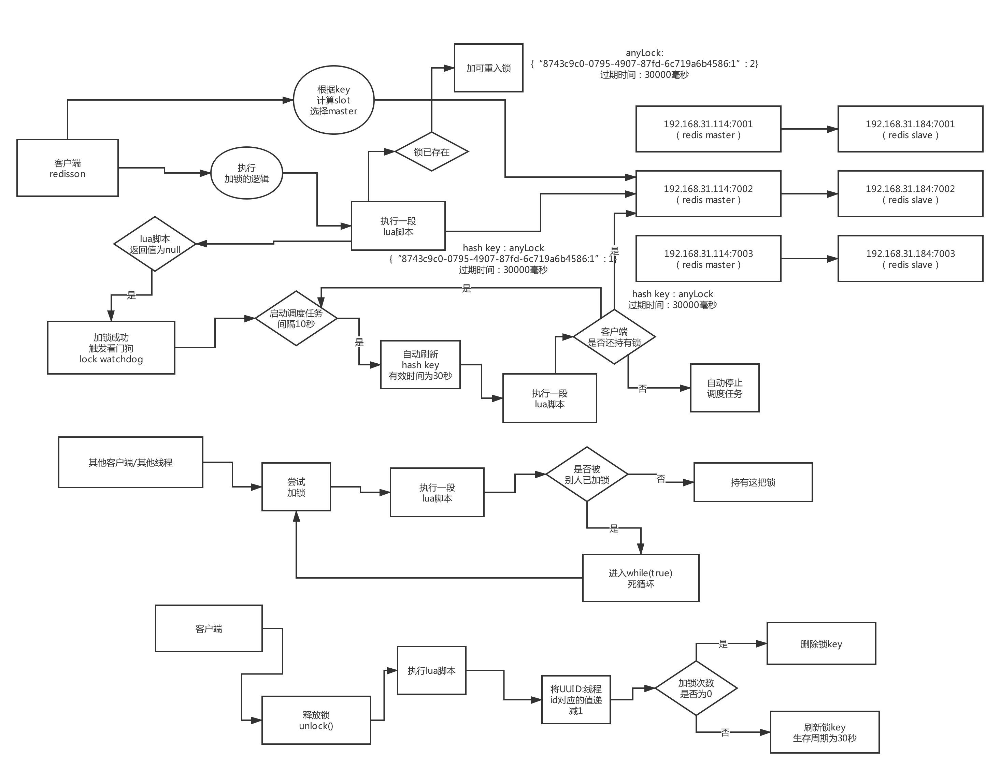
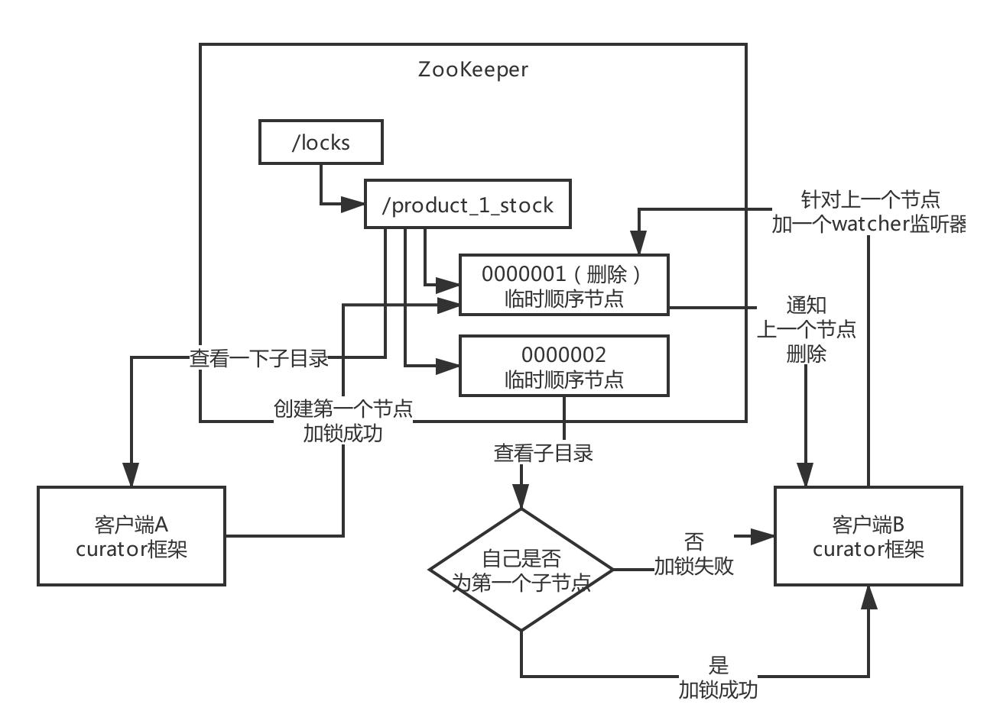

## 一般实现分布式锁有两种方式？使用redis如何设计分布式锁？使用zk如何来设计分布式锁？这两种分布式锁的实现方式哪种效率较高？

### Redis实现的分布式锁：
官方叫做 redLock 算法，是redis官方支持的分布式锁算法。
这个分布式锁有3个重要的考量点，互斥(只能有一个客户端获取锁)，不能死锁，容错(大部分redis节点获得这个锁就可以释放)
第一种最普通的实现方式，就是在redis里创建一个key算作加锁。
set my:lock 随机值 NX PX 30000，这个命令就ok，这里NX的意思就是只有key不存在的时候才会设置成功， PX 30000的意思就是30秒后锁自动释放。别恩创建时发现key已经存在就不能加锁了。

释放锁就是删除key，一般使用lua脚本删除，判断value一样才可以删除:
```
if redis.call("get",KEYS[1]) == ARGV[1] then
    return redis.call("del",KEYS[1])
else 
	return0
end
```
为什么要用随机值呢？因为如果某个客户端获取到了锁，但是阻塞了很长时间才执行完，此时可能已经自动释放锁了，此时可能别的客户端已经获取到了这个锁，要是这个时候直接删除key的话是会有问题的，所以得用随机值加上面的lua脚本来释放锁。

但是这样是肯定不行的，因为如果是普通的redis单实例，那就是单点故障，或者是redis普通主从，那redis是异步复制，如果主节点挂了，key还没同步到从节点，此时从结点切换为主节点，其他人就会拿到锁。

所以引出redlock算法。这个场景假设有一个redis cluster，有5个redis master实例，然后执行如下步骤获取一把锁:
(1)获取当前时间戳，单位是毫秒
(2)跟上面类似，轮流尝试在每个master节点上创建锁，过期时间较短，一般就几十毫秒
(3)尝试在大多数节点上建立一个锁，比如5个节点就要求是3个节点(n/2 + 1)
(4)客户端计算建立好锁的时间，如果建立锁的时间小于超时时间，就算建立成功了
(5)要是锁建立失败，那么就依次删除这个锁
(6)只要别人建立了一把分布式锁，你就得不断轮询去尝试获取锁

### zk分布式锁
zk分布式锁，其实可以做的比较简单，就是某个节点尝试创建临时znode，此时创建成功了就获取了这个锁，这个时候别的客户端来创建锁会失败，只能注册个监听器监听这个锁。释放锁就是删除这个znode，一旦释放锁就会通知客户端，然后有一个等待着的客户端就可以再次重新加锁

### redis分布式锁和zk分布式锁的对比
redis分布式锁，其实需要自己不断去尝试获取锁，比较消耗性能
zk分布式锁，获取不到锁，注册个监听器即可，不需要不断主动尝试获取锁，性能开销较小

另外一点就是，如果是redis获取锁的那个客户端bug了，或者挂了，那么只能等待超时时间之后才能释放锁；而zk，因为创建的是临时node，只要客户端挂了，znode就没了，此时就自动释放锁

### 你们生产系统中有哪个业务场景是需要用分布式锁的？为什么要使用？
支付之前需要创建一个订单，而在创建订单时，订单里会指定对哪些商品要购买多少件，此时需要先校验库存，然后确保库存充足后锁定库存，
这个过程必须使用分布式锁，锁住这个商品的库存，对同一个商品的购买同一时间只能有一个人操作。

### 你们是用哪个开源框架实现的redis分布式锁？能说说其核心原理吗？
redis的分布式锁，很少自己手写，一般直接用Redisson框架，这个框架基于redis实现了一系列开箱即用的高级功能如分布式锁
核心原理:对苹果这个商品id为1的商品加锁，redisson.lock("product_1_stock"),分布式锁key的业务语义为针对productId为1的商品库存进行加锁,product_1_stock:{"XXX":1},
过期时间30秒。加锁成功后，redission框架后台会启动一个watchDog来每隔10s去检查一下这个锁是否还被当前客户端持有，如果是的话，重新刷新一下key的过期时间为30s
，当其他客户端尝试加锁时，会发现"product_1_stock"这个key已存在，说明已经被其他客户端加锁了，此时会进入一个无限循环阻塞状态来等待加锁。当第一个客户端加锁成功时此时会有两种情况，第一种情况是
这个客户端操作完毕后主动释放锁；第二种情况时如果这个客户端在持有锁期间宕机了，那么这个客户端的reddison框架之前启动的后台watchDog
线程就没有了， 此时最多30s，key就会过期然后自动释放了宕机客户端之前持有的锁


### 如果redis是集群部署的，那么集群故障时分布式锁还有效吗？
* 瞬时故障:当第一个客户端加锁成功后，redis的master数据还未同步给slave，此时redis故障转移，slave被选举为master，这时第二个客户端就可以加锁成功
彻底解决这个问题，很难，除非修改一些redis和redisson框架的源码，做源码级的二次开发，当加锁时必须是master和slave同时写成功才算是加锁成功

### 作业:自己梳理出来redis分布式锁的生产问题解决方案
自己哪个业务可以用分布式锁？用什么框架？有什么生产问题？

### 如果要实现zookeeper分布式锁，一般用哪个开源框架？核心原理是什么？
一般很少自己手写，主要使用curator框架，基于zk实现了一整套高级功能


### 对于zookeeper的羊群效应，分布式锁应该如何优化？
* 使用普通临时节点带来的羊群效应:直接对指定key创建临时节点，多个客户端同时争抢创建此临时节点，当客户端A加锁成功后，
其他客户端会对key节点注册一个watcher，当客户端A释放锁时，zookeeper会同时通知其他所有客户端来尝试创建锁，造成很多没必要的请求和网络开销，
加重网络负载。
* 解决方案(使用临时有序节点):也就是Curator框架所采用的那种方式，使用临时有序节点。客户端A加锁成功后，其他客户端按节点序号注册watcher，
每个watcher监听前一个节点的状态，当客户端A释放锁后，只会通知后面一个客户端。

### 如果遇到zookeeper脑裂问题，分布式锁应该如何保证健壮性？
* 脑裂问题:分布式系统，主控节点有一个master，此时由于网络故障导致其他人认为此master不可用然后重新选举出了一个master，造成集群里同时有2个master
在运行。脑裂问题会导致重复加锁 -> 当客户端A加锁成功后，选举出了新master，客户端B在新的master上加锁成功，发生了重复加锁
* 解决方案:解决脑裂问题算是一个业界难题，分布式锁并不是百分百健壮的。如果实在要做，修改curator框架源码增加一些协调机制

### 作业:自己梳理出来zookeeper分布式锁的生产问题解决方案 & redis和zookeeper哪种分布式锁更好？
从分布式系统协调语义而言，用zookeeper做分布式锁更好一些，因为zookeeper就是用于分布式协调服务的，而redis本身其实是分布式缓存，但是redis能扛高并发，高并发场景
用redis好些。而zookeeper本身不适合部署大规模集群，本身适用的场景就是部署三五台机器，不是承载高并发请求的，仅仅是用于分布式协调服务的。
* 选redis还是选zookeeper？ 如果公司有redis集群，没有zookeeper集群，当然选择redis；如果公司两个都有，用哪种分布式锁都可以，如果有高并发场景就选redis

### 在搭建好的电商系统中，落地开发分布式锁保证库存数据准确的方案？
《亿级流量电商详情页系统实战》有文档，部署redis和zookeeper，redisson做分布式锁，curator做分布式锁

### 你们的分布式锁做过高并发优化吗？能扛下每秒上万并发吗？
核心思想:分段加锁 + 合并扣减
比如苹果库存有10000个，此时在数据库一个表里分成10个库存字段，stock_01,stock_02，每个库存字段放1000个库存，然后每个字段对应一个库存的分布式锁。
请求过来时，从10个key随机选择一个key去加锁，假如每秒10000请求，此时会对10个库存分段key加锁，每个key扛1000请求。而假如下订单数量为20，
而某个库存分段只剩10个库存，就用合并扣减库存的方式，先对product_1_stock_5加锁，库存为10个，不够买20个，可以继续尝试去锁product_1_stock_1，
再查询库存为30个，此时持有两把锁，这时就可以对product_1_stock_5锁定10个库存，对product_1_stock1锁定10个库存，总计扣减20个库存

### 淘宝和京东的库存是怎么实现的？能不能不用分布式锁实现高并发库存更新？
大公司一般有分布式kv存储集群，tair、redis、mongodb，每秒几十万并发没问题
实时库存数据放在kv存储里，当操作库存时，直接扣减，如果发现扣减之后是负数，此时就认为库存超卖，回滚刚才的扣减
，然后提示用户库存不足。对kv库存的每次修改都要写如mq，通过异步的方式将库存同步给数据库。相当于异步双写


