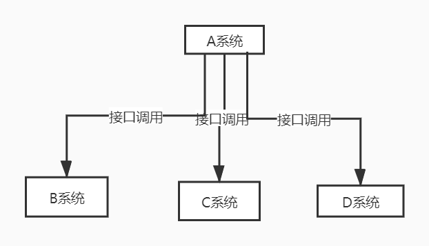
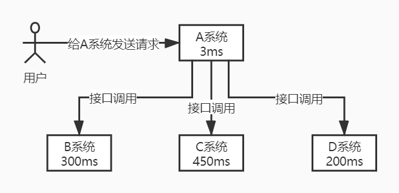
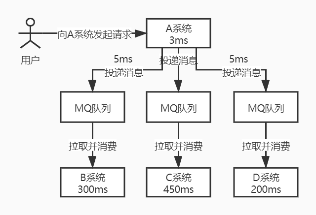
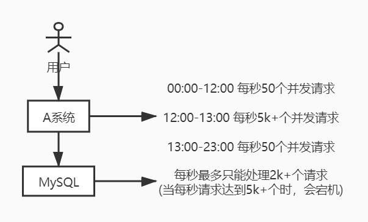
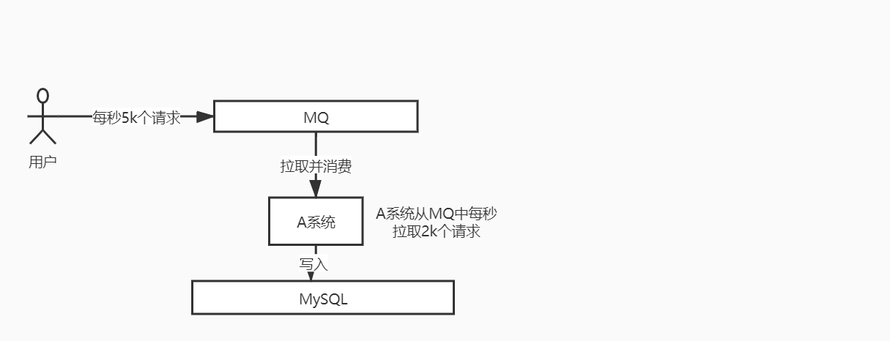
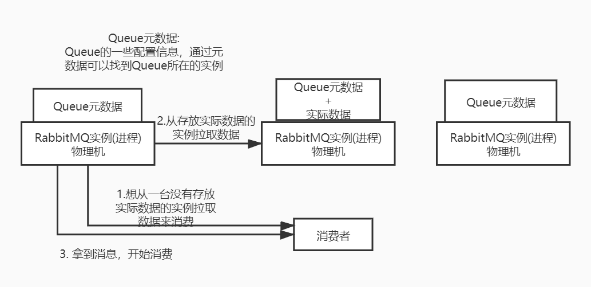
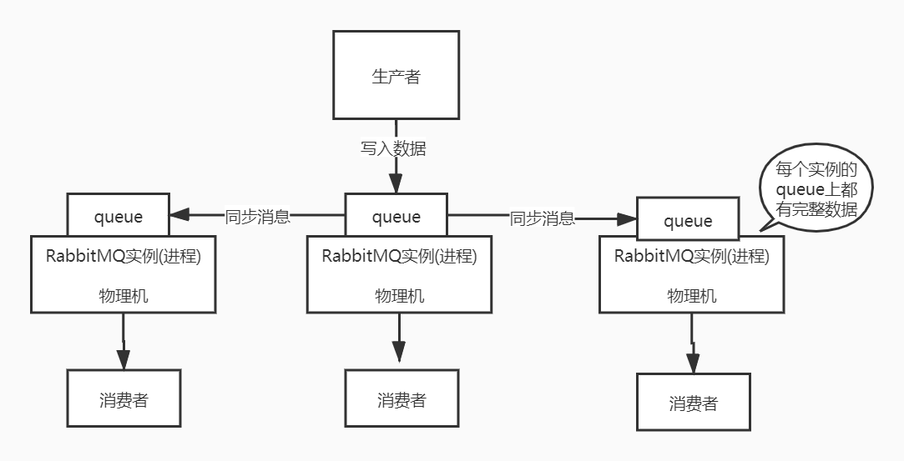
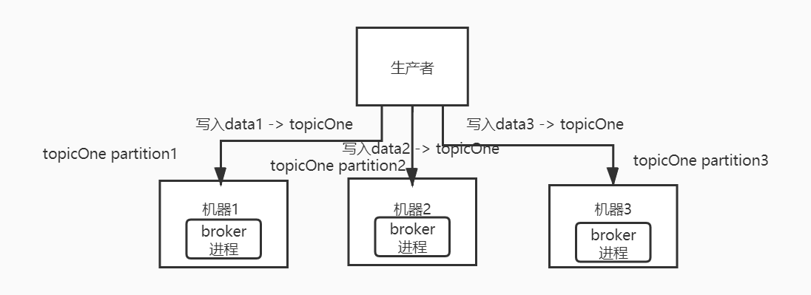
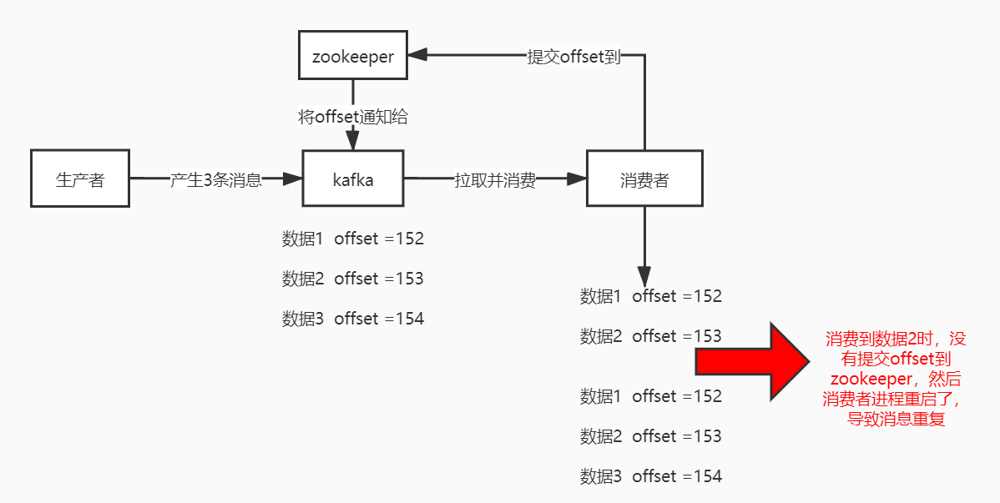

## 消息模型:
* 点对点: 生产者向消息队列中发送一个消息后，只能被一个消费者消费一次
* 发布/订阅: 生产者向频道发送一个消息后，所有订阅了该频道的消费者都可以收到这条消息并消费

### 发布订阅模式和观察者模式有哪些不同？
>1. 观察者模式中,观察者和主题都知道对方的存在;而发布订阅模式中，生产者和消费者互相不知道对方的存在，它们之间通过频道进行通信
>2. 观察者模式是同步的，当事件触发时，主题会调用观察者的方法，然后等待方法返回;而发布订阅模式是异步的，生产者向频道发送一个消息后，不需要关心消费者何时消费这条消息，可以立即返回

## 使用场景:
* 解耦:如果模块之间直接调用，这样耦合度很高，那么修改一个模块或者新增一个模块时对其他模块的影响会很大，没有扩展性。通过使用消息队列，一个模块只需要向消息队列中发送消息，其他模块可以选择性地从消息队列中消费消息从而完成调用
* 异步:同步场景是发送者发送请求后等待消费者处理完成后才能返回，而异步场景中发送者将消息投递到 MQ 中，不需要等待处理完成立即可以返回，然后消费者从 MQ 
中获取并消费消息，以此提高响应速度。只有业务流程允许异步处理的情况下才可以这么做，假如要求实时响应的场景就不能做异步处理(注册流程中如果要求用户对验证邮件进行点击后才能完成注册，就不能使用 MQ )
* 削峰:高并发场景下，短时间内到来的大量请求会压垮服务器。可以将请求发送到 MQ中，服务器按照处理能力从MQ中消费消息

### 为什么使用消息队列?消息队列都有哪些使用场景？你项目里具体是什么场景？
* 考点分析:没有对自己的架构问过为什么的人一定是平时没有独立思考的人，要学会独立思考，而不是拿别人的架构就去用

常见的消息队列使用场景有很多，比较核心的有3个场景:解耦、异步、削峰
* 解耦: 耦合场景:A系统和BCD系统通过接口调用的方式通信，假如E系统也需要A系统发送的数据，同时C系统不再需要A系统
发送的数据，这时候只能A系统修改代码，因为A系统和BCDE系统产生了严重耦合。并且A系统需要考虑BCDE系统不可用如何处理
，是重发还是存储消息？这就是耦合带来的问题。

使用MQ后解耦处理:引入MQ后，A系统只需要将消息投递到MQ里，不需要考虑BCD系统是否可用，超时等问题，
当引入E系统需要A系统发送的数据时，E系统只需要订阅A系统的消息即可。也就是说，
通过引入MQ的发布订阅模型将A系统和BCD系统彻底解耦

项目场景: ？？？？？？

* 异步: 同步场景:用户向A系统发送一个请求，A系统通过接口调用同步调用BCD系统，A系统写数据库耗时3ms,
BCD系统写数据库总耗时为300+450+200=950ms，一般互联网企业对于用户直接的操作要求每个请求必须在200ms以内完成，
对用户几乎无感知，而同步调用操作耗时接近1s，几乎不可接受

异步改造后: 引入MQ后，用户向A系统发起请求，A系统向MQ投递3条消息耗时5ms，总时长是3+5=8ms后返回给用户，
体验极好。投递消息后由BCD系统从相应的MQ队列中拉取消息并消费，此过程用户无感知。

项目场景: ？？？？？？

* 削峰: 高峰低谷场景:00:00-12:00时间段内，A系统每秒并发请求量只有50个，到了12:00-13:00时间段内，
每秒并发请求量暴增到5k+条。该系统直接基于MySQL，大量请求打入MySQL，每秒钟需要MySQL执行5k+条SQL，
而mysql每秒可以处理2k个请求，如果每秒请求5k+的话，会直接导致mysql宕机，进而导致系统崩溃。当高峰期一过，
下午是请求低谷，每秒并发请求量又回到50个请求。

引入MQ削峰后场景:引入MQ后，每秒5k个请求写入MQ。因为MySQL每秒最多处理2k个请求，所以A系统每秒钟最多处理2k个请求，
A系统从MQ中慢慢拉取消息并消费，只要不超过自己每秒最大请求数量就可以，这样哪怕是在高峰期，A系统也不会挂掉。
而中午高峰期可能会积压几十万甚至上百万的消息在MQ中，但是这个短暂的高峰积压是没关系的，因为到低谷期时，
每秒并发请求数只有50个，而A系统依然会以每秒2k条消息的速度在处理，消费速度大于生产速度，
所以A系统在低谷期会快速将积压的消息消费掉。

项目场景: ？？？？？？

### 消息队列有什么优点和缺点？
* 考点分析:引入中间件是一定有好处有坏处的，需要明确引入中间件带来的弊端和风险
优点: 在解耦、异步、削峰等特殊场景下有对应的好处
缺点: 
>1. 系统可用性降低: 系统引入的外部依赖越多，越容易挂掉。因为加入mq后，如果mq挂掉会导致整套系统崩溃，所以需要保证消息队列的高可用，从而来保证整套系统的高可用
>2. 系统复杂性提高:  引入MQ后，需要考虑消息重复、消息丢失、消息顺序性等针对引入mq后带来的问题的解决方案
>3. 一致性问题: A系统写入MQ后直接返回，整个交易需要ABCD全部处理成功才可以，问题是如果BCD三个系统中，BD两个系统写库成功，C系统写库失败，也就是说中间某一环节失败了，如何保证数据的整体一致性。

总结: 消息队列是一种非常复杂的架构，引入它享受它的好处，但是也需要针对它带来的坏处做各种额外的技术方案来应对。可能做好处理后系统复杂度提升了一个数量级，但是关键时刻该用还是得用。

### kafka、ActiveMQ、RabbitMQ、RocketMQ都有什么区别，以及适合哪些场景？
* 考点分析:引入中间件之前一定要做技术选型，要对业界流行的MQ做调研，看用在哪个场景可以扬长避短，用其优势，避其劣势，避免留坑

| 特性 | ActiveMQ | RabbitMQ | RocketMQ | Kafka |
|---|---|---|---|---|
| 单机吞吐量 | 万级，比 RocketMQ、Kafka 低一个数量级 | 万级 | 10 万级，能支撑高吞吐 | 10 万级，能支撑高吞吐，一般配合大数据类的系统来进行实时数据计算、日志采集等场景 |
| topic 数量对吞吐量的影响 | | | topic 可以达到几百/几千的级别，吞吐量会有较小幅度的下降，这是 RocketMQ 的一大优势，在同等机器数目下可以支撑大量的 topic | topic 
从几十到几百个时候，吞吐量会大幅度下降，在同等机器数目下使用Kafka 尽量保证 topic 数量不要过多，如果要支撑大规模的 topic，需要增加更多的机器资源 |
| 时效性 | ms 级 | 微秒级，低延迟是 RabbitMQ 的一大特点，延迟最低 | ms 级 |  ms 级 |
| 可用性 | 高，基于主从架构实现高可用 | 高，基于主从架构实现高可用 | 非常高，分布式架构 | 非常高，分布式架构，一个数据多个副本，少数机器宕机不会丢失数据也不会导致不可用 |
| 消息可靠性 | 有较低的概率丢失数据 | 基本不丢 | 经过优化的参数配置，可以做到 0 丢失 | 经过优化的参数配置，可以做到 0 丢失 |
| 功能支持 | MQ 领域的功能极其完备 | 基于 erlang 开发，并发能力很强，性能好延时低 | MQ 功能较为完善，分布式架构扩展性好 | 功能较为简单，主要支持简单的 MQ 
功能，在大数据领域的实时计算以及日志采集被大规模使用 |

* 结论:
>1. 一般公司的业务系统在引入MQ时，最早大家都用ActiveMQ，现在由于社区不活跃，没有经过大规模吞吐量场景的验证，目前不推荐使用。
>2. 后来大家开始使用RabbitMQ，但是erlang语言组织了大量的Java工程师去深入研究和掌控它，对公司而言几乎处于不可控状态。好在社区活跃度高，支持稳定
>3. 目前越来越多的公司选择用RocketMQ，经过阿里大规模场景验证，但是社区有黄掉风险(RocketMQ已捐给Apache，但是Github上活跃度不高)
，如果对自己公司技术实力没有绝对自信，还是推荐用RabbitMQ，RabbitMQ有活跃的开源社区绝对不会黄
>4. 中小型公司，技术实力较为一般，技术挑战不是特别高，用RabbitMQ是不错的选择；大型公司基础架构研发实力较强，用RocketMQ是很好的选择，可以基于RocketMQ进行一些个性化的2次开发
>5. 如果是大数据领域的实时计算、日志采集等场景，用Kafka是业内标准，也几乎是全世界大数据领域的事实性规范，社区活跃度很高，绝对不会黄

### 如何保证消息队列的高可用？
* 考点分析: 问到MQ这块，高可用是必问的，因为引入MQ会导致系统可用性降低，所以肯定围绕MQ的这些缺点问解决办法，
有水平的面试官，问的是MQ的高可用性怎么保证？这样你用过哪个MQ就说说那个MQ的高可用的理解就好了。

* RabbitMQ的高可用性:
RabbitMQ有3种模式: 单机模式、普通集群模式、镜像集群模式
>1. 单机模式: demo级别，一般不应用于生产
>2. 普通集群模式(无高可用性): 多台物理机上启动多个实例，每个实例都同步Queue的元数据，但是创建的Queue只会在一个实例上存放实际数据。消费时
如果连接了另一个实例，那么这个实例会从实际存放数据的Queue所在实例上拉取数据。此方案主要是通过让集群中的多个节点来服务
某个Queue的读写来提高吞吐量，不保证高可用性。
缺点:
1. 没做到分布式，就是个普通集群。若消费者固定连接Queue所在实例来消费，会导致单实例性能瓶颈；
若消费者每次随机连接一个实例然后拉取数据后消费，会有数据拉取开销。
2. 可用性没有保障，开启消息持久化后消息不会丢失，但是当存放实际数据的queue实例宕机会导致其他实例无法从那个实例拉取数据消费

>3. 镜像集群模式(高可用性): 这种模式能保证RabbitMQ的高可用性。镜像集群模式下创建的Queue，无论元数据还是Queue中实际
存储的数据都会存在于多个实例上，也就是说每个RabbitMQ实例上都有每个Queue的完整镜像，每次向队列写入消息时，都会自动把消息
同步到多个实例的Queue上。

优点:任何一台机器宕机，不影响系统，保证了高可用性
缺点:
1. 消息需要同步到所有机器上，网络带宽压力等性能开销大。
2. 不是分布式架构导致没有扩展性，整个集群的最大负载量瓶颈就是单个实例的负载量。高负载下无法线性扩展，也就是加机器无法解决性能瓶颈问题

* kafka的高可用性:
>1. kafka的基本架构: kafka集群由多个broker组成，每个broker是一个实例；当新建一个topic时，这个topic可以划分为多个partition，每个partition可以存在于不同的broker
上，每个partition只存一部分数据。这就是天然的分布式消息队列，也就是说一个topic的数据是分散在多个机器上的，每个机器只存一部分数据。
>2. 而rabbitMQ并不是分布式消息队列，它就是传统的消息队列，只不过提供了集群、高可用机制而已，但是无论如何配置，RabbitMq一个queue的数据都只能存放在要给实例里，镜像集群模式下，也只是每个节点都存放这个queue
的完整数据。
>3. kafka 0.8以前，没有HA(High Availability)机制，也就是任何一个broker宕机，则这个broker上的partition就不可用了，没法读也没法写。如下图所示，如果创建了一个topic
，指定其partition数量是3个，分布在3台机器上，但是如何第二台机器宕机会导致这个topic的1/3数据丢失，所以做不到高可用

>4. kafka 0.8以后，提供了HA机制，也就是replica(复制品)副本机制，每个partition的数据都会同步到其他机器上，形成自己的多个replica副本，所有的replica会选举出一个leader
，生产和消费时都只跟这个leader打交道，其他replica就是follower。
>5. 写入时leader会负责将数据同步到所有follower上，读取时直接读取leader上的数据即可。如果可以随意读写每个follower就要解决数据一致性问题，会导致系统复杂度太高容易出问题。而kafka
均匀地将一个partition的所有replica分布在不同的机器上来提高容错性。如下图所示
.jpg)
>6. 高可用原理: 当某个broker宕机时，由于这个broker上面的partition在其他机器上都有replica，如果这个宕机broker中包含leader，此时会从follower中重新选举出一个leader
，消费者继续读写新的leader即可。  
写入一条数据时，生产者只写leader，leader将数据写到本地磁盘，其他follower主动从leader来pull这条数据，当所有的follower都同步完这条数据后，发送ack给leader，leader
收到所有follower的ack后给生产者返回写入成功(可调整，是kafka的其中一种策略模式)  
消费一条数据时，消费者只会从leader读取，并且当且仅当一个消息已经被所有follower都成功同步返回ack时，消费者才能消费到这条消息(没有被所有follower同步并给leader返回ack的消息，对消费者来说是暂时不可见的)

### 如何保证消息不被重复消费？或者说使用MQ如何保证消息消费的幂等性？
* 消息产生重复的原因: 首先，比如RabbitMQ、RocketMQ、Kafka，都有可能会出现消息重复的问题，这个问题通常不是由MQ自己保证的，而是在消费时由开发来特殊处理保证的。
* Kafka导致消息重复的场景:向kafka写入的每个消息都有一个offset，代表消息的序号，而consumer消费消息时，不是每条消息都给kafka提交本条消息的offset的，而是定时定期把自己消费过的消息的offset提交给kafka，表示"这些offset的消息已经消费过了，下次如果我重启了，我从这次提交的offset之后消费"。当consumer所在系统重启后，会导致有些消息虽然处理过了，但是consumer还没来得及提交offset，导致重启后消息重复。
* 消息重复实际场景: 消息1/2/3依次进入kafka，kafka给这3条消息分配offset为152/153/154,消费者消费时也按照这个顺序来消费。当消费者消费了offset=153这条数据，还没来得及提交offset到zookeeper，消费者进程就重启了，下次再从kafka拉取消息时，kafka会从offset=152开始发送，导致消息重复。

* 解决方案:
消息重复不可怕，可怕的是没有对消息重复做处理，也就是做幂等性处理
幂等性:一个请求无论重复多少次，都能确保数据不会出错。
具体解决方案需要结合业务来定: 
>1. 如果数据要insert，先根据主键查询，如果存在记录放弃insert走update
>2. 如果是写入redis，天然幂等
>3. 生产者发送每条数据时，数据中加入一个全局唯一id，存入redis，id有状态有两个状态，消费时先检查id的状态
>4. 基于数据库的唯一键约束，当插入重复数据时会报错，不会导致数据库中出现脏数据

### 如何保证消息的可靠传输？或者说，如何处理消息丢失的问题？
* 考点分析:用MQ有个基本原则，就是数据不能多一条也不能少一条。不能多指的是消费端要做幂等处理，不能少指的就是消息不能丢
* RabbitMQ消息丢失的情况:
>1. 生产者弄丢了数据:
生产者将数据发送到RabbitMQ时，由于网络原因丢失消息。
* 解决方案:使用RabbitMQ提供的事务功能，在生产者发送消息之前开启RabbitMq事务channel.txSelect,然后发送消息，如果RabbitMQ没有收到消息，则生产者会收到异常报错，此时可以回滚消息事务channel
.txRollback,然后尝试重新发送消息，如果RabbitMQ成功收到了消息，则可以提交事务channel.txCommit
* 缺点:使用事务机制太耗费性能，导致吞吐量下降
* 如果想在生产者端保证消息不丢失，可以开启confirm模式。当channel开启confirm模式后，每次写入的消息都会分配一个唯一的id，当写入RabbitMQ成功时，RabbitMQ会回调ack
接口确认消息成功，当写入RabbitMQ失败时，会回调nack接口，通知接口确认消息失败。这时可以选择重试，或者结合这个机制在内存里维护消息key-value，key是id，value是消息内容，当超过一定时间没有收到消息回调时，可以选择重发消息。
* 事务机制和confim机制的最大不同点在，事务机制是同步的，当提交事务时会阻塞，而confirm机制是异步的，发送消息后可以继续发送消息，然后等待RabbitMQ
来回调接口通知消息的接收状态，所以一般生产者避免数据丢失是使用confirm机制
>2. RabbitMQ弄丢了消息:
消息写入RabbitMQ后,RabbitMQ将消息保存在内存中然后重启后，消息丢失。
解决方案:开启RabbitMQ持久化，当消息写入后会持久化到磁盘，即使RabbitMQ宕机，恢复后会自动读取之前存储的数据，一般数据不会丢。极其罕见的情况是RabbitMq还没有持久化就挂掉了就可能会导致少量消息丢失，但是这个概率较小。
设置持久化的两个步骤:
1. 创建queue的时候将其设置为持久化的，这样可以保证rabbitMQ持久化queue的元数据，但是不会持久化queue里的消息
2. 发送消息时将消息的deliveryMode设置为2，将消息设置为持久化的，这样消息能持久化到磁盘上
必须同时设置这两个持久化才可以，这样哪怕rabbitmq宕机后再次重启，也会从磁盘上恢复queue里的数据。所以消息持久化可以和生产者那边的confirm机制配合起来，只有消息被持久化到磁盘后才会通知生产者ack，这样即使在消息持久化到磁盘之前rabbitmq挂了，数据丢失了，如果生产者收不到ack也是可以自己重发的。
>3. 消费者弄丢了消息:
消费消息时，刚消费到消息还没来得及处理，结果进程挂掉后重启，rabbitmq认为这条消息已经消费了，然后不会重发这条消息导致消息丢失。
解决方案:使用RabbitMq的ack机制。简单说就是关闭RabbitMQ的自动ack，当在代码里确保处理完成时，再通过api发送ack。这样当没有处理完宕机后重启，rabbitmq会将这条消息分配给其他消费者处理可以保证消息不丢

kafka消息丢失情况:
* 消费端弄丢了消息:唯一导致消费端弄丢数据的情况，就是消费者端是自动提交offset(默认)，当消费到这条消息时，刚准备处理这条消息，结果挂掉了，但是kafka以为这条消息已经消费过了，不会再重发，所以这条消息就丢了。

解决方案: kafka会默认自动提交offset，所以只要关闭自动提交offset，在消费者处理完成后手动提交offset，就可以保证消息不会丢，但是可能会有重复消息(消费者进程重启导致)，需要保证消费幂等性。
生产实战:生产环境碰到的问题，kafka消费者消费到了数据后是写到一个内存的queue里先缓冲一下，结果有时候刚把消息写入内存queue，然后消费者自动提交了offset，这时重启了系统导致了内存中的queue的数据还没来得及处理就丢失了

* kafka弄丢了消息:
常见场景:kafka某个broker宕机然后重新选举partition的leader，如果此时有些leader上的数据还没同步到其他follower，这时leader挂掉后，重新选举某个follower成为leader后，就会丢失这部分没有同步的数据。

解决方案:起码要设置如下4个参数
>1. 给topic设置replication.factor参数:这个值必须大于1，也就是要求每个partition必须至少2个副本
>2. 在kafka服务端设置min.insync.replicas参数:这个参数必须大于1。这个参数是要求一个leader必须至少感知到一个follower还跟自己保持联系，没有掉队，这样才能确保leader挂掉时还有一个follower
>3. 在producer端设置acks = all :这个参数是要求每条数据必须是写入所有replica后，才能认为是写成功了。
>4. 在producer端设置retries=MAX(很大的一个值，无限次重试的意思):这个参数是要求一旦写入失败，就无限次重试

生产环境按上述要求配置后，就可以保证当leader所在的broker发生故障时，进行leader切换时不会丢失消息。 
* 生产者会不会弄丢数据？

如果按照上述思路设置了acks = all，那么生产者端一定不会丢。因为这个参数要求当leader接收到消息时，只有所有的follower都同步到了消息后，才认为本次写入成功了，否则生产者会自动不断重试，重试无限次。

### 引入 MQ 可能导致的问题:
消息丢失，消息重复，消息积压

### 如何保证发送端的可靠性？也就是说如何确保消息一定投递到 MQ 中？
* 实现方法：利用本地数据库的事务机制，在本地数据库建立一张消息表，将消息数据和业务数据保存在本地数据库中，事务成功提交后，异步将消息表中消息投递到 MQ ，若成功投递则删除消息表中数据，否则重试

### 如何保证接收端的可靠性？也就是说如何确保接收端一定能够从消息队列成功消费一次消息？
>1. 保证消费端处理消息的业务逻辑具有幂等性，这样无论消费多少次消息，最后的处理结果都是一样的
>2. 保证消息具有全局唯一编号，并使用一张日志表来记录已经消费的消息编号

Rabbitmq普通集群模式缺点：
1. 可能会在rabbitmq集群内部产生大量的数据传输
2. 可用性几乎没什么保障

镜像集群模式缺点：每个节点上都有这个queue的，不是分布式的，负载大于一个节点的最大负载就无法解决了

Rabbitmq设置持久化的两个步骤：
1. 创建queue时候将其设置为持久化的，这样可以保证rabbitmq持久化queue的元数据，但是不会持久化queue里面的数据
2. 发送消息的时候将消息的deliveryMode设置为2，就是将消息设置为持久化的，此时rabbitmq就会将消息持久化到磁盘。必须同时设置这两个持久化才行

