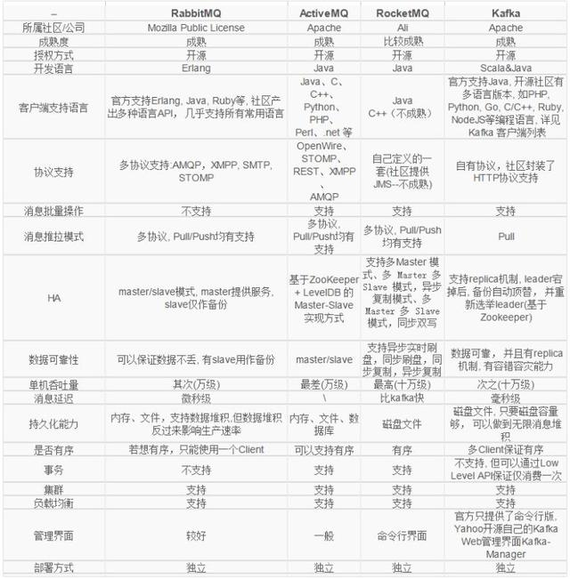
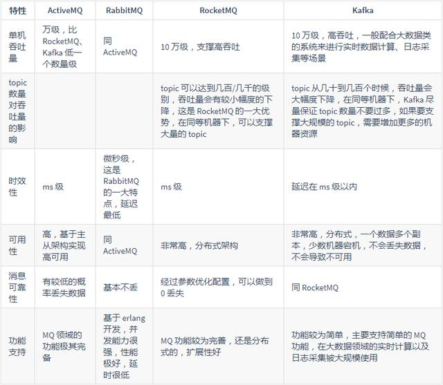

消息队列的3个作用：解耦，异步，削峰

问题：消息丢失，消息重复，消息积压

Rabbitmq普通集群模式缺点：
1. 可能会在rabbitmq集群内部产生大量的数据传输
2. 可用性几乎没什么保障

镜像集群模式缺点：每个节点上都有这个queue的，不是分布式的，负载大于一个节点的最大负载就无法解决了

Rabbitmq设置持久化的两个步骤：
1. 创建queue时候将其设置为持久化的，这样可以保证rabbitmq持久化queue的元数据，但是不会持久化queue里面的数据
2. 发送消息的时候将消息的deliveryMode设置为2，就是将消息设置为持久化的，此时rabbitmq就会将消息持久化到磁盘。必须同时设置这两个持久化才行

