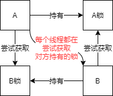

# Thread

## 1. Runnable 比 Callable 效率低,后面从源码上来分析

## Callable和Runnable的区别？
1.可以有返回值
2. 可以抛出异常
3. 需要覆写的方法不同，run()/call()

## Thread类中没有能接收 Callable 接口子类的构造方法，如何运行 Callable 接口的子类呢？
```java
public class CallableThread {
    public static void main(String[] args) throws ExecutionException, InterruptedException {
        // 如何运行 Callable
        new Thread();
        MyThread thread = new MyThread();
        // 使用FutureTask来包装Callable的子类
        FutureTask futureTask = new FutureTask(thread);
        new Thread(futureTask, "A").start();
        new Thread(futureTask, "B").start();
        /**
         * 细节:
         * 1. 有缓存
         * 2. 结果会阻塞
         */
        // todo 有缓存?????????????????????
        // get方法在没有得到结果之前会产生阻塞，一般会把它放到最后，或者使用异步通信来处理
        String s = (String) futureTask.get();// 获取返回结果
        System.out.println(s);
    }
}
class MyThread implements Callable<String> {
    @Override
    public String call() {
        System.out.println("call()");
        return "call() exec success";
    }
}
```

## 2.Java默认有几个线程？

2个。一个main线程，一个gc守护线程。

## 3.Java真的可以开启线程吗？

不可以，java无法操作硬件，只能调用本地方法开启

## 4.线程有哪几种状态?
5种状态
```java
public enum State {
    // 新生，还没有运行起来
    NEW,
    /**
     * Thread state for a runnable thread.  A thread in the runnable
     * state is executing in the Java virtual machine but it may
     * be waiting for other resources from the operating system
     * such as processor.
     */
    // 处于可以运行状态，可能正在JVM上执行，也可能在等其他资源如cpu处理器
    RUNNABLE,

    // 阻塞，正在等一个monitor锁
    BLOCKED,

    // 等待
    WAITING,

    /**
     * Thread state for a waiting thread with a specified waiting time.
     * A thread is in the timed waiting state due to calling one of
     * the following methods with a specified positive waiting time:
     */
    // 带时间等待
    TIMED_WAITING,

    /**
     * Thread state for a terminated thread.
     * The thread has completed execution.
     */
    // 终结状态(线程已经运行完毕)
    TERMINATED;
}

```

## 5. 并发与并行的区别？

并发是一种竞争，并行是一种合作。并发编程的本质:充分利用cpu资源

* 并发:多个线程操作同一资源。用一个核心的cpu模拟出多条线程，天下武功唯快不破，快速交替
* 并行:多个人一起行走。多核cpu，多个线程可以同时执行

## 6.wait/sleep区别？
>1. 来自不同的类:wait --> object；sleep --> Thread
>2. 锁的释放:wait会释放锁；而sleep是睡觉，抱着锁睡觉，不会释放
>3. 使用范围不同 wait必须在同步代码块中；而sleep可以在任何地方睡
>4. 是否需要捕获异常:wait不需要捕获异常；sleep必须要捕获异常

## 7. Thread就是一个单独的资源类，没有任何附属的操作

# Lock锁(重点)

## 1. 公平锁和非公平锁有什么区别？

* 公平锁:按先来后到的顺序
* 非公平锁:可以插队，不按先来后到的顺序

## 2.使用Lock锁的标准三部曲:

```java
class Ticket2 {
    private int number;
    Lock lock = new ReentrantLock();

    public void sale() {
        // 第一步
        lock.lock();
        try {
            // 第二步:写业务代码
        } catch (Exception e) {
            e.printStackTrace();
        } finally {
            // 第三步
            lock.unlock();
        }
    }
}
```

## 3.synchronized和Lock区别？(需要按相同点和不同点去整理一下)

>1. synchronized是内置的java关键字，Lock是一个java类
>2. synchronized无法判断获取锁的状态，Lock可以判断是否获取到了锁
>3. synchronized会自动释放锁，lock必须要手动释放锁，如果不释放锁会发生死锁
>4.  用synchronized当线程1获得锁正在执行业务代码时，线程2在阻塞等待；而Lock就不一定等待下去
>5. synchronized是可重入锁，不可以中断，非公平；lock锁可重入锁，可以判断是否得到锁，非公平(可以自己设置)
>6.  synchronized适合锁少量的代码同步问题，lock适合锁大量的同步代码


##### 深入理解 CAS:
Java中的原子类底层使用自旋CAS的方式去更新值，比较当前工作内存中的值和主内存中的值，如果等于期望值则更新，否则一直循环重新计算然后再次尝试更新。
有几个缺点:
>1. 循环会耗时
>2. 一次只能保证一个共享变量的原子性
>3. 有ABA问题

### Java死锁排查:

```java
/**
 * 产生死锁Demo
 */
public class DeadLockDemo {
    public static void main(String[] args) {
        String lockA = "lockA";
        String lockB = "lockB";
        // T-1线程先对 lockA 加锁，再对 lockB 加锁
        new Thread(new DeadLockThread(lockA, lockB), "T-1").start();
        // T-2线程先对 lockB 加锁，再对 lockA 加锁
        new Thread(new DeadLockThread(lockB, lockA), "T-2").start();
    }
}

class DeadLockThread implements Runnable {
    private String lockA;
    private String lockB;

    public DeadLockThread(String lockA, String lockB) {
        this.lockA = lockA;
        this.lockB = lockB;
    }

    @Override
    public void run() {
        synchronized (lockA) {
            System.out.println(Thread.currentThread().getName() + " 获取到" + lockA);
            try {
                TimeUnit.SECONDS.sleep(2);
            } catch (InterruptedException e) {
                e.printStackTrace();
            }
            synchronized (lockB) {
                System.out.println(Thread.currentThread().getName() + " 获取到" + lockB);
            }
        }
    }
}
```
运行结果:
```
T-1 获取到lockA
T-2 获取到lockB
线程永远不终结
```
排查步骤:

```jshelllanguage
1.使用jps找到需要排查的java进程号: jps -l

46160 com.example.juc.DeadLockDemo
65444 org.jetbrains.idea.maven.server.RemoteMavenServer
73812 sun.tools.jps.Jps
28792 org.jetbrains.kotlin.daemon.KotlinCompileDaemon
129416
97240 org.jetbrains.jps.cmdline.Launcher
13948
8316 org.jetbrains.jps.cmdline.Launcher

2. 使用jstack命令查看进程内的线程状态: jstack 46160
Found one Java-level deadlock:
=============================
"T-2":
  waiting to lock monitor 0x0000000002d6c0e8 (object 0x00000000d60293b0, a java.lang.String),
  which is held by "T-1"
"T-1":
  waiting to lock monitor 0x0000000002d6bed8 (object 0x00000000d60293e8, a java.lang.String),
  which is held by "T-2"

Java stack information for the threads listed above:
===================================================
"T-2":
        at com.example.juc.DeadLockThread.run(DeadLockDemo.java:35)
        - waiting to lock <0x00000000d60293b0> (a java.lang.String)
        - locked <0x00000000d60293e8> (a java.lang.String)
        at java.lang.Thread.run(Thread.java:745)
"T-1":
        at com.example.juc.DeadLockThread.run(DeadLockDemo.java:35)
        - waiting to lock <0x00000000d60293e8> (a java.lang.String)
        - locked <0x00000000d60293b0> (a java.lang.String)
        at java.lang.Thread.run(Thread.java:745)

Found 1 deadlock.
```
工作中排查问题，9成靠日志，1成靠堆栈信息


