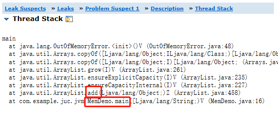

#### 专栏学习目标:

1. 对自己负责的线上系统，可以进行生产环境的 JVM 参数优化
2. 线上遇到 JVM 生产故障，绝对有思路去分析、排查和定位
3. 清楚如何去动手实践从而弄明白背后的 JVM 底层原理
4. 通过专栏积累的几十个 JVM 生产案例，能支撑你对各种不同的生产故障进行处理和解决

先把jvm运行原理学懂，然后能通过对线上系统的监控，去调优。

所谓jvm优化，就是尽可能让对象都在新生代里被分配回收，尽量别让太多对象频繁进入老年代，避免频繁触发fullGc对老年代进行垃圾回收。同时给系统充足的内存大小，避免新生代频繁进行minorGc

## Java 代码是怎么跑起来的？
processOn上有图

## JVM在什么情况下会去加载一个类？(类的加载时机)

* jar包或者war包中会指定一个类的main方法作为运行入口，当jvm启动后，先由类加载器把这个主类加载到内存中，然后开始执行main方法中的代码，接着如果main方法中需要使用其他类，则继续加载
* 后面jvm运行过程中代码第一次用到某个类时，就需要由类加载器从.class文件中把类加载到jvm中。是按需加载，而不是一次性都加载进jvm

首先加载包含main方法的主类，然后是运行我们写的代码的过程中，遇到什么类，再加载什么类

## 类的加载过程？
* 加载过程:
加载 -> 验证 -> 准备 -> 解析 -> 初始化 -> 使用 -> 卸载

```java
// 类代码如下: 
public class ReplicaManager{
    // 静态变量是属于类的
	public static int flushInterval;
}
```

* 验证:(先加载进内存后再验证)就是以 Java 虚拟机规范为标准，来校验加载进来的“.class”文件中的内容是否符合规范，验证通过则加载进jvm，验证不通过不允许加载到jvm中，主要是为了维护虚拟机自身的安全。
* 准备(核心阶段):在准备阶段需要给类分配内存空间，然后给类变量(类中static修饰的变量)分配内存空间，并给类变量初始化为默认值，对象类型初值是null，数字类型初值是0，布尔值初值是false。(给ReplicaManager.class类分配空间，给类变量flushInterval分配空间，然后把初始值0赋给类变量flushInterval)
>1. 给类分配内存空间
>2. 给类变量分配空间并赋默认值
* 解析: 把符号引用替换为直接引用
* 初始化(核心阶段): 
>1. 真正给类变量赋值
>2. 如果有static代码块，是在初始化阶段来执行static代码块(用户使用类的时候肯定是希望类已经准备好了一些数据，所以jvm设计者设计在类加载的初始化阶段去执行静态代码块)

类什么时候被初始化？类的初始化时机:
>1. 被main()方法间接调用的类，必须是立即初始化的 
>2. 代码中如果要实例化对象(new 对象)，就必须先触发类的加载全过程
>3. 如果初始化一个子类时发现他的父类还没有初始化，那么必须先初始化他的父类

## 类加载器有哪几种？

>1. 启动类加载器(Bootstrap ClassLoader):负责加载java安装目录的lib目录下的核心类库，这些类库用来支撑jvm自身的运行，所以一旦jvm启动就会依托启动类加载器去加载lib目录中的核心类库
>2. 扩展类加载器(Extension ClassLoader):负责加载lib/ext目录中的核心类，也是用来支撑jvm运行的
>3. 应用程序类加载器(Application ClassLoader):负责加载环境变量(classPath)所指定的路径中的类，通常我们自己写的java代码就是由应用程序类加载器来负责加载的。
>4. 自定义类加载器:根据自己的需求来定义类的加载

## 双亲委派机制

类加载器是有亲子层次结构的，启动类加载器在最上层，扩展类加载器在第二层，应用程序加载器在第三层，自定义类加载器在最后一层。

当jvm需要加载一个类进来时，类加载器会先找自己父亲去加载，父亲明确回复说无法加载的，再由儿子来加载

### 一个类在双亲委派机制下的加载过程: 


### 双亲委派机制的好处:

* 先找父类加载器去加载，如果父类无法加载再由子类加载器来加载，避免了多层级的加载器结构重复加载某些类，双亲委派机制主要是为了避免类的重复加载.每个类加载器层次分明，没有规矩不成方圆，定义父子角色后可以防止类的重复加载
* 类加载器本身也可以对代码之间进行隔离，例如，应用无法获取启动类加载器（Bootstrap Class-Loader）对象实例，不同的类加载器也可以起到容器的作用，隔离模块之间不必要的可见性

### 为什么类加载器必须要一级一级往上找，直接从顶层类加载器开始找不行吗？

* 第一:  如果想从顶层类加载器开始找，就必须硬编码来规定，可扩展性不好，所以类加载器被设计为父子关系模型，每个层级的类加载器各司其职，这是一种保证代码可扩展的代码设计思想。
* 第二:  每一层类加载器对某个类的加载，先上推给父类加载器，直到顶层类加载器如果发现自己无法加载，再下推回子类加载器，这种双亲委派模型的工作方式可以解决类重复加载的问题，因为每个类加载器有不同的类加载路径，不同类加载器的路径一般是不会重叠的，所以这样可以保证不会重复加载某个类。

## Tomcat的类加载器结构


一个Tomcat启动多个web应用，JVM只有一个。tomcat自定义了common、catalina、shared等类加载器用来加载tomcat自身的核心类库。

tomcat是打破了双亲委派模型的:

* 对于容器中的web应用，tomcat为每个部署在容器内的web应用定义了一个webApp类加载器负责加载此web应用的类，不会传导给上层类加载器去加载。如果加载的不是

* 对于jsp，tomcat为每个jsp页面都准备了一个jsp类加载器

## JVM的内存区域划分

jvm在运行我们写的代码时，必须使用多块内存空间，让不同空间用来存放不同的数据，才能让系统跑起来。

**存放类的内存空间**：

JDK 1.8以前，这块内存区域叫做方法区，也叫永久代，用来存放类和常量池

JDK1.8之后，这块区域改名为metaspace，只存放类，常量池被移到堆中

**线程:**

程序计数器: 记录当前线程执行到哪条字节码指令了

虚拟机栈:调用任何方法时都会为每个方法创建一个栈帧，然后入栈， 栈帧中保存这个方法的局部变量表，操作数栈，动态链接，方法出口，方法执行完毕后出栈

本地方法栈:  调用本地方法(native)时使用，和虚拟机栈类似


**堆：**


**堆外内存:**  通过DirectByteBuffer来引用和操作堆外内存空间


## 内存的分代模型：新生代、老年代、永久代

代码中创建的所有对象，都会在堆内存上分配。代码中在堆上创建对象的时机就两个，并且采用不同方式创建和使用的对象的生命周期是不同的。
一个是方法的局部变量创建对象，另一个就是类的静态变量创建对象，一个被方法的局部变量引用，一个被类的静态变量引用。而一般被方法的局部变量所引用的对象生命周期是很短的，而被类的静态变量引用的对象由于只要类不被回收就会一直持有类静态变量的引用，所以生命周期很长。所以jvm针对这两种按生命周期的特点把堆内存划分为两个区域，新生代和老年代，创建和使用完后立马就要回收的对象放在新生代，创建后需要一直长期使用的对象放在老年代，并且针对生命周期的不同特点去用不同策略回收内存，也就是垃圾回收


```java
public class DataManager {

    private static ReplicaFetcher fetcher = new ReplocaFetcher();

    public static void main(String[] args) {
        // 从本地磁盘加载副本，只执行一次
        loadReplicaFromDisk();

        while (true) {
            // 从远端加载副本，需要周期性执行
            fetchReplicaFromRemote();
            Thread.sleep(1000);
        }
    }

    /**
     * 从本地磁盘加载副本
     */
    private static void loadReplicaFromDisk() {
        // 方法执行结束后，由于replicaManager对象是被局部变量引用的，所以将被回收
        ReplicaMananger replicaManager = new ReplicaManager();
        replicaManager.load();
    }

    /**
     * 从远端加载副本
     */
    private static void fetchReplicaFromRemote() {
        // 方法执行结束后，由于fetch对象被类静态变量引用，所以不会立即被回收
        fetcher.fetch();
    }
}
```

年轻代：存放生命周期很短的对象
老年代：存放生命周期较长的对象
永久代：也就是方法区，用来存放类信息的


### 加载到方法区的类会被当作垃圾回收掉吗？什么时候回收？

会。满足下面3个条件，方法区里的类就才可以被回收:

>1. 首先该类的所有实例(对象)都已经从java堆内存里被回收了
>2. 其次加载这个类的ClassLoader已经被回收了
>3. 最后，对该类的Class对象没有任何引用

系统平时运行时，都是优先把对象放在新生代，然后新生代内存满了就垃圾回收，如果有长期存活的对象，躲过了十多次垃圾回收，就进入老年代

#### 每个线程都有Java虚拟机栈，里面也有方法的局部变量等数据，针对Java虚拟机栈需要进行垃圾回收吗？

不需要，当方法执行完，栈帧出栈时，会将栈帧的局部变量表清空


## 新生代的内存分配过程？

系统刚启动时，第一次创建对象时只会分配到eden区，当第一次MinorGC时，会将eden中存活的对象转移到一块Survivor区中，然后将eden区清空。第一次MinorGC完成后如果此时再分配对象，就可以再次分配到eden区了。这时如果发生第二次MinorGC，会对eden区和Survivor区进行垃圾回收，然后将存活对象转移到空的那块survivor区，然后将eden区和survivor区都清空，后面的情况和第二次MinorGC的情况重复
* Survivor区只能专门用来放每次GC后的存活对象的，而不是用于直接在此区分配对象
* 因为总是有一块survivor区是空着的，所以新生代空间利用率为90%

# 垃圾回收

系统运行时创建的对象都是先分配在新生代的eden区里的，当想要继续在在新生代eden区为对象分配内存时，发现内存不够用了，这时就会触发一次新生代垃圾回收，也叫做"Minor gc" 或者 "Young gc"。这就是新生代的垃圾回收触发时机

### 那什么是垃圾？如何判断哪些是垃圾？

进行gc清扫时，只要不是被gc roots所引用的对象，都是垃圾。

jvm规范中规定gc roots只有以下两种：

* 局部变量：只要正在被局部变量引用的对象，都不能回收
* 类静态变量： 只要被类静态变量引用的对象，就不会被回收

jvm使用“可达性分析法”来判定哪些对象是可以被回收的，规定是，从每个待回收对象出发，一层一层向上判断引用，如果最终由GC Roots所引用的，就能存活；不被GC Roots引用的就可以被回收。

### Java中的4种引用类型与垃圾回收的关系

引用类型与垃圾回收是息息相关的。

* 强引用：

```java
ReplicaManager replicaManager = new ReplicaManager();
```

被强引用关联的对象，垃圾回收时一定不会被回收

* 软引用：

```java
SoftReference<ReplicaManager> replicaManager = new SoftReference<ReplicaManager>(new ReplicaManager());
```

正常情况下垃圾回收不回收软引用对象，但是如果gc后发现还是不够存放新对象时就会将软引用对象回收掉

* 弱引用：

```java
WeakReference<ReplicaManager> replicaManager = new WeakReference<ReplicaManager>(new ReplicaManager());
```

弱引用和没引用类似，只要进行垃圾回收，弱引用对象就会被回收

* 虚引用：不常用

### 回收时如果没有被GC roots引用的对象，是一定马上被回收吗？

并不是，可以通过覆写finalize()方法来拯救自己。假设现在有一个ReplicaManager对象要被垃圾回收了，如果这个对象重写了Object类中的finalize()方法，此时会尝试调用一下它的finalize()方法，看看当前实例对象是否赋给了某个GC Roots变量，如果重新被某个GC Roots变量引用了，那么这个对象就不用被垃圾回收了

```java
public class ReplicaManager{
    public static ReplicaManager instance;
    
    @Override
    protected void finalize() throws Throwable{
        ReplicaManager.instance = this;
    }
}
```

### 新生代垃圾回收算法：复制算法

JVM把新生代分为三块，一块eden区，两块survivor区。最开始在新生代为对象分配空间，都是在eden区分配，当eden区无法再次分配对象，则触发MinorGC，这时将eden区存活对象拷贝到一块survivor区，然后将eden区清空。下次eden区满了会将eden区连同上次的survivor区一起垃圾回收，将这两块区域中的存活对象拷贝到另一块survivor，后面就是循环使用这三块区域。

优点：只有10%空间是闲置的，内存使用率高

无内存碎片

回收速度快


### 老年代垃圾回收算法：标记整理算法

标记-清除-整理：首先标记出老年代中当前存活对象，然后一次性把垃圾对象都回收掉，最后让进行整理，也就是让存活对象往内存的一个方向移动，让存活对象紧凑的靠在一起，避免出现内存碎片和内存空洞

老年代垃圾回收算法速度至少比新生代垃圾回收算法慢10倍，如果系统频繁触发老年代的fullGC，会导致系统出现频繁卡顿。

### 垃圾收集器

* serial和serial old垃圾回收器：分别用来回收新生代和老年代。工作原理就是单线程运行，当需要进行垃圾回收时，直接将工作线程停止，让系统卡死不动，让serial垃圾收集器进行垃圾回收，现在一般不用
* ParNew和CMS垃圾收集器：ParNew用于新生代垃圾收集器，CMS用于回收老年代的垃圾收集器，工作原理都是多线程的。
* G1垃圾收集器：使用优秀的算法和设计机制来统一回收新生代和老年代

无论使用什么垃圾收集器，无论进行MinorGC还是FullGc，垃圾回收时都要停止所有工作线程，进入“Stop The World”状态，回收完成后再恢复所有工作线程的运行


## 触发老年代Full GC的时机？

* 第一: 老年代可用内存小于新生代全部对象大小，如果没开启空间担保参数，会直接触发FullGC，所以一般空间担保参数都会打开
* 第二: 老年代可用内存小于历次新生代Gc后进入老年代的平均对象大小,此时会提前fullGC
* 第三: 新生代MinorGc后的存活对象大于Survivor，会直接进入老年代，而此时老年代空间不足，触发Full GC
* 第四: JVM参数"-XX:CMSInitiatingOccupancyFaction",如果老年代可用内存大于历次minorGC后进入老年代对象的平均大小，但是老年代已用内存超过了此参数指定的比例，也会触发FullGC

无论是Old区满了触发fullGC，还是metaspace满了触发的FullGC，都会执行metaspace区域的gc

## 为什么老年代的FullGC比新生代MinorGC慢很多倍，一般在10倍以上？
从新生代和老年代的GC执行过程分析：
* 新生代MinorGC速度很快是因为直接从GC Roots出发追踪哪些对象是存活的即可，因为新生代存活对象很少，所以需要追踪的对象数量也很少，并且使用复制算法，所以此过程速度很快，将存活对象放入Survivor，然后一次回收eden和survivor即可
* 老年代使用的CMS的FullGC:第一在并发标记阶段需要追踪所有存活对象，因为老年代存活对象很多，所以这个过程很慢。第二在并发清理阶段，不是一次性回收一大片内存，而是找到散落在各个地方的垃圾对象，所以速度很慢。最后还需要进行内存碎片整理，把大量存活的对象向一个方向移动，这个过程需要"Stop The World"。并且在并发清理期间，剩余内存空间不足以存放即将进入老年代的对象，引发"Concurrent Mode Failure"问题，还需要用”Serial Old“垃圾收集器来替换CMS垃圾收集器，这样就得重新"Stop The World"然后让"Serial Old"垃圾收集器重新走一次FullGC流程，就更加耗时了。

## 老年代的垃圾回收算法有哪些?
* 标记清除算法: 会产生内存碎片，不使用
* 标记整理算法: 标记出当前存活的对象，然后把存活对象尽量向一个方向移动，让存活对象紧凑的靠在一起，这个过程内存地址会改变，避免垃圾回收后出现过多的内存碎片，然后一次性将垃圾对象都回收掉。老年代的垃圾回收算法速度至少比新生代垃圾回收算法速度慢10倍，如果系统频繁出现full gc会严重影响性能

## 对象是如何进入老年代的？(对象进入老年代的4个时机)
>1. 一个实例对象在新生代成功躲过15次垃圾回收后还是没被回收掉，说明它已经15岁了，就会被转移到老年代中。具体多少岁进入老年代，可以通过JVM参数"-XX:MaxTenuringThreshold"来设置，默认是15岁
>2. 动态对象年龄判断机制。有一种情况可以让新生代的对象不用等待15次GC就可以进入老年代:如果当前存放对象的Survivor区域里，一批对象的总大小大于这块Survivor区域内存大小的50%，那么此时Survivor区域中大于等于这批对象年龄的对象(取这批对象中年龄最大的大小作为参考值)，就可以直接进入老年代。比如年龄1对象 + 年龄2 对象 + 年龄n的对象大小总和超过了Survivor区域大小的50%，此时就会把年龄n及以上的对象都放入老年代。核心思想就是希望那些可能是长期存活的对象今早进入老年代。
>3. 大对象直接进入老年代。JVM参数"-XX:PretenureSizeThreshold"控制大对象的阈值，这个值可以设置为字节数，比如"1048576"字节，就是1MB
，如果要创建一个大于这个大小的对象或者数组，会直接将这个大对象在老年代分配，不经过新生代。假如新生代里出现大对象后，屡次躲过GC，然后在两个Survivor
区来回复制多次后才能进入老年代，很耗费时间。核心思想就是让长时间存活的对象尽早进入老年代。  
>4. 空间担保机制。youngGC后存活对象太多无法放入Survivor区，此时直接进入老年代

## 当每个线程执行方法时，方法对应的栈帧出栈了，栈帧里的局部变量需要垃圾回收吗？
JVM垃圾回收针对的是新生代、老年代、方法区，不会针对方法的栈帧。方法执行完毕后当栈帧出栈时，栈帧里面的局部变量引用会被直接从内存里清理掉，虚拟机栈栈帧出栈后，栈帧中局部变量的引用直接被清除，但是对象还是要等待垃圾回收时才能被销毁。(方法运行期间，堆上对象被引用占用，无法被回收，所以高并发下多个方法同时运行期间，这种情况下会发生OOM)

## MinorGC后对象太多无法放入Survivor区怎么办?
>1. 在minorGC前先检查一下老年代的可用空间是否大于新生代所有对象的总大小，这是因为最极端的情况下，MinorGC后可能所有对象都存活下来。如果老年代空间足以放下，就可以发起minorGC了，因为即使MinorGC后所有对象都存活且survivor区放不下，也是可以放到老年代的。如果老年代空间能放下，直接将这批对象放入老年代
>2. 如果老年代内存不足以放下新生代所有对象，就检查JVM参数“-XX:HandlePromotionFailure”是否已设置，此参数用于开启老年代空间担保机制。如果设置了这个参数，就判断老年代的内存大小是否大于每次MinorGC
后进入老年代对象的平均大小，例如之前每次MinorGC后平均有10MB的对象进入老年代，如果此时老年代剩余可用内存大于10MB，就说明这次MinorGC后差不多也是10MB左右对象进入老年代，老年代空间足够。老年代空间不足或者参数没有设置，就直接触发一次fullGC对老年代控件进行回收，然后再进行MinorGC。

第一种可能:MinorGC后存活对象小于Survivor区大小，此时所有存活对象进入Survivor区
第二种可能: MinorGC后存活对象大于Survivor区大小，但是小于老年代可用内存大小，此时直接进入老年代
第三种可能:MinorGC后存活对象大于Survivor区大小，也大于老年代可用内存大小，此时如果没配置handle promotion failure，就直接oom。如果配置了，就触发fullGC，如果fullGC后还是放不下MinorGC存活的对象，就会oom

但是"-XX:HandlePromotionFailure"参数在JDK1.6以后被废弃了，在JDK1.6以后，只要 ”老年代可用空间“ > "新生代对象总和"，或者”老年代可用空间“ > ”历次MinorGC升入老年代对象的平均大小“，这两个条件满足其中一个，就可以直接进行MinorGC，不需要提前触发FullGC了

## JVM参数"HandlePromotionFail"空间分配担保的意义是什么？(HandlePromotionFail  -> 处理晋升失败)
如果开启了这个参数，当MinorGC后老年代放不下所有对象时，还会继续判断老年代剩余空间是否大于每次MinorGC后进入老年代的平均对象大小，如果大于，就直接MinorGC后将存活对象放入老年代。要是不配置这个参数，当判断完老年代放不下新生代所有存活对象后，就直接触发fullGc对老年代进行垃圾回收了。这个参数配置的意义就是说，在这种情况下，有可能会省一次提前的fullGc，当然如果判断通过了，到实际放时候放不下，也是需要通过fullGc来回收老年代空间的。开启参数与否的区别在于不需要频繁FullGC

## ParNew + CMS的垃圾收集器，如何保证只做MinorGC，JVM参数如何配置？
优化JVM参数后的一个最理想的状态就是: 只发生MinorGC，fullGC次数为0。那就要求老年代可以放下所有长时间存活的对象，并且新生代的对象，就不要跑到老年代去，这就需要去考虑新生代对象什么情况下会被转移到老年代去，把几种会转移到老年代的情况，结合线上系统的运行情况(借助一些工具来观察每秒钟会在新生代增加多少对象，多长时间触发一次MinorGC，平均每次minorGC后会有多少对象存活，Survivor区是否可以放的下)，核心点就是必须让survivor区放得下，而且也要保证不能因为动态年龄判定机制使新生代的对象直接升入老年代，通过优化JVM参数来做到只发生MinorGC，而fullGC次数为0.

## 垃圾收集器:
对新生代和老年代进行垃圾回收时，不同区域使用不同的垃圾收集器。
* serial 和 serial old垃圾收集器:分别用来回收新生代和老年代的垃圾对象。单线程运行，垃圾回收时停止所有其他工作线程，然后进行垃圾回收，现在几乎不用
* ParNew 和 CMS: ParNew回收新生代，CMS回收老年代。这两个都是多线程并发，性能更好，现在一般是生产环境标配的组合
* G1: 统一收集新生代和老年代，采用了更优秀的算法和设计机制

## JDK 8 默认使用的垃圾收集器是什么？
使用下面命令查看:
```
java -XX:+PrintCommandLineFlags -version
结果显示:
-XX:+UseParallelGC
```
可以通过"-XX:+UseParNewGC"参数指定使用ParNew垃圾收集器对新生代进行回收

## 老年代垃圾收集器 CMS？
CMS垃圾收集器采用的是垃圾回收线程 和 系统工作线程并行的模式来处理,CMS默认启动的垃圾回收线程数量是(CPU核数+3)/4。为了避免长时间的"Stop The World",CMS在执行一次垃圾回收的过程一共分为4个阶段:
>1. 初始标记:将系统工作线程全部停止，进入"Stop The World"状态，然后只标记出所有GC Roots直接引用的对象
>2. 并发标记:系统工作线程恢复运行，在这个过程中垃圾回收线程主要是对此过程中新创建的对象和在此过程失去引用变成垃圾的对象进行标记，也就是标记出被GC Roots间接引用的对象，也是对老年代所有对象进行Gc Roots追踪，追踪所有对象是否从根源上被GC Roots引用了，此过程最耗时
3. 重新标记:再次将系统工作线程全部停止，进入"Stop The World"状态，然后标记下在并发标记阶段新创建的对象中失去引用变成垃圾的那些对象
>4. 并发清理: 系统工作线程和垃圾回收线程并行运行，由垃圾回收线程将之前标记为垃圾的对象清理掉，这个阶段很耗时。但是CMS并不是完全使用"标记-清除"算法的，因为内存空洞会导致更加频繁的FullGC,CMS有一个参数是"-XX:UseCMSCompactAtFullCollection",默认是开启状态，意思就是使用CMS进行fullGC后要再次进入Stop The World，进行碎片整理。还有一个参数是"-XX:CMSFullGCsBeforeCompaction"，意思就是执行多少次FullGc后再执行一次内存碎片整理工作，默认值是0，也就说每次FullGC后都会进行一次碎片整理  

## CMS 垃圾收集器的Concurrent Mode Failure问题
在CMS的并发清理阶段中，系统的工作线程是一直在运行的，同时也会有对象在MinorGC后进入老年代，也会有老年代中没有被标记的对象变成垃圾对象，这种垃圾对象叫做"浮动垃圾"。为了保证在CMS垃圾回收器的并发清理阶段老年代还能留有一些空间能让对象可以进入老年代，当老年代内存使用率达到一定比例而不是满了时就会触发full gc，"-XX:CMSInitiatingOccupancyFaction"参数可以用来设置老年代占用多少比例时触发CMS垃圾回收，JDK1.6默认值为92%。如果在CMS正在并发清理阶段，系统程序要放入老年代的对象大于了老年代当前可用空间，此时就会发生Concurrent Mode Failure，也就是说本次并发垃圾回收由于CMS一边回收，一边还有对象进入老年代导致内存都不够用了，这时jVM会启动"serial old"来替代CMS，此时会强行进入"Stop The World"，然后重新进行长时间的GC Roots追踪，一次性把垃圾对象都回收掉，然后再恢复系统工作线程。实际生产环境要优化自动触发CMS垃圾回收的内存比例，避免产生"Concurrent Mode Failure"问题

## 动态年龄判断机制:
年龄1+年龄2+年龄3的对象占据了50%的Survivor，就让年龄3以上的对象进入老年代。也就是说把survivor区的对象年龄从小到大进行累加，当累加到年龄X时对象总大小占据survivor区50%(可以使用-XX:TargetSurvivorRatio=?来设置保留多少空闲空间，默认值是50)，那么比X大的都会晋升到老年代

G1核心概念点:
1. G1把整个堆内存拆分成多个大小相等的Region
2. G1也有新生代和老年代的概念，但是是逻辑上的概念，物理区域划分还是按Region分的
3. G1可以设置一个垃圾回收的预期停顿时间，对垃圾回收导致的系统停顿可控
4. Region是一个盒子，容器，可能属于新生代，也可能属于老年代，刚开始这块Region可能谁都不属于，然后分配给新生代，然后放了很多对象，接着触发了GC对这块region进行回收，然后这块Region可能被分配给老年代
5. G1来自动控制整个堆内存，所以新生代和老年代的内存区域是不停变动的
6. G1中Region最多有2048个，Region的大小必须是2的倍数，比如1MB、2MB、4MB之类的，也可以通过参数"-XX:G1HeapRegionSize"来手动指定
7. 堆中新生代默认占比为5%，也可以通过参数"-XX:G1NewSizePercent"来设置新生代初始占比，一般会维持默认值。在系统运行过程中会不断给新生代增加更多的Region，但是新生代最多不会超过60%，也可以通过参数"-XX:G1MaxNewSizePercent"来设置堆内存新生代最大占比
8. 启动G1垃圾收集器后，JVM会将初始分给新生代的Region，再按原来8:1:1的比例分给Eden和Survivor
9. G1可以通过参数"-XX:MaxGcPauseMills"来指定最大系统停顿时间，默认值是200ms
10. 对象进入老年代的时机和之前保持一致(到达一定年龄、动态年龄判断)
11. 以前大对象会直接分配到老年代，在G1下提供了专门的Region来存放大对象，G1中对大对象的定义是一个对象超过了一个Region容量的50%，并且对大对象Region的回收是在对新生代和老年代GC时顺带回收
12. G1中的新生代和老年代各有一个最大占比，当分给新生代的Eden区满了时就会触发新生代垃圾回收，回收时因为要考虑GC停顿时间，所以会挑选一些Region来进行垃圾回收。

## 什么时候触发新生代 + 老年代的Mixed GC？
G1有一个参数是"-XX:InitiatingHeapOccupancyPercent",默认值是45%，就是说当老年代占用堆内存45%的Region时，尝试触发新生代+老年代一起回收的Mixed Gc。比如堆内存有2048个region,如果老年代占用了其中45%的region,也就是将近1000个Region时就会触发Mixed GC。

## G1的Mixed GC垃圾回收过程？
>1. 首先进入stop the world，触发初始标记阶段，这个阶段仅仅是标记一下gc roots的直接引用对象，速度很快。
>2. 然后恢复工作线程的运行，进入并发标记阶段，从GC roots开始追踪所有存活对象
(追踪GC Roots 间接引用的对象，也就是将GC Roots所引用的对象标记为存活状态)，由于要追踪全部的存活对象所以这个阶段很耗时，但是这个阶段可以和工作线程并行运行，所以不影响系统程序的运行。JVM会记录此阶段对象状态的变化，比如哪些对象被新创建，哪些对象失去了引用。
>3. 进入"Stop The World"状态，进入最终标记阶段，将上一阶段(并发标记阶段)JVm记录的对象做最终标记，标记一下哪些是存活对象，哪些是垃圾对象。
>4. 进入Mixed GC阶段(混合回收阶段)，然后计算新生代、老年代、大对象中每个Region的存活对象数量、存活对象比例、垃圾回收的预期性能、回收效率。先"Stop The World"停止工作线程，然后根据预期设定的停顿时间来选择部分Region进行回收。比如本次垃圾回收预期停顿时间为200ms，就会从新生代、老年代、大对象里都挑选出一些Region，以此来达到在指定的停顿时间内回收尽可能多的垃圾，这就叫做混合回收。这个阶段回收会被拆分为多次，也就是进行一次预期停顿时间的回收，然后恢复系统运行，然后再进次进行回收，通过参数"-XX:G1MixedGcCountTarget"来控制回收次数，默认值是 8，也就是先停止系统运行，混合回收一些Region，然后再恢复系统运行，重复8次。
Mixed Gc是基于复制算法对Region回收的，这样不会出现内存碎片，并且不需要CMS那样标记-清除后还需要进行内存碎片整理。还有一个参数"-XX:G1HeapWastePercent"，默认值是5%，意思是Mixed Gc过程中会不断空出新的Region，一旦空闲出来的Region数量达到了堆内存的5%，就立即停止MixedGC。
还有一个参数"-XX:G1MixedGcLiveThresholdPercent",默认值是85%，意思是在对Region回收时，只有存活对象低于85%的Region才能被回收(对存活对象比例高于85%的Region拷贝到其他Region，成本很高)

由于Mixed GC基于复制算法进行回收，所以一旦在拷贝过程中找不到空闲的Region来存放拷贝的对象，就会触发失败，而一旦失败，立即会"Stop The World"，然后采用单线程进行标记、清除、内存碎片整理，这个过程是很慢很慢的

## G1的回收过程？
* youngGC触发时机:新生代占用达到堆大小的60%,无法继续在新生代找到空间继续给分配对象。采用G1回收，最开始到eden区满了也不会立即开始gc，还会继续给新生代分配region，直到新生代占据region总数的60%（或者自定义的数值），才会对新生代回收
* youngGc过程：因为新生代占60%，老年代可用空间肯定小于新生代空间。所以接下来判断是否开启了空间担保，如果开启了则比较老年代可用空间和历次gc进入老年代对象的平均大小，如果大于则可以youngGc
，如果没有开启或者小于则直接进入oldGc。如果youngGc后的存活对象老年代放不下则进行一次oldGc。
* mixedGc触发时机:老年代占用堆空间的45%,无法继续在老年代找到空间分配给对象
* mixedGc过程：第一阶段，停止用户线程进入stop the world状态，以gc 
roots为起点开始标记哪些不是垃圾对象直到标记完成。第二阶段，恢复用户线程的运行，进入并发标记阶段，这时用户线程和垃圾回收标记线程并行执行，然后到第三阶段，再次进入stop the world状态，开始标记出在第一次stop the world和第二次stop the world之间产生的新垃圾对象，然后第四阶段混合回收，通过复制算法将region中存活对象拷贝到空的region中然后将整个region清空，所以此过程不产生内存碎片。将垃圾对象确定后，G1开始按照设定的预期停顿时间和停顿次数(默认8次)进入stop the world开始混合回收性价比最高的对象(还是region？)，也就是先停止系统运行再混合回收一些region，然后再恢复系统运行重复8次，如果回收次数少于8次则再次进行mixedGC(这里是什么意思？答疑篇其他同学总结的)，如果在回收的过程中空闲region大小达到堆内存的5%，就会提前结束本次gc。一旦在拷贝过程中找不到空闲的Region来存放拷贝的对象，就会触发失败，则转而使用serialOld用单线程重新开始一次gc过程，标记清除整理

## G1 优化实战:
* 背景:百万级用户的在线教育平台，高峰期为3小时，总共60万活跃用户，平均每个用户上课1小时，每小时有20万活跃用户同时学习，
20万用户每分钟进行一次互动操作，1小时会进行60次互动操作，20万用户在1小时内会进行1200万次互动，平均每秒钟进行3000次互动操作，
根据经验，部署5台4核8G的机器，每台机器每秒钟抗600个请求。每台机器每秒有600个请求会占用3MB内存

* 优化前参数:堆内存分配4GB，其中新生代默认初始占比为5%，最大占比为60%，每个Java栈内存为1MB，元数据区为256MB。
"-XX:G1NewSizePercent"参数用于设置新生代初始占比，这里维持默认值为5%，"-XX:G1MaxNewSizePercent"参数用来设置新生代最大占比，
这里维持默认值60%。堆内存4G，除以2048，每个Region为2MB，新生代初始占比5%，新生代占用100个Region，有200MB内存空间。
"-XX:MaxGcPauseMills"参数设置最大停顿时间，这里保持默认值为200ms。

* 优化分析:系统开始运行时，不停在Eden区分配对象，每秒分配3MB对象，1分钟左右会塞满100个Region，但是不会触发GC，
因为回收这100个Region大概只需要几十ms，远低于预设的最大停顿时间200ms，因为如果此时Gc
，那1分钟后会再次触发gc，会导致频繁GC，所以G1此时会给新生代增加分配Region，然后到一个时刻，
通过计算发现回收目前新生代占用的这些Region大概需要200ms，此时才会触发一次新生代gc

* 新生代GC优化方式:对于G1，首先给整个JVM堆足够的内存，然后设置合理的"-XX:MaxGcPauseMills"参数。如果参数设置过小，
说明每次gc停顿时间可能会特别短，此时G1发现几十个Region占满就会立即触发新生代GC
，会导致gc触发会特别频繁。如果参数设置过大，G1会不断给新生代分配Region，然后再一次性回收几百个Region，
此时GC停顿时间会很长，达到几百ms，但是GC频率很低。通过系统压测用户、gc日志分析、内存分析工具等结合，
尽量让系统gc频率不能太高，每次GC停顿时间也不能太长，达到一个合理的理想值

* MixedGC优化方式:MixedGC的触发时机是当老年代占据堆内存的45%就会触发，新生代进入老年代的几个条件，对象年龄太大，
动态年龄判断规则，新生代gc后存活对象太多无法放入Survivor。最关键的两个条件就是新生代gc后存活对象太多导致无法放入Survivor区和动态年龄判断规则，
这两个条件可能会让很多本应该在新生代呆着的对象快速进入了老年代，导致老年代频繁达到堆内存45%的阈值然后频繁触发MixedGC。
核心优化点还是"-XX:MaxGcPauseMills"值不能过大，因为如果设置的很大，会导致系统运行很久才会触发新生代GC，
如果这时新生代占用达到堆内存60%才触发新生代GC，存活下来的对象就会有很多，就会导致survivor区放不下，就会被转移到老年代。
又或者新生代GC后存活下来的对象过多，达到了survivor区50%，这样进入Survivor区后就触发了动态年龄判断规则，
也会导致一些对象快速进入老年代。

>1. 一些负载很低的系统，JVM 本身就没什么好调优的
>2. G1非常适合超大内存的机器，因为如果内存太大用parNew+CMS，则会导致每次新生代GC都是内存快满了才开始回收，导致停顿时间太长，而用了G1可以指定每次GC的停顿时间，通过每次回收部分
region的方式就可以达成这个目标
>3. 一定要坚持，学习技术就是这样的，长期跟着坚持下来，收获就会很大
>4. G1主要针对内存大的场景，或者是业务不能有太高时延的情况,其他情况可以用ParNew+CMS
>5. JVM调优没那么复杂，关键是明白背后的原理，然后调节几个关键参数就可以了
>6. 使用JVm的系统最怕的就是Stop the world时间过长，系统卡不卡是受gc频率和"-XX:MaxGcPauseMills"每次gc停顿时间所决定的。主要的卡顿问题就是因为内存分配、参数设置不合理，导致对象频繁进入老年代，然后频繁触发老年代GC，导致系统频繁每隔几分钟就要卡住几秒钟

## 名词定义:
* 年轻代GC:Minor GC/Young GC
* 老年代GC:Old GC。对于major GC到底指的是 Old GC还是 full GC，这个概念比较容易混淆，以后不用这个概念
* 针对新生代、老年代、永久代在内的全体内存空间的GC:fullGC
* Mixed GC:是G1中特有的概念，mixedGC同时对年轻代和老年代进行垃圾回收

## 每日百亿数据量的实时分析系统频繁发生FullGC情况的分析
* 案例介绍:一个实时分析系统不停从MySQL数据库提起大量数据到JVM内存里进行计算，负载大概是每分钟500次数据提取后计算，
分为5台机器，每台机器每分钟负责100次数据提取后计算，每次提取1万条数据，每次计算耗时10秒钟。每台机器是4核8G，JVM内存
给4G，其中新生代和老年代分别是1.5G内存空间，目前问题是会频繁发生FullGC
* 分析:这个系统多久会塞满新生代?
每台机器每分钟执行100次计算任务，每次是1万条数据需要计算10秒钟，这个系统的每条数据比较大，大概20个字段，可以
认为每条数据1KB大小，所以每次计算任务需要10MB大小，新生代按照8:1:1的比例分配，Eden区分到1.2GB，每个Survivor区
100MB，这样大概1分钟左右新生代塞满，然后在继续执行计算过程中，一定是需要先通过MinorGC回收一部分内存才能继续进行计算的
开始第一次MinorGC，先检查老年代可用空间是否大于新生代全部对象，此时老年代是空的(1.5G空闲)，新生代eden区有1.2G，这样即使MinorGC后
对象全部存活，老年代也是能放下的，所以进行minorGC。此时eden区有多少对象是存活的呢？eden区对象是被100个计算任务占满的
，当1分钟多过去时，假设80个计算任务完成，eden区还剩20个计算任务共计200MB还在计算中不能被回收，然后survivor区只有100MB
，所以survivor区放不下，只能通过空间担保机制放入老年代，然后eden区清空。接下来每分钟就是一个轮回，每分钟触发一次minorGC，
然后大概200MB左右数据进入老年代。当2分钟过去后，此时老年代400MB空间被占用，只有1.1GB可用，然后进入第3分钟，此时eden区是满的1.2GB，
先进行检查，检查老年代可用空间是否能放下全部eden区对象，此时放不下，然后检查"-XX:-HandlePromotionFailure"参数是否打开，默认是打开的，
所以就检查当前老年代可用空间是否大于历次minorGC后进入老年代对象的平均大小，之前算过了每次是200MB对象进入老年代，此时老年代可用空间还有
1.1GB，所以预计minorGC后大概率还是200MB对象进入老年代，所以可以放心触发一次MinorGC，然后当7分钟过去后，大概1.4GB对象已经进入了老年代，
老年代只剩100MB对象了，当进入第8分钟时，新生代eden区满了，此时检查老年代可用空间比每次minorGC平均进入老年代对象的大小要小，所以此时
直接触发一次fullGC，此时假设老年代被占据的1.4GB空间全部是可回收的，所以老年代控件被全部回收。然后进行minorGC，200MB对象再次从eden'区进入老年代。
所以平均下来是7、8分钟一次fullGC，这个频率已经很高了，因为每次fullGC速度都很慢，性能很差
* 优化方法:GC频繁的原因就是Survivor区太小，所以更改新生代内存比例，2GB分给新生代，1GB留给老年代，这样survivor区是200MB，每次刚好能放下minorGC后存活的对象，
这样每次MinorGC后200MB存活对象放入survivor区，然后下次minorGC时，整个survivor的对象对应的计算任务早就结束了，可以全部回收，而此时eden区的总1.6GB空间被占满，其中1,4GB
可以被回收掉，这样minorGC后，eden区和survivor区被清空，eden区仍在存活的200MB对象进入Survivor2区，这样基本很少对象会进入老年代，从而将
fullGC频率从几分钟一次降低到几个小时一次，大幅提升了系统的性能
* 负载扩大10倍后发生的状况:负载扩大10倍后，每秒钟要加载100MB数据，现在eden区空间是1.6GB，那么最多16秒就会塞满触发minorGC，
每次计算需要处理10秒钟才能处理完成，所以10多秒触发一次minorGC可能只能回收几百MB内存空间，还剩1GB对象内存无法被回收，只能放到老年代，
所以就导致每隔10秒钟就有1GB数据进入老年代，老年代总空间也就是1GB，这样第二个10秒过来时，就需要提前触发fullGC去回收老年代的1GB空间，然后
再把MinorGC后存活的1GB对象放入老年代。就会造成一台4核8G的机器每分钟要触发2、3次fullGC
* 优化方法: 将机器升级为16核32GB内存的高配置机器，eden区扩大10倍，有16GB，如果每秒加载100MB，要2分钟
左右才会触发一次MinorGC，这样每次MinorGC后存活对象大概有几百mB，不超过1GB。而目前每个survivor区域有2GB内存，
所以每次minorGC后的存活对象可以轻松放入survivor区，不会进入老年代。这样通过升级机器配置就解决了频繁GC问题。而由于这是一个
后台自动计算的系统，并不直接面向用户，所以即使2分钟1次MinorGC，每次停顿1秒钟也是没什么影响的，所以没必要使用G1来管理大内存来减少每次MinorGC
的停顿时间

## 作业: 打开脑洞，假设当你负责的系统负载增加10倍，100倍，在每台机器负载都很高的情况下，分析出minorGC频率？fullGC频率？如何负载扩大10倍后如何优化？
分析当前系统的机器配置、minorGC频率、fullGC频率、负载扩大10倍后如何升级机器、负载扩大100倍如何调整JVM参数

## oldGC的触发时机:
核心原因就是老年代可用空间不足
(1)youngGC之前检查，新生代历次youngGC后升入老年代对象的平均大小 大于当前老年代可用空间
(2)youngGC后的存活对象大于老年代当前可用空间
(3)老年代内存占用率达到92%

## G1的核心卖点:
低延时和管理大堆，由于使用划分Region的方式可以降低延时，从而可以管理大堆。
* G1和parNew的调优原则都是尽可能YoungGC，不进行或少进行oldGC。为什么G1适合大堆情况呢？因为如果大堆情况下使用parNew+CMS，必须等内存占满后才会触发GC，由于内存过大会一次需要回收几十G
的垃圾，有可能会导致一次停顿多达几十秒，而使用G1，将大内存分成Region，然后G1按照预期设定的MaxPause来每次回收一小部分region,而不是对整个新生代回收。也就是把parNew的一次长停顿分成多个短停顿，从而降低延时

### 如何根据xss计算JVm中可以容纳多少个线程？
整个jvm内存大小减掉堆和方法区，除以xss(单个线程栈大小)大小。一般JVM内部也就最多几百个线程

**屏蔽system.gc()的fullGC回收?**

### youngGC场景复现:
```java
public class Demo1 {
    public static void main(String[] args) {
        byte[] array1 = new byte[1024*1024];
        array1 = new byte[1024*1024];
        array1 = new byte[1024*1024];
        array1 = null;
        byte[] array2 = new byte[2*1024*1024];
    }
}
```
```
JVM参数:
堆内存分配10MB，新生代分配5MB，其中Eden区占4MB，每个Survivor区占0.5MB，大对象阈值为10MB，年轻代使用parNew垃圾回收器，老年代使用CMS回收器
-XX:+PrintGCDetails  --->  打印详细的 gc 日志
-XX:+PrintGCTimeStamps ---> 打印每次 gc 发生时间
-Xloggc:gc.log  ---> 将 gc 日志写入磁盘文件
-XX:NewSize=5242880 -XX:MaxNewSize=5242880 -XX:InitialHeapSize=10485760 -XX:MaxHeapSize=10485760 -XX:SurvivorRatio=8 -XX:PretenureSizeThreshold=10485760 -XX:+UseParNewGC -XX:+UseConcMarkSweepGC -XX:+PrintGCDetails -XX:+PrintGCTimeStamps -Xloggc:gc.log
```
解析GC日志:
```
Java HotSpot(TM) 64-Bit Server VM (25.231-b11) for windows-amd64 JRE (1.8.0_231-b11), built on Oct  5 2019 03:11:30 by "java_re" with MS VC++ 10.0 (VS2010)
Memory: 4k page, physical 8246884k(1825456k free), swap 17684068k(7620872k free)
// 运行的 JVM 参数
CommandLine flags: -XX:InitialHeapSize=10485760 -XX:MaxHeapSize=10485760 -XX:MaxNewSize=5242880 -XX:NewSize=5242880 -XX:OldPLABSize=16 -XX:PretenureSizeThreshold=10485760 -XX:+PrintGC -XX:+PrintGCDetails -XX:+PrintGCTimeStamps -XX:SurvivorRatio=8 -XX:+UseCompressedClassPointers -XX:+UseCompressedOops -XX:+UseConcMarkSweepGC -XX:-UseLargePagesIndividualAllocation -XX:+UseParNewGC 
// JVM运行开始0.510s对象分配失败，触发gc，使年轻代占用空间从3463KB降低到512KB，耗时0.0030857秒。使整个堆空间占用从3463KB降低到1870KB，耗时0.0033517秒
0.510: [GC (Allocation Failure) 0.510: [ParNew: 3463K->512K(4608K), 0.0030857 secs] 3463K->1870K(9728K), 0.0033517 secs] [Times: user=0.00 sys=0.00, real=0.00 secs] 
0.513: [GC (Allocation Failure) 0.513: [ParNew: 2679K->96K(4608K), 0.0014751 secs] 4038K->1965K(9728K), 0.0015300 secs] [Times: user=0.00 sys=0.00, real=0.00 secs]
// JVM 退出时打印出来的当前堆内存的使用情况 
Heap
  // parNew回收器负责的年轻代总共有4608KB(4.6MB)内存，已使用2214KB(2.5MB)
  par new generation   total 4608K, used 2214K [0x00000000ff600000, 0x00000000ffb00000, 0x00000000ffb00000)
  // eden区使用情况
  eden space 4096K,  51% used [0x00000000ff600000, 0x00000000ff811910, 0x00000000ffa00000)
  // from 区使用情况
  from space 512K,  18% used [0x00000000ffa00000, 0x00000000ffa180c8, 0x00000000ffa80000)
  // to 区使用情况
  to   space 512K,   0% used [0x00000000ffa80000, 0x00000000ffa80000, 0x00000000ffb00000)
  // CMS回收器管理老年代空间总计5MB，已使用1869KB
 concurrent mark-sweep generation total 5120K, used 1869K [0x00000000ffb00000, 0x0000000100000000, 0x0000000100000000)
  // 元空间使用情况
 Metaspace       used 3285K, capacity 4496K, committed 4864K, reserved 1056768K
  // 类空间使用情况
  class space    used 355K, capacity 388K, committed 512K, reserved 1048576K

```

youngGC后存活对象在survivor区放不下，并不是将全部存活对象都转移到老年代，而是将一部分对象放入Survivor区，剩余的部分放入老年代

当需要在新生代分配对象时，新生代内存不足就会触发youngGc，youngGc后Survivor区放不下，所以直接放入老年代，当老年代空间不足时触发一次fullGc(指的是由老年代垃圾回收器对老年代回收一次，再对metaspace回收一次)

虽然设置了大对象阈值为10mb，但是当分配一个8.2mb的对象大于8mb的Eden区时，连youngGc都不会触发，也不会判断是否符合大对象标准（8.2mb小于10mb），会将对象直接在老年代分配

一次youngGc后survivor区占用达到百分之百不会立即触发动态年龄判断机制从而将对象升入老年代，而是在下次youngGc完成时检查survivor区占用是否还超过50%，如果超过则动态年龄判断机制生效，将对象升入老年代

实际生产中对于survivor区，最好是让每次youngGc后的存活对象小于survivor区大小的50%，这样以免触发动态年龄判断机制让对象提前升入老年代。第一次youngGC后触发了动态年龄判断机制不会直接入老年代，要第二次触发youngGC后才会触发动态年龄判断机制让对象进入老年代

基于动态年龄判断机制来判断时，如果年龄1-5的对象占survivor区的50%，此时年龄大于等于5的对象都会进入老年代，这里是有等号的。

## JVM优化方案:
(1)项目上线前根据预期并发量和平均每个任务的内存需求大小评估使用几台机器，每台机器需要什么配置
(2)根据系统并发量和请求处理速度评估内存使用情况，然后合理分配Eden、Survivor、老年代的大小。核心优化思想就是让生存周期短的对象尽量在youngGC时回收，避免进入老年代，长期存活对象尽早进入老年代，以免在新生代复制来复制去。对系统响应时间敏感且内存需求大的选择使用G1回收器

如何合理分配各个区域大小:
(1)根据内存增速来评估多久进入 youngGC
(2)结合 jstat 工具查看 gc 情况，然后评估 survivo r区大小是否合理
(3)查看 fullGC 频率，看业务是否可以接受

如果公司业务增长10倍、100倍怎么办？
(1)根据业务增长倍数增加同等机器配置做横向扩容，JVM配置可以保持不变
(2)改为使用高配置机器，大内存选择使用G1回收器，能减少管理大堆带来的长时间stw，然后重新根据项目现状分配堆中各区域内存大小

# 整理简历相关，在项目经验这一块
可以整理一下jvm参数相关配置，和jvm内存分配方案，主要是对线上系统优化后的效果要描述清楚，优化前的youngGc和fullGc频率以及优化后的youngGc和fullGc频率，及gc日志分析等，准备好后可以在面试时候主动吹

合理分配内存空间，尽可能让对象留在年轻代不进入老年代，避免发生频繁的fullGC。这就是对JVM最好的性能优化了

## 使用 jstat 工具查看 JVM 的内存使用情况及 gc 情况
```bash
jstat -gc Pid  // 查看java进程的内存及gc情况

S0C: From Survivor区大小
S1C: To Survivor区大小
S0U: From Survivor区当前使用的内存大小
S1U: To Survivor区当前使用的内存大小
EC: Eden区大小
EU: Eden区当前使用的内存大小
OC: 老年代大小
OU: 老年代当前使用的内存大小
MC: 方法区(永久代、元数据区)大小
MU: 方法区当前使用的内存大小
YGC: 系统运行至今的YoungGC次数
YGCT: YoungGC总耗时
FGC: 系统运行至今的FullGc次数
FGCT: FullGC总耗时
GCT: 所有GC的总耗时

还有一些其他命令:
jstat -gccapacity pid: 堆内存分析
jstat -gcnew pid: youngGC分析，TT和MTT可以看到对象在年轻代存活的年龄和存活的最大年龄
jstat -gcnewcapacity pid: 新生代内存分析
jstat -gcold pid: 老年代gc分析
jstat -gcoldcapacity pid: 老年代内存分析
jstat -gcmetacapacity pid: 元数据区内存分析
```

### 作业:把自己项目中的JVM运行情况全部摸出来
新生代对象增长的速率
YoungGc的触发频率
YoungGC的耗时
每次YoungGc后有多少对象是存活下来的
每次YoungGc后有多少对象进入了老年代
老年代对象的增长速率
FullGC触发频率
FullGc耗时

### 如何查看JVM中的对象分布？

使用顺序:先用 jmap -histo查看对象大致分布情况，然后使用jmap生成堆转储快照，最后用jhat去分析堆转储快照

```bash
jmap -heap pid  --> 查看当前堆内存各个区域的情况
jmap -histo pid --> 查看各种对象占用内存的大小按降序排列，占用内存最多的对象排在第一位 
也可以使用 jmap -dump:live,format=b,file=dump.hprof pid --> 在当前目录下生成一个dump.hprof的二进制文件，存的是这一时刻堆内存里所有对象的快照
还可以用 jhat dump.hprof -port 7000 --> 就可以在浏览器上访问这台机器的7000端口以图像化的方式去查看堆内存的对象分布情况
```

### 从测试到上线，如何结合JVM运行情况合理优化?


### 案例分析:大数据商家bi系统用于给商家实时生成经营数据报表，没什么大影响的频繁youngGC场景复现

* 背景介绍:最开始bi系统使用的商家不是很多，使用了几台普通4核8g机器，给堆内存中的新生代分配了1.5G内存，这样eden区大概是1G内存。由于每个商家的前端页面有一个js脚本定时请求接口来刷新数据，所以在商家用户暴涨时，每秒并发量就会达到几百，按每秒500个请求算，每个请求大概是100kb数据，所以每秒钟需要加载50mb数据到内存中进行计算。

* GC计算:每秒加载50MB数据到eden区，eden区大小为1G，所以20s就会填满eden区，然后触发一次youngGc，回收一次只需要几十ms，而且每次youngGC后存活对象可能就是几十MB，这种场景对用户和系统都是几乎没有影响的

* 场景复现:目标是用一段程序来模拟出bi系统的频繁youngGC的场景,堆内存设置为200MB，新生代分配100MB，eden区为80MB，每个Survivor区是10MB，老年代也是100MB

  JVM参数为:-XX:NewSize=104857600 -XX:MaxNewSize=104857600 -XX:InitialHeapSize=209715200 -XX:MaxHeapSize=209715200 -XX:SurvivorRatio=8 -XX:MaxTenuringThreshold=15 -XX:PretenureSizeThreshold=3145728 -XX:+UseParNewGC -XX:+UseConcMarkSweepGC -XX:+PrintGCDetails -XX:+PrintGCTimeStamps -Xloggc:gc.log

  示例程序:

  ```java
  public class Demo1 {
      public static void main(String[] args) throws Exception {
          Thread.sleep(30000);
          while (true) {
              loadData();
          }
      }
  
      private static void loadData() throws Exception {
          byte[] data = null;
          for (int i = 0; i < 50; i++) {
              data = new byte[100 * 1024];
          }
          data = null;
          Thread.sleep(1000);
      }
  }
  ```

  * gc分析:通过jstat -gc pid 1000 1000，每隔1秒钟输出gc状态发现，新生代eden区的对象增速为每秒5MB左右，当eden区使用量达到78MB时，再分配5MB就不够用了所以分配失败触发了youngGC，youngGC后Eden区只剩下3MB左右。所以是大概10几秒就触发一次youngGC，耗时1ms回收了70MB内存，youngGC后回收了大部分对象。整个过程没有触发fullGC，已经几乎不需要什么优化了。

  * 总结:通过一个示例程序的运行，可以通过jstat分析出如下信息:

    1. 新生代eden区对象的增长速率

    2. YoungGC的触发频率
    3. YoungGC的耗时
    4. 每次youngGC后有多少对象存活下来
    5. 每次youngGC后有多少对象进入老年代
    6. 老年代对象的增长速率
    7. FullGC的触发频率
    8. FullGC的耗时

###   案例分析:上亿数据量的实时计算系统频繁 fullGC 场景分析与复现:

* 背景介绍:实时计算系统不停从mysql拉取数据到jvm中计算，整个系统大概每分钟500次数据拉取和计算，部署了5台机器，所以也就是每台机器每分钟要执行100次数据提取与计算，每次拉取1万条数据，机器配置为4核8g，JVM内存分配了4G，新生代和老年代分别1.5G内存，按8:1:1的比例，eden区大小为1.2GB,每个survivor区100MB

* JVM计算:单台机器每分钟100次数据拉取并计算，每次是1万条数据需要计算10秒钟的时间。每条数据包含了20个字段，可以认为平均每条数据为1KB大小。所以每次计算任务的1万条数据就是10MB大小。这样计算大概1分钟左右会占满eden区。假设1分钟后80个计算任务执行完成，还剩20个计算任务没有完成，此时eden区存活对象共200MB，此时MinorGc无法将存活对象放入survivor区，因为survivor区只有100MB，所以会通过空间担保机制进入老年代，然后eden区被清空了。因为老年代空间为1.5GB，所以转折点发生在第7分钟，这时minorGC回收后的存活对象无法放入老年代了，这时触发fullGc。也就是7,8分钟发生一次fullGC

* 优化方案:这个系统最大的问题就是survivor区放不下存活对象，所以调整堆内存的分配，3GB的堆内存其中2GB分给新生代，1GB分给老年代，这样survivor区大概是200MB，基本每次都能放下存活对象。这样几乎不会有对象进入老年代，也就大大降低了fullGC的频率。通过这种优化成功将老年代fullGC频率从几分钟一次降低到了几小时一次

* 场景复现:大对象阈值改为20MB

  JVM参数为:-XX:NewSize=104857600 -XX:MaxNewSize=104857600 -XX:InitialHeapSize=209715200 -XX:MaxHeapSize=209715200 -XX:SurvivorRatio=8  -XX:MaxTenuringThreshold=15 -XX:PretenureSizeThreshold=20971520 -XX:+UseParNewGC -XX:+UseConcMarkSweepGC -XX:+PrintGCDetails -XX:+PrintGCTimeStamps -Xloggc:gc.log
  
  示例代码:
  
  

#### JDK1.6后去掉了"-XX:+HandlePromotionFailure"参数，他默认是比较历次youngGc后升入老年代的平均对象大小和老年代的剩余可用空间就可以了。所以JDK1.8不需要配置这个参数

### 案例实战:每秒 10 万 QPS 的社交 APP 优化 JVM 后性能提升 3 倍

问题现象:10W QPS的高并发查询下导致频繁fullGC

分析: 由于并发很高，在每次youngGC时会有很多请求没有处理完,导致存活对象过多，然后survivor区放不下，使对象提前进入了老年代。而JVM参数设置的是"-XX:+UseCmsCompactAtFullCollection -XX:CMSFullGCsBeforeCompaction=5"。由于CMS垃圾回收器默认采用标记-清除算法，所以会造成大量内存碎片，而参数表示在5次FullGC后会触发一次Compact操作，也就是压缩操作，会把所有存活对象向一个方向移动，也就是一个整理内存碎片的过程。

如何优化: 

1. 使用jstat分析各个机器上的jvm运行情况，判断每次youngGc后存活对象有多少，然后根据存活对象的大小调整survivor区大小，避免存活对象大小超过survivor区的50%，避免动态年龄判断使对象快速进入老年代。
2. 由于负载很高，这样调优过后还是会每小时有1次fullGC。所以第二个需要解决的是CMS回收器的内存碎片问题，需要设置参数"-XX:+UseCMSCompactAtFullCollection -XX:CMSFullGCsBeforeCompaction=0"。让CMS在每次fullGC后都要整理一下内存碎片，否则会产生正反馈，会使下一次FullGC更快到来

#### 案例实战:垂直电商APP后端系统的fullGC优化

问题现象: 后端系统使用默认jVM参数运行，导致有一定用户量后频繁FullGC

分析: 默认jVM参数的堆内存只有几百MB，当业务高峰期时由于堆内存不够导致频繁GC。

解决方案: 不使用默认JVM参数，自己定制JVM参数模版

```bash
# JVM 参数模板
-Xms4096M -Xms4096M -Xmn3072M -Xss1M -XX:PermSize=256M -XX:MaxPermSize=256M -XX:+UseParNewGC -XX:+UseConcMarkSweepGc -XX:CMSInitiatingOccupancyFraction=92 -XX:+UseCMSCompactAtFullCollection -XX:CMSFullGCsBeforeCompaction=0 -XX:+CMSParallelInitialMarkEnabled -XX:+CMSScavengeBeforeRemark
# 8G内存机器，因为有其他进程会使用内存，所以给堆内存分配4G差不多
# 新生代给3G，让新生代尽量大一些，从而让每个Survivor区大一些，达到300MB左右。由于YoungGc时可能有部分请求没有处理完，存活对象大概有几十MB，survivor区能放的下，并且不会触发动态年龄判断规则
# 每次FullGC后压缩内存，整理一下内存碎片

# 用于优化 FullGC 性能的参数:
-XX:+CMSParallelInitialMarkEnabled : 这个参数会在CMS回收器的"初始标记阶段"开启多线程并行执行
-XX:+CMSScavengeBeforeRemark: 这个参数表示CMS重新标记阶段之前尽量先执行一次YoungGc。由于CMS的重新标记也会StopTheWorld，如果在重新标记之前先执行一次YoungGc回收掉新生代里失去引用的对象，在重新标记阶段就可以少扫描一些对象，可以提升CMS重新标记阶段的性能。如果这次YOungGC把大部分新生代对象回收了，那作为根的部分减少了，从而提高了remark的效率。老年代扫描的时候要确认老年代里哪些对象是存活的，这个时候必然会扫描到年轻代，因为有些年轻代的对象可能引用了老年代的对象，所以提前做youngGC可以把年轻代里一些对象回收掉，减少了扫描时间，可以提升性能
```

#### 案例实战:新手工程师增加不合理的JVM参数导致频繁FullGC

问题现象:线上频繁收到JVM fulGC报警，登录线上机器后，在GC日志里看到 "【Full GC(Metadata Threshold) xxxx,xxxxx】"，从这里知道这次的频繁fullGC是由metaspace元数据区导致的。元数据区一般都是存放一些加载到JVM中的类，为什么会因为metaspace频繁被塞满而导致fullGC呢，而fullGC会带动CMS回收老年代，也会对metaData区域进行回收

排查过程: 登录监控系统查看metaspace的内存占用情况，发现metaspace的空间使用情况呈现一个波动状态，先不断增加然后到达一个顶点后，触发了fullGc对metaSpace的垃圾回收，然后占用率就下降了。推测是由于有某些类不停被加载到metaSpace中，所以在JVm启动参数加上"-XX:TraceClassLoading -XX:TraceClassUnLoading"用于追踪类的加载和卸载情况，会在tomcat的catalina.out日志中打印出来，发现日志内容"Loaded sun.reflect.GeneratedSerializationConstructorAccessor from _JVM_Defined_Class",明显看到JVM在运行期间不停加载了大量的"GeneratedSerializationConstructorAccessor"到metaspace里。到这里知道了是由于代码中使用了反射，而在执行反射代码时，JVM会在代码被反复调用一定次数后就动态生成一些类放入metaspace，然后下次再执行反射时就直接调用这些类的方法，这是一个JVM底层优化机制。而JVM为反射创建的类都是软引用的(softReference)。正常情况下是不会回收软引用对象的，只有在内存紧张时才会回收软引用对象。

而软引用的对象到底在gc时要不要被回收怎么判断呢？

| 参数名                  | 含义                                  |
| ----------------------- | ------------------------------------- |
| clock                   | 当前时间戳                            |
| timestamp               | 上次被访问时间                        |
| freespace               | jvm中空闲内存空间的大小               |
| SoftRefLRUPolicyMSPerMB | 每1MB空闲空间允许软引用对象存活的时间 |

| 软引用实际存活时间 | 最大允许软引用存活时间              |
| ------------------ | ----------------------------------- |
| clock - timestamp  | freespace * SoftRefLRUPolicyMSPerMB |

"clock-timestamp <=freespace * SoftRefLRUPolicyMSPerMB"。当实际存活时间比允许存活时间小，则软引用可存活。否则被回收。例如当前JVM空闲内存为3000MB，SoftRefLRUPolicyMSPerMB默认值是1000ms，则JVM为反射创建的软引用的Class对象能存活的时间为3000*1s为3000秒，大概50分钟。而新手工程师把SoftRefLRUPolicyMSPerMB参数设置为0，导致允许软引用存活的时间为0，也就是JVM为反射刚创建出来的类会立刻被回收，然后继续创建这种类

解决办法:SoftRefLRUPolicyMSPerMB用默认值，或者是设置为1000ms、2000ms、5000ms都可以，提高这个数值后JVM自动创建的类对象就不会随便被回收了。修改后系统开始稳定运行

#### 案例实战:线上系统每天数十次FullGC导致频繁卡死的优化

问题现象:一般正常系统的fullGC频率大概几天发生一次或者最多一天发生几次。而新系统上线后发现每天的FullGC次数达到几十次甚至上百次，经过jVM监控平台+jstat工具分析得出每分钟3次youngGC，每小时2次fullGC。

线上JVM参数及内存分配情况:

```bash
-Xms1536M -Xmx1536 -Xmn512M -Xss256K -XX:SurvivorRatio=5 -XX:+UseParNewGC -XX:+UseConcMarkSweepGC -XX:CMSInitiatingOccupancyFraction=68 -XX:+CMSParallelRemarkEnabled -XX:+UseCMSInitiatingOccupancyOnly -XX:+printGCDetaild -XX:+PrintGCTimeStamps -XX:+PrintHeapAtGC
```

双核4G机器，JVM堆内存分配1.5G，新生代分配512M，老年代1G，eden:survivor:survivor = 5:1:1,所以eden区大致为365M，每个Survivor区大致为70MB。比较关键的参数就是 CMSInitiatingOccupancyFraction 参数设置为68，也就是一旦老年代内存占用达到68%大概680MB左右就会触发FullGC

根据线上系统GC情况倒推运行内存模型:

* 新生代分析: 根据每分钟触发3次YoungGC，说明20秒就会占满Eden区的300MB空间，平均每秒钟产生15-20MB的对象

* 老年代分析: 根据每小时触发2次FullGC推断出30分钟触发一次FullGC，根据"-XX:CMSInitiatingOccupancyFraction=68"参数计算出老年代有600MB左右对象时就会触发一次FullGC，因为1GB的老年代有68%的空间占满就会触发FullGC了，所以系统运行30分钟会导致老年代里有600MB左右的对象，从而触发FullGC

  

  通过jstat分析发现，并不是每次YoungGC后都有几十MB对象进入老年代的，而是偶尔一次YoungGC才会有几十MB对象进入老年代，所以并不是新生代的存活对象太多导致Survivor区放不下触发动态年龄判定从而使存活对象进入老年代的。所以继续通过jstat观察发现，系统运行过程中，会突然有大概五六百MB对象一直进入老年代，所以这里已经出现答案了，一定是系统运行过程中每隔一段时间就会突然产生几百MB的大对象直接进入老年代，而不经过Eden区，然后再加上偶尔YoungGc后有几十MB对象进入老年代，所以导致了30分钟触发一次FullGC

  如何定位系统的大对象:通过jstat工具观察系统，什么时候发现老年代里突然进入了几百MB大对象，立即使用jmap工具导出一份dump内存快照，然后使用jhat或者是Visual VM之类的可视化工具来分析dump内存快照，分析过后发现是几个map，是从数据库查出来的，最后发现是由于某些特殊场景下会执行没有where 条件的查询语句，导致一次查询几十万条数据

  优化方法: 第一步，修改代码bug，避免代码中执行不加where条件的查询语句

  第二步，修改堆内存分配。由于偶尔还是会有存活对象进入老年代，所以很明显survivor区空间不够，所以改为新生代分配700MB，这样每个survivor区是150mb左右，老年代分配500MB就够了，因为一般不会有对象进入老年代，而且调整了参数"-XX:CMSInitiatingOccupancyFraction=92"，避免老年代仅仅占用68%就触发GC，然后主动设置永久代大小为256MB，如果不主动设置会导致默认永久代就只有几十MB，很容易导致万一系统运行时利用了反射，这样一旦动态加载类过多就会频繁触发GC

  #### 案例实战:电商大促活动下，严重FullGC导致系统直接卡死的优化

  问题背景: 新系统上线平时都是正常的，结果在大促活动下，系统直接卡死不动，所有请求到系统内直接卡住无法处理，无论怎么重启都没有任何效果

  排查过程: 使用jstat查看JVM各个内存区域的使用量，发现一切正常，年轻代对象增长并不快，老年代占用了不到10%空间，永久代使用了20%左右空间，怀疑是代码中存在"System.gc()"，结果发现确实存在这行代码。System.gc()每次被调用都会让jVM去尝试执行一次FullGC，连同新生代、老年代、永久代都会回收。平时系统访问量低时基本没问题，大促活动访问量高立马由"System.gc()"代码频繁触发了FullGC，导致整个系统被卡死

  优化方案:针对这个问题，为了防止代码中主动触发FullGC，可以在启动JVM参数中加入"-XX:+DisableExplicitGC"来禁止显式触发GC

  #### 案例实战:线上大促活动导致的内存泄漏和FullGC优化

  场景:大促活动刚开始就导致CPU使用率过高从而使系统直接卡死，无法处理任何请求，重启系统后会好一段时间，但是CPU马上又会使用率太高，继续卡死

  排查过程:

  一般线上机器cpu负载过高有两个常见场景:

  一是业务系统确实在扛高并发导致cpu负载过高，

  二是业务系统在频繁发生FullGC，fullGC是非常耗费cpu资源的。

  对于确定是哪种原因导致的cpu负载过高可以使用排除法，先看看fullGc的频率，如果fullGC频率不高则就是由于系统在扛高并发。通过监控平台发现业务系统fullGC频率十分频繁，几乎一分钟一次fullGC。

  频繁fullGC可能的4个原因:

  1. 内存分配不合理导致对象频繁进入老年代，进而引发频繁fullGC
  2. 存在内存泄漏，导致大量对象进入老年代，导致稍微有一些对象进入老年代就会引发fullGC
  3. metaspace加载类太多触发了fullGC
  4. 代码中错误执行了"System.gc()"

  通过使用jstat排查发现，老年代中驻留了大量对象，所以年轻代稍微有一些存活对象进入老年代，就很容易触发fullGC，而且fullGC无法回收掉之前老年代中驻留的大量对象，导致了频繁触发fullGC。

  通过jmap命令导出线上系统的内存快照:

  ```bash
  jmap -dump:live,format=b,file=dump.hprof pid
  ```

  然后使用MAT打开这个内存快照。分析后发现是在系统内做了一个本地缓存，但是没有限制本地缓存大小，并且也没有用LRU算法定期淘汰缓存中的数据所以导致缓存在内存中的对象越来越多，进而造成了内存泄漏 

  解决办法:使用EHcache缓存框架设置最多缓存多少个对象，然后使用LRU算法淘汰对象

  

  #### java语言的通用规则:

  一个jvm进程总是从main方法开始执行，所有的方法都需要依赖jvm进程中的线程来执行，也就是说线程才是执行代码的核心主体，jvm进程启动后默认就有一个main线程，专门用于执行main方法

  #### 什么是内存溢出？哪些区域会发生内存溢出？

  * 系统运行过程中申请内存时内存空间不足
  * metaspace、虚拟机栈、堆

  MetaSpace:通过参数"-XX:MetaspaceSize=512M"和"-XX:MaxMetaspaceSize=512M"来设置metaspace占用的内存大小，也就是说metaspace大小是固定的。一旦频繁加载类就会导致metaspace满，然后触发fullGC。fullGC会对old区和metaspace同时回收，也会带着回收新生代的youngGC。

  ##### 哪些情况下会导致metaspace内存溢出？

* 第一种原因:系统上线时直接用默认参数导致metaspace只有几十MB，导致稍微加载一些jar包中的类空间就不够了
* 第二种原因:使用cglib或反射动态生成一些类，代码中出现bug导致频繁加载类进而造成内存溢出
* 实际生产中只要合理分配metaspace大小，给512MB，同时代码中避免动态生成太多类，这样metaspace一般不会触发oom

虚拟机栈:栈中存储一个一个的栈帧，每个栈帧代表一个方法，并且栈帧里面有方法的局部变量，也就是说栈帧也是需要占用内存的，如果进行了无限制的方法递归，最终就会导致虚拟机栈内存溢出，也就是stackOverFlow

#### 一般只要代码上注意，不太容易会引发metaspace和虚拟机栈内存溢出。最容易引发内存溢出的，就是系统在堆上创建出来的对象太多了，最终导致系统堆内存溢出

#### 堆内存溢出的原因:

有限的内存中放了过多的对象，而且都是存活的无法被回收，所以无法继续放入更多对象，只能引发内存溢出
堆内存溢出的两种主要场景:

1. 系统承载高并发，由于请求量过大导致大量对象存活，gc回收又回收不掉，如果继续放入新对象就会引发OOM
2. 系统存在内存泄漏，导致大量对象存活，gc回收回收不掉，由于放不下更多对象了只能引发OOM

#### 使用cglib动态生成大量类来模拟metaspace内存溢出

使用cglib的Enhancer来动态生成car的子类，会频繁放入metaspace并且这些类无法被回收

```java
import net.sf.cglib.proxy.Enhancer;
import net.sf.cglib.proxy.MethodInterceptor;
import net.sf.cglib.proxy.MethodProxy;

import java.lang.reflect.Method;

public class CglibDemo {
    public static void main(String[] args) {
        long count = 0;
        while (true) {
            System.out.println("目前创建了" + count + "个car的子类");
            Enhancer enhancer = new Enhancer();
            enhancer.setSuperclass(Car.class);
            enhancer.setUseCache(false);
            enhancer.setCallback(new MethodInterceptor() {
                @Override
                public Object intercept(Object o, Method method, Object[] objects, MethodProxy methodProxy) throws Throwable {
                    if (method.getName().equals("run")) {
                        System.out.println("启动汽车之前，先进行安全检查");
                        return methodProxy.invokeSuper(o, objects);
                    } else {
                        return methodProxy.invokeSuper(o, objects);
                    }
                }
            });
            Car car = (Car) enhancer.create();
            car.run();
            count++;
        }
    }
    static class Car {
        public void run() {
            System.out.println("启动成功，开始行驶");
        }
    }
}
```

```bash
# 运行结果: --->  OOM
Caused by: java.lang.OutOfMemoryError: Metaspace
	at java.lang.ClassLoader.defineClass1(Native Method)
	at java.lang.ClassLoader.defineClass(ClassLoader.java:763)
	... 11 more
```

#### 模拟线程虚拟机栈溢出

一台4核8G机器，其中512MB给了metaspace，4G给了堆内存,剩下3G左右内存，并且操作系统本身需要用掉一些内存，剩下的1两个G内存可以留给栈内存，我们通常会设置每个线程的栈内存是1MB，jvm自身线程和tomcat核心工作线程，再加上自己创建的线程池的线程，大概总共有1000个线程，1000个线程需要1GB内存。总而言之，metaspace+堆内存+几百个线程占用的栈内存，就是JVM对机器内存资源的一个消耗。1mB栈内存可以连续调用5000次以上的方法，除了代码bug造成的死循环递归一般是完全够用的

```java
public class ThreadStackDemo {
    static long count = 0;

    public static void work() {
        System.out.println("当前是第" + (++count) + "次调用方法");
        work();
    }

    public static void main(String[] args) {
        work();
    }
}
```

```bash
# 运行结果:调用6206次方法后栈溢出
当前是第6206次调用方法
Exception in thread "main" java.lang.StackOverflowError
	at sun.nio.cs.UTF_8$Encoder.encodeLoop(UTF_8.java:691)
	at java.nio.charset.CharsetEncoder.encode(CharsetEncoder.java:579)
	at sun.nio.cs.StreamEncoder.implWrite(StreamEncoder.java:271)
	at sun.nio.cs.StreamEncoder.write(StreamEncoder.java:125)
	at java.io.OutputStreamWriter.write(OutputStreamWriter.java:207)
	at java.io.BufferedWriter.flushBuffer(BufferedWriter.java:129)
	at java.io.PrintStream.write(PrintStream.java:526)
	at java.io.PrintStream.print(PrintStream.java:669)
	at java.io.PrintStream.println(PrintStream.java:806)
```

#### 模拟堆内存溢出

```bash
# 设置 JVM 参数:
-Xms10M -Xmx10M
```

```java
import java.util.ArrayList;
import java.util.List;

public class OOMDemo {
    public static void main(String[] args) {
        long count = 0;
        List<Object> list = new ArrayList<>();
        while (true) {
            list.add(new Object());
            System.out.println("当前创建了第 " + (++count) + " 个对象");
        }
    }
}
```

```bash
# 运行结果:
当前创建了第 360145 个对象
Exception in thread "main" java.lang.OutOfMemoryError: Java heap space
	at java.util.Arrays.copyOf(Arrays.java:3210)
	at java.util.Arrays.copyOf(Arrays.java:3181)
	at java.util.ArrayList.grow(ArrayList.java:265)
	at java.util.ArrayList.ensureExplicitCapacity(ArrayList.java:239)
	at java.util.ArrayList.ensureCapacityInternal(ArrayList.java:231)
	at java.util.ArrayList.add(ArrayList.java:462)
	at com.example.juc.OOMDemo.main(OOMDemo.java:11)
```

#### 案例实战:导致大数据处理系统OOM的优化

系统背景:拉取数据--计算数据--推送数据

这个大数据系统会不停从mysql中加载大量数据到内存里进行复杂的计算，计算好后将结果通过 kafka 推送给另一个系统。当遇到kafka故障时，解决方案是将一次计算的结果全部驻留在内存中然后不停重试，直到kafka恢复。

故障背景:当kafka发生了短暂故障时，所有计算结果全部驻留在内存里无法推送到kafka，造成大量存活对象无法回收最终OOM

解决方案:取消大数据处理系统在kafka故障下的重试机制。一旦kafka故障了直接丢弃掉本地计算结果，把计算结果占用的大量内存释放，后续迭代的话，当kafka故障时，把计算结果写入本地磁盘然后将内存释放

#### 案例实战:es写日志bug导致死循环问题

背景:系统中需要将核心链路节点一些重要日志写入 ES 集群中，然后再基于 ELK 对日志进行分析。当某个节点发生异常时也需要将节点异常写入es集群中，需要知道系统异常发生的地方。当es集群故障时，log方法会死循环递归调用自己，导致StackOverFlow，直接导致了JVM进程崩溃

产生bug的代码:

```java
try{
    // 业务逻辑代码
    log();
}catch(Exception e){
    log();
}

public void log(){
    try{
        // 将日志写入es集群
    }catch(Exception e){
        log();
    }
}
```

解决方案:通过严格的持续集成+严格的codeReview标准来避免。提交代码后直接集成到整体代码中，自动运行全部单元测试+集成测试

#### 案例实战:动态代理类没有缓存起来复用导致的OOM问题

背景:在使用cglib进行动态代理时，生成的代理类没有被缓存起来复用而是每次处理请求都会生成一个代理类，在系统并发很高时瞬间产生了很多类塞满了metaspace且无法被回收，由metaspace引发OOM，导致系统崩溃

解决方案:将动态代理类全局缓存起来。然后在每次上线前进行严格的自动化压力测试，通过高并发压力下系统是否能正常运行24小时来判断是否可以上线

#### 如何对线上系统的OOM异常监控并报警？

对于OOM监控，最好使用如zabbix、Open-Falcon之类的监控平台，当系统出现oom异常时会自动报警通过邮件、短信、钉钉等发送给对应的开发人员

* 监控cpu使用率:cpu负载过高长时间占用90%使用率，就需要报警了
* 监控内存:主要是监控JVM各个区域的内存使用情况，内存长期使用率超过90%则报警
* 监控jvm的fullGC频率:
* 监控某些业务指标:比如每次创建订单上报监控系统，由监控系统统计创建订单频率，过高则报警
* 监控系统中trycatch中的异常报错:所有异常直接上报到监控平台

#### 如何在OOM时自动dump内存快照？

* 为什么要dump内存快照:  系统发生OOM时一定是由于对象太多了最终导致OOM的，所以系统发生OOM时必须有一份发生OOM时的内存快照，然后用MAT等工具对内存快照进行分析就能知道是由于什么对象太多了导致的。
* 设置在OOM时自动dump内存快照: 首先OOM是由JVM主动触发的，所以他在触发OOM'之前是可以将内存快照dump到本地磁盘文件中的。在JVM的启动参数中增加: -XX:+HeapDumpOnOutOfMemoryError -XX:HeapDumpPath=/usr/local/oom,第一个参数是设置在OOM时自动dump内存快照到磁盘，第二个参数是设置内存快照的存储路径

#### 一份JVM参数模板

```bash
-Xms4098M -Xmx4094M -Xmn3072M -Xss1M -XX:MetaspaceSize=256M -XX:MaxMetaspaceSize=256M -XX:+UseParNewGC -XX:UseConcMarkSweepGC -XX:CMSInitiatingOccupancyFaction=92 -XX:+UseCMSCompactAtFullCollection -XX:CMSFullGcsBeforeCompaction=0 -XX:+CMSParallelInitialMarkEnabled -XX:+CMSScavengeBeforeRemark -XX:+DisableExplicitGC -XX:+PrintGCDetails -Xloggc:gc.log -XX:+HeapDumpOnOutOfMemoryError -XX:HeapDumpPath=/usr/local/app/oom
```

```bash
# 先进行内存分配
# 然后指定垃圾回收器及一些和gc相关的参数
# 设置平时gc时打印日志，然后可以结合jstat工具分析gc频率和性能
# 设置当oom时dump内存快照到磁盘文件
```

#### Metaspace内存溢出时如何解决？

先通过gc.log查看jvm的gc情况，在gc.log中发现如下:metaspace满了触发fullGC

```bash
1.651: [Full GC (Metadata GC Threshold) 1.651: [CMS: 1312K->2892K(87424K), 0.0271283 secs] 10259K->2892K(126720K), [Metaspace: 9799K->9799K(1058816K)], 0.0272228 secs] [Times: user=0.00 sys=0.03, real=0.03 secs] 

```

然后对metaspace回收后还是没有足够空间分配，进行了最后一次拯救"last ditch collection"

```bash
1.678: [Full GC (Last ditch collection) 1.678: [CMS: 2892K->1920K(87424K), 0.0108122 secs] 2892K->1920K(126848K), [Metaspace: 9799K->9799K(1058816K)], 0.0108976 secs] [Times: user=0.03 sys=0.00, real=0.01 secs] 
```

最后一次拯救后的结果是"[Metaspace: 9799K->9799K(1058816K)]"，没有回收掉任何类，几乎占满了设定的10M的metaspace，然后控制台产生了oom异常，

```bash
Caused by: java.lang.OutOfMemoryError: Metaspace
	at java.lang.ClassLoader.defineClass1(Native Method)
	at java.lang.ClassLoader.defineClass(ClassLoader.java:763)
	... 20 more
```

Jvm进程退出，退出时打印出了当前jvm内存的情况:

```bash
Heap
 par new generation   total 39424K, used 1039K [0x0000000081600000, 0x00000000840c0000, 0x00000000962c0000)
  eden space 35072K,   2% used [0x0000000081600000, 0x0000000081703f50, 0x0000000083840000)
  from space 4352K,   0% used [0x0000000083840000, 0x0000000083840000, 0x0000000083c80000)
  to   space 4352K,   0% used [0x0000000083c80000, 0x0000000083c80000, 0x00000000840c0000)
 concurrent mark-sweep generation total 87424K, used 1920K [0x00000000962c0000, 0x000000009b820000, 0x0000000100000000)
 Metaspace       used 9827K, capacity 10122K, committed 10240K, reserved 1058816K
  class space    used 874K, capacity 881K, committed 896K, reserved 1048576K
```

这里得知是由于metaspace内存溢出导致系统oom。oom时系统自动dump内存快照到磁盘文件，从线上拷贝到本地笔记本电脑，然后打开MAT工具分析内存快照，首先看到占用内存最多的对象是AppClassLoader


分析得出是由于使用cglib动态生成类时候搞出来的。然后看到有一堆自己写的CglibDemo中的Car$EnhancerByCGLIB


从这里知道了是由于自己写的代码中创建了太多动态生成类填满metaspace导致OOM。解决办法就是缓存Enhancer对象，不要无限制去生成。

oom异常问题排查解决的总结:

* 从gc日志可以知道系统是如何在多次gc后导致oom的
* 从内存快照可以分析出到底是哪些对象占据太多内存导致OOM的
* 最后在代码中找出原因并解决

#### 线程栈内存溢出如何解决？

栈内存溢出本质是由于线程栈中压入了过多栈帧导致栈内存不足最终stackoverflow的，跟gc与内存分配无关，所以之前的gc日志、内存快照对栈内存溢出没有任何帮助。只要把异常信息写入本地日志文件，系统崩溃时直接看日志就能直接定位到出问题的代码处。

```bash
Exception in thread "main" java.lang.StackOverflowError
	at com.example.juc.jvm.StackDemo.lock(StackDemo.java:13)
	at com.example.juc.jvm.StackDemo.lock(StackDemo.java:13)
	at com.example.juc.jvm.StackDemo.lock(StackDemo.java:13)
```

#### JVM堆内存溢出如何解决？

```java
public class MemDemo {
    public static void main(String[] args) {
        List<Data> datas = new ArrayList<>();
        while (true) {
            datas.add(new Data() {
            });
        }
    }
}
```

jvm参数如下:

```bash
-Xms10M
-Xmx10M
-XX:+PrintGCDetails
-Xloggc:gc.log
-XX:+HeapDumpOnOutOfMemoryError
-XX:HeapDumpPath=./
-XX:+UseParNewGC
-XX:+UseConcMarkSweepGC
```

运行后的现象:控制台输出堆内存溢出

```bash
java.lang.OutOfMemoryError: Java heap space
Dumping heap to ./\java_pid32980.hprof ...
Heap dump file created [13573490 bytes in 0.051 secs]
Exception in thread "main" java.lang.OutOfMemoryError: Java heap space
	at java.util.Arrays.copyOf(Arrays.java:3210)
	at java.util.Arrays.copyOf(Arrays.java:3181)
	at java.util.ArrayList.grow(ArrayList.java:261)
	at java.util.ArrayList.ensureExplicitCapacity(ArrayList.java:235)
	at java.util.ArrayList.ensureCapacityInternal(ArrayList.java:227)
	at java.util.ArrayList.add(ArrayList.java:458)
	at com.example.juc.jvm.MemDemo.main(MemDemo.java:16)
```

此时不用分析gc日志了，因为堆内存溢出会对应大量的gc日志，所以直接将内存快照拷贝到本地笔记本电脑中用MAT分析即可。MAT打开后如下图:


MAT告诉我们内存溢出的原因只有一个，是因为main线程持有局部变量占用了7203512个字节，大概是7MB，而堆内存总共只有10MB。"The memory is accumulated in one instance of "java.lang.Object[]"告诉我们内存都被一个实例对象占用了，就是java.lang.Object[],然后点击stacktrace



得到原因，是因为MemDemo的main方法一直调用add方法导致的，到代码处修改即可

#### 案例实战:每秒仅100个请求的系统因OOM而崩溃

* 故障背景:线上系统收到OOM报警，登录线上机器查看日志发现"Exception in thread"http-nio-8080-exec-1089"java.lang.OutOfMemoryError:Java heap space",说明堆内存溢出，而且是tomcat的工作线程在处理请求时需要在堆内存分配对象时发现空间不足了且无法继续回收空间

* 排查过程:

  1. 第一步先看日志，确定一下溢出类型，是堆内存溢出、栈内存溢出、metaspace内存溢出
  2. 第二步，看日志中是哪个线程运行代码时内存溢出的
  3. 第三步，系统上线前需要设置参数"-XX:+HeapDumpOnOutOfMemoryError"，在OOM时会自动导出内存快照，然后这时开始用MAT分析内存快照。发现占内存最大的是大量的"byte[]"数组，占8G左右内存，系统JVM堆内存分配为8G。也就是说tomcat工作线程在处理请求时创建了大量的byte[]数组，大概有8G，导致JVM堆内存占满了，无法继续在堆上分配对象了。然后在MAT中看到byte[]数组中大部分是10MB,大概有800个，都被TaskThread类引用着，发现是tomcat自己的线程类。此时发现Tomcat的工作线程大概有400个，每个线程创建了2个byte[]数组，每个byte[]数组是10MB，最终是400个tomcat工作线程同时在处理请求，总共创建了8GB内存的byte[] 数组，最终导致了OOM

  ```bash
  "byte[10008192]@0x7aa800000 GET /order/v2 http/1.0-forward"
  ```

  4. 排查为何系统QPS只有100，但是tomcat400个线程都在工作？
  5. 由于系统qps为100，每秒请求数只有100，但是400个线程都在工作，所以也就只有一种可能，每个请求处理需要4秒。并且由于tomcat配置文件中配置了"max-http-header-size:10000000"导致每个请求创建2个数组，每个数组是配置的10MB
  6. 继续查找日志发现有大量服务调用超时，"Timeout Exception..."，查找发现工程师将RPC调用超时时间设置为4秒，然后远程服务故障，导致4秒内请求处理工作线程直接卡死在无效的网络访问上

  解决方案:把超时时间改为1s。这样每秒100个请求，tomcat一共创建200个byte[]数组，占据2G内存，不会有压力，并且可以适当调小tomcat的"max-http-header-size"参数

  #### 案例实战:Jetty的NIO机制导致堆外内存溢出

  故障背景:一个使用jetty的线上系统报警服务不可用，去线上机器查看日志发现是由于Direct buffer memory内存溢出，也就是堆外内存溢出，直接内存是直接被操作系统管理的内存，也就是jetty利用nio机制直接向操作系统申请的内存

  ```bash
  nio handle failed java.lang.OutOfMemoryError:Direct buffer memory
  	at org.eclipse.jetty.io.nio.xxxx
  ```

  jetty使用的nio通过java中的DirectByteBuffer对象来引用堆外内存，一个DirectByteBuffer对象关联一块直接被操作系统分配的内存，当DirectByteBuffer对象被回收时，它所关联的那块内存才会被释放。

  故障原因:如果系统承载高并发，瞬时大量请求过来创建过多DirectByteBuffer占据过多堆内存导致OOm，但是系统并没有高并发。最终原因是由于堆内存分配不合理，导致survivor区放不下存活的DirectByteBuffer，进入老年代后一直没有触发老年代的gc，导致大量DirectByteBuffer无法被回收。java 的NIO已经考虑到这点了(可能很多DirectByteBuffer对象已经没人使用了，但是由于一直无法触发gc导致一直占据堆内存)，ajva的NIO源码中每次分配新的堆外内存时，都会调用System.gc去主动触发JVM的gc去回收一些失去引用的DirectByteBuffer对象来释放堆内存空间，但是上线的JVM参数中禁掉了主动gc"-XX:+DisableExplicitGC",导致NIO源码中的"System.gc()"不生效，最终引发OOM

  解决方案:
  
  * 堆内存分配不合理:合理分配堆内存，给年轻代更多内存
  * 放开"-XX:DisableExplicitGC"，让System.gc()生效，这样java nio就可以回收失去引用的DirectByteBuffer了
  
  #### 案例实战:微服务自研RPC框架下引发的OOM故障
  
  故障背景:服务A通过RPC框架调用服务A，当服务A上线新代码后，导致服务B宕机了。登录服务B所在机器查看日志，发现了"java.lang.OutOfMemoryError:java heap space",说明堆内存溢出导致了OOM，尝试重启服务B后还是很快由于OOM宕机。
  
  排查过程:
  
  * 一般内存溢出问题必须首先找到故障点，一般看日志就可以了，因为日志中有详细的异常栈信息 ------> 查看日志发现引发OOM异常的是自研RPC框架
  * 通过日志已经找到了引发OOM的组件，接下来使用MAT来分析一下OOM时占内存最大的对象。MAT分析发现占内存最大的是一个byte[]数组，有4G大小，而堆内存只不过才4G。
  * RPC框架的类定义:RPC框架对要传输的Request对象要通过特殊语法定义后反向生成java类，然后导入到服务A和服务B中，当服务A传输对象Request给服务B时，服务A先把对象序列化为字节流，然后服务B收到后把字节流反序列化成一个Request对象，自研RPC框架有一个bug，一旦对方发送过来的字节流反序列化失败(一般是由于两方定义的Request类不一致，可能是有一方做了修改)，就会开辟一个byte[]数组，把对方发过来的字节流完整复制进这个byte[]数组，默认大小给的是4GB。而服务A改了很多Request类并且没有同步给服务B，导致服务B反序列化失败，开辟了一个巨大的byte[]数组，直接导致OOM了
  
* 解决方案:

  1. 把自定义RPC框架中数组默认值从4GB改为4MB即可，一般请求都不会超过4MB
  2. 让服务A和服务B的Request类定义保持一致，一方有修改及时同步另一方

#### 排查OOM故障步骤:

1. 首先定位故障的引发者，是tomcat、jetty、rpc框架，业务代码？
2. 使用MAT来分析OOM时dump出的内存快照
3. 结合mat分析得出的信息对tomcat、jetty、rpc框架等进行代码分析
4. 最好能在本地复现问题

#### 案例实战:每天10亿数据的日志分析系统OOM问题

故障背景:一个日志分析系统不断从kafka中消费各种日志数据然后对用户敏感信息脱敏处理，然后把清洗后数据交付给其他系统使用。线上突然收到报警发生了OOm异常，查看日志后发现是"java.lang.OutOfMemoryError:java heap space"。

排查过程: 从日志中查看堆栈信息发现有一个方法反复出现了很多次:xxxClass.process(),最终导致了堆内存溢出。初步推测可能是某块代码出现了大量递归最终导致堆内存溢出，必须进一步使用MAT分析dump内存快照。分析发现有大量的xxxClass.process()方法递归调用，并且每个process方法中都创建了大量的char[]数组，最终导致OOM。但是process方法只调用了10几次最多几十次，所有递归调用创建出来的char[]对象总和加起来最多1G。然后分析gc日志，看到jvm启动参数，4核8g的机器给堆内存分配了1g，并且从日志中看到由于youngGC后存活对象过多无法放入survivor区，只能进入老年代，然后每秒钟执行一次fullGC，最终导致oom

解决方案:

1. 修改jvm启动参数，给堆内存分配5g
2. 修改代码。去掉递归调用，直接在一个方法中对不同用户的日志切分后处理

#### 案例实战:服务类加载过多导致OOM的问题

故障背景:一个部署在tomcat中的web系统，突然收到反馈说服务不稳定，调用此系统接口出现服务假死。但是上游系统反馈说一段时间无法访问接口，但是过了一会又可以访问了。

排查过程:由于是服务假死，并不是说不可用，一般猜测有两种可能:

1. 可能是服务使用了大量内存，并且内存始终无法释放，导致频繁gc。可能每秒都执行一个fullGC，结果每次都回收不了多少内存，最终表现出来就是接口调用出现频繁假死
2. 可能是由于机器上的其他进程占用cpu负载过高，导致服务中的web工作线程始终无法得到cpu资源来执行，也就会造成接口假死

所以先用top命令查看下服务进程的cpu和内存使用情况，发现cpu使用率只有1%，内存使用率为50%，这台机器是4核8g，分给堆内存的为4-5G，

jvm占用的总内存主要有三类，栈内存，堆内存，metaspace，4核8g机器，一般给metaspace 512MB，堆内存给4G，栈内存，每个线程给1MB，如果jvm进程中创建了几百上千个线程，就是大约占用1g的内存。此时jvm进程真实耗费的总内存为6g，剩余2g是留给操作系统内核及其他进程使用的。所以进程的内存使用率为50%意味着几乎要把整个堆内存都占用了，并且长期保持50%说明gc时并没有回收掉很多内存

一个进程的内存占用率过高会发生什么？

* 第一个可能:内存使用率居高不下，导致频繁进行fullGC，频繁fullGC带来的频繁stop the world会导致接口假死
* 第二个可能:内存使用率过多，导致jvm发生oom
* 第三个可能:内存使用率过高，导致进程因为申请内存不足然后直接被操作系统杀掉

继续排查，用jstat分析gc情况，频繁gc时上游服务并没有反馈服务假死问题，日志中也并不存在oom异常，排除前两种可能。当进程被杀时，就会出现上游服务无法访问，然后使用的脚本来监控进程，一旦被杀脚本会自动把进程重新拉起，这时上游服务就又可以访问了，所以找到了问题，就是因为进程向操作系统申请内存被操作系统杀掉，继续排查被操作系统杀掉的原因，用top命令和jstat观察发现jvm耗费超过50%内存时直接从线上导出一份内存快照，使用mat进行分析，发现占内存的是一大堆的classLoader，有几千个，加载了大量的byte[]数组，由于系统代码工程师做了自定义类加载器，并且在代码里无限制的创建了大量的自定义类加载器去重复加载大量数据，经常把内存耗尽导致进程被杀

解决方案:修改代码，避免重复创建几千个自定义类加载器，避免重复加载大量数据到内存中

#### 专栏总结

有三个问题是在面试时回答的不好的:

1. 你们生产环境的系统jvm参数是怎么设置的？为什么要这么设置？

2. 可以聊聊生产环境中的jvm优化经验吗？

3. 说说在生产环境解决过哪些jvm的oom问题？
