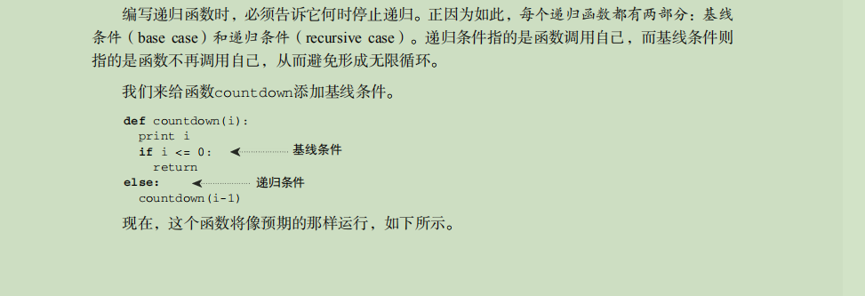
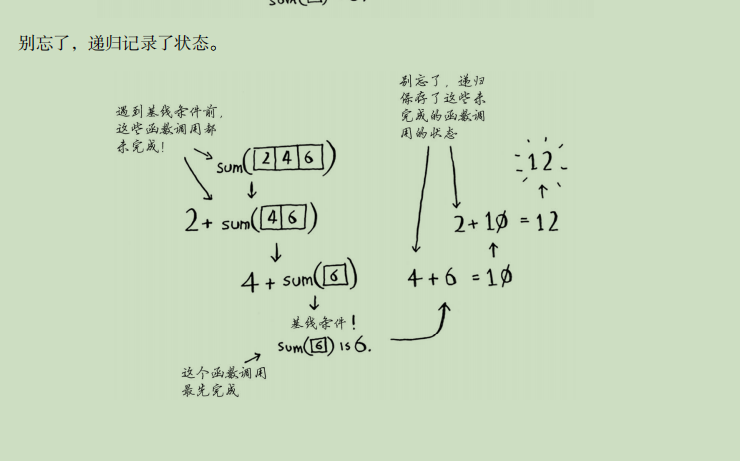

1. 递归: 指的是自己调用自己。每个递归函数都有两个条件：基线条件(让递归停止的条件),递归条件(让递归进行下去的条件)  




玩转数据结构递归笔记：  
本质上，是将原来的问题，转化为更小的同一问题  

```
public static int sum(int[] arr,int l){
if(l == arr.length)
    return 0;                        ------------------> 求解最基本问题
return arr[l] + sum(arr,l+1);  -------------------> 把原问题转化为更小的问题
}
```