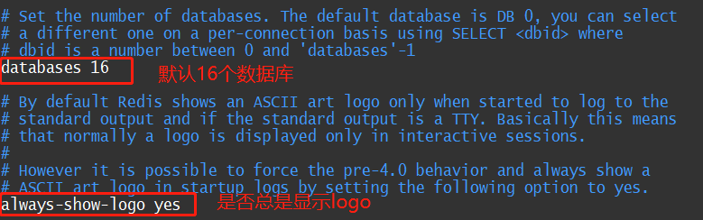

## Redis简介

### 为什么要使用NoSQL呢?

MySQL作为存储中间件是无法扛高并发的，而且大量并发请求中80%都是读请求，使用 NoSQL 做缓存来缓解MySQL的并发压力是很有效的

### 为什么不用 Map 或者 Guava 做缓存？

* Map 和 Guava 实现的是本地缓存，生命周期随着jvm的销毁而结束。在分布式架构中，多个实例每个实例单独持有一份缓存，无法保证缓存一致性。而redis或memCached属于分布式缓存，在分布式架构的多个实例下，可以共用一份缓存，可以保证缓存一致性。缺点是需要保证缓存的高可用  

### Redis  --> Remote Dictionary Server ,即远程字典服务

* Redis 是一个基于内存的数据库，因为读写速度快所以多用做缓存。
* Redis 支持多种类型的数据结构，如 字符串（strings）， 散列（hash）， 列表（lists）， 集合（set）， 有序集合（sorted set） 与范围查询， bitmaps，hyperloglogs 和 地理空间（geospatial） 索引半径查询。
* redis支持事务、持久化、lua脚本、集群部署

* cpu不是redis的瓶颈，Redis的瓶颈是机器的内存和网络带宽

### redis为什么快？

* 基于纯内存访问
* 单线程架构避免了线程上下文切换带来的资源损耗
* 使用基于事件的IO多路复用模型

### redis都有哪些数据类型分析？分别在哪些场景下使用比较合适？字符串最大不能超过多少？

* String：最简单的 K-V 缓存
* Hash：类似map，一般可以用于存对象，方便对某个字段进行操作
* List ：有序列表，微博某大v的粉丝。可以用list存储。可以用lrange来实现分页。还可以作为简单的消息队列
* Set：无序集合，自动去重。分布式环境下用redis来全局去重。并且可以算交集，并集，差集
* Sorted set：排序的set，能自动去重。可以用于排行榜

还有HyperLogLog、流、地理坐标等

* 最大不能超过 512MB

### redis和memcached区别？redis线程模型是什么？为什么单线程的redis比多线程的memcached效率要高得多？为什么redis是单线程的但是可以支撑高并发？

* 答：

  * redis数据类型比memcached丰富，

  * redis单线程，mem多线程。
  * mem没有原生集群模式，redis原生支持cluster模式

redis线程模型：redis基于refactor模型开发了文件事件处理器，这个是单线程的实现，采用io多路复用同时监听多个socket

### redis默认分多少个数据库？

* 16个，从 0 到 15

##  Linux下安装Redis

```bash
# 使用wget命令下载redis源码
wget http://download.redis.io/releases/redis-5.0.8.tar.gz
# 解压源码
tar -zxvf redis-5.0.8.tar.gz
# 进入解压目录进行编译
cd redis-5.0.8
# 安装gcc环境
yum install -y gcc-c++
# 编译
make
# 安装
make install
# 修改 redis.conf 配置文件，把daemonize 改为 yes,把bind改为绑定本机局域网ip
# 启动redis
redis-server /user/local/redis-5.0.8/redis.conf
# 启动后用redis客户端连接到server
redis-cli -p 6379
# 测试是否连接成功,当收到 ‘Pong’说明连接成功
ping
# 从客户端关闭server
127.0.0.1:6379> shutdown
not connected> exit
```

## 压力测试

#### 官方工具  -->  redis-benchmark

| 序号 | 选项      | 描述                                       | 默认值    |
| ---- | --------- | ------------------------------------------ | --------- |
| 1    | **-h**    | 指定服务器主机名                           | 127.0.0.1 |
| 2    | **-p**    | 指定服务器端口                             | 6379      |
| 3    | **-s**    | 指定服务器 socket                          |           |
| 4    | **-c**    | 指定并发连接数                             | 50        |
| 5    | **-n**    | 指定请求数                                 | 10000     |
| 6    | **-d**    | 以字节的形式指定 SET/GET 值的数据大小      | 2         |
| 7    | **-k**    | 1=keep alive 0=reconnect                   | 1         |
| 8    | **-r**    | SET/GET/INCR 使用随机 key, SADD 使用随机值 |           |
| 9    | **-P**    | 通过管道传输 请求                          | 1         |
| 10   | **-q**    | 强制退出 redis。仅显示 query/sec 值        |           |
| 11   | **--csv** | 以 CSV 格式输出                            |           |
| 12   | **-l**    | 生成循环，永久执行测试                     |           |
| 13   | **-t**    | 仅运行以逗号分隔的测试命令列表。           |           |
| 14   | **-I**    | Idle 模式。仅打开 N 个 idle 连接并等待。   |           |

#### 简单性能测试:

```bash
# 100个并发连接进行100000次请求
redis-benchmark -h localhost -p 6379 -c 100 -n 100000
```

## 常用命令

#### 通用命令

```bash
# 默认是16个数据库，切换数据库(0-15)
127.0.0.1:6379[3]> select 3  # 切换数据库
OK
127.0.0.1:6379[3]> dbsize # 统计数据库中key个数 
(integer) 2
127.0.0.1:6379[3]> keys * # 查看数据库中的所有key
1) "out"
2) "money"
127.0.0.1:6379[3]> flushdb # 清空当前数据库
OK
127.0.0.1:6379[3]> flushall # 清空所有数据库
OK
127.0.0.1:6379[3]> exists money # 查看key是否存在(返回0为不存在，1为存在)
(integer) 1
127.0.0.1:6379[3]> move money 0 # 把key迁移到其他数据库
(integer) 1
127.0.0.1:6379[3]> keys *  # 迁移成功
1) "out"
127.0.0.1:6379[3]>  expire out 10000 # 对key设置过期时间10000s
(integer) 1
127.0.0.1:6379[3]> ttl out # 查看key的剩余存活时间
(integer) 9997
127.0.0.1:6379[3]> type out # 查看key所存value的类型
string
```

#### 五大基本数据类型

##### String字符串类型

```bash
127.0.0.1:6379[3]> set k1 v1 # 设置值
OK
127.0.0.1:6379[3]> get k1 # 获取值
"v1"
127.0.0.1:6379[3]> append k1 hello # 给指定key的value追加字符串
(integer) 7
127.0.0.1:6379[3]> get k1 # 追加成功
"v1hello"
127.0.0.1:6379[3]> append k2 v2 #追加时如果key不存在则相当于set k-v
(integer) 2
127.0.0.1:6379[3]> get k2 # 设置成功
"v2"
```

```bash
127.0.0.1:6379[3]> set money 0 #设置余额初始值为数字
OK
127.0.0.1:6379[3]> incr money # 增加1
(integer) 1
127.0.0.1:6379[3]> decr money # 减少1
(integer) 0
127.0.0.1:6379[3]> get money # 查看修改结果
"0"
127.0.0.1:6379[3]> incrby money 100 # 增加指定步长
(integer) 100
127.0.0.1:6379[3]> decrby money 50 # 减少指定步长
(integer) 50
127.0.0.1:6379[3]> get money # 查看修改结果
"50"
```

```bash
127.0.0.1:6379[3]> get k1 #查看k1
"v1hello"
127.0.0.1:6379[3]> getrange k1 1 3 # 截取字符串
"1he"
127.0.0.1:6379[3]> getrange k1 0 -1 #截取全部字符串(-1)
"v1hello"
127.0.0.1:6379[3]> set k2 abcd 
OK
127.0.0.1:6379[3]> setrange k2 1 xx # 替换字符串
(integer) 4
127.0.0.1:6379[3]> get k2 # 替换成功
"axxd
```

```bash
127.0.0.1:6379[3]> setex k3 100 hello #设置值带过期时间
OK
127.0.0.1:6379[3]> ttl k3 # 设置过期时间成功
(integer) 96
127.0.0.1:6379[3]> setnx db redis # 如果不存在则创建，创建成功返回1
(integer) 1
127.0.0.1:6379[3]> get db #key不存在，创建成功
"redis"
127.0.0.1:6379[3]> setnx db redis #key已存在，创建失败返回0
(integer) 0
127.0.0.1:6379> mset k1 v1 k2 v2 k3 v3 #同时设置多个值
OK
127.0.0.1:6379> mget k1 k2 k3 # 同时获取多个值
1) "v1"
2) "v2"
3) "v3"
127.0.0.1:6379> msetnx k1 v1 k4 v4 # msetnx是一个原子命令，要么一起成功，要么一起失败
(integer) 0
127.0.0.1:6379> keys * # 查看所有key发现由于k1已存在，所以k4没有被设置
1) "k3"
2) "k1"
3) "k2"
```

```bash
127.0.0.1:6379> getset db redis #先获取value再设置value，如果原值不存在则返回null
(nil)
127.0.0.1:6379> get db #设置成功
"redis"
127.0.0.1:6379> getset db mongodb #如果原值存在则返回原值并设置新值
"redis"
127.0.0.1:6379> get db #设置成功
"mongodb"
```

##### List列表类型

```bash
127.0.0.1:6379[3]> lpush mylist one # 左插
(integer) 1
127.0.0.1:6379[3]> lpush mylist two
(integer) 2
127.0.0.1:6379[3]> lpush mylist three
(integer) 3
127.0.0.1:6379[3]> lrange mylist 0 -1 # 获取list中的值
1) "three"
2) "two"
3) "one"
127.0.0.1:6379[3]> lrange mylist 0 1  # 获取list中指定区间的值
1) "three"
2) "two"
127.0.0.1:6379[3]> rpush mylist hello # 右插
(integer) 4
127.0.0.1:6379[3]> get mylist # 尝试发现list类型不能使用get命令来获取整个list中的值
(error) WRONGTYPE Operation against a key holding the wrong kind of value
127.0.0.1:6379[3]> lrange mylist 0 -1 #list类型必须使用lrange来获取list中的值
1) "three"
2) "two"
3) "one"
4) "hello"
```

```bash
127.0.0.1:6379[3]> lpop mylist #从左边弹出一个元素
"three"
127.0.0.1:6379[3]> rpop mylist # 从右边弹出一个元素
"hello"
127.0.0.1:6379[3]> lrange mylist 0 -1 # 查看弹出两个元素后的list中值
1) "two"
2) "one"
127.0.0.1:6379[3]> lindex mylist 0 #根据下标获取list中值
"two"
127.0.0.1:6379[3]> lindex mylist 1 
"one"
```

```bash
127.0.0.1:6379[3]> lpush mylist one #左插一个重复的值
(integer) 3
127.0.0.1:6379[3]> lrange mylist 0 -1 #查看当前list中的值
1) "one"
2) "two"
3) "one"
127.0.0.1:6379[3]> llen mylist # 查看列表的长度
(integer) 3
127.0.0.1:6379[3]> lrem mylist 1 one # 移除列表中的一个one
(integer) 1
127.0.0.1:6379[3]> lrange mylist 0 -1 #查看移除后的结果
1) "two"
2) "one"
```

```bash
127.0.0.1:6379[3]> rpush mylist v1
(integer) 1
127.0.0.1:6379[3]> rpush mylist v2
(integer) 2
127.0.0.1:6379[3]> rpush mylist v3 #右插3个元素
(integer) 3
127.0.0.1:6379[3]> ltrim mylist 1 2 #截取list
OK
127.0.0.1:6379[3]> lrange mylist 0 -1 #查看截取后的结果
1) "v2"
2) "v3"
```

```bash
127.0.0.1:6379[3]> rpush mylist v1 v2 v3 v4 # 右插4个元素
(integer) 4
127.0.0.1:6379[3]> lrange mylist 0 -1
1) "v1"
2) "v2"
3) "v3"
4) "v4"
127.0.0.1:6379[3]> rpoplpush mylist list #从右边弹出一个元素左插入另一个list中
"v4"
127.0.0.1:6379[3]> rpoplpush mylist list #再次执行
"v3"
127.0.0.1:6379[3]> lrange mylist 0 -1 #查看源list结果
1) "v1"
2) "v2"
127.0.0.1:6379[3]> lrange list 0 -1 #查看目标list结果
1) "v3"
2) "v4"
```

```bash
127.0.0.1:6379[3]> exists list #确保list不存在
(integer) 0
127.0.0.1:6379[3]> rpush list v1 #右插一个元素
(integer) 1
127.0.0.1:6379[3]> lset list 0 tttt # 把list下标0的位置替换为tttt
OK
127.0.0.1:6379[3]> lrange list 0 -1 # 查看替换后结果
1) "tttt"
127.0.0.1:6379[3]> lset list 1 v2 # 不存在的下标替换会报错
(error) ERR index out of range
```

```bash
127.0.0.1:6379[3]> rpush mylist v1 v2 v3 v4 #右插4个元素
(integer) 4
127.0.0.1:6379[3]> lrange mylist 0 -1
1) "v1"
2) "v2"
3) "v3"
4) "v4"
127.0.0.1:6379[3]> linsert mylist before v2 0-0 #在list中指定的值前面插入
(integer) 5
127.0.0.1:6379[3]> lrange mylist 0 -1 #查看插入后结果
1) "v1"
2) "0-0"
3) "v2"
4) "v3"
5) "v4"
127.0.0.1:6379[3]> linsert mylist after v4 aa # 往list中指定的值后面插入
(integer) 6
127.0.0.1:6379[3]> lrange mylist 0 -1 # 查看插入结果
1) "v1"
2) "0-0"
3) "v2"
4) "v3"
5) "v4"
6) "aa"
```

总结:

* list由链表实现。列表中的值是有序的，可以通过索引下标来获取某个元素，列表中的值可以重复

##### Set集合数据类型

set中的值是不能重复的

```bash
127.0.0.1:6379[6]> sadd myset hello   #向集合中添加元素
(integer) 1
127.0.0.1:6379[6]> sadd myset world
(integer) 1
127.0.0.1:6379[6]> smembers myset  #查看集合中所有元素
1) "world"
2) "hello"
127.0.0.1:6379[6]> sismember myset hello #判断是否为集合中元素(是返回1)
(integer) 1
127.0.0.1:6379[6]> sismember myset 110 #不是返回0
(integer) 0
```

```bash
127.0.0.1:6379[6]> scard myset   # 获取set集合中的元素个数
(integer) 2
```

```bash
127.0.0.1:6379[6]> srem myset hello #移除set中指定元素
(integer) 1
127.0.0.1:6379[6]> smembers myset   #可以看到移除成功
1) "world"
```

```bash
127.0.0.1:6379[6]> smembers myset #查看当前set中所有元素
1) "002"
2) "001"
3) "world"
4) "003"
5) "004"
127.0.0.1:6379[6]> srandmember myset #随机抽出一个元素
"003"
127.0.0.1:6379[6]> srandmember myset 2 #随机抽出指定个数的元素
1) "001"
2) "003"
```

```bash
127.0.0.1:6379[6]> smove myset myset2 world #将一个set中指定值移动到另一个set中
(integer) 1
127.0.0.1:6379[6]> smembers myset  #查看源set
1) "003"
2) "004"
3) "002"
4) "001"
127.0.0.1:6379[6]> smembers myset2 #查看目标set
1) "world"
```

```bash
########################### 集合运算 ######################
127.0.0.1:6379[6]> sadd myset 001 002 003 #向myset中添加3个元素
(integer) 3
127.0.0.1:6379[6]> sadd myset2 003 004 005 #向myset2中添加3个元素
(integer) 3
127.0.0.1:6379[6]> sdiff myset myset2 # 计算myset2相对于myset的差集
1) "002"
2) "001"
127.0.0.1:6379[6]> sinter myset myset2 # 计算myset和myset2的交集
1) "003"
127.0.0.1:6379[6]> sunion myset myset2 # 计算myset和myset2的并集
1) "004"
2) "001"
3) "003"
4) "002"
5) "005"
# 交集可以用于计算共同关注，差集可以用于计算还没有关注的人
```

##### Hash(哈希，用于存储对象)

hash结构存储的是一个key-map结构

```bash
127.0.0.1:6379[6]> hset myhash name ak  #往hash结构中set值
(integer) 1
127.0.0.1:6379[6]> hget myhash name #获取一个字段的值
"ak"
127.0.0.1:6379[6]> hmset myhash age 27 address 0001 #set多个kye-value
OK
127.0.0.1:6379[6]> hmget myhash age address #获取多个字段值
1) "27"
2) "0001"
127.0.0.1:6379[6]> hgetall myhash #获取全部key-value
1) "name"
2) "ak"
3) "age"
4) "27"
5) "address"
6) "0001"
127.0.0.1:6379[6]> hdel myhash address #删除指定的key。此时对应的value也就消失了
(integer) 1
127.0.0.1:6379[6]> hgetall myhash  #删除成功
1) "name"
2) "ak"
3) "age"
4) "27"
```

```bash
127.0.0.1:6379[6]> hgetall myhash 
1) "name"
2) "ak"
3) "age"
4) "27"
127.0.0.1:6379[6]> hlen myhash # 查看hash中字段数量
(integer) 2
127.0.0.1:6379[6]> hexists myhash name # 判断hash中指定字段是否存在(1为已存在)
(integer) 1
127.0.0.1:6379[6]> hexists myhash address # 0为不存在
(integer) 0
127.0.0.1:6379[6]> hkeys myhash # 只获取hash中所有key
1) "name"
2) "age"
127.0.0.1:6379[6]> hvals myhash # 只获取hash中所有value
1) "ak"
2) "27"
```

```bash
# incr
127.0.0.1:6379[6]> hset myhash age 23
(integer) 1
127.0.0.1:6379[6]> hincrby myhash age 1 #给指定字段增加指定的值
(integer) 24
127.0.0.1:6379[6]> hincrby myhash age -1 #给指定字段减少指定的值(hash中没有decrby命令)
(integer) 23
127.0.0.1:6379[6]> hsetnx myhash name ak #不存在则设置
(integer) 1
127.0.0.1:6379[6]> hsetnx myhash name ak #存在则设置失败
(integer) 0
```

##### Zset(有序集合)

应用场景:排行榜、成绩排序

```bash
127.0.0.1:6379[6]> zadd myzset 1 one 2 two 3 three #向zset中添加元素
(integer) 3
127.0.0.1:6379[6]> zrange myzset 0 -1 #查看zset中的所有元素
1) "one"
2) "two"
3) "three"
127.0.0.1:6379[6]> zadd salary 2500 xiaohong 5000 zhangsan 500 kuang 
(integer) 3
127.0.0.1:6379[6]> zrangebyscore salary -inf +inf #在负无穷到正无穷范围内对员工薪资排序
1) "kuang"
2) "xiaohong"
3) "zhangsan"
127.0.0.1:6379[6]> zrangebyscore salary -inf +inf  withscores  #显示全部员工并附带薪资
1) "kuang"
2) "500"
3) "xiaohong"
4) "2500"
5) "zhangsan"
6) "5000"
127.0.0.1:6379[6]> zrangebyscore salary -inf 2500 withscores    # 显示工资小于2500的员工，按薪资升序排序
1) "kuang"
2) "500"
3) "xiaohong"
4) "2500"
```

```bash
127.0.0.1:6379[6]> zadd myset 1 hello 2 world 3 ak #添加3个元素
(integer) 3
127.0.0.1:6379[6]> zcount myset 1 3 #统计zset指定区间的元素数量
(integer) 3
127.0.0.1:6379[6]> zcount myset 1 2 #统计zset指定区间的元素数量
(integer) 2
```

#### 三种特殊数据类型

##### geospatial

共6个命令:

* geoadd: 添加地理坐标
* geopos: 获取地理坐标
* geodist: 获取距离
* georadius: 获取附近的坐标
* georadiusbymember: 获取元素附近坐标
* geohash: 获取元素的geohash值

```bash
# 添加地理坐标(经度，纬度)
127.0.0.1:6379[6]> geoadd china:city 116.40 39.90 beijing 121.47 31.23 shanghai 106.50 29.53 chongqing 114.05 22.52 shenzhen 120.16 60.24 hangzhou 108.96 34.26 xian
(integer) 6
# 获取地理坐标(经度，纬度)
127.0.0.1:6379[6]> geopos china:city beijing shanghai 
1) 1) "116.39999896287918091"
   2) "39.90000009167092543"
2) 1) "121.47000163793563843"
   2) "31.22999903975783553"
```

单位:

* m 表示单位为米
* km 表示单位为千米
* mi 表示单位为英里
* ft 表示单位为英尺

```bash
# 查看两个坐标之间的距离
127.0.0.1:6379[6]> geodist china:city beijing shanghai km 
"1067.3788"
```

```bash
# 找出指定key集合中与给定坐标距离不超过给定距离的元素
127.0.0.1:6379[6]> georadius china:city 110 30 500 km
1) "chongqing"
2) "xian"
# 可追加参数:
# withdist: 返回位置与给定坐标的距离
# withcoord: 返回位置元素的经纬值
# withhash: 返回元素经过geohash后的值，官方文档标注用处不大
127.0.0.1:6379[6]> georadius china:city 110 30 500 km withcoord 
1) 1) "chongqing"
   2) 1) "106.49999767541885376"
      2) "29.52999957900659211"
2) 1) "xian"
   2) 1) "108.96000176668167114"
      2) "34.25999964418929977"
127.0.0.1:6379[6]> georadius china:city 110 30 500 km withdist
1) 1) "chongqing"
   2) "341.9374"
2) 1) "xian"
   2) "483.8340"
127.0.0.1:6379[6]> georadius china:city 110 30 500 km withdist withcoord count 1 # 筛选出指定的结果
1) 1) "chongqing"
   2) "341.9374"
   3) 1) "106.49999767541885376"
      2) "29.52999957900659211"
```

```bash
# 找出指定key集合中与给定元素距离不超过给定距离的元素
127.0.0.1:6379[6]> georadiusbymember china:city beijing 1000 km
1) "beijing"
2) "xian"
```

```bash
# 获取指定元素的geohash值
127.0.0.1:6379[6]> geohash china:city beijing shanghai
1) "wx4fbxxfke0"
2) "wtw3sj5zbj0"
```

```bash
# geo底层是用zset实现的，所以可以用zset命令来操作geo
127.0.0.1:6379[6]> zrange china:city 0 -1 # 查看地图中全部元素
1) "chongqing"
2) "xian"
3) "shenzhen"
4) "shanghai"
5) "beijing"
6) "hangzhou"
127.0.0.1:6379[6]> zrem china:city beijing  # 移除指定元素
(integer) 1
127.0.0.1:6379[6]> zrange china:city 0 -1
1) "chongqing"
2) "xian"
3) "shenzhen"
4) "shanghai"
5) "hangzhou"
```

##### hyperloglog

redis 2.8.9版本新增了Hyperloglog数据结构，用于基数统计。基数统计指的是统计一个集合中所有不重复的数字。

* 使用场景:统计网页UV（一个人访问网站多次，但还是算作一个人）。传统的网页UV统计方式是使用一个set来保存用户id，然后统计set中元素个数的方式，但是UV统计是为了计数，而不是为了保存用户id，会造成空间浪费

* 优点:所占用的内存是固定的，并且最多能满足2^64个不同元素的计数，而仅需要12KB内存
* 缺点:有0.81%的错误率。如果允许容错则使用hyperloglog，如果需要精确统计则使用set集合

```bash
# 创建一组元素mykey
127.0.0.1:6379[6]> pfadd mykey 0001 0002 0003 0004 0005 0006 0007
(integer) 1
# 对mykey进行基数统计
127.0.0.1:6379[6]> pfcount mykey
(integer) 7
# 创建第二组元素mykey2
127.0.0.1:6379[6]> pfadd mykey2 0001 0007 0008 0009 0010
(integer) 1
127.0.0.1:6379[6]> pfcount mykey2
(integer) 5
# 合并两组元素: mykey3 = mykey + mykey2 
127.0.0.1:6379[6]> pfmerge mykey3 mykey mykey2
OK
# 查看合并后集合的并集数量
127.0.0.1:6379[6]> pfcount mykey3
(integer) 10
```

##### bitmaps(位图)

按位存储信息，每位只有0和1两个状态。可以用于统计有两个状态的信息，比如活跃或不活跃、登录或未登录。

如果使用bitmaps统计一年的打卡情况，则365天只需要365bit，1字节=8bit，则只需要46个字节左右

```bash
#依次设置一周中每一天的打卡情况
127.0.0.1:6379[6]> setbit sign 0 1
(integer) 0
127.0.0.1:6379[6]> setbit sign 1 0
(integer) 0
127.0.0.1:6379[6]> setbit sign 2 1
(integer) 0
127.0.0.1:6379[6]> setbit sign 3 0
(integer) 0
127.0.0.1:6379[6]> setbit sign 4 0
(integer) 0
127.0.0.1:6379[6]> setbit sign 5 1
(integer) 0
127.0.0.1:6379[6]> setbit sign 6 1
(integer) 0
# 统计一周的打卡情况
127.0.0.1:6379[6]> bitcount sign
(integer) 4
# 查看星期日的打卡情况:已打卡
127.0.0.1:6379[6]> getbit sign 6
(integer) 1
# 查看星期五的打卡情况:未打卡
127.0.0.1:6379[6]> getbit sign 4
(integer) 0
```

## 持久化

#### 为什么要持久化？

redis是内存数据库，如果不将内存中的数据保存到磁盘，一旦服务器进程退出，内存中数据就会丢失，所以redis提供了两种持久化方案:一种是快照的方式，一种是类似日志追加的方式。持久	化机制主要用做灾难恢复。如果同时开启了rdb和aof两种持久化机制，当redis重启时会使用aof来重新构建数据，因为aof中的数据

#### RDB持久化

RDB(Redis DataBase)持久化是一种快照存储的持久化方式，也就是将某一时刻的内存数据保存到磁盘上，redis服务器启动时会重新加载dump.rdb文件中的数据到内存中来恢复数据库

##### 如何配置开启rdb持久化？

编辑redis.conf，配置"save 60 1000"，意味着每隔60s检查一次，如果60s内有1000个key发生了变化就重新生成一个dump.rdb文件，

##### RDB快照触发机制:

* 满足配置文件中的save检查点时，会自动触发rdb快照
* 手动调用save或bgsave，同步或异步执行rdb快照生成
* 执行flushall命令也会触发rdb快照
* 使用shutdown命令退出redis，也会触发rdb快照

##### RDB持久化的工作流程:

1. fork一个子进程，子进程将数据dump到临时的rdb快照文件中
2. 完成rdb快照文件生成后，替换之前的旧快照文件。每次生成一个新的快照dump.rdb文件，都会覆盖之前的老快照。

##### RDB持久化的数据恢复实验

在redis中插入几条数据，然后通过两种方式停掉redis，然后再重启redis，看刚刚插入的数据是否还在

* 插入数据后，使用redis-cli shutdown的方式，停掉redis，发现插入的数据还在。通过redis-cli shutdown的方式停止redis是一种安全退出操作，redis会在退出之前生成rdb快照文件
* 插入数据后，用kill -9杀掉redis进程，模拟redis宕机，发现redis数据丢失

```bash
192.168.200.40:6379> config get dir  # 先查看rdb文件的存放目录
1) "dir"
2) "/usr/local/bin"
# 把rdb文件放在上面的存放目录中，redis启动时则会自动检查dump.rdb文件并恢复其中的数据
```

##### RDB持久化的优点:

1. RDB会在不同时刻生成不同的全量备份，十分适合冷备，便于定时将rdb文件同步到远程云服务器上
2. RDB持久化生成RDB文件时对redis对外提供读写服务影响较小，因为只需要从redis主进程fork一个子进程，让子进程执行磁盘IO进行rdb持久化即可
3. 跟AOF相比，redis基于rdb文件恢复数据时更快速

##### RDB持久化的缺点

* fork子进程进行持久化需要占用一定的内存空间，如果数据文件太大会导致客户端提供的服务暂停数毫秒甚至数秒？
* rdb持久化一般配置为5分钟生成一次，生成过程中如果redis宕机就会丢失5分钟数据

#### AOF持久化

aof(Append Only File)持久化方式就是把server端收到的每一条写命令，以redis协议追加保存到appendonly.aof文件中，当redis重启时会加载aof文件并重放命令来恢复数据

##### aof持久化的配置方式

AOF持久化默认是关闭的

```bash
appendonly yes    # 把no改为yes，开启aof持久化
appendfilename "appendonly.aof" # 配置aof文件名
appendsync everysec # 写入策略:每秒fsync写入一次
no-appendfsync-on-rewrite no # 默认不重写aof文件
dir ~/redis/  # aof文件保存目录
```

##### AOF的rewrite

redis中的数据都保存在内存中，所以存储的数据是有限的，很多数据可能会自动过期，也可能被用户主动删除，但是之前已经被删除的数据对应的写命令还保存在aof日志中，而aof日志只有一个，所以会不断膨胀。所以aof会自动在后台每隔一段时间做rewrite操作。

具体步骤:

1. redis从主进程中fork一个子进程，然后子进程基于当前内存中数据构建日志，往一个新的临时aof日志中写入
2. 主进程继续接收client新的写操作，然后在内存中写一份aof日志，然后继续往旧的aof日志中写入
3. 子进程写完新日志后，redis主进程将子进程rewrite期间在内存中写的新日志追加写入新的aof日志中
4. 用新aof日志文件替换掉旧的aof日志


rewrite策略配置:

在redis.conf中可以配置rewrite策略

```shell
auto-aof_rewrite-percentage 100

auto-aof-rewrite-min-size 64mb
```

假如第一次rewrite后日志为128MB，然后继续写入aof日志，如果发现增长比例超过了之前的100%，256MB，然后去跟rewrite-min-size比较一下，256MB > 64MB，才会触发rewrite

##### AOF持久化优点

1. aof通过一个后台线程每隔一秒执行一次fsync操作，所以最多丢失1秒数据，可以更好的保护数据不丢失

* aof持久化以append-only方式追加写入，没有任何磁盘寻址开销，写入性能很高并且文件不容易破损，即使尾部破损也很容易修复
* aof日志rewrite时不影响客户端的读写。rewrite会生成一个新日志文件，老日志文件正常写入，等新文件merge完成后再交换新老日志文件即可
* aof日志文件的命令可读，非常适合做灾难恢复。比如不小心用flushall命令清空了数据，只要还没有rewrite，就可以立即拷贝aof文件，然后编辑将aof文件最后一条flushall命令删除，然后再将aof文件放回去即可恢复数据

##### AOF持久化缺点

1. 对内存中的同一份数据来说，aof日志要比rdb文件更大
2. 由于aof持久化方式一般会配置每秒fsync一次日志文件，所以导致开启aof后redis支持的写qps会比rdb低。当然每秒一次fsync下的redis性能也还是很高的
3. 旧版本的redis通过aof方式记录日志后，通过rewrite后把日志merge后然后再回放命令恢复出来的数据和原数据不一致，存在bug。后来的版本中aof为了避免rewrite产生bug，会基于当时内存的数据进行指令的重新构建，提高数据完整性

##### aof文件损坏的处理

在写入aof日志文件时redis服务器宕机则可能导致aof日志文件出现格式错误，当重启redis服务器时，redis服务器会拒绝载入这个aof文件，需要使用redis-check-aof对aof文件修复后再重新启动redis。修复时可能删除部分aof日志内容，也就是修复时可能丢失一部分数据

```bash
redis-check-aof --fix appendonly.aof
```

### RDB与AOF如何选择？

* 如果仅使用RDB持久化， redis意外宕机时会丢失很多数据；
* 如果仅使用AOF持久化，aof备份复杂容易出bug而且恢复时速度慢
* 所以如果单纯选择某1种持久化方式，都有缺点，综上所述，需要同时开启RDB和AOF。用AOF来保证数据不丢失，作为数据恢复时的首选。用RDB文件来做不同程度的冷备，这样在AOF文件丢失或损坏不可用时，可以用RDB进行快速数据恢复。

1. redis支持同时开启RDB与AOF两种持久化方式。并且在同时开启时，redis优先使用aof日志来恢复数据，因为aof文件保存的数据比rdb文件更完整。
2. 并且如果同时开启RDB和AOF时，当RDB的快照fork在工作时，则redis不会执行aof的rewrite；如果redis在执行aof的rewrite时，就不会执行rdb的fork
3. 如果rdb在执行快照fork时，此时即使用户执行bgrewriteaof命令，也不会立即执行，会等待rdb快照生成后，才会去执行aof的rewrite

| 持久化方式 | RDB      | AOF        |
| ---------- | -------- | ---------- |
| 启动优先级 | 低       | 高         |
| 体积       | 小       | 大         |
| 恢复速度   | 快       | 慢         |
| 数据完整性 | 会丢数据 | 由策略决定 |
| 轻重       | 重       | 轻         |

### 持久化文件备份方案	

每小时拷贝一份rdb文件备份到指定文件夹，仅保留最近48小时的备份
每天拷贝一份rdb文件备份到指定文件夹，仅保留最近1个月的备份
每天晚上把服务器上所有备份发送到云端

### 企业级人为删除数据后的数据恢复方案

如果redis当前的rdb和aof文件都出现了丢失/损坏到无法恢复。或者是某次上线后有bug进行回退:

2. 停掉redis，修改配置文件中关闭aof，从云端拉取最新rdb小时级备份拷贝到redis文件夹，重启redis。确认数据恢复后，直接在redis-cli使用命令热修改配置来打开aof，让redis把内存中数据写入aof日志中，此时aof和rdb两个文件的数据就同步了。
3. 使用命令行修改的配置没有被持久化修改，所以再次停掉redis，手动配置打开aof，然后重启redis，数据恢复结束

## Replication

redis replication -> 主从架构 -> 读写分离 -> 支持水平扩容支撑高并发

#### 主从复制过程

1. slaveNode根据配置文件中配置的slaveof配置获取masterNode的host和port
2. slaveNode内部有一个定时任务会每秒检查是否有新的masterNode要连接和复制，如果发现有就跟masterNode建立socket网络连接
3. 连接建立后slaveNode先向masterNode发送ping命令
4. 如果masterNode设置了requirePass则slaveNode必须发送masterAuth的口令过去进行认证
5. slaveNode会先发送一个psync命令(psync runid offset)给masterNode,然后masterNode会根据情况返回响应信息，可能是fullResync runid offset触发全量复制，也可能是continue触发增量复制。如果slaveNode是第一次与masterNode建立连接，那么会触发一次fullResynchronization过程。如果master在指定期间内发现同时有多个slaveNode都来重新连接，只会启动一个rdb的save操作，用一份数据服务所有slaveNode。全量复制:masterNode执行bgsave，在后台启动一个线程开始生成rdb快照，如果rdb复制时间超过默认配置的60s(repl-timeout)，则slaveNode在等待超时后会认为复制失败。对于千兆网卡机器，一般每秒传输100MB，传输6G文件很可能超过60s。所以可以适当调大这个参数。
6. 然后将rdb文件发送给slaveNode，发送过程中masterNode和slaveNode都会维护一个offset，master自身会不断累加offset，slaveNode也会不断累加offset，slave每秒上报一次自己的offset给master，同时master会保存每个slave的offset。offset并不是专用于全量复制的，而是在整个replication过程中都会维护的，因为master和slave要相互知道各自数据的offset才能知道互相之间的数据不一致，才能触发replication
7. 在masterNode生成rdb期间会将所有写命令缓存在内存中，当slaveNode保存了rdb后再将缓存的写命令复制给slaveNode。配置: client-output-buffer-limit slave 256MB 64MB 60,意思是如果在复制期间内存缓冲区持续消耗超过64MB，或者一次性超过256MB，那么停止复制，认为本次复制失败
8. slaveNode接收到rdb后清空自己的旧数据，重新加载rdb到自己的内存中，同时基于旧的数据版本对外提供服务。复制完成的时候，需要删除旧数据集，加载新数据集，这个时候就会暂停对外服务了
9. 如果slaveNode开启了aof，则会立即执行bgRewriteAof来重写aof
10. masterNode和slaveNode之间通过互发heartBeat信息来互相确认网络连接状态，master默认每隔10s发送一次heartbeat，slaveNode每隔1秒发送一个heartbeat。如果全量复制期间master和slave之间网络连接断掉，那么slave重新连接master会触发增量复制，masterNode会直接从自己的backlog中获取部分丢失的数据发送给slaveNode，backlog默认是1MB，然后master根据slaveNode发送的psync中的offset来从backlog中获取数据的
11. masterNode后续每次接到写命令后，先在本机写入数据，然后异步将命令发送给slaveNode

主从复制期间的rdb生成，rdb网络拷贝，slaveNode旧数据的清理，slaveNode的aof reWrite,很耗费时间，如果复制的数据量在4G-6G之间，那么很可能全量复制时间消耗1分半到2分钟

* backlog: masterNode有一个backlog，默认是1MB大小，当masterNode给slaveNode复制数据时，也会将数据在backlog中同步写一份，backlog主要是用来做断点续传的增量复制的
* master runid: info server命令可以查看master runid。如果只根据host+port定位masterNode是不靠谱的，如果masterNode重启或者数据发生了变化，这时slaveNode应该根据不同runid来区分这种情况，runid变了就做全量复制，runid没有变就增量复制。如果想重启redis不更改runid，可以使用redis-cli debug reload命令 

#### 断点续传

redis从2.8开始支持主从复制的断点续传。也就是说如果主从复制过程中网络连接断掉了，可以接着上次复制的地方继续复制而不是从头开始复制一份。

masterNode会在内存中维护一个backLog，masterNode和slaveNode都会保存一个replica offset和master id。offset就是保存在backlog中的，如果master和slave网络连接断开，则slave会让master从上次的replica offset开始继续复制，如果没有找到对应的offset，则会执行一次resynchronization(全量复制)

#### 无磁盘化复制

masterNode直接在内存中创建rdb，然后不落地到磁盘，直接发送给slaveNode

相关配置参数:

1. repl-diskless-sync
2. repl-diskless-sync-delay 等待一定时长再开始复制，因为要等待更多的slave重新连接

#### 主从复制过程中的过期key处理

slaveNode不会主动过期key，当master过期了一个key，或者通过LRU淘汰了一个key，会模拟一条del命令发送给slave

#### 基于replication的主从复制架构

* 配置slaveNode:

在配置文件中配置 slaveof 192.168.1.1 6379即可，或者使用slaveof命令

开启读写分离: slave节点默认是开启只读的 -->   slave-read-only yes

配置master连接口令: ----> masterauth hadoop

* 配置masterNode: 

启用安全认证: ---> requirepass hadoop

在masterNode上使用info replication查看主从复制状态


这样即可横向扩展读节点，单个从节点读QPS大约5w，两个从节点组成集群能扛读QPS为10w+

## Sentinel 哨兵

当使用redis主从复制模式时，一旦master宕机，需要人工将slave节点升级为master，然后修改所有程序的master节点地址，然后重新上线。这种故障处理方式效率低下，于是redis从2.8开始提供sentinel架构来解决这个问题，sentinel也就是自动挡主从复制模式。

哨兵用于监控redis的集群的高可用状态，哨兵主要功能有:

* 集群监控:负责监控 redis masterNode 和 slaveNode 是否故障
* 消息通知: 如果某个redis实例发生故障，哨兵负责发送消息作为报警通知管理员
* 故障转移: 如果masterNode宕机故障了，哨兵负责将master自动转移到slaveNode上
* 配置中心: 当进行故障转移时，通知client客户端新的master地址

哨兵作为一个用来保证redis集群高可用的组件，它本身必须是高可用的，所以哨兵支持集群部署，即使部分哨兵节点挂掉，哨兵集群还是可以正常工作的。当故障转移时，判断某个masterNode是否宕机需要大部分哨兵都同意才行，涉及到了分布式选举问题。

目前redis使用的是sentinal2版本，相比sentinal1重写了很多代码，使故障转移的机制和算法变得更加健壮和简单

#### 哨兵集群搭建

* 哨兵搭建集群时，最少需要3个实例。为什么哨兵集群两个节点无法正常工作(死局)?

选举规则:

1. 被选举节点无法参与投票
2. n代表集群中节点总数，
3. quorum代表选举票数，
4. majority代表选举成立时的票数，n确定时则majority也确定了，是一个定值

两个节点无法正常工作的原因：

n为2，majority为2，当A节点宕机时，quorum为1, quorum<majority，所以投票不成立，无法执行故障转移


三个节点可以正常工作的原因:

n为3，majority为2，当A节点宕机时，B、C节点投票，quorum为2，quorum=majority，所以投票成立，可以执行故障转移


* 哨兵集群只能保证redis集群的高可用性，不保证主从架构的数据零丢失


#### 集群异步复制的问题

哨兵集群对主从复制架构redis集群进行故障转移主备切换过程中，有两种情况会导致数据丢失：

1. 主从间异步复制机制导致数据丢失:因为master与slave之间的复制是异步的，所以可能有部分数据还没等复制到slave，master就宕机了，此时这部分数据就丢失了
2. 脑裂导致数据丢失: 某个master所在机器突然脱离了正常网络，无法与其他slave机器建立网络连接，但是实际上master还运行着，此时哨兵集群可能会认为master已宕机，然后开始选举，将其他slave切换成了master，此时集群中同时存在两个master，也就是所谓的脑裂。此时虽然某个slave被切换成了master，但是有可能client还没来得及切换到新的master，还继续向旧master写入数据，当旧master再次与集群恢复网络连接时，会被当作slave挂到新的master上，自己的数据会清空，重新从新master同步数据，最终导致client写入的这部分数据永久丢失。

解决办法:

在redis.conf中修改如下配置:

```bash
# 要求在整个集群中至少有一个slave与master的同步延迟不能超过10秒
min-slaves-to-write 1
min-slaves-max-lag 10
```

也就是说，当所有的slave的数据复制和同步延迟都超过了10秒，那么master不再接收任何写请求。

(1) 减少异步复制机制造成的数据丢失:  min-slave-max-lag 10 可以确保一旦slave和master之间复制数据和ack延时太长，master就认为自己本身此时宕机会造成丢失很多数据，所以拒绝写请求，以此来把master宕机时由于数据未同步到slave造成的数据丢失降低在可控范围内(10s内)

(2) 减少脑裂造成的数据丢失: 集群中出现脑裂后，哨兵集群已经选举出了新的master在接收写请求，而旧master还在接收写请求，但是由于上面的配置后，10s后旧master发现没有任何slave复制同步数据，此时就会停止写入，然后旧master所在机器网络恢复后重新连接到集群中成为slave，此时整个集群只丢失了10s数据。

#### 故障转移

* sdown:主观宕机。一个哨兵ping一个master，超过了配置中的is-master-down-after-milliseconds指定的毫秒数后，就认为这个master宕机了

* odown:客观宕机。如果quorum数量的哨兵都认为一个master宕机了，就是客观宕机

* sdown与odown的转换过程:如果一个哨兵在指定时间内收到了quorum数量的其他哨兵也认为这个master是sdown了，那么就认为此时odown成立，也就是认为这个master真的宕机了。

哨兵集群中的节点之间是如何自动发现的？

哨兵之间的互相发现，是通过redis的pub/sub系统实现的，每个哨兵会往_sentinel_:hello channel中发送消息，每隔两秒钟每个哨兵各自往自己监控的某个master+slave对应的__sentinel__:hello channel里发送一个消息，内容是自己的host，ip和runid还有对这个master的监控配置，每个哨兵同时在监听这个channel，然后每个哨兵还会跟其他哨兵交换对master的监控配置，互相进行监控配置的同步

哨兵同时也负责自动纠正slave的配置:

当slave要成为潜在的master候选人时，哨兵会确保salve正在复制现有master上的数据；

当故障转移后，slave连接到了一个错误的master上，哨兵会确保他们连接到正确的master上

#### slave ---> master选举算法

当一个哨兵要做主备切换时，首先需要quorum数量的哨兵认为odown，然后选举出一个哨兵来做切换，这个哨兵还得得到majority数量哨兵的授权才能正式切换。

当quorum < majority,majority数量的哨兵授权即可执行切换。例如5个哨兵，majority就是3，如果quorum设置为2，那么3个哨兵授权就可以执行切换。

当quorum>=majority,则必须quorum数量的哨兵都授权才能执行切换。例如5个哨兵，majority是3，quorum是5，但必须5个哨兵都同意授权才能执行切换。

如果一个master被认为odown了，并且整个哨兵集群中majority数量的哨兵都允许了主备切换，那么某个哨兵就会执行主备切换操作，但是在切换之前首先要从slave中选出一个最适合当master的slave节点。

选举slave时的选拔优先级顺序:

1. 跟master断开连接的时长
2. slave优先级
3. 复制的offset
4. run id


选举过程:

选举 ---> 获取configuration version ----> configuration传播

当某个slave节点与master断开连接的时长超过了down-after-milliseconds的10倍，外加master宕机的时长，则此master直接被淘汰，不参与选举

(down-after-milliseconds  * 10) + milliseconds_since_master_is_in_SDOWN_state

淘汰无资格的slave后，对剩下的slave排序:

1. 按照slave优先级进行排序，slave priority值越低，优先级越高
2. 如果两个slave的priority相同，则比较replica offset。哪个offset复制了较多的数据则offset越靠后，优先级越高
3. 如果上面两个条件相同，则选择run id比较小的那个slave

configuration epoch:  哨兵会保存一份当前监控的主从集群的配置，便于添加slave时给slave同步配置。选出最合适的slave后，执行切换的那个哨兵会从新master取到一个configuration epoch当作version号，并且每次切换的version号都必须是唯一的。如果第一个选举出的哨兵切换失败了，那么会等待failover-timeout时间，再由其他哨兵继续执行切换，此时会重新获取一个新的configuration epoch作为新的version号。


configuration传播:  由于哨兵集群中的所有哨兵都是用pub/sub系统的同一个channel去发布和监听的，所以当一个哨兵完成一次新的切换后，会先在自己本地生成最新的master配置，然后更新configuration的version号，这样其他哨兵从channel中监听到version号变了就会更新本机配置

#### 哨兵的配置文件

sentinel.conf

每个哨兵都可以配置来监控多个主从架构集群，只需在配置文件中配置多个如下单元：

```bash
#主从集群-1
sentinel monitor mymaster 127.0.0.1 6379 2
sentinel down-after-milliseconds mymaster 60000
sentinel failover-timeout mymaster 180000
sentinel parallel-syncs mymaster 1

#主从集群-2
sentinel monitor resque 192.168.1.3 6380 4
sentinel down-after-milliseconds resque 10000
sentinel failover-timeout resque 180000
sentinel parallel-syncs resque 5
```

* quorum：quorum是用来识别故障的，需要至少quorum个哨兵同意，才能进行选举，选举得票大于majority的哨兵才可以开启故障转移操作
* down-after-milliseconds：哨兵ping redis实例超过多少毫秒没有回应，哨兵就认为这个redis实例挂了
* failover-timeout：执行故障转移的超时时长
* parallel-syncs：表示故障转移选出新的master后，同时允许多少个slave切换去连接到新master。如果1个master带4个slave，master宕机后选出一个slave作为新master，剩下的3个master都要挂到新master上去。如果paralled-syncs是1，那么这3个slave就需要一个一个地挂接上去，1个slave挂接上同时从新master同步完数据后，才能挂接下一个slave；如果parallel-syncs是3，那么就会一次性把所有slave挂接到新master上去


#### 检查哨兵状态

```bash
#启动哨兵进程：
redis-sentinel /redis-5.0.8/sentinel.conf
# 或者
redis-server /redis-5.0.8/sentinel.conf --sentinel


# 连接到redis-server
redis-cli -h 192.168.31.187 -p 5000
# 查看master状态
sentinel master mymaster
# 查看指定master集群中的slave节点
sentinel slaves mymaster
# 查看哨兵状态
sentinel sentinels mymaster
# 根据master名称获取ip地址
sentinel get-master-addr-by-name mymaster
```

#### 哨兵节点的增加和删除

* 增加sentinel时，会自动发现
* 删除sentinel的步骤：

1. 杀掉sentinel进程
2. 在所有其他sentinel上执行：sentinel reset * ,清理所有master状态
3. 在所有sentinel上执行：sentinel master masterName，然后查看所有sentinel对数量是否达成了一致

让master摘除某个已经下线的slave: 在所有哨兵上执行： sentinel reset masterName

## 事务

redis事务的本质就是一组命令的集合。redis单条命令能保证原子性但是事务不保证原子性。redis事务通过multi命令开启，开启事务后所有命令都放入队列中缓存，通过exec命令提交事务，事务中的任何一条命令执行失败，其余的命令仍然会被执行，在事务收集命令的过程中，其他客户端提交的命令不会被插入到当前事务的命令队列中

#### 一个事务从开启到执行的三个阶段:

* 开启事务:MULTI
* 命令入队
* 提交事务:EXEC 或放弃事务:DISCARD

```bash
127.0.0.1:6379[3]> multi   #开启事务
OK
127.0.0.1:6379[3]> set k1 v1
QUEUED
127.0.0.1:6379[3]> set k2 v2
QUEUED
127.0.0.1:6379[3]> get k1
QUEUED
127.0.0.1:6379[3]> exec  #执行事务
1) OK
2) OK
3) "v1"
```

```bash
127.0.0.1:6379[3]> multi     #开启事务
OK
127.0.0.1:6379[3]> set k1 v1
QUEUED
127.0.0.1:6379[3]> set k2 v2
QUEUED
127.0.0.1:6379[3]> discard   #放弃事务
OK
127.0.0.1:6379[3]> get k1  #事务并没有执行，值是空的
(nil)
```

#### 事务中的编译型异常与运行时异常:

* 编译型异常:事务队列里的某条命令有语法错误，则整个事务都不会执行

```bash
127.0.0.1:6379[3]> multi  #开启事务
OK
127.0.0.1:6379[3]> set k1 v1
QUEUED
127.0.0.1:6379[3]> set k2 v2
QUEUED
127.0.0.1:6379[3]> setget k1 #事务队列中输入了语法错误的命令
(error) ERR unknown command 'setget'
127.0.0.1:6379[3]> exec  #执行事务报错，事务被放弃了
(error) EXECABORT Transaction discarded because of previous errors.
127.0.0.1:6379[3]> get k1   #事务并没有被执行，值是空的
(nil)
```

* 运行时异常:事务队列中的命令语法全部正确，而是执行时出的错，则错误命令抛出异常，剩余的其他命令都可以被正常执行

```bash
127.0.0.1:6379[3]> multi  #开启事务
OK
127.0.0.1:6379[3]> set k1 v1
QUEUED
127.0.0.1:6379[3]> incr k1 #写一条执行时会失败的命令
QUEUED
127.0.0.1:6379[3]> set k2 v2
QUEUED
127.0.0.1:6379[3]> exec #提交事务
1) OK
2) (error) ERR value is not an integer or out of range   #只有这条出错，其余命令全部被执行
3) OK
```

### 使用 watch 命令作为redis的乐观锁

* watch命令用于事务开启前对指定key进行监视，如果在事务中被监视的值被其他线程所修改，则整个事务会失败返回一个null。watch命令底层使用了cas方式去更新值。

* 当执行exec命令时，无论事务是否成功，对所有key的监视都会取消。也可以使用命令unwatch手动取消对key的监视

```bash
127.0.0.1:6379[3]> set money 100 #钱包初始余额为100
OK
127.0.0.1:6379[3]> set out 0
OK
127.0.0.1:6379[3]> watch money #开启监视余额
OK
127.0.0.1:6379[3]> multi
OK
127.0.0.1:6379[3]> decrby money 20 #减少钱包余额
QUEUED
127.0.0.1:6379[3]> incrby out 20
QUEUED
127.0.0.1:6379[3]> exec
(nil)  #事务执行期间，余额已经被其他线程修改过了，cas失败所以事务执行失败
127.0.0.1:6379[3]> get money
"200"  #余额已经被其他线程修改为200了
```

使用watch命令执行事务正常更新的情况:

```bash
127.0.0.1:6379[3]> set money 100 #钱包余额为100
OK
127.0.0.1:6379[3]> set out 0
OK
127.0.0.1:6379[3]> watch money #开启监视余额
OK
127.0.0.1:6379[3]> multi
OK
127.0.0.1:6379[3]> decrby money 20 #减少钱包余额
QUEUED
127.0.0.1:6379[3]> incrby out 20
QUEUED
127.0.0.1:6379[3]> exec 
1) (integer) 80   #对比监视的值，cas成功所以事务执行成功
2) (integer) 20
```

### Jedis

#### redis官方推荐的java连接开发工具

#### jedis的使用步骤

1. 导入依赖

```xml
<!--jedis-->
<dependency>
    <groupId>redis.clients</groupId>
    <artifactId>jedis</artifactId>
    <version>3.2.0</version>
</dependency>
<!--fastjson-->
<dependency>
    <groupId>com.alibaba</groupId>
    <artifactId>fastjson</artifactId>
    <version>1.2.62</version>
</dependency>
```

2. 在 maven 项目中编码测试:

```java
public class TestJedis {
    public static void main(String[] args) {
        Jedis jedis = new Jedis("192.168.200.40", 6379);
        System.out.println(jedis.ping());
    }
}
// 输出:  PONG
```

#### Jedis常用api

jedis的命令和redis原生命令基本相同

#### jedis中执行事务

```java
public class JedisDemo {
    public static void main(String[] args) {
        JedisPoolConfig poolConfig = new JedisPoolConfig();
        JedisPool jedisPool = new JedisPool(poolConfig, "192.168.11.112", 6379, 0, "123456", false);
        Jedis jedis = jedisPool.getResource();

        JsonObject jsonObject = new JsonObject();
        jsonObject.addProperty("hello", "world");
        //开启事务
        Transaction multi = jedis.multi();
        try {
            multi.set("json".getBytes(), jsonObject.getAsString().getBytes());
            //除0异常
            int i = 100 / 0;
            multi.exec();
        } catch (Exception e) {
            e.printStackTrace();
            //如果出现异常则放弃事务
            multi.discard();
        } finally {
            //关闭客户端
            jedis.close();
        }
    }
}
```

### SpringBoot整合Redis

#### 说明:

SpringBoot 2.x后把jedis替换成了lettuce。

jedis:采用直连方式，线程模型，多个线程操作是不安全的，如果想要避免不安全，使用jedis pool连接池，更像bio模式

lettuce:采用netty，实例可以在多个线程中进行共享，不存在线程不安全的情况，可以减少线程数量，更像NIO模型，比较高效

#### 设置RedisTemplate的序列化方式

```java
import com.fasterxml.jackson.annotation.JsonAutoDetect;
import com.fasterxml.jackson.annotation.PropertyAccessor;
import com.fasterxml.jackson.databind.ObjectMapper;
import org.springframework.context.annotation.Bean;
import org.springframework.context.annotation.Configuration;
import org.springframework.data.redis.connection.RedisConnectionFactory;
import org.springframework.data.redis.core.RedisTemplate;
import org.springframework.data.redis.serializer.Jackson2JsonRedisSerializer;
import org.springframework.data.redis.serializer.StringRedisSerializer;

@Configuration
public class RedisSerializeConfig {
    /**
     * 修改redisTemplate序列化方式
     *
     * @return
     */
    @Bean
    public RedisTemplate<String, Object> redisTemplate(RedisConnectionFactory factory) {
        RedisTemplate<String, Object> redisTemplate = new RedisTemplate<>();
        redisTemplate.setConnectionFactory(factory);

        // jackson序列化对象
        Jackson2JsonRedisSerializer jackson2JsonRedisSerializer = new Jackson2JsonRedisSerializer(Object.class);
        ObjectMapper om = new ObjectMapper();
        om.setVisibility(PropertyAccessor.ALL, JsonAutoDetect.Visibility.ANY);
        om.enableDefaultTyping(ObjectMapper.DefaultTyping.NON_FINAL);
        jackson2JsonRedisSerializer.setObjectMapper(om);

        // string序列化对象
        StringRedisSerializer stringRedisSerializer = new StringRedisSerializer();

        // key使用string的序列化方式
        redisTemplate.setKeySerializer(stringRedisSerializer);
        // value使用string的序列化方式
        redisTemplate.setValueSerializer(stringRedisSerializer);
        // hash的key使用string的序列化方式
        redisTemplate.setHashKeySerializer(stringRedisSerializer);
        // hash的value使用fastJson的序列化方式
//        redisTemplate.setHashValueSerializer(new FastJsonRedisSerializer<>(Object.class));
        redisTemplate.setHashValueSerializer(jackson2JsonRedisSerializer);
        redisTemplate.afterPropertiesSet();

        return redisTemplate;
    }
}
```

#### 对 SpringData 中的 RedisTemplate 封装形成工具类

```java
import org.springframework.beans.factory.annotation.Autowired;
import org.springframework.data.redis.core.RedisTemplate;
import org.springframework.stereotype.Component;
import org.springframework.util.CollectionUtils;

import java.util.List;
import java.util.Map;
import java.util.Set;
import java.util.concurrent.TimeUnit;

@Component
public final class RedisUtil {

    @Autowired
    private RedisTemplate<String, Object> redisTemplate;

    // =============================common============================

    /**
     * 指定缓存失效时间
     *
     * @param key  键
     * @param time 时间(秒)
     */
    public boolean expire(String key, long time) {
        try {
            if (time > 0) {
                redisTemplate.expire(key, time, TimeUnit.SECONDS);
            }
            return true;
        } catch (Exception e) {
            e.printStackTrace();
            return false;
        }
    }

    /**
     * 根据key 获取过期时间
     *
     * @param key 键 不能为null
     * @return 时间(秒) 返回0代表为永久有效
     */
    public long getExpire(String key) {
        return redisTemplate.getExpire(key, TimeUnit.SECONDS);
    }

    /**
     * 判断key是否存在
     *
     * @param key 键
     * @return true 存在 false不存在
     */
    public boolean hasKey(String key) {
        try {
            return redisTemplate.hasKey(key);
        } catch (Exception e) {
            e.printStackTrace();
            return false;
        }
    }

    /**
     * 删除缓存
     *
     * @param key 可以传一个值 或多个
     */
    @SuppressWarnings("unchecked")
    public void del(String... key) {
        if (key != null && key.length > 0) {
            if (key.length == 1) {
                redisTemplate.delete(key[0]);
            } else {
                redisTemplate.delete(CollectionUtils.arrayToList(key));
            }
        }
    }

    // ============================String=============================

    /**
     * 普通缓存获取
     *
     * @param key 键
     * @return 值
     */
    public Object get(String key) {
        return key == null ? null : redisTemplate.opsForValue().get(key);
    }

    /**
     * 普通缓存放入
     *
     * @param key   键
     * @param value 值
     * @return true成功 false失败
     */

    public boolean set(String key, Object value) {
        try {
            redisTemplate.opsForValue().set(key, value);
            return true;
        } catch (Exception e) {
            e.printStackTrace();
            return false;
        }
    }

    /**
     * 普通缓存放入并设置时间
     *
     * @param key   键
     * @param value 值
     * @param time  时间(秒) time要大于0 如果time小于等于0 将设置无限期
     * @return true成功 false 失败
     */

    public boolean set(String key, Object value, long time) {
        try {
            if (time > 0) {
                redisTemplate.opsForValue().set(key, value, time, TimeUnit.SECONDS);
            } else {
                set(key, value);
            }
            return true;
        } catch (Exception e) {
            e.printStackTrace();
            return false;
        }
    }

    /**
     * 递增
     *
     * @param key   键
     * @param delta 要增加几(大于0)
     */
    public long incr(String key, long delta) {
        if (delta < 0) {
            throw new RuntimeException("递增因子必须大于0");
        }
        return redisTemplate.opsForValue().increment(key, delta);
    }

    /**
     * 递减
     *
     * @param key   键
     * @param delta 要减少几(小于0)
     */
    public long decr(String key, long delta) {
        if (delta < 0) {
            throw new RuntimeException("递减因子必须大于0");
        }
        return redisTemplate.opsForValue().increment(key, -delta);
    }

    // ================================Map=================================

    /**
     * HashGet
     *
     * @param key  键 不能为null
     * @param item 项 不能为null
     */
    public Object hget(String key, String item) {
        return redisTemplate.opsForHash().get(key, item);
    }

    /**
     * 获取hashKey对应的所有键值
     *
     * @param key 键
     * @return 对应的多个键值
     */
    public Map<Object, Object> hmget(String key) {
        return redisTemplate.opsForHash().entries(key);
    }

    /**
     * HashSet
     *
     * @param key 键
     * @param map 对应多个键值
     */
    public boolean hmset(String key, Map<String, Object> map) {
        try {
            redisTemplate.opsForHash().putAll(key, map);
            return true;
        } catch (Exception e) {
            e.printStackTrace();
            return false;
        }
    }

    /**
     * HashSet 并设置时间
     *
     * @param key  键
     * @param map  对应多个键值
     * @param time 时间(秒)
     * @return true成功 false失败
     */
    public boolean hmset(String key, Map<String, Object> map, long time) {
        try {
            redisTemplate.opsForHash().putAll(key, map);
            if (time > 0) {
                expire(key, time);
            }
            return true;
        } catch (Exception e) {
            e.printStackTrace();
            return false;
        }
    }

    /**
     * 向一张hash表中放入数据,如果不存在将创建
     *
     * @param key   键
     * @param item  项
     * @param value 值
     * @return true 成功 false失败
     */
    public boolean hset(String key, String item, Object value) {
        try {
            redisTemplate.opsForHash().put(key, item, value);
            return true;
        } catch (Exception e) {
            e.printStackTrace();
            return false;
        }
    }

    /**
     * 向一张hash表中放入数据,如果不存在将创建
     *
     * @param key   键
     * @param item  项
     * @param value 值
     * @param time  时间(秒) 注意:如果已存在的hash表有时间,这里将会替换原有的时间
     * @return true 成功 false失败
     */
    public boolean hset(String key, String item, Object value, long time) {
        try {
            redisTemplate.opsForHash().put(key, item, value);
            if (time > 0) {
                expire(key, time);
            }
            return true;
        } catch (Exception e) {
            e.printStackTrace();
            return false;
        }
    }

    /**
     * 删除hash表中的值
     *
     * @param key  键 不能为null
     * @param item 项 可以使多个 不能为null
     */
    public void hdel(String key, Object... item) {
        redisTemplate.opsForHash().delete(key, item);
    }

    /**
     * 判断hash表中是否有该项的值
     *
     * @param key  键 不能为null
     * @param item 项 不能为null
     * @return true 存在 false不存在
     */
    public boolean hHasKey(String key, String item) {
        return redisTemplate.opsForHash().hasKey(key, item);
    }

    /**
     * hash递增 如果不存在,就会创建一个 并把新增后的值返回
     *
     * @param key  键
     * @param item 项
     * @param by   要增加几(大于0)
     */
    public double hincr(String key, String item, double by) {
        return redisTemplate.opsForHash().increment(key, item, by);
    }

    /**
     * hash递减
     *
     * @param key  键
     * @param item 项
     * @param by   要减少记(小于0)
     */
    public double hdecr(String key, String item, double by) {
        return redisTemplate.opsForHash().increment(key, item, -by);
    }

    // ============================set=============================

    /**
     * 根据key获取Set中的所有值
     *
     * @param key 键
     */
    public Set<Object> sGet(String key) {
        try {
            return redisTemplate.opsForSet().members(key);
        } catch (Exception e) {
            e.printStackTrace();
            return null;
        }
    }

    /**
     * 根据value从一个set中查询,是否存在
     *
     * @param key   键
     * @param value 值
     * @return true 存在 false不存在
     */
    public boolean sHasKey(String key, Object value) {
        try {
            return redisTemplate.opsForSet().isMember(key, value);
        } catch (Exception e) {
            e.printStackTrace();
            return false;
        }
    }

    /**
     * 将数据放入set缓存
     *
     * @param key    键
     * @param values 值 可以是多个
     * @return 成功个数
     */
    public long sSet(String key, Object... values) {
        try {
            return redisTemplate.opsForSet().add(key, values);
        } catch (Exception e) {
            e.printStackTrace();
            return 0;
        }
    }

    /**
     * 将set数据放入缓存
     *
     * @param key    键
     * @param time   时间(秒)
     * @param values 值 可以是多个
     * @return 成功个数
     */
    public long sSetAndTime(String key, long time, Object... values) {
        try {
            Long count = redisTemplate.opsForSet().add(key, values);
            if (time > 0)
                expire(key, time);
            return count;
        } catch (Exception e) {
            e.printStackTrace();
            return 0;
        }
    }

    /**
     * 获取set缓存的长度
     *
     * @param key 键
     */
    public long sGetSetSize(String key) {
        try {
            return redisTemplate.opsForSet().size(key);
        } catch (Exception e) {
            e.printStackTrace();
            return 0;
        }
    }

    /**
     * 移除值为value的
     *
     * @param key    键
     * @param values 值 可以是多个
     * @return 移除的个数
     */

    public long setRemove(String key, Object... values) {
        try {
            Long count = redisTemplate.opsForSet().remove(key, values);
            return count;
        } catch (Exception e) {
            e.printStackTrace();
            return 0;
        }
    }

    // ===============================list=================================

    /**
     * 获取list缓存的内容
     *
     * @param key   键
     * @param start 开始
     * @param end   结束 0 到 -1代表所有值
     */
    public List<Object> lGet(String key, long start, long end) {
        try {
            return redisTemplate.opsForList().range(key, start, end);
        } catch (Exception e) {
            e.printStackTrace();
            return null;
        }
    }

    /**
     * 获取list缓存的长度
     *
     * @param key 键
     */
    public long lGetListSize(String key) {
        try {
            return redisTemplate.opsForList().size(key);
        } catch (Exception e) {
            e.printStackTrace();
            return 0;
        }
    }

    /**
     * 通过索引 获取list中的值
     *
     * @param key   键
     * @param index 索引 index>=0时， 0 表头，1 第二个元素，依次类推；index<0时，-1，表尾，-2倒数第二个元素，依次类推
     */
    public Object lGetIndex(String key, long index) {
        try {
            return redisTemplate.opsForList().index(key, index);
        } catch (Exception e) {
            e.printStackTrace();
            return null;
        }
    }

    /**
     * 将list放入缓存
     *
     * @param key   键
     * @param value 值
     */
    public boolean lSet(String key, Object value) {
        try {
            redisTemplate.opsForList().rightPush(key, value);
            return true;
        } catch (Exception e) {
            e.printStackTrace();
            return false;
        }
    }

    /**
     * 将list放入缓存
     *
     * @param key   键
     * @param value 值
     * @param time  时间(秒)
     */
    public boolean lSet(String key, Object value, long time) {
        try {
            redisTemplate.opsForList().rightPush(key, value);
            if (time > 0)
                expire(key, time);
            return true;
        } catch (Exception e) {
            e.printStackTrace();
            return false;
        }

    }

    /**
     * 将list放入缓存
     *
     * @param key   键
     * @param value 值
     * @return
     */
    public boolean lSet(String key, List<Object> value) {
        try {
            redisTemplate.opsForList().rightPushAll(key, value);
            return true;
        } catch (Exception e) {
            e.printStackTrace();
            return false;
        }

    }

    /**
     * 将list放入缓存
     *
     * @param key   键
     * @param value 值
     * @param time  时间(秒)
     * @return
     */
    public boolean lSet(String key, List<Object> value, long time) {
        try {
            redisTemplate.opsForList().rightPushAll(key, value);
            if (time > 0)
                expire(key, time);
            return true;
        } catch (Exception e) {
            e.printStackTrace();
            return false;
        }
    }

    /**
     * 根据索引修改list中的某条数据
     *
     * @param key   键
     * @param index 索引
     * @param value 值
     * @return
     */

    public boolean lUpdateIndex(String key, long index, Object value) {
        try {
            redisTemplate.opsForList().set(key, index, value);
            return true;
        } catch (Exception e) {
            e.printStackTrace();
            return false;
        }
    }

    /**
     * 移除N个值为value
     *
     * @param key   键
     * @param count 移除多少个
     * @param value 值
     * @return 移除的个数
     */

    public long lRemove(String key, long count, Object value) {
        try {
            Long remove = redisTemplate.opsForList().remove(key, count, value);
            return remove;
        } catch (Exception e) {
            e.printStackTrace();
            return 0;
        }
    }
}
```

### redis配置文件详解

#### 单位


#### 引入其他配置文件


#### 网络设置


```bash
bind 127.0.0.1		#绑定ip，远程访问可以设置本机ip

protected-mode yes		#开启保护模式，只允许绑定的ip访问

port 6379		#端口
```

#### 通用




#### 快照

redis是内存数据库，如果没有持久化则断电即失


持久化设置:在规定时间内执行多少次操作，则会持久化到文件dump.rdb、apendonly.aof文件

```bash
save 900 1  #900s内， 如果至少有1个key进行了修改，就进行持久化操作
save 300 10   #300s内， 如果至少有10个key进行了修改， 就进行持久化操作
save 60 10000  #60s内， 如果至少有10000个key进行了修改， 就进行持久化操作
```

#### 安全


```bash
192.168.200.40:6379> ping
PONG
192.168.200.40:6379> CONFIG GET requirepass		#获取redis的密码
1) "requirepass"
2) ""
192.168.200.40:6379> CONFIG SET requirepass 123456		#设置redis的密码
OK
192.168.200.40:6379> CONFIG GET requirepass		#所有命令都没有权限了
(error) NOAUTH Authentication required.
192.168.200.40:6379> ping
(error) NOAUTH Authentication required.
192.168.200.40:6379> AUTH 123456		#使用密码登录
OK
192.168.200.40:6379> CONFIG GET requirepass
1) "requirepass"
2) "123456"
```

#### 客户端


#### 内存管理


```bash
maxmemory-policy noeviction			#内存到达上限之后的处理策略

# maxmemory-policy 六种方式
volatile-lru：只对设置了过期时间的key进行LRU（默认值）
allkeys-lru ： 删除lru算法的key
volatile-random：随机删除即将过期key
allkeys-random：随机删除
volatile-ttl ： 删除即将过期的
noeviction ： 永不过期，返回错误
```

#### aof设置


### 发布与订阅(pub/sub)

redis使用publish、subscribe等命令实现了发布订阅模式。subscribe命令可以让客户端订阅任意数量的channel，每当有新消息发送到被订阅的频道时，消息就会发送给所有订阅指定频道的客户端

```bash
subscribe channel    #订阅指定的一个或多个频道
unsubscribe channel #退订指定的一个或多个频繁
publish channel message  #将信息发送到指定频道
psubscribe pattern #订阅给定的模式
punsbuscribe pattern # 退订给定的模式
pubsub  #查询发布订阅系统相关信息
```

#### 订阅

```bash
127.0.0.1:6379[3]> SUBSCRIBE zhaoning  # 订阅channel
Reading messages... (press Ctrl-C to quit)
1) "subscribe"
2) "zhaoning"
3) (integer) 1

1) "message"                              #收到消息
2) "zhaoning"
3) "hello"
```

#### 发布

```bash
127.0.0.1:6379[3]> publish zhaoning hello #将消息hello发送到执行channel
(integer) 1
```

### 主从复制

* 80%情况下都是在进行读操作，所以用主从复制架构来做读写分离，减轻单台服务器压力是架构中经常用的办法。

* 主从复制指的是将一台redis服务器的数据复制到其他redis服务器，前者称为主节点(master)，后者称为从节点(slave)。
* 数据的复制是单向的，只能由主节点数据同步到从节点

* 默认情况下每台redis服务器都是主节点。一个 主节点可以有多个从节点，而一个从节点只能有一个主节点

#### 为什么要使用主从复制？

因为单机有宕机风险，无法支撑高可用

#### 主从复制的配置

只需要配置从库，主库无需配置

```bash
127.0.0.1:6379> info replication # 查看当前库的信息
# Replication
role:master        #角色:master
connected_slaves:0 #当前没有从机
master_replid:ae7a58dd1a19dfbf53c48f06fbea01c11ef97a01
master_replid2:0000000000000000000000000000000000000000
master_repl_offset:0
second_repl_offset:-1
repl_backlog_active:0
repl_backlog_size:1048576
repl_backlog_first_byte_offset:0
repl_backlog_histlen:0
```

复制3个配置文件，然后修改对应的信息:

1. port

2. pid名字
3. log文件名字
4. dump.rdb名字

修改完成后用这3个配置文件分别启动3个redis服务器，然后通过进程信息查看是否启动成功


##### 配置一主二从(是一个认老大的过程，一主(79)二从(80、81))

因为默认情况下每台redis服务器都是主节点，所以我们只需要配置从机就好了，先配置6380端口的从机

```bash
127.0.0.1:6380> SLAVEOF 127.0.0.1 6379  # 找谁当自己的老大
OK
127.0.0.1:6380> info replication
# Replication
role:slave             # 当前角色是从机
master_host:127.0.0.1  # 可以看到主机的信息
master_port:6379
master_link_status:up
master_last_io_seconds_ago:5
master_sync_in_progress:0
slave_repl_offset:0
slave_priority:100
slave_read_only:1
connected_slaves:0
master_replid:20a0c0758e3515e1dc02b52295eb9baad94ab31f
master_replid2:0000000000000000000000000000000000000000
master_repl_offset:0
second_repl_offset:-1
repl_backlog_active:1
repl_backlog_size:1048576
repl_backlog_first_byte_offset:1
repl_backlog_histlen:0
```

在主机6379上查看当前集群情况:

```bash
127.0.0.1:6379> info replication
# Replication
role:master
connected_slaves:1   #多了从机的配置信息
slave0:ip=127.0.0.1,port=6380,state=online,offset=378,lag=0 #从机的信息
master_replid:20a0c0758e3515e1dc02b52295eb9baad94ab31f
master_replid2:0000000000000000000000000000000000000000
master_repl_offset:378
second_repl_offset:-1
repl_backlog_active:1
repl_backlog_size:1048576
repl_backlog_first_byte_offset:1
repl_backlog_histlen:378
```

然后配置6381端口的从机

```bash
127.0.0.1:6381> SLAVEOF 127.0.0.1 6379
OK
```

再次查看主机6379端口的信息，如果两台从机都配置完后，这里会出现两个从节点。真实的主从配置应该在配置文件中配置，这样才是永久的。使用命令配置的是暂时的

```bash
127.0.0.1:6379> info replication     
# Replication
role:master
connected_slaves:2   #两台从机配置成功
slave0:ip=127.0.0.1,port=6380,state=online,offset=742,lag=0
slave1:ip=127.0.0.1,port=6381,state=online,offset=742,lag=0
master_replid:20a0c0758e3515e1dc02b52295eb9baad94ab31f
master_replid2:0000000000000000000000000000000000000000
master_repl_offset:742
second_repl_offset:-1
repl_backlog_active:1
repl_backlog_size:1048576
repl_backlog_first_byte_offset:1
repl_backlog_histlen:742
```

==主机可以写(wirte)，从机只能读(readlOnly)==

```bash
127.0.0.1:6379> set k1 v1 #6379为主机，只有主机才可以写
OK

127.0.0.1:6380> get k1   # 6380为从机，从机只能读
"v1"
127.0.0.1:6380> set k2 v2 # 从机写会报错
(error) READONLY You can't write against a read only replica.
```

测试:主机断开连接，从机依然是连接到主机的，但是没有写操作，这时如果主机回来了，从机依然可以直接获取到主机写的信息

如果是使用命令行来配置的主从，然后从机重启，这时从机就会变回主机。需要手动再次配置为从机，这时立马可以从主机中获取值

##### 复制原理:

slave成功连接到master后会发送一个sync同步命令，master接到命令后会启动后台的存盘进程，同时收集所有接收到的用于修改数据的命令。在后台进程执行完毕后，master将传送整个数据文件到slave，并完成一次完全同步

全量复制:slave服务在接收到数据库文件数据后，将其存盘并加载到内存中

增量复制:master继续将新的所有收集到的修改命令依次传给slave，完成同步

只要重新连接master，一次完全同步(全量复制)将被自动执行我们的数据一定可以在从机中看到

##### 也可以使用层层链路的方式配置主从关系

M <----- S   <--- S,这样也可以完成主从复制

如果主节点宕机了，是否可以选出一个节点继续当主节点呢？可以，使用手动配置的方式。在从节点上执行: slave of no one使自己变成主机，然后再手动配置其他机器以这台新主机为老大。

### 哨兵模式(自动选举老大的模式，从2.8开始支持)

主从切换技术的方法是:当主服务器宕机后，需要手动把一台从服务器切换为主服务器，这就需要人工干预，费时费力，还会造成一段时间内服务不可用，不推荐。更多时候我们优先考虑啥哨兵模式，redis从2.8开始正式提供了sentinel(哨兵)架构来解决这个问题

某朝篡位的自动版，能够后台监控主机是否故障，如果故障了根据投票数自动将从库切换为主库

哨兵模式是一种特殊的模式，首先redis提供了哨兵的命令，哨兵是一个独立的进程，作为进程他会独立运行，原理是哨兵通过发送命令等待服务器响应，从而监控运行的多个redis实例

这里的哨兵有两个作用：

1. 通过发送命令让redis服务器返回监控其运行状态，包括主服务器和从服务器
2. 当哨兵检测到master宕机时，会自动将slave切换为master，然后通过发布订阅模式通知其他从服务器修改配置文件，让他们切换主机

然而一个哨兵进程对redis服务器监测可能会发生单点故障， 所以可以使用多个哨兵进行监控，各个哨兵之间还会互相监测，这样就形成了多哨兵模式

假设主服务器宕机，哨兵1先检测到这个结果，系统并不会马上进行failover过程，当前仅仅是哨兵1主观认为主服务器不可用，这个现象称为主观下线，当后面的哨兵也监测到主服务器不可用，并且数量达到一定值时，那么哨兵之间就会进行一次投票，投票的结果由一个哨兵发起，进行failover故障转移操作，切换成功后，就会通过发布订阅模式，让每个哨兵把自己监控的从服务器实现切换主机，这个过程称为客观下线

##### 测试

我们目前的状态是一主二从。

1. 配置哨兵配置文件sentinel.conf

   ```bash
                    #被监控的名称  host  port 1
   sentinel monitor myredis 127.0.0.1 6379 1 
   ```

   后面的数字1，表示主机挂了，从机变成主机所需要得到的票数

2. 启动sentinel：


3. 将主机下线，模拟宕机，查看哨兵日志，6381从机已被选为主机

   

4. 这时重新开启6379服务，6379会变为6381的一个从机，这就是哨兵模式的规则

   

#### 优点和缺点:

优点:

1. 哨兵集群，基于主从复制模式，所有主从配置的优点他都有
2. 主从可以切换，故障可以转移，高可用
3. 哨兵模式就是主从模式的升级，从手动到自动，更加健壮

缺点:

1. redis不好在线扩容，集群容量一旦达到上限，在线扩容非常麻烦
2. 实现哨兵模式的配置其实是很麻烦的，里面有很多选择

##### 哨兵模式的全部配置:

```bash
# 哨兵sentinel实例运行的端口，默认26379  
port 26379
# 哨兵sentinel的工作目录
dir ./

# 哨兵sentinel监控的redis主节点的 
## ip：主机ip地址
## port：哨兵端口号
## master-name：可以自己命名的主节点名字（只能由字母A-z、数字0-9 、这三个字符".-_"组成。）
## quorum：当这些quorum个数sentinel哨兵认为master主节点失联 那么这时 客观上认为主节点失联了  
# sentinel monitor <master-name> <ip> <redis-port> <quorum>  
sentinel monitor mymaster 127.0.0.1 6379 2

# 当在Redis实例中开启了requirepass <foobared>，所有连接Redis实例的客户端都要提供密码。
# sentinel auth-pass <master-name> <password>  
sentinel auth-pass mymaster 123456  

# 指定主节点应答哨兵sentinel的最大时间间隔，超过这个时间，哨兵主观上认为主节点下线，默认30秒  
# sentinel down-after-milliseconds <master-name> <milliseconds>
sentinel down-after-milliseconds mymaster 30000  

# 指定了在发生failover主备切换时，最多可以有多少个slave同时对新的master进行同步。这个数字越小，完成failover所需的时间就越长；反之，但是如果这个数字越大，就意味着越多的slave因为replication而不可用。可以通过将这个值设为1，来保证每次只有一个slave，处于不能处理命令请求的状态。
# sentinel parallel-syncs <master-name> <numslaves>
sentinel parallel-syncs mymaster 1  

# 故障转移的超时时间failover-timeout，默认三分钟，可以用在以下这些方面：
## 1. 同一个sentinel对同一个master两次failover之间的间隔时间。  
## 2. 当一个slave从一个错误的master那里同步数据时开始，直到slave被纠正为从正确的master那里同步数据时结束。  
## 3. 当想要取消一个正在进行的failover时所需要的时间。
## 4.当进行failover时，配置所有slaves指向新的master所需的最大时间。不过，即使过了这个超时，slaves依然会被正确配置为指向master，但是就不按parallel-syncs所配置的规则来同步数据了
# sentinel failover-timeout <master-name> <milliseconds>  
sentinel failover-timeout mymaster 180000

# 当sentinel有任何警告级别的事件发生时（比如说redis实例的主观失效和客观失效等等），将会去调用这个脚本。一个脚本的最大执行时间为60s，如果超过这个时间，脚本将会被一个SIGKILL信号终止，之后重新执行。
# 对于脚本的运行结果有以下规则：  
## 1. 若脚本执行后返回1，那么该脚本稍后将会被再次执行，重复次数目前默认为10。
## 2. 若脚本执行后返回2，或者比2更高的一个返回值，脚本将不会重复执行。  
## 3. 如果脚本在执行过程中由于收到系统中断信号被终止了，则同返回值为1时的行为相同。
# sentinel notification-script <master-name> <script-path>  
sentinel notification-script mymaster /var/redis/notify.sh

# 这个脚本应该是通用的，能被多次调用，不是针对性的。
# sentinel client-reconfig-script <master-name> <script-path>
sentinel client-reconfig-script mymaster /var/redis/reconfig.sh
```

### 缓存穿透、缓存击穿、缓存雪崩

##### 缓存穿透

用户查询一个数据，发现缓存中没有，然后向数据库发起查询，发现也没有，于是本次查询无结果，所以并没有被缓存，下次还会继续请求数据库

当这样的请求量很大时，就会给数据库造成很大的压力，也就是缓存穿透

解决方案:

布隆过滤器：一种数据结构，对所有可能查询的参数以hash形式存储，先进行校验如果不符合则丢弃请求，从而避免对数据库查询造成压力

缓存空数据:但是会带来两个问题，第一是如果缓存空值则意味着需要占用很多缓存空间来存储更多的key。第二是对空值设置了过期时间还是会存在缓存和数据库的数据有一段时间窗口的不一致，对需要保持一致性的业务会有影响

##### 缓存击穿(量太大，缓存过期！)

缓存击穿指的是一个key非常热点，在不停的扛着大并发，大并发集中对这一个点进行访问，当这个key在失效的瞬间，持续的大并发就会穿破缓存直接请求数据库，就像在一个屏障上凿开了一个洞。

当某个key在过期的瞬间，有大量的请求并发访问，这类数据一般是热点数据，由于缓存过期，会同时访问数据库来查询最新数据，并且回写缓存，会导致数据库瞬间压力过大

解决方案:

1. 设置热点数据永不过期:
2. 分布式锁:

#### 缓存雪崩

缓存雪崩，是指在某一个时间段内，缓存集中过期失效。redis宕机

产生雪崩的原因之一，比如双十一秒杀，把商品放入缓存，缓存过期时间为1小时，当缓存过期时，大量商品访问请求都落到了数据库，导致数据库挂掉。

集中过期并不是非常致命，比较致命的缓存雪崩， 是缓存服务器某个节点宕机或断网，因为自然形成的缓存雪崩，一定是在某个时间段集中创建缓存，这个时候，数据库也是可以顶住压力的，无非就是对数据库产生周期性压力而已，而缓存服务节点的宕机，对数据库服务器造成的压力是不可预知的，很可能瞬间把数据库压垮

解决方案:双十一停掉一些服务(保证主要服务高可用)

redis高可用:搭建集群，异地多活

限流降级:缓存失效后通过加锁或者队列来控制读数据库写缓存的线程数量，比如某个key只允许一个线程查询数据和写缓存

## 引入缓存带来的问题

1. 缓存与数据库双写不一致
2. 缓存雪崩
3. 缓存穿透
4. 缓存并发竞争

5. 缓存穿透:用户对某些一定不在缓存中的数据进行请求，则这些请求会直接到达数据库，造成缓存穿透  
   解决方案:  
   (1)对这类请求进行过滤  
   (2)对这些不存在的数据缓存一个空数据  

6. 缓存雪崩:指的是缓存数据大面积失效，叫雪崩  
   原因:  
   (1)数据没有被加载到缓存中  
   (2) 缓存在同一时间大量失效  
   (3)缓存服务器宕机  
   在有缓存起作用的系统中，缓存分担了很大一部分请求，当雪崩发生后，所有请求直接打到数据库，会导致数据库崩溃  
   解决方案:  
   (1)合理设置缓存过期时间，最好是随机数，这样避免同一时间大面积失效  
   (2) 为防止单点故障，可以使用分布式缓存，保证可用性  
   (3) 进行缓存预热，避免系统刚启动不久还未将大量数据缓存导致的缓存雪崩  

7. 缓存一致性:在数据更新时缓存必须同时被更新  
   解决方案:  
   (1) 在更新数据时更新缓存  
   (2) 读缓存之前先判断是否为最新缓存，如果不是最新的则更新  

保证缓存一致性需要付出很大代价，所以缓存中最好放点对一致性要求不高的东西。  